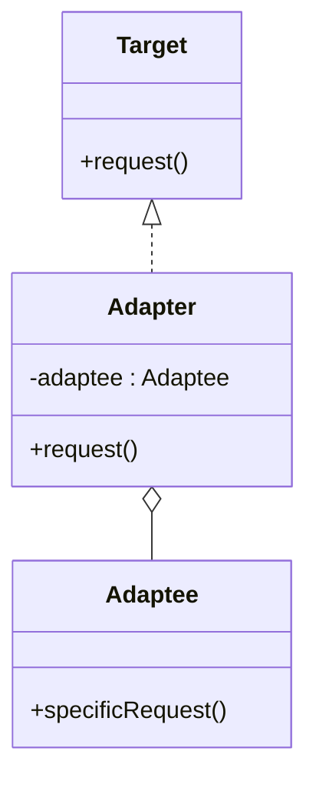

## 6.2.1 Understanding the Adapter Pattern

### Introduction

In the ever-evolving world of software development, integrating disparate systems and components is a common challenge. Often, these systems are built independently and come with their own interfaces, which may not align with each other. The **Adapter Pattern**, a key structural design pattern, provides a solution to this problem by allowing objects with incompatible interfaces to collaborate seamlessly. This chapter delves into the intricacies of the Adapter Pattern, exploring its intent, structure, and the scenarios where it becomes indispensable.

### Definition of the Adapter Pattern

The Adapter Pattern is a structural design pattern that acts as a bridge between two incompatible interfaces. It allows an interface of an existing class to be used as another interface, making it possible for classes to work together that otherwise could not because of incompatible interfaces. By doing so, it promotes code reuse and flexibility, enabling developers to integrate new functionalities without altering existing codebases.

### Problem Statement

#### Interface Incompatibility

In software development, it is common to encounter situations where you need to integrate a new system or component with an existing one. However, the interfaces of these systems might not be compatible. For instance, consider a scenario where you have a legacy system with a well-defined interface, and you want to integrate it with a modern system that expects a different interface. Changing the existing interface might not be feasible due to several reasons:

- **Legacy Constraints:** The existing system might be a legacy system where changes are risky and expensive.
- **Third-Party Libraries:** The system might rely on third-party libraries where you have no control over the interface.
- **Backward Compatibility:** Altering the interface could break backward compatibility with other parts of the system that depend on it.

#### Need for Integration

Despite these challenges, integration is often necessary to leverage the functionalities of both systems. This is where the Adapter Pattern comes into play, providing a way to bridge the gap between incompatible interfaces without modifying the existing code.

### Solution Provided by the Adapter Pattern

The Adapter Pattern solves the problem of interface incompatibility by introducing an Adapter class. This class sits between the two systems and translates the interface of one system into an interface that the other system can understand. Essentially, the Adapter acts as a middleman that adapts one interface to another, enabling seamless integration.

### Types of Adapters

There are two main types of adapters: **Class Adapter** and **Object Adapter**. Each has its own approach to achieving interface compatibility.

#### Class Adapter (Using Inheritance)

The Class Adapter pattern uses inheritance to adapt one interface to another. It is applicable in languages that support multiple inheritance. In this pattern, the Adapter class inherits from both the interface that needs to be adapted and the target interface. By doing so, it can override methods from the target interface and provide the necessary adaptations.

**Advantages:**

- **Direct Access:** The Adapter has direct access to the methods and fields of the adapted class, which can be efficient.
- **Simplicity:** It is straightforward to implement if multiple inheritance is supported.

**Disadvantages:**

- **Limited Flexibility:** It is limited to languages that support multiple inheritance.
- **Tight Coupling:** The Adapter is tightly coupled to the adapted class, which can reduce flexibility.

#### Object Adapter (Using Composition)

The Object Adapter pattern uses composition to achieve interface compatibility. Instead of inheriting from the adapted class, the Adapter holds an instance of the class and delegates calls to it. This approach is more flexible and is widely used in languages that do not support multiple inheritance.

**Advantages:**

- **Flexibility:** It can be used in any language that supports object-oriented programming.
- **Loose Coupling:** The Adapter is loosely coupled to the adapted class, enhancing flexibility and maintainability.

**Disadvantages:**

- **Overhead:** There might be a slight overhead due to delegation.

### Real-World Analogy: Power Socket Adapter

To better understand the Adapter Pattern, consider the analogy of a power socket adapter. When traveling to a different country, you might find that the power sockets are different from those in your home country. Your electrical devices, designed for one type of socket, cannot be plugged directly into the foreign sockets. A travel plug adapter acts as a bridge, allowing you to connect your device to the foreign socket by adapting the interface (plug type) of your device to match the socket.

This analogy perfectly encapsulates the essence of the Adapter Pattern: enabling compatibility between two different interfaces without altering the existing systems.

### Visual Representation: Class Diagram

To visualize the structure of the Adapter Pattern, consider the following class diagram:

In this diagram:

- **Target:** Represents the interface that clients expect.
- **Adaptee:** Represents the existing interface that needs to be adapted.
- **Adapter:** Bridges the gap between the Target and Adaptee by implementing the Target interface and holding an instance of Adaptee.

### Key Points to Emphasize

- **Integration of Incompatible Interfaces:** The Adapter Pattern is crucial for integrating classes with incompatible interfaces, enabling them to work together without modifying existing code.
- **Code Reuse and Flexibility:** By allowing existing classes to be reused in new contexts, the Adapter Pattern promotes code reuse and enhances flexibility.
- **Choice of Adapter Type:** Depending on the language and specific requirements, developers can choose between Class Adapter and Object Adapter, each offering its own set of advantages.

### Conclusion

The Adapter Pattern is an essential tool in the software architect's toolkit, providing a robust solution for integrating systems with incompatible interfaces. By understanding and applying this pattern, developers can create flexible and maintainable systems that can adapt to changing requirements and integrate with a wide range of components. As we continue to explore design patterns, the Adapter Pattern stands out as a testament to the power of structural design patterns in solving real-world software challenges.

## Quiz Time!



### What is the primary purpose of the Adapter Pattern?

- [x] To allow objects with incompatible interfaces to collaborate.
- [ ] To create objects that are clones of existing objects.
- [ ] To provide a way to create families of related objects.
- [ ] To separate the construction of a complex object from its representation.

> **Explanation:** The Adapter Pattern enables objects with incompatible interfaces to work together by providing a bridge between them.

### Which of the following is a real-world analogy for the Adapter Pattern?

- [x] A travel plug adapter.
- [ ] A blueprint for a house.
- [ ] A recipe for a meal.
- [ ] A remote control for a TV.

> **Explanation:** A travel plug adapter allows an electrical device designed for one type of outlet to be plugged into a different type, similar to how the Adapter Pattern works.

### What is a key advantage of the Object Adapter over the Class Adapter?

- [x] It provides loose coupling between the adapter and adaptee.
- [ ] It requires less code to implement.
- [ ] It is faster in execution.
- [ ] It allows for multiple inheritance.

> **Explanation:** The Object Adapter uses composition, which provides loose coupling and enhances flexibility and maintainability.

### In the Adapter Pattern, what role does the Adapter class play?

- [x] It acts as a bridge between two incompatible interfaces.
- [ ] It creates instances of a class.
- [ ] It defines the interface that clients use.
- [ ] It encapsulates a set of individual algorithms.

> **Explanation:** The Adapter class bridges the gap between incompatible interfaces, enabling them to work together.

### Which type of Adapter is more flexible and widely used in languages that do not support multiple inheritance?

- [x] Object Adapter
- [ ] Class Adapter
- [ ] Interface Adapter
- [ ] Template Adapter

> **Explanation:** The Object Adapter is more flexible and can be used in languages that do not support multiple inheritance, as it uses composition.

### What problem does the Adapter Pattern primarily address?

- [x] Interface incompatibility between classes.
- [ ] Inefficient memory usage.
- [ ] Lack of scalability in systems.
- [ ] Security vulnerabilities in software.

> **Explanation:** The Adapter Pattern addresses the problem of interface incompatibility between classes, allowing them to work together.

### What is a disadvantage of the Class Adapter?

- [x] It is limited to languages that support multiple inheritance.
- [ ] It requires more lines of code.
- [ ] It cannot be used with third-party libraries.
- [ ] It is less efficient in terms of performance.

> **Explanation:** The Class Adapter is limited to languages that support multiple inheritance, which reduces its applicability.

### In the class diagram for the Adapter Pattern, what does the arrow from Adapter to Adaptee represent?

- [x] Composition
- [ ] Inheritance
- [ ] Aggregation
- [ ] Dependency

> **Explanation:** The arrow from Adapter to Adaptee represents composition, indicating that the Adapter holds an instance of Adaptee.

### Which of the following is NOT a benefit of using the Adapter Pattern?

- [ ] It promotes code reuse.
- [ ] It enhances flexibility.
- [x] It increases the complexity of the system.
- [ ] It allows integration of incompatible interfaces.

> **Explanation:** While the Adapter Pattern can introduce some complexity, its primary benefits are promoting code reuse, enhancing flexibility, and allowing integration of incompatible interfaces.

### True or False: The Adapter Pattern can only be used in object-oriented programming languages.

- [x] True
- [ ] False

> **Explanation:** The Adapter Pattern is a structural design pattern primarily used in object-oriented programming to enable compatibility between different interfaces.


