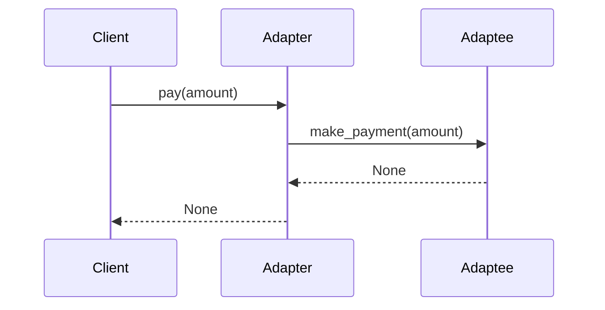

## 6.2.2 Implementation in Python

In the realm of software design, the Adapter pattern plays a crucial role in ensuring compatibility between disparate systems or components. This pattern is particularly useful when integrating third-party libraries or legacy systems that do not conform to the expected interfaces. In this section, we will delve into the implementation of the Adapter pattern in Python, providing a detailed guide and practical examples.

### Understanding the Adapter Pattern

The Adapter pattern is a structural design pattern that allows objects with incompatible interfaces to work together. It acts as a bridge between two incompatible interfaces, enabling them to communicate seamlessly. This is achieved without altering the existing code, thus preserving the integrity and functionality of both the client and the adaptee.

### Implementation Steps

To implement the Adapter pattern in Python, follow these steps:

#### 1. Identify the Incompatible Interfaces

The first step is to identify the existing class, known as the **Adaptee**, which has an interface that cannot be changed. This class contains the functionality that needs to be adapted to the client's expectations.

```python
class ThirdPartyPaymentService:
    def make_payment(self, amount):
        print(f"Processing payment of ${amount} using ThirdPartyPaymentService.")
```

In this example, `ThirdPartyPaymentService` represents a third-party payment processor with a method `make_payment`.

#### 2. Define the Target Interface

Next, define the **Target Interface** that the client code expects. This interface will be used by the client to interact with the system.

```python
class PaymentProcessor:
    def pay(self, amount):
        raise NotImplementedError("Subclasses must implement this method.")
```

Here, `PaymentProcessor` is the interface that the client code expects. It defines a method `pay` that must be implemented by any class conforming to this interface.

#### 3. Create the Adapter Class

The **Adapter** class implements the Target interface and uses composition to hold an instance of the Adaptee. It translates calls from the Target interface to the Adaptee's interface.

```python
class PaymentAdapter(PaymentProcessor):
    def __init__(self, adaptee):
        self.adaptee = adaptee

    def pay(self, amount):
        # Translate the method call to the adaptee's interface
        self.adaptee.make_payment(amount)
```

In this implementation, `PaymentAdapter` adapts the `make_payment` method of `ThirdPartyPaymentService` to the `pay` method expected by the client.

### Example Scenario: Integrating a Third-Party Payment Processor

Imagine you are developing a payment processing system where the client code expects a `PaymentProcessor` interface. However, you want to integrate a new third-party payment service that provides a different interface. The Adapter pattern allows you to achieve this integration without modifying the client code.

#### Client Code

The client code interacts with the `PaymentProcessor` interface, oblivious to the underlying implementation details.

```python
def process_payment(processor, amount):
    processor.pay(amount)

third_party_service = ThirdPartyPaymentService()
adapter = PaymentAdapter(third_party_service)
process_payment(adapter, 100.0)
```

In this scenario, the client code calls the `pay` method on the `PaymentProcessor` interface. The `PaymentAdapter` translates this call to the `make_payment` method of `ThirdPartyPaymentService`, enabling seamless integration.

### Explanation of the Code

- **Adaptee:** The `ThirdPartyPaymentService` class is the adaptee with a method `make_payment`.
- **Target Interface:** The `PaymentProcessor` class defines the interface expected by the client.
- **Adapter:** The `PaymentAdapter` class implements the `PaymentProcessor` interface and translates the `pay` method call to `make_payment`.

### Best Practices for Implementing the Adapter Pattern

- **Use Composition Over Inheritance:** Favor composition over inheritance to increase flexibility and maintainability. By holding an instance of the adaptee, the adapter can easily switch to different implementations without altering its structure.
- **Adhere to the Target Interface:** Ensure that the adapter class strictly adheres to the target interface to maintain compatibility with the client code.
- **Minimize Changes to Existing Code:** The primary advantage of the Adapter pattern is its ability to integrate new functionality without modifying existing code. Strive to keep changes minimal and localized.

### Visualizing the Adapter Pattern

To better understand the flow of interactions in the Adapter pattern, consider the following sequence diagram:



This diagram illustrates how the client interacts with the adapter, which in turn communicates with the adaptee, translating the method calls appropriately.

### Key Points to Emphasize

- **Integration Without Modification:** The Adapter pattern allows for the integration of new systems or components without modifying existing code, ensuring compatibility and reducing the risk of introducing errors.
- **Flexibility and Reusability:** By adhering to the target interface, adapters can be reused across different contexts, providing a flexible solution for integrating various systems.
- **Ideal for Third-Party Libraries:** The Adapter pattern is particularly useful when working with third-party libraries or legacy code that cannot be altered.

### Real-World Applications of the Adapter Pattern

The Adapter pattern is widely used in software development, particularly in scenarios where systems need to communicate with external libraries or services. Some common applications include:

- **Integrating Payment Gateways:** As demonstrated in the example, the Adapter pattern can be used to integrate different payment gateways with varying interfaces into a unified system.
- **Legacy System Integration:** When modernizing legacy systems, the Adapter pattern allows new components to interact with outdated interfaces without requiring modifications to the legacy code.
- **Cross-Platform Development:** In cross-platform development, adapters can be used to bridge platform-specific APIs, enabling a consistent interface for the application.

### Conclusion

The Adapter pattern is a powerful tool in the software developer's arsenal, enabling seamless integration of disparate systems and enhancing the flexibility of software architectures. By understanding and implementing this pattern, developers can create robust solutions that accommodate changing requirements and technologies.

As you continue your journey in software design, consider how the Adapter pattern can be applied to your projects to improve compatibility and maintainability. Experiment with the provided code examples, and explore real-world scenarios where this pattern can be leveraged to solve complex integration challenges.

## Quiz Time!



### What is the primary purpose of the Adapter pattern?

- [x] To allow incompatible interfaces to work together
- [ ] To improve the performance of a system
- [ ] To add new functionality to existing classes
- [ ] To simplify complex algorithms

> **Explanation:** The Adapter pattern is used to allow objects with incompatible interfaces to work together by providing a bridge between them.

### In the Adapter pattern, what is the role of the Adaptee?

- [x] It is the existing class with an incompatible interface
- [ ] It is the new class implementing the target interface
- [ ] It is the client code interacting with the system
- [ ] It is the interface expected by the client

> **Explanation:** The Adaptee is the existing class that has an interface incompatible with the target interface expected by the client.

### What is the main advantage of using composition over inheritance in the Adapter pattern?

- [x] Increases flexibility and maintainability
- [ ] Reduces the number of classes in the system
- [ ] Simplifies the implementation of the adapter
- [ ] Enhances performance of the system

> **Explanation:** Composition allows the adapter to hold an instance of the adaptee, making it easier to switch implementations and increasing flexibility.

### Which method in the `PaymentAdapter` class translates the call to the Adaptee's interface?

- [x] pay
- [ ] make_payment
- [ ] process_payment
- [ ] translate_call

> **Explanation:** The `pay` method in the `PaymentAdapter` class translates the call to the `make_payment` method of the Adaptee.

### Why is it important for the Adapter to adhere to the Target interface?

- [x] To maintain compatibility with the client code
- [ ] To improve the performance of the adapter
- [ ] To reduce the complexity of the system
- [ ] To ensure the adapter can be reused

> **Explanation:** Adhering to the Target interface ensures that the adapter is compatible with the client code, allowing seamless integration.

### What is a common use case for the Adapter pattern?

- [x] Integrating third-party libraries with different interfaces
- [ ] Optimizing database queries
- [ ] Implementing complex algorithms
- [ ] Enhancing user interfaces

> **Explanation:** The Adapter pattern is commonly used to integrate third-party libraries or services that have different interfaces from what the client expects.

### In the provided example, what does the `PaymentAdapter` class do?

- [x] It adapts the `make_payment` method to the `pay` method
- [ ] It processes payments directly
- [ ] It modifies the `ThirdPartyPaymentService` class
- [ ] It interacts with the client code directly

> **Explanation:** The `PaymentAdapter` class adapts the `make_payment` method of the `ThirdPartyPaymentService` to the `pay` method expected by the client.

### How does the client code interact with the system in the Adapter pattern?

- [x] Through the Target interface
- [ ] Directly with the Adaptee
- [ ] By modifying the Adapter
- [ ] Through the Adaptee's interface

> **Explanation:** The client code interacts with the system through the Target interface, which is implemented by the Adapter.

### What is the role of the Adapter in the Adapter pattern?

- [x] To translate calls from the Target interface to the Adaptee's interface
- [ ] To act as the client code
- [ ] To modify the Adaptee's interface
- [ ] To provide a new interface for the client

> **Explanation:** The Adapter translates calls from the Target interface to the Adaptee's interface, allowing them to work together.

### True or False: The Adapter pattern modifies the existing Adaptee class.

- [ ] True
- [x] False

> **Explanation:** The Adapter pattern does not modify the existing Adaptee class; it provides a way to work with it through an adapter without altering its code.


