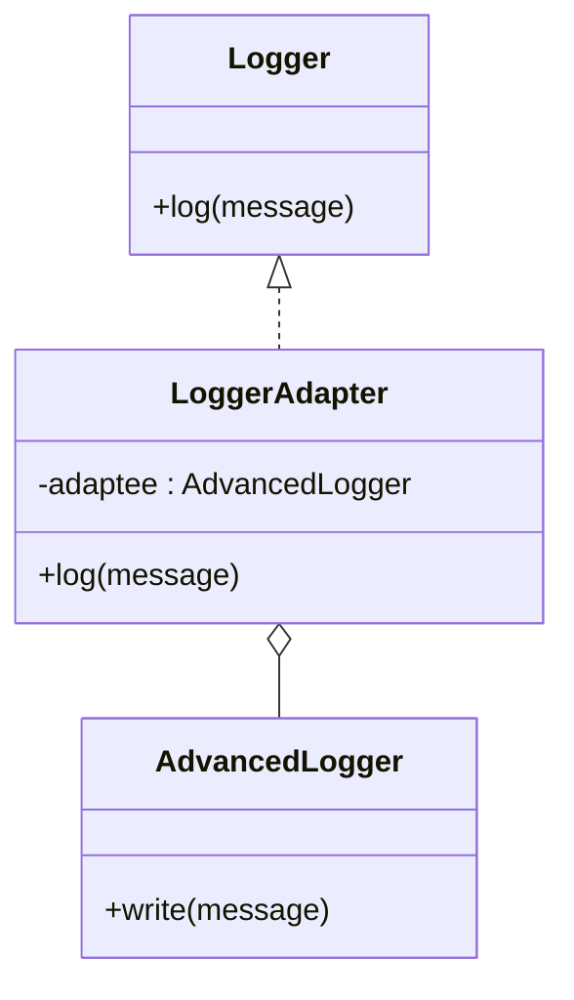

## 6.2.3 Implementation in JavaScript

In the world of software development, integrating new components into existing systems is a common necessity. The Adapter pattern is a structural design pattern that allows incompatible interfaces to work together. It acts as a bridge between two incompatible interfaces, enabling them to communicate effectively without altering their existing code. This section will delve into implementing the Adapter pattern in JavaScript, leveraging ES6 classes to create a seamless integration process.

### Understanding the Adapter Pattern

Before we dive into the implementation, it's crucial to understand the core concept of the Adapter pattern. Imagine you have a plug that doesn't fit into a socket. Instead of changing the plug or the socket, you use an adapter to make them compatible. Similarly, in software, the Adapter pattern allows you to use a new class (Adaptee) with an existing interface (Target) by creating an Adapter that translates requests from the Target interface to the Adaptee.

### Key Components of the Adapter Pattern

1. **Target Interface:** This is the interface expected by the client code. It defines the methods that the client can call.

2. **Adaptee:** This is the new class that needs to be integrated into the system. It has a different interface than what the client expects.

3. **Adapter:** This is the class that implements the Target interface and wraps the Adaptee. It translates the calls from the client to the Adaptee.

### Implementation Steps in JavaScript

Let's walk through the steps to implement the Adapter pattern in JavaScript, using a practical example of integrating a new logging library.

#### Step 1: Identify the Incompatible Interfaces

In our example, the client code expects a `Logger` interface with a `log(message)` method. However, the new logging library provides a `write(message)` method. These are the incompatible interfaces we need to bridge.

#### Step 2: Define the Target Interface

In JavaScript, interfaces are not explicitly defined as in some other languages. Instead, we rely on documentation and conventions to specify the expected methods. For our example, the Target interface is the `Logger` interface, which expects a `log(message)` method.

#### Step 3: Create the Adaptee Class

The Adaptee is the new logging library that we want to integrate. Let's define it:

```javascript
class AdvancedLogger {
    write(message) {
        console.log(`[AdvancedLogger]: ${message}`);
    }
}
```

#### Step 4: Create the Adapter Class

The Adapter class will wrap the Adaptee and implement the Target interface. It will translate the `log` method calls to the `write` method of the Adaptee.

```javascript
class LoggerAdapter {
    constructor(adaptee) {
        this.adaptee = adaptee;
    }

    log(message) {
        this.adaptee.write(message);
    }
}
```

#### Step 5: Implement the Client Code

The client code will interact with the Adapter as if it were the Target interface. This allows us to integrate the new logging library without changing the existing client code.

```javascript
function processLogs(logger) {
    logger.log("Application started.");
    // Other logging operations...
}

// Usage
const advancedLogger = new AdvancedLogger();
const adapter = new LoggerAdapter(advancedLogger);
processLogs(adapter);
```

### Explanation of the Code

- **Adaptee:** The `AdvancedLogger` class provides a `write` method for logging messages.
- **Adapter:** The `LoggerAdapter` class wraps an instance of `AdvancedLogger` and implements the `log` method by calling the `write` method on the Adaptee.
- **Client Code:** The `processLogs` function works with any object that has a `log` method, allowing it to use the Adapter seamlessly.

### Best Practices for Implementing the Adapter Pattern

- **Use Composition:** The Adapter should contain an instance of the Adaptee, rather than inheriting from it. This promotes loose coupling and flexibility.
- **Adhere to the Target Interface:** Ensure that the Adapter strictly follows the Target interface to maintain compatibility with the client code.
- **Document Expected Interfaces:** Since JavaScript doesn't enforce interfaces, it's important to clearly document the expected methods and their behavior.

### Visual Representation

To further clarify the structure of the Adapter pattern, let's look at a class diagram:



### Real-World Applications of the Adapter Pattern

The Adapter pattern is widely used in software development for various purposes, such as:

- **Integrating Third-Party Libraries:** When a new library's interface doesn't match the existing system, an Adapter can bridge the gap.
- **Legacy Code Integration:** Adapters can help incorporate legacy systems into modern applications by wrapping old interfaces.
- **API Compatibility:** When different systems need to communicate but have different APIs, Adapters can translate requests and responses.

### Conclusion

The Adapter pattern is a powerful tool in a developer's arsenal, enabling the integration of new components into existing systems without altering their code. By understanding and implementing this pattern in JavaScript, developers can enhance the flexibility and maintainability of their applications.

JavaScript's dynamic nature and support for ES6 classes make it an ideal language for implementing the Adapter pattern. By following the steps outlined in this guide, you can effectively use the Adapter pattern to solve real-world integration challenges.

### Further Reading and Resources

To deepen your understanding of the Adapter pattern and its applications, consider exploring the following resources:

- **Books:**
  - "Design Patterns: Elements of Reusable Object-Oriented Software" by Erich Gamma, Richard Helm, Ralph Johnson, and John Vlissides.
  - "JavaScript: The Good Parts" by Douglas Crockford.

- **Online Articles:**
  - [MDN Web Docs - Classes](https://developer.mozilla.org/en-US/docs/Web/JavaScript/Reference/Classes)
  - [Refactoring Guru - Adapter Pattern](https://refactoring.guru/design-patterns/adapter)

- **Courses:**
  - "JavaScript Design Patterns" on platforms like Udemy or Coursera.

By practicing and experimenting with the Adapter pattern, you can master its implementation and apply it effectively in your projects.

## Quiz Time!



### What is the primary purpose of the Adapter pattern?

- [x] To allow incompatible interfaces to work together
- [ ] To improve performance of a system
- [ ] To enhance security
- [ ] To reduce code duplication

> **Explanation:** The Adapter pattern allows incompatible interfaces to work together by acting as a bridge between them.

### In the Adapter pattern, what role does the Adaptee play?

- [x] The class with the incompatible interface that needs to be adapted
- [ ] The client code that uses the Adapter
- [ ] The interface expected by the client
- [ ] The class that implements the Target interface

> **Explanation:** The Adaptee is the class with the incompatible interface that needs to be adapted to the Target interface.

### How does the Adapter pattern achieve compatibility between interfaces?

- [x] By creating an Adapter class that translates requests from the Target interface to the Adaptee
- [ ] By modifying the Adaptee class to match the Target interface
- [ ] By changing the client code to use the Adaptee directly
- [ ] By using inheritance to extend the Target interface

> **Explanation:** The Adapter class implements the Target interface and translates requests to the Adaptee, achieving compatibility without modifying existing code.

### In JavaScript, how are interfaces typically defined?

- [ ] Using the `interface` keyword
- [x] Through documentation and conventions
- [ ] By implementing abstract classes
- [ ] By using TypeScript

> **Explanation:** JavaScript does not have a native `interface` keyword; interfaces are defined through documentation and conventions.

### What method does the `LoggerAdapter` class implement in the example provided?

- [x] log(message)
- [ ] write(message)
- [ ] processLogs(logger)
- [ ] initialize()

> **Explanation:** The `LoggerAdapter` class implements the `log(message)` method to adapt the Adaptee's `write(message)` method.

### Why is composition preferred over inheritance in the Adapter pattern?

- [x] It promotes loose coupling and flexibility
- [ ] It improves performance
- [ ] It simplifies code maintenance
- [ ] It allows for multiple inheritance

> **Explanation:** Composition promotes loose coupling and flexibility by allowing the Adapter to contain an instance of the Adaptee rather than inheriting from it.

### Which of the following is a real-world application of the Adapter pattern?

- [x] Integrating third-party libraries
- [ ] Optimizing database queries
- [ ] Enhancing user interface design
- [ ] Managing memory allocation

> **Explanation:** The Adapter pattern is often used to integrate third-party libraries with incompatible interfaces.

### What is the key benefit of using the Adapter pattern in software design?

- [x] It allows for integration without altering existing client code
- [ ] It increases the speed of development
- [ ] It reduces the need for testing
- [ ] It simplifies algorithm complexity

> **Explanation:** The Adapter pattern allows for the integration of new components without altering existing client code, maintaining system stability.

### Which of the following best describes the role of the Target interface?

- [x] The interface expected by the client code
- [ ] The new class that needs to be integrated
- [ ] The class that wraps the Adaptee
- [ ] The class that implements the Adapter

> **Explanation:** The Target interface is the interface expected by the client code, which the Adapter implements.

### True or False: The Adapter pattern can be used to integrate legacy systems into modern applications.

- [x] True
- [ ] False

> **Explanation:** True. The Adapter pattern is often used to integrate legacy systems into modern applications by adapting their interfaces.


