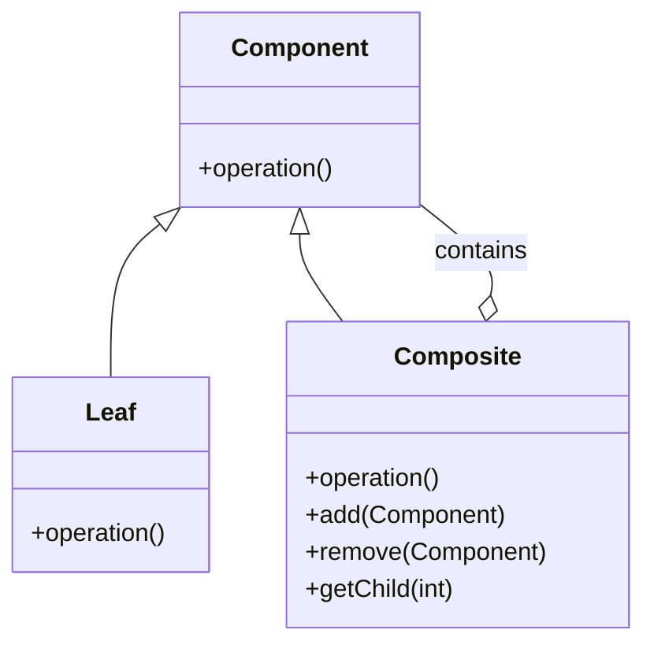

---

linkTitle: "6.3.1 Concept of the Composite Pattern"
title: "Composite Pattern: Understanding Its Concept and Applications"
description: "Explore the Composite Pattern, a structural design pattern that simplifies complex hierarchical structures by treating individual and composite objects uniformly."
categories:
- Software Design
- Design Patterns
- Structural Patterns
tags:
- Composite Pattern
- Design Patterns
- Software Architecture
- Hierarchical Structures
- Object-Oriented Design
date: 2024-10-25
type: docs
nav_weight: 6310

---

## 6.3.1 Concept of the Composite Pattern

In the realm of software design, particularly when dealing with complex systems, the need to manage and represent hierarchical structures becomes paramount. The Composite Pattern, a structural design pattern, emerges as a powerful tool in this context. It allows developers to compose objects into tree structures to represent part-whole hierarchies. By doing so, it enables clients to treat individual objects and compositions of objects uniformly, simplifying interactions and operations across the structure.

### Definition of the Composite Pattern

The Composite Pattern is a structural design pattern that facilitates the creation of a tree-like structure of objects. It allows individual objects and compositions of objects to be treated uniformly. This pattern is particularly useful when dealing with complex structures that consist of both simple and composite objects, allowing operations to be performed on these objects in a consistent manner.

The essence of the Composite Pattern lies in its ability to define a class hierarchy that consists of primitive objects and composite objects. Composite objects can contain both primitives and other composites, creating a recursive structure that can be navigated and manipulated with ease.

### Problem Statement

In software development, there are numerous scenarios where systems need to manage complex structures composed of simple and composite objects. Consider a graphical user interface (GUI) with components such as buttons, panels, and windows. Each component can be a simple object or a composite of other components. Similarly, in a file system, a directory can contain files or other directories, creating a nested structure.

The challenge arises when operations need to be performed uniformly across these structures. For instance, calculating the total size of a directory should consider both individual files and nested directories. Without a unified approach, handling these operations can become cumbersome and error-prone, leading to complex and hard-to-maintain code.

### Solution Provided by Composite

The Composite Pattern offers a robust solution to the problem of managing hierarchical structures by defining a class hierarchy that consists of both primitive and composite objects. The key elements of this pattern are:

- **Component**: An abstract class or interface that defines the common operations for both simple and composite objects.
- **Leaf**: A concrete class representing simple objects that do not have any children.
- **Composite**: A concrete class that can contain both Leaf and Composite objects, allowing for the creation of complex structures.

The Composite Pattern enables operations to be performed uniformly across both simple and composite objects. By treating individual objects and compositions uniformly, the pattern simplifies client code and enhances the flexibility and scalability of the system.

### Real-World Analogy: File System Directories and Files

A classic real-world analogy for the Composite Pattern is a file system, where directories and files form a hierarchical structure. In a file system:

- A **directory** can contain files or other directories, creating a nested structure.
- Operations such as "size" or "delete" apply uniformly to both files and directories.
- A directory can be seen as a composite object that can contain both primitive objects (files) and other composite objects (subdirectories).

This analogy illustrates how the Composite Pattern allows for uniform treatment of individual and composite objects, simplifying operations across the structure.

### Visual Representation: Class Diagram

To better understand the structure of the Composite Pattern, let's examine a class diagram that illustrates the relationships between the different components:

In this diagram:

- The **Component** class defines the common interface for both Leaf and Composite classes.
- The **Leaf** class represents simple objects that do not have any children.
- The **Composite** class represents complex objects that can contain both Leaf and Composite objects, allowing for the creation of tree structures.

### Key Points to Emphasize

1. **Uniform Treatment**: The Composite Pattern simplifies client code by allowing single objects and compositions to be treated uniformly. This uniformity reduces complexity and enhances code maintainability.

2. **Recursive Structures**: The pattern is highly effective for representing recursive structures, such as file systems, organizational hierarchies, and GUI components. It allows for flexible and scalable design solutions.

3. **Simplified Operations**: By defining a common interface for operations, the Composite Pattern enables simplified and consistent operations across both simple and composite objects.

4. **Enhanced Flexibility**: The pattern provides enhanced flexibility by allowing new types of components to be added easily without affecting existing code.

### Conclusion

The Composite Pattern is a powerful tool for managing hierarchical structures in software design. By allowing individual objects and compositions to be treated uniformly, it simplifies operations and enhances the flexibility and scalability of the system. Whether dealing with file systems, GUI components, or organizational hierarchies, the Composite Pattern provides a robust solution for representing and manipulating complex structures.

As we move forward, we'll explore practical implementations of the Composite Pattern in various programming languages, including Python and JavaScript, to demonstrate its versatility and applicability in modern software development.

## Quiz Time!



### What is the primary purpose of the Composite Pattern?

- [x] To compose objects into tree structures and treat them uniformly
- [ ] To optimize performance in complex systems
- [ ] To separate data from behavior in objects
- [ ] To enforce strict type checking in object hierarchies

> **Explanation:** The Composite Pattern is designed to compose objects into tree structures, allowing individual and composite objects to be treated uniformly.

### Which component in the Composite Pattern represents simple objects?

- [x] Leaf
- [ ] Composite
- [ ] Component
- [ ] Node

> **Explanation:** The Leaf class represents simple objects that do not have any children in the Composite Pattern.

### In the Composite Pattern, what does the Composite class typically contain?

- [x] Both Leaf and Composite objects
- [ ] Only Leaf objects
- [ ] Only Component objects
- [ ] Primitive data types

> **Explanation:** The Composite class can contain both Leaf and other Composite objects, allowing for the creation of complex hierarchical structures.

### What is a real-world analogy often used to explain the Composite Pattern?

- [x] File system directories and files
- [ ] Database tables and records
- [ ] Network protocols and packets
- [ ] User interfaces and widgets

> **Explanation:** A file system, where directories can contain files or other directories, is a common analogy for the Composite Pattern.

### Which of the following is NOT a benefit of the Composite Pattern?

- [ ] Simplifies client code
- [ ] Enhances flexibility
- [ ] Allows for recursive structures
- [x] Improves execution speed

> **Explanation:** While the Composite Pattern simplifies client code and enhances flexibility, it does not inherently improve execution speed.

### How does the Composite Pattern affect code maintainability?

- [x] It enhances maintainability by allowing uniform treatment of objects
- [ ] It complicates code by adding extra layers of abstraction
- [ ] It has no impact on maintainability
- [ ] It reduces maintainability by increasing complexity

> **Explanation:** The Composite Pattern enhances maintainability by allowing both individual and composite objects to be treated uniformly, reducing complexity.

### What kind of operations does the Composite Pattern simplify?

- [x] Operations that need to be performed uniformly across simple and composite objects
- [ ] Operations that require complex mathematical calculations
- [ ] Operations that involve data serialization
- [ ] Operations that need to be performed on primitive data types

> **Explanation:** The Composite Pattern simplifies operations that need to be performed uniformly across both simple and composite objects.

### Which class in the Composite Pattern defines the common interface for operations?

- [x] Component
- [ ] Leaf
- [ ] Composite
- [ ] Node

> **Explanation:** The Component class defines the common interface for operations in the Composite Pattern.

### What type of structure does the Composite Pattern typically represent?

- [x] Hierarchical structures
- [ ] Linear structures
- [ ] Circular structures
- [ ] Random structures

> **Explanation:** The Composite Pattern is typically used to represent hierarchical structures, such as file systems or organizational charts.

### True or False: The Composite Pattern can only be used in object-oriented programming languages.

- [x] False
- [ ] True

> **Explanation:** While the Composite Pattern is commonly used in object-oriented languages, its principles can be applied in other programming paradigms as well.



By understanding the Composite Pattern, developers gain a valuable tool for managing complex hierarchical structures in software design. This pattern not only simplifies operations but also enhances the flexibility and scalability of systems, making it an indispensable part of a software engineer's toolkit.
