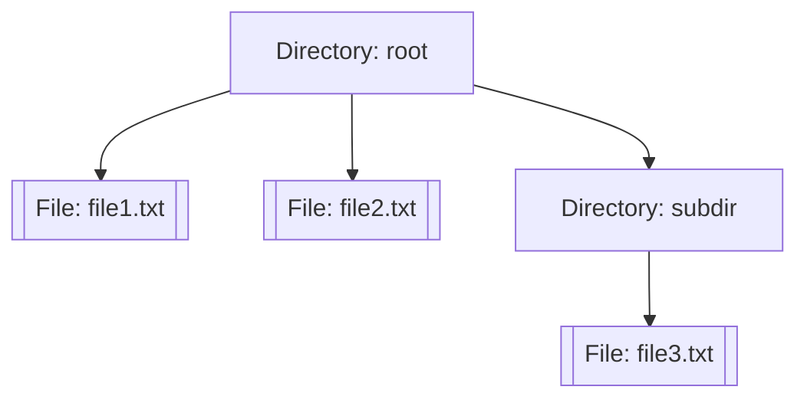

---

linkTitle: "6.3.2 Coding the Composite Pattern in Python"
title: "Composite Pattern in Python: A Comprehensive Guide to Implementation"
description: "Explore the Composite Pattern in Python with detailed code examples, explanations, and real-world applications in file system simulation."
categories:
- Software Design
- Design Patterns
- Python Programming
tags:
- Composite Pattern
- Structural Patterns
- Python
- Software Design Patterns
- Object-Oriented Programming
date: 2024-10-25
type: docs
nav_weight: 632000
---

## 6.3.2 Coding the Composite Pattern in Python

The Composite Pattern is a structural design pattern that enables you to compose objects into tree-like structures to represent part-whole hierarchies. This pattern allows clients to treat individual objects and compositions of objects uniformly. In this section, we will explore how to implement the Composite Pattern in Python, using a file system representation as a practical example.

### Understanding the Composite Pattern

Before diving into the code, let's understand the core concept of the Composite Pattern. The pattern is particularly useful when you need to work with tree structures, such as file systems, where you have both files and directories. Both files and directories can be treated as "nodes" in the tree, where directories can contain other files or directories, forming a recursive structure.

**Key Components of the Composite Pattern:**

1. **Component:** This is an abstract class or interface that declares the common operations for both composite and leaf objects.
2. **Leaf:** Represents the leaf objects in the composition. A leaf has no children.
3. **Composite:** Represents a component that can have children. It implements methods to manage child components.

### Implementation Steps

Let's break down the implementation of the Composite Pattern in Python into manageable steps.

#### Step 1: Define the Component Base Class

The Component class serves as the base class for both composite and leaf nodes. It declares the interface for objects in the composition. In our file system example, this class will define a method for displaying the structure.

```python
from abc import ABC, abstractmethod

class FileSystemComponent(ABC):
    @abstractmethod
    def display(self, indent=0):
        pass
```

Here, `FileSystemComponent` is an abstract base class with an abstract method `display`. This method will be implemented by both the `File` and `Directory` classes.

#### Step 2: Implement the Leaf Class

The Leaf class represents primitive objects in the composition. In our example, a `File` is a leaf node since it cannot contain other components.

```python
class File(FileSystemComponent):
    def __init__(self, name):
        self.name = name

    def display(self, indent=0):
        print(' ' * indent + self.name)
```

The `File` class implements the `display` method, which simply prints the file's name with indentation to represent its level in the hierarchy.

#### Step 3: Implement the Composite Class

The Composite class represents a component that can have children. In our example, a `Directory` is a composite node because it can contain both files and other directories.

```python
class Directory(FileSystemComponent):
    def __init__(self, name):
        self.name = name
        self.children = []

    def add(self, component):
        self.children.append(component)

    def remove(self, component):
        self.children.remove(component)

    def display(self, indent=0):
        print(' ' * indent + self.name)
        for child in self.children:
            child.display(indent + 2)
```

The `Directory` class implements methods to add and remove child components. The `display` method iterates over its children and calls their `display` method, effectively traversing the tree.

### Example Scenario: File System Representation

To demonstrate the Composite Pattern, let's simulate a file system where both files and directories can be treated uniformly. This example will help illustrate how the pattern simplifies client code by allowing you to treat individual objects and compositions uniformly.

#### Client Code

The client code builds a tree structure and calls the `display` method on the root directory.

```python
def main():
    root = Directory("root")
    file1 = File("file1.txt")
    file2 = File("file2.txt")
    root.add(file1)
    root.add(file2)

    sub_dir = Directory("subdir")
    file3 = File("file3.txt")
    sub_dir.add(file3)

    root.add(sub_dir)

    root.display()

if __name__ == "__main__":
    main()
```

In this example, we create a root directory containing two files and a subdirectory, which in turn contains another file. The `display` method is called on the root directory, which recursively displays the entire structure.

### Explanation of the Code

- **FileSystemComponent:** This abstract class defines the interface for all components, ensuring that both `File` and `Directory` implement the `display` method.
- **File:** Implements the `display` method for leaf nodes, which prints the file's name with appropriate indentation.
- **Directory:** Implements the `display` method for composite nodes, iterating over its children and calling their `display` method. It also provides methods to add and remove children, managing the tree structure.

### Visual Representation

To better understand the structure, let's visualize the file system hierarchy using a tree diagram:



This diagram illustrates the tree structure formed by the directories and files, highlighting the recursive nature of the Composite Pattern.

### Best Practices

When implementing the Composite Pattern, consider the following best practices:

- **Consistent Interfaces:** Ensure that methods in the Composite class handle child components appropriately and that interfaces are consistent across components.
- **Encapsulation:** Keep the internal structure of composite objects hidden from clients, exposing only the necessary methods.
- **Recursive Methods:** Use recursion to simplify operations on tree structures, as demonstrated in the `display` method.

### Real-World Applications

The Composite Pattern is widely used in various applications beyond file systems. Here are a few examples:

- **Graphical User Interfaces (GUIs):** GUI components, such as windows, panels, and buttons, can be organized in a tree structure, allowing for uniform treatment of individual components and composite containers.
- **Document Structures:** In document processing applications, elements like paragraphs, tables, and images can be treated as part of a composite document structure.
- **Game Development:** In game engines, scenes can be composed of various game objects, each potentially containing other objects, forming a scene graph.

### Conclusion

The Composite Pattern is a powerful tool for managing tree structures in software design. By allowing you to treat individual objects and compositions uniformly, it simplifies client code and enhances flexibility. In this section, we explored the implementation of the Composite Pattern in Python, using a file system representation as a practical example. By following the steps outlined and adhering to best practices, you can effectively apply this pattern to various real-world scenarios.

## Quiz Time!



### What is the primary purpose of the Composite Pattern?

- [x] To allow treating individual objects and compositions uniformly
- [ ] To separate the construction of a complex object from its representation
- [ ] To define a one-to-many dependency between objects
- [ ] To provide a way to access the elements of an aggregate object sequentially

> **Explanation:** The Composite Pattern allows treating individual objects and compositions of objects uniformly, which simplifies client code when dealing with tree structures.

### Which class in the Composite Pattern represents primitive objects in the composition?

- [ ] Component
- [x] Leaf
- [ ] Composite
- [ ] Client

> **Explanation:** The Leaf class represents primitive objects in the composition. In our example, the `File` class is a leaf node.

### In the provided example, what is the role of the `Directory` class?

- [ ] It defines the interface for objects in the composition
- [ ] It represents primitive objects in the composition
- [x] It contains child components and manages them
- [ ] It acts as the client code

> **Explanation:** The `Directory` class is a composite node that can contain other components, such as files and directories. It manages its children and implements the `display` method.

### What method is used in the `Directory` class to add a child component?

- [ ] insert()
- [x] add()
- [ ] append()
- [ ] include()

> **Explanation:** The `add()` method in the `Directory` class is used to add a child component to the directory's list of children.

### Which method is responsible for displaying the structure of the file system in the example?

- [x] display()
- [ ] show()
- [ ] print()
- [ ] reveal()

> **Explanation:** The `display()` method is responsible for displaying the structure of the file system, recursively printing the names of directories and files with appropriate indentation.

### What is the advantage of using the Composite Pattern in GUI applications?

- [x] It allows uniform treatment of individual components and composite containers
- [ ] It simplifies the creation of complex GUIs
- [ ] It enhances the performance of GUI applications
- [ ] It provides a way to handle user input more efficiently

> **Explanation:** The Composite Pattern allows uniform treatment of individual components and composite containers in GUI applications, simplifying the management of complex user interfaces.

### How does the Composite Pattern simplify client code?

- [x] By allowing clients to treat individual objects and compositions uniformly
- [ ] By providing a direct way to access individual components
- [ ] By reducing the number of classes needed
- [ ] By improving the performance of the application

> **Explanation:** The Composite Pattern simplifies client code by allowing clients to treat individual objects and compositions uniformly, making it easier to work with complex structures.

### In the context of the Composite Pattern, what is a common use case for recursion?

- [ ] To improve performance
- [ ] To reduce memory usage
- [x] To simplify operations on tree structures
- [ ] To enhance security

> **Explanation:** Recursion is commonly used in the Composite Pattern to simplify operations on tree structures, such as traversing and displaying the hierarchy.

### Which of the following is a real-world application of the Composite Pattern?

- [x] Document processing applications
- [ ] Network protocol implementations
- [ ] Database management systems
- [ ] Machine learning algorithms

> **Explanation:** The Composite Pattern is used in document processing applications to manage elements like paragraphs, tables, and images as part of a composite document structure.

### True or False: The Composite Pattern is only applicable to file system representations.

- [ ] True
- [x] False

> **Explanation:** False. The Composite Pattern is applicable to various domains, such as GUI applications, document processing, and game development, wherever tree structures are needed.



By understanding and implementing the Composite Pattern, you can effectively manage complex tree structures in your applications, leading to more flexible and maintainable code.
