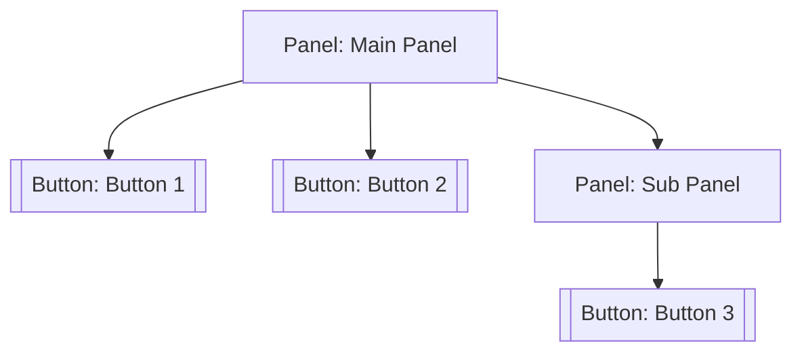

## 6.3.3 Coding the Composite Pattern in JavaScript

### Introduction

The Composite Pattern is a structural design pattern that allows you to compose objects into tree structures to represent part-whole hierarchies. This pattern allows clients to treat individual objects and compositions of objects uniformly. In this section, we'll delve into how the Composite Pattern can be implemented in JavaScript, focusing on a practical example involving a UI component hierarchy.

### Understanding the Composite Pattern

Before we jump into coding, it's crucial to understand the core components of the Composite Pattern:

- **Component**: An abstract class or interface that defines the common interface for all objects in the composition.
- **Leaf**: Represents the end objects of a composition. A leaf object can't have any children.
- **Composite**: A class that represents a group of leaf objects. This class implements child-related operations like `add`, `remove`, and `display`.

### Implementation Steps

Let's implement the Composite Pattern in JavaScript using ES6 class syntax. We'll create a simple UI component hierarchy consisting of Panels and Buttons.

#### Step 1: Define the Component Base Class

The `UIComponent` class will act as our abstract base class. It defines the interface for all components, including methods for adding, removing, and displaying components.

```javascript
class UIComponent {
    add(component) {
        throw new Error("Method not implemented.");
    }

    remove(component) {
        throw new Error("Method not implemented.");
    }

    display(indent = 0) {
        throw new Error("Method not implemented.");
    }
}
```

### Step 2: Implement the Leaf Class (Button)

The `Button` class extends `UIComponent` and represents a leaf in our component hierarchy. It implements the `display` method to show its name.

```javascript
class Button extends UIComponent {
    constructor(name) {
        super();
        this.name = name;
    }

    display(indent = 0) {
        console.log(' '.repeat(indent) + this.name);
    }
}
```

### Step 3: Implement the Composite Class (Panel)

The `Panel` class also extends `UIComponent` and can contain other components, both `Button` and `Panel`. It implements methods to manage its children and display them.

```javascript
class Panel extends UIComponent {
    constructor(name) {
        super();
        this.name = name;
        this.children = [];
    }

    add(component) {
        this.children.push(component);
    }

    remove(component) {
        const index = this.children.indexOf(component);
        if (index !== -1) {
            this.children.splice(index, 1);
        }
    }

    display(indent = 0) {
        console.log(' '.repeat(indent) + this.name);
        for (const child of this.children) {
            child.display(indent + 2);
        }
    }
}
```

### Step 4: Client Code to Build the Component Hierarchy

Now let's write some client code to construct a hierarchy of UI components and display them.

```javascript
function main() {
    const mainPanel = new Panel("Main Panel");
    const button1 = new Button("Button 1");
    const button2 = new Button("Button 2");
    mainPanel.add(button1);
    mainPanel.add(button2);

    const subPanel = new Panel("Sub Panel");
    const button3 = new Button("Button 3");
    subPanel.add(button3);

    mainPanel.add(subPanel);

    mainPanel.display();
}

main();
```

### Explanation of the Code

- **UIComponent**: This is the abstract base class. It declares methods that will be implemented by the `Button` and `Panel` classes.
- **Button**: This class represents a leaf in the component hierarchy. It implements the `display` method to print its name.
- **Panel**: This class can contain other components. It implements `add`, `remove`, and `display` methods to manage and display its children.
- **Client Code**: Constructs a hierarchy of `Panel` and `Button` objects and displays it. The `main` function demonstrates how these components can be composed and displayed.

### Visualizing the Component Hierarchy

To better understand the structure we've created, let's visualize it using a diagram:



### Best Practices for Implementing the Composite Pattern

- **Consistent Method Names**: Ensure that all components implement the same interface. This consistency allows for uniform treatment of objects.
- **Error Handling**: Leaf components should throw errors for methods that are not applicable to them, such as `add` and `remove`.
- **Flexible Design**: Design your composite and leaf classes to be flexible enough to accommodate future changes or extensions.

### Real-World Applications

The Composite Pattern is particularly useful in scenarios where you need to work with tree structures. Here are some real-world applications:

- **Graphical User Interfaces (GUIs)**: Managing a hierarchy of UI components, such as windows, panels, and buttons.
- **File Systems**: Representing directories and files in a hierarchical structure.
- **Document Object Models (DOM)**: Manipulating elements in an HTML or XML document.

### Advantages of the Composite Pattern

- **Simplifies Client Code**: Clients can treat individual objects and compositions uniformly, simplifying the code.
- **Easily Extendable**: New component types can be added without changing existing code.
- **Promotes Reusability**: Components can be reused across different parts of an application.

### Common Pitfalls and How to Avoid Them

- **Overcomplicating the Design**: Avoid adding unnecessary complexity to your component classes. Keep the design as simple as possible.
- **Ignoring Performance**: Be mindful of the performance implications of deep hierarchies, especially in resource-constrained environments.
- **Inconsistent Interfaces**: Ensure all components adhere to the defined interface to prevent runtime errors.

### Conclusion

The Composite Pattern is a powerful tool for managing hierarchical data structures in JavaScript. By understanding and implementing this pattern, you can create flexible and maintainable applications that handle complex hierarchies with ease. Whether you're building a UI library or managing a file system, the Composite Pattern offers a robust solution for treating individual objects and compositions uniformly.

### Additional Resources

For further reading and exploration of the Composite Pattern and other design patterns, consider the following resources:

- [Design Patterns: Elements of Reusable Object-Oriented Software](https://en.wikipedia.org/wiki/Design_Patterns) by Erich Gamma et al.
- [MDN Web Docs on JavaScript Classes](https://developer.mozilla.org/en-US/docs/Web/JavaScript/Reference/Classes)
- [Refactoring Guru's Composite Pattern](https://refactoring.guru/design-patterns/composite)

### Encouragement for Continued Learning

As you continue your journey in software design, remember that mastering design patterns like the Composite Pattern will greatly enhance your ability to build robust and scalable applications. Practice implementing this pattern in different scenarios to deepen your understanding and adaptability.

## Test Your Knowledge with a Quiz!



### What is the primary purpose of the Composite Pattern?

- [x] To allow clients to treat individual objects and compositions of objects uniformly.
- [ ] To enforce a strict hierarchy for object management.
- [ ] To improve the performance of object-oriented applications.
- [ ] To simplify the design of singleton objects.

> **Explanation:** The Composite Pattern allows clients to treat individual objects and compositions of objects uniformly, enabling flexible and scalable designs.

### Which class acts as the abstract base class in our JavaScript example?

- [x] UIComponent
- [ ] Button
- [ ] Panel
- [ ] ComponentBase

> **Explanation:** `UIComponent` is the abstract base class that defines the common interface for all components.

### In the Composite Pattern, what does a Leaf represent?

- [x] An end object in the composition that cannot have children.
- [ ] A root object that manages all other objects.
- [ ] An intermediary object that connects two components.
- [ ] A component that can contain other components.

> **Explanation:** A Leaf represents an end object in the composition that cannot have children, such as the `Button` class in our example.

### What method should a Leaf component like Button throw an error for?

- [x] add
- [ ] display
- [ ] render
- [ ] initialize

> **Explanation:** Leaf components like `Button` should throw an error for the `add` method, as they cannot contain other components.

### Which method is responsible for displaying the component hierarchy in our example?

- [x] display
- [ ] render
- [ ] show
- [ ] print

> **Explanation:** The `display` method is responsible for displaying the component hierarchy, as implemented in both `Button` and `Panel` classes.

### What is a key benefit of using the Composite Pattern?

- [x] Simplifies client code by allowing uniform treatment of objects.
- [ ] Ensures all objects are singleton instances.
- [ ] Automatically optimizes application performance.
- [ ] Forces strict type-checking in JavaScript.

> **Explanation:** The Composite Pattern simplifies client code by allowing uniform treatment of individual objects and compositions.

### What should you be cautious of when implementing deep hierarchies with the Composite Pattern?

- [x] Performance implications
- [ ] Code readability
- [ ] Memory leaks
- [ ] Security vulnerabilities

> **Explanation:** Deep hierarchies can have performance implications, especially in resource-constrained environments.

### How does the Composite Pattern promote reusability?

- [x] By allowing components to be reused across different parts of an application.
- [ ] By enforcing strict inheritance rules.
- [ ] By limiting the number of components in a hierarchy.
- [ ] By using global variables for component management.

> **Explanation:** The Composite Pattern promotes reusability by allowing components to be reused across different parts of an application.

### Which real-world application can benefit from the Composite Pattern?

- [x] Graphical User Interfaces (GUIs)
- [ ] Database Management Systems
- [ ] Network Protocols
- [ ] Operating System Kernels

> **Explanation:** Graphical User Interfaces (GUIs) can benefit from the Composite Pattern for managing a hierarchy of UI components.

### True or False: The Composite Pattern is only applicable in object-oriented programming languages.

- [ ] True
- [x] False

> **Explanation:** False. The Composite Pattern can be applied in any programming paradigm that supports hierarchical data structures, including JavaScript.



By mastering the Composite Pattern, you'll be well-equipped to handle complex hierarchical data structures in JavaScript and beyond. Happy coding!
