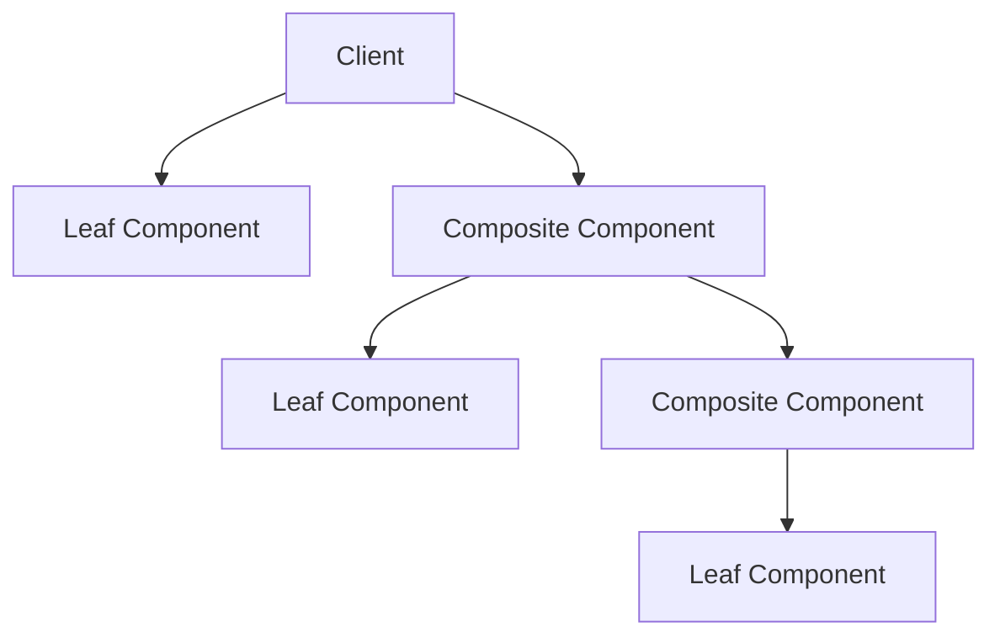
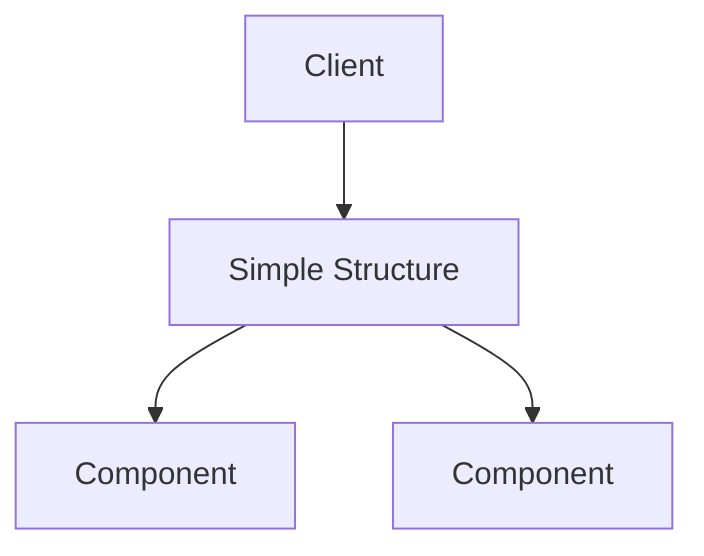

## 6.3.4 Benefits and Limitations

The Composite Pattern is a structural design pattern that enables you to compose objects into tree structures to represent part-whole hierarchies. This pattern allows clients to treat individual objects and compositions of objects uniformly. In this section, we will delve into the benefits and limitations of the Composite Pattern, helping you understand when and how to apply it effectively in your software design projects.

### Benefits of the Composite Pattern

The Composite Pattern offers several advantages that make it an attractive choice for certain types of problems, particularly those involving hierarchical data structures. Let's explore these benefits in detail.

#### 1. Uniformity

One of the most significant advantages of the Composite Pattern is its ability to treat individual objects and compositions uniformly. This uniformity simplifies client code, as it can interact with both simple and complex objects through a common interface.

**Example:** Consider a graphical user interface (GUI) framework where buttons, panels, and windows can be treated as components. The Composite Pattern allows you to treat individual widgets and containers that hold multiple widgets in the same way.

```python

class Component:
    def render(self):
        raise NotImplementedError("You should implement this method.")

class Button(Component):
    def render(self):
        print("Render a button")

class Panel(Component):
    def __init__(self):
        self.children = []

    def add(self, component):
        self.children.append(component)

    def render(self):
        print("Render a panel")
        for child in self.children:
            child.render()

button = Button()
panel = Panel()
panel.add(button)

panel.render()
```

In this example, the `Panel` can contain other components, including `Button`, and render them using the same `render` method. This uniform approach simplifies the client code significantly.

#### 2. Extensibility

The Composite Pattern makes it easy to add new types of components. Since all components adhere to a common interface, extending the system with new component types requires minimal changes to existing code.

**Example:** Suppose you want to add a new `TextBox` component to the GUI framework. You simply need to implement the `Component` interface.

```python
class TextBox(Component):
    def render(self):
        print("Render a text box")

text_box = TextBox()
panel.add(text_box)
panel.render()
```

This extensibility is particularly useful in systems that require frequent updates or modifications.

#### 3. Simplifies Client Code

By allowing clients to treat individual objects and composites uniformly, the Composite Pattern reduces the need for complex conditional logic to differentiate between objects and composites. This leads to cleaner and more maintainable code.

**Example:** In a file system, both files and directories can be treated as components. The Composite Pattern allows operations like `display` or `size` to be performed without needing to check the type of each component.

```python

class FileSystemComponent {
    display() {
        throw "You should implement this method.";
    }
}

class File extends FileSystemComponent {
    constructor(name) {
        super();
        this.name = name;
    }

    display() {
        console.log(`File: ${this.name}`);
    }
}

class Directory extends FileSystemComponent {
    constructor(name) {
        super();
        this.name = name;
        this.children = [];
    }

    add(component) {
        this.children.push(component);
    }

    display() {
        console.log(`Directory: ${this.name}`);
        this.children.forEach(child => child.display());
    }
}

// Client code
const file1 = new File("file1.txt");
const dir = new Directory("Documents");
dir.add(file1);
dir.display();
```

The client code is straightforward, as it doesn't need to differentiate between files and directories when calling the `display` method.

### Limitations of the Composite Pattern

While the Composite Pattern provides significant benefits, it also comes with some limitations that should be considered before its adoption.

#### 1. Overhead

The Composite Pattern can introduce unnecessary complexity if the hierarchy is simple. If your structure doesn't naturally fit into a tree-like hierarchy, using this pattern might lead to over-engineering.

**Example:** For a simple application with a flat structure, such as a list of items, using the Composite Pattern might add unnecessary complexity without providing significant benefits.

#### 2. Potential for Misuse

Incorrect implementation of the Composite Pattern can lead to inefficient operations, especially if leaf operations are not optimized. This can result in performance bottlenecks, particularly in large composite structures.

**Example:** In a large file system, operations like calculating the total size of a directory can become inefficient if not implemented carefully. Each component should optimize its operations to avoid redundant calculations.

#### 3. Design Complexity

Designing the component interface to accommodate all use cases can be challenging. The interface must be flexible enough to support both simple and complex components, which can lead to a bloated or overly complex interface.

**Example:** In a GUI framework, the component interface might need to support operations like `render`, `resize`, and `move`. Designing such an interface to suit all component types can be complex and may require careful consideration.

### Use Cases for the Composite Pattern

The Composite Pattern is particularly useful in scenarios where objects need to be composed into tree structures. Here are some common use cases:

#### 1. Graphical User Interfaces

In GUI frameworks, the Composite Pattern is used to manage widgets, components, and containers. It allows developers to treat individual widgets and composite containers uniformly, simplifying the rendering and event handling processes.

#### 2. Organization Charts

The Composite Pattern is ideal for representing the hierarchical structure of an organization. Each employee can be treated as a component, and departments can be represented as composite components containing other employees or sub-departments.

#### 3. File Systems

File systems are a classic example of the Composite Pattern, where files and directories are treated as components. Directories can contain other files or directories, forming a hierarchical structure.

### Best Practices for the Composite Pattern

To effectively use the Composite Pattern, consider the following best practices:

#### 1. Carefully Design the Component Interface

Ensure that the component interface is designed to suit both leaves and composites. The interface should be flexible enough to accommodate various operations without becoming overly complex.

#### 2. Optimize Operations

Optimize operations that could be inefficient over large composite structures. For example, in a file system, caching the size of directories can improve performance when calculating total sizes.

#### 3. Use Judiciously

The Composite Pattern is powerful but should be used judiciously. Evaluate whether your problem naturally fits into a hierarchical structure before adopting this pattern.

### Visuals and Diagrams

To better understand when the Composite Pattern simplifies versus complicates design, consider the following diagrams:



In this diagram, the client interacts with both leaf and composite components uniformly, demonstrating the simplicity of the Composite Pattern.



In a simple structure, using the Composite Pattern might add unnecessary complexity, as shown in this diagram.

### Key Points to Emphasize

- The Composite Pattern is powerful for scenarios involving hierarchical structures, such as GUIs, organization charts, and file systems.
- The pattern simplifies client code by allowing uniform treatment of individual objects and composites.
- It is crucial to carefully design the component interface and optimize operations to avoid performance bottlenecks.
- Use the Composite Pattern judiciously, evaluating whether your problem naturally fits into a hierarchical structure.

## Quiz Time!



### What is a primary benefit of the Composite Pattern?

- [x] It allows treating individual objects and compositions uniformly.
- [ ] It simplifies the implementation of singleton objects.
- [ ] It ensures thread safety in concurrent applications.
- [ ] It automatically optimizes memory usage.

> **Explanation:** The Composite Pattern's primary benefit is the uniform treatment of individual objects and compositions, simplifying client code.

### Which of the following is a limitation of the Composite Pattern?

- [x] It can introduce unnecessary complexity if the hierarchy is simple.
- [ ] It cannot be used in graphical user interfaces.
- [ ] It is incompatible with object-oriented programming.
- [ ] It mandates the use of global variables.

> **Explanation:** The Composite Pattern can introduce unnecessary complexity if the hierarchy is simple, making it less suitable for flat structures.

### In which scenario is the Composite Pattern particularly useful?

- [x] Managing widgets, components, and containers in GUIs.
- [ ] Implementing a singleton logger.
- [ ] Creating a database connection pool.
- [ ] Handling network sockets.

> **Explanation:** The Composite Pattern is useful in GUIs for managing widgets, components, and containers uniformly.

### What is a best practice when using the Composite Pattern?

- [x] Carefully design the component interface to suit both leaves and composites.
- [ ] Always use it for any data structure.
- [ ] Avoid using interfaces for components.
- [ ] Implement it without considering performance optimization.

> **Explanation:** Carefully designing the component interface ensures it suits both leaves and composites, facilitating extensibility and maintainability.

### How does the Composite Pattern simplify client code?

- [x] By reducing the need for complex conditional logic to differentiate between objects and composites.
- [ ] By eliminating the need for any conditional logic.
- [ ] By using global state management.
- [ ] By enforcing strict type checking.

> **Explanation:** The Composite Pattern simplifies client code by reducing the need for complex conditional logic, allowing uniform treatment of objects and composites.

### What is a common use case for the Composite Pattern?

- [x] Representing the hierarchical structure of an organization.
- [ ] Implementing a caching mechanism.
- [ ] Managing database transactions.
- [ ] Handling asynchronous events.

> **Explanation:** The Composite Pattern is commonly used to represent hierarchical structures, such as organization charts.

### What should be optimized in large composite structures?

- [x] Operations that could be inefficient, such as calculating total sizes.
- [ ] The use of global variables.
- [ ] The number of interfaces implemented.
- [ ] The length of method names.

> **Explanation:** Optimizing operations like calculating total sizes in large composite structures can prevent performance bottlenecks.

### Which of the following is a benefit of the Composite Pattern?

- [x] Extensibility, as it is easy to add new component types.
- [ ] It automatically handles concurrency.
- [ ] It reduces memory usage by half.
- [ ] It enforces strict typing.

> **Explanation:** The Composite Pattern's extensibility makes it easy to add new component types, enhancing flexibility.

### What is a potential misuse of the Composite Pattern?

- [x] Incorrect implementation leading to inefficient operations.
- [ ] Using it in a multi-threaded environment.
- [ ] Applying it to non-object-oriented languages.
- [ ] Using it with immutable objects.

> **Explanation:** Incorrect implementation can lead to inefficient operations, especially if leaf operations are not optimized.

### True or False: The Composite Pattern is always the best choice for any hierarchical data structure.

- [ ] True
- [x] False

> **Explanation:** False. The Composite Pattern is powerful but should be used judiciously, as it may introduce unnecessary complexity in simple hierarchies.



By understanding the benefits and limitations of the Composite Pattern, you can make informed decisions about when and how to apply it in your software design projects. This knowledge will help you create more flexible, maintainable, and efficient systems.
