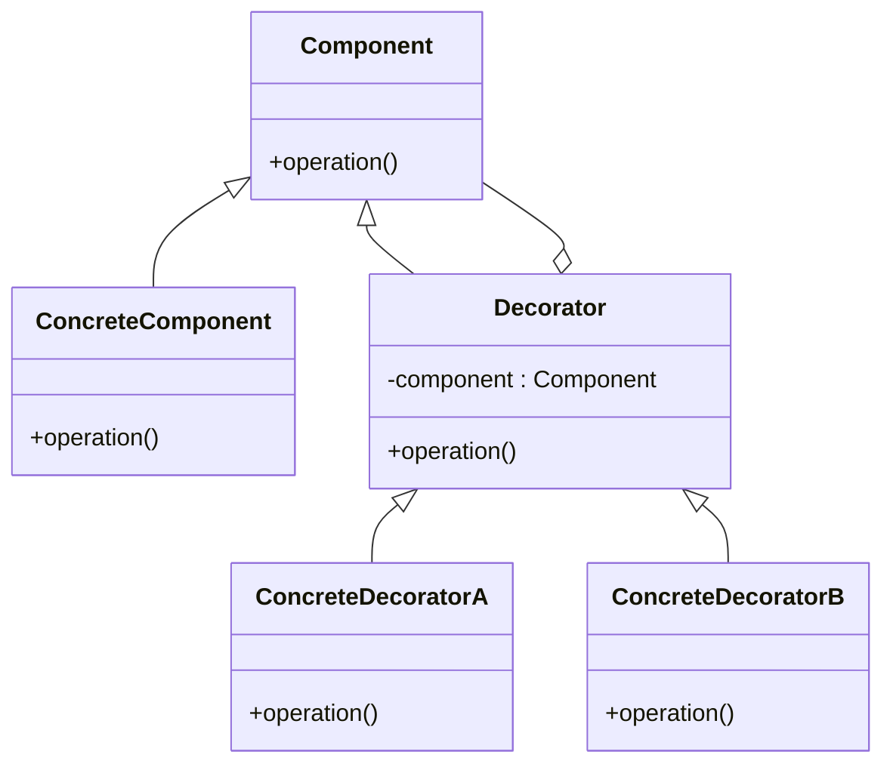

## 6.4.1 Understanding the Decorator Pattern

In the world of software design, flexibility and maintainability are key attributes of a robust application. The **Decorator Pattern** stands as a testament to these principles by providing a way to extend the functionality of objects in a dynamic and flexible manner. This pattern is part of the structural design patterns family, which focuses on how classes and objects are composed to form larger structures.

### Definition of the Decorator Pattern

The **Decorator Pattern** is a structural design pattern that allows behavior to be added to individual objects, either statically or dynamically, without affecting the behavior of other objects from the same class. It provides a more flexible alternative to subclassing for extending functionality.

#### Key Characteristics:

- **Dynamic Behavior Addition:** The pattern enables adding responsibilities to objects dynamically at runtime.
- **Composition Over Inheritance:** It leverages composition rather than inheritance, allowing behaviors to be mixed into objects without altering the original class.
- **Transparent to Clients:** The client using the decorated object is unaware of the presence of decorators, as the decorators adhere to the same interface as the original object.

### Problem Statement

In traditional object-oriented programming, adding new functionalities to a class often involves subclassing. However, subclassing can lead to an explosion of subclasses, especially when multiple independent extensions are needed. This results in a rigid class hierarchy that is difficult to maintain and extend.

Consider a scenario where you have a `Window` class in a graphical user interface library. You might want to add features such as scrolling, borders, or shadows. Subclassing for each combination of features would be impractical and lead to a maintenance nightmare.

### Solution Provided by the Decorator Pattern

The Decorator Pattern addresses this problem by using composition to wrap the original object with one or more decorator objects that add new behaviors. Each decorator object implements the same interface as the original object, ensuring that they can be used interchangeably.

#### Benefits:

- **Flexibility:** Decorators can be combined in various ways to achieve different behaviors.
- **Scalability:** New decorators can be added without modifying existing code.
- **Single Responsibility Principle:** Each decorator has a specific responsibility, promoting cleaner and more maintainable code.

### Real-World Analogy: Clothing Layers

A practical analogy for the Decorator Pattern is the concept of clothing layers. Imagine dressing for cold weather. You start with a basic layer, such as a t-shirt. As the temperature drops, you add a sweater, a jacket, and perhaps a scarf. Each layer adds functionality (warmth, protection) without altering your body. Similarly, decorators add functionality to objects without modifying their core structure.

### Visual Representation of the Decorator Pattern

To better understand the Decorator Pattern, let's examine its class diagram:

#### Explanation of the Diagram:

- **Component:** This is an interface or abstract class defining the operations that can be altered by decorators.
- **ConcreteComponent:** This class implements the `Component` interface and represents the object to which additional responsibilities can be attached.
- **Decorator:** This abstract class implements the `Component` interface and contains a reference to a `Component` object. It delegates all operations to the component.
- **ConcreteDecoratorA/B:** These are concrete classes that extend the `Decorator` class. They add additional responsibilities to the component by overriding operations.

### Key Points to Emphasize

- **Flexibility:** The Decorator Pattern allows behaviors to be added or removed at runtime, making it highly flexible.
- **Avoidance of Inheritance Issues:** By using composition, the pattern avoids the pitfalls associated with deep inheritance hierarchies, such as rigidity and fragility.
- **Transparent to Clients:** Clients interact with the decorated objects through the `Component` interface, unaware of the underlying decorators.

### Conclusion

The Decorator Pattern is a powerful tool in a software designer's arsenal, offering a way to extend and modify object behavior dynamically. By embracing composition over inheritance, it provides a scalable and maintainable approach to enhancing objects with new functionalities. As we delve deeper into specific implementations in the following sections, you'll see how this pattern can be applied in various programming languages and contexts, further solidifying its role as a cornerstone of flexible software design.

## Quiz Time!



### What is the primary purpose of the Decorator Pattern?

- [x] To add responsibilities to objects dynamically without altering their structure.
- [ ] To create a fixed hierarchy of classes.
- [ ] To ensure objects are immutable.
- [ ] To enforce strict type checking.

> **Explanation:** The Decorator Pattern is used to add responsibilities to objects dynamically, providing a flexible alternative to subclassing.

### How does the Decorator Pattern achieve flexibility?

- [x] By using composition to wrap objects with additional behaviors.
- [ ] By creating multiple subclasses for each behavior.
- [ ] By modifying the original class directly.
- [ ] By using static methods to add functionality.

> **Explanation:** The pattern uses composition to wrap objects, allowing behaviors to be added or removed at runtime.

### What problem does the Decorator Pattern solve?

- [x] The proliferation of subclasses when adding new behaviors.
- [ ] The need for global state management.
- [ ] The inability to create objects at runtime.
- [ ] The difficulty in implementing singleton classes.

> **Explanation:** The Decorator Pattern addresses the issue of subclass proliferation by allowing behaviors to be added dynamically without modifying the original class.

### In the Decorator Pattern, what role does the `Component` play?

- [x] It defines the interface for objects that can have responsibilities added.
- [ ] It implements the additional behaviors.
- [ ] It serves as the base class for all decorators.
- [ ] It manages the lifecycle of decorated objects.

> **Explanation:** The `Component` defines the interface for objects that can be extended by decorators.

### Which of the following is a real-world analogy for the Decorator Pattern?

- [x] Wearing layers of clothing to add warmth.
- [ ] Building a house with multiple floors.
- [ ] Assembling a car from parts.
- [ ] Baking a cake with multiple ingredients.

> **Explanation:** Wearing layers of clothing is analogous to adding decorators, as each layer adds functionality without altering the body.

### What is a key advantage of using the Decorator Pattern?

- [x] It allows for the dynamic addition of behaviors at runtime.
- [ ] It simplifies the creation of deep inheritance hierarchies.
- [ ] It ensures all objects are created at compile time.
- [ ] It guarantees thread safety in multi-threaded applications.

> **Explanation:** The Decorator Pattern's main advantage is its ability to add or remove behaviors dynamically at runtime.

### How does the Decorator Pattern adhere to the Single Responsibility Principle?

- [x] Each decorator has a specific responsibility, promoting cleaner code.
- [ ] By consolidating all behaviors into a single class.
- [ ] By using inheritance to manage responsibilities.
- [ ] By enforcing a single interface for all classes.

> **Explanation:** Each decorator focuses on a specific responsibility, which aligns with the Single Responsibility Principle.

### What is the relationship between a `Decorator` and a `Component`?

- [x] A `Decorator` has a reference to a `Component` and delegates operations to it.
- [ ] A `Decorator` is a subclass of `Component`.
- [ ] A `Decorator` and `Component` are unrelated.
- [ ] A `Decorator` inherits all methods from `Component`.

> **Explanation:** A `Decorator` holds a reference to a `Component` and delegates operations, adding additional behaviors.

### Which of the following is NOT a characteristic of the Decorator Pattern?

- [ ] It uses composition to add behaviors.
- [ ] It allows dynamic behavior modification.
- [x] It requires modifying the original class.
- [ ] It promotes flexibility in design.

> **Explanation:** The Decorator Pattern does not require modifying the original class; it uses composition to add behaviors.

### True or False: The Decorator Pattern is best used for adding behaviors that are known at compile time.

- [ ] True
- [x] False

> **Explanation:** The Decorator Pattern is ideal for adding behaviors dynamically at runtime, not just those known at compile time.



By understanding and applying the Decorator Pattern, developers can create flexible and scalable software systems that adapt to changing requirements with ease. This pattern not only enhances the functionality of objects but also promotes clean and maintainable code architecture.
