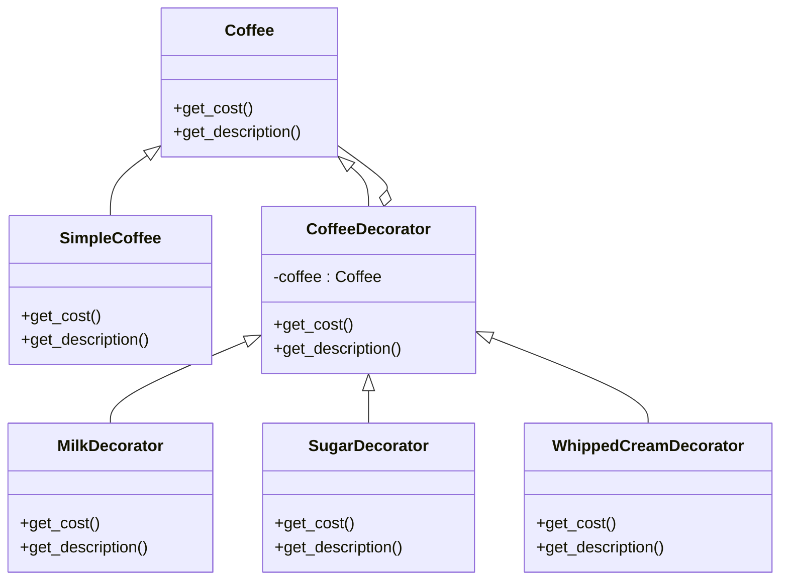

## 6.4.2 Implementation in Python

The Decorator Pattern is a structural design pattern that allows behavior to be added to individual objects, either statically or dynamically, without affecting the behavior of other objects from the same class. This pattern is particularly useful in scenarios where you need to add responsibilities to objects without using inheritance. In this section, we will delve into the intricacies of implementing the Decorator Pattern in Python, using a practical example of a coffee ordering system.

### Introduction to the Decorator Pattern

Before diving into the implementation, let's explore the core concepts of the Decorator Pattern. This pattern involves a set of decorator classes that are used to wrap concrete components. Decorators provide a flexible alternative to subclassing for extending functionality, adhering to the Open/Closed Principle by allowing classes to be open for extension but closed for modification.

#### Key Concepts

- **Component Interface:** Defines the interface for objects that can have responsibilities added to them dynamically.
- **Concrete Component:** The class that implements the component interface and provides the basic functionality.
- **Decorator Base Class:** Implements the component interface and maintains a reference to a component object.
- **Concrete Decorators:** Extend the decorator base class and add new functionalities.

### Implementation Steps

To implement the Decorator Pattern in Python, follow these steps:

#### Step 1: Define the Component Interface

The component interface is an abstract base class that defines the standard methods for the components and decorators. In our coffee ordering system, the `Coffee` interface will define methods to get the cost and description of the coffee.

```python
from abc import ABC, abstractmethod

class Coffee(ABC):
    @abstractmethod
    def get_cost(self):
        pass

    @abstractmethod
    def get_description(self):
        pass
```

#### Step 2: Implement the Concrete Component

The concrete component class, `SimpleCoffee`, implements the `Coffee` interface and provides the base functionality.

```python
class SimpleCoffee(Coffee):
    def get_cost(self):
        return 2.0  # Base cost of coffee

    def get_description(self):
        return "Simple Coffee"
```

#### Step 3: Create the Decorator Base Class

The decorator base class, `CoffeeDecorator`, also implements the `Coffee` interface and holds a reference to a `Coffee` object. It delegates calls to the wrapped object.

```python
class CoffeeDecorator(Coffee):
    def __init__(self, coffee):
        self._coffee = coffee

    def get_cost(self):
        return self._coffee.get_cost()

    def get_description(self):
        return self._coffee.get_description()
```

#### Step 4: Implement Concrete Decorators

Concrete decorators extend the decorator base class and add new functionalities. Each decorator modifies the behavior of the `get_cost` and `get_description` methods.

- **Milk Decorator:**

  ```python
  class MilkDecorator(CoffeeDecorator):
      def get_cost(self):
          return self._coffee.get_cost() + 0.5

      def get_description(self):
          return self._coffee.get_description() + ", Milk"
  ```

- **Sugar Decorator:**

  ```python
  class SugarDecorator(CoffeeDecorator):
      def get_cost(self):
          return self._coffee.get_cost() + 0.2

      def get_description(self):
          return self._coffee.get_description() + ", Sugar"
  ```

- **Whipped Cream Decorator:**

  ```python
  class WhippedCreamDecorator(CoffeeDecorator):
      def get_cost(self):
          return self._coffee.get_cost() + 0.7

      def get_description(self):
          return self._coffee.get_description() + ", Whipped Cream"
  ```

### Example Scenario: Coffee Ordering System

In this example, we will demonstrate how the Decorator Pattern can be used to dynamically add ingredients to a coffee order. This system allows customers to customize their coffee with various ingredients, each represented by a decorator.

#### Client Code

The client code illustrates how to use the decorators to add functionality to the `SimpleCoffee` object dynamically.

```python
def main():
    my_coffee = SimpleCoffee()
    print(f"Description: {my_coffee.get_description()}")
    print(f"Cost: ${my_coffee.get_cost():.2f}")

    # Add Milk
    my_coffee = MilkDecorator(my_coffee)
    # Add Sugar
    my_coffee = SugarDecorator(my_coffee)
    # Add Whipped Cream
    my_coffee = WhippedCreamDecorator(my_coffee)

    print("\nAfter adding decorations:")
    print(f"Description: {my_coffee.get_description()}")
    print(f"Cost: ${my_coffee.get_cost():.2f}")

if __name__ == "__main__":
    main()
```

### Explanation

- **Component Interface (`Coffee`):** Defines the methods `get_cost()` and `get_description()` that must be implemented by concrete classes.
- **Concrete Component (`SimpleCoffee`):** Provides the base implementation of a simple coffee.
- **Decorator Base Class (`CoffeeDecorator`):** Holds a reference to a `Coffee` object and delegates calls to the wrapped object.
- **Concrete Decorators:** Each adds additional functionality (cost and description) to the coffee. They wrap a `Coffee` object and enhance its behavior.
- **Client Code:** Starts with a simple coffee and dynamically decorates it with milk, sugar, and whipped cream, demonstrating that behaviors can be added at runtime.

### Best Practices

- **Transparency:** Decorators should conform to the interface of the components they decorate to ensure transparency.
- **Minimalism:** Keep each decorator focused on a single responsibility for clarity and reusability.
- **Immutability Consideration:** Be cautious with mutable state; ensure that decorators do not unintentionally affect other decorators.

### Visuals and Diagrams

To better understand the structure and relationships in the Decorator Pattern, let's look at a class diagram:



### Key Points to Emphasize

- The Decorator Pattern provides a flexible alternative to subclassing for extending functionality.
- It allows behaviors to be added or removed at runtime by wrapping objects.
- This pattern adheres to the Open/Closed Principle, as classes are open for extension but closed for modification.

### Conclusion

The Decorator Pattern is a powerful tool in a developer's toolkit, offering a flexible way to extend the functionality of objects without altering their structure. By implementing this pattern in Python, you can create scalable and maintainable systems that adapt to changing requirements with ease. The coffee ordering system example demonstrates how decorators can be used to add dynamic behavior to objects, making your code more modular and easier to manage.

## Quiz Time!



### What is the main purpose of the Decorator Pattern?

- [x] To add behavior to individual objects dynamically without affecting other objects.
- [ ] To enforce strict type checking at compile time.
- [ ] To simplify complex algorithms.
- [ ] To manage memory allocation efficiently.

> **Explanation:** The Decorator Pattern allows for adding responsibilities to objects dynamically, providing a flexible alternative to subclassing.

### Which principle does the Decorator Pattern adhere to?

- [x] Open/Closed Principle
- [ ] Single Responsibility Principle
- [ ] Liskov Substitution Principle
- [ ] Interface Segregation Principle

> **Explanation:** The Decorator Pattern adheres to the Open/Closed Principle by allowing classes to be open for extension but closed for modification.

### In the coffee ordering system, what role does `SimpleCoffee` play?

- [x] Concrete Component
- [ ] Component Interface
- [ ] Decorator Base Class
- [ ] Concrete Decorator

> **Explanation:** `SimpleCoffee` is the concrete component that provides the base implementation of a simple coffee.

### What is the function of a Decorator Base Class?

- [x] To hold a reference to a component object and delegate calls to it.
- [ ] To implement complex business logic.
- [ ] To manage database connections.
- [ ] To provide user interface elements.

> **Explanation:** The Decorator Base Class holds a reference to a component object and delegates calls to the wrapped object.

### Which of the following is a concrete decorator in the coffee ordering system?

- [x] MilkDecorator
- [ ] Coffee
- [ ] CoffeeDecorator
- [ ] SimpleCoffee

> **Explanation:** `MilkDecorator` is a concrete decorator that adds additional functionality to the coffee by wrapping a `Coffee` object.

### How does the Decorator Pattern differ from subclassing?

- [x] It allows for dynamic addition of behavior at runtime.
- [ ] It requires less memory.
- [ ] It is faster in execution.
- [ ] It simplifies code readability.

> **Explanation:** The Decorator Pattern allows for dynamic addition of behavior at runtime, providing more flexibility than static subclassing.

### What is a key advantage of using decorators?

- [x] They provide a flexible alternative to subclassing.
- [ ] They eliminate the need for interfaces.
- [ ] They reduce the number of classes needed.
- [ ] They enforce compile-time type checking.

> **Explanation:** Decorators provide a flexible alternative to subclassing for extending functionality.

### In the Decorator Pattern, what is the role of the component interface?

- [x] To define the standard methods for components and decorators.
- [ ] To manage application state.
- [ ] To handle user input.
- [ ] To provide logging functionality.

> **Explanation:** The component interface defines the standard methods for components and decorators, ensuring consistency.

### What should decorators conform to for transparency?

- [x] The interface of the components they decorate.
- [ ] The database schema.
- [ ] The user interface guidelines.
- [ ] The network protocol specifications.

> **Explanation:** Decorators should conform to the interface of the components they decorate to ensure transparency.

### True or False: The Decorator Pattern can only be used with immutable objects.

- [ ] True
- [x] False

> **Explanation:** The Decorator Pattern can be used with both mutable and immutable objects, but care must be taken with mutable state to avoid unintended side effects.



By understanding and applying the Decorator Pattern, you can enhance the flexibility and maintainability of your software systems, making them more adaptable to future changes and requirements.
