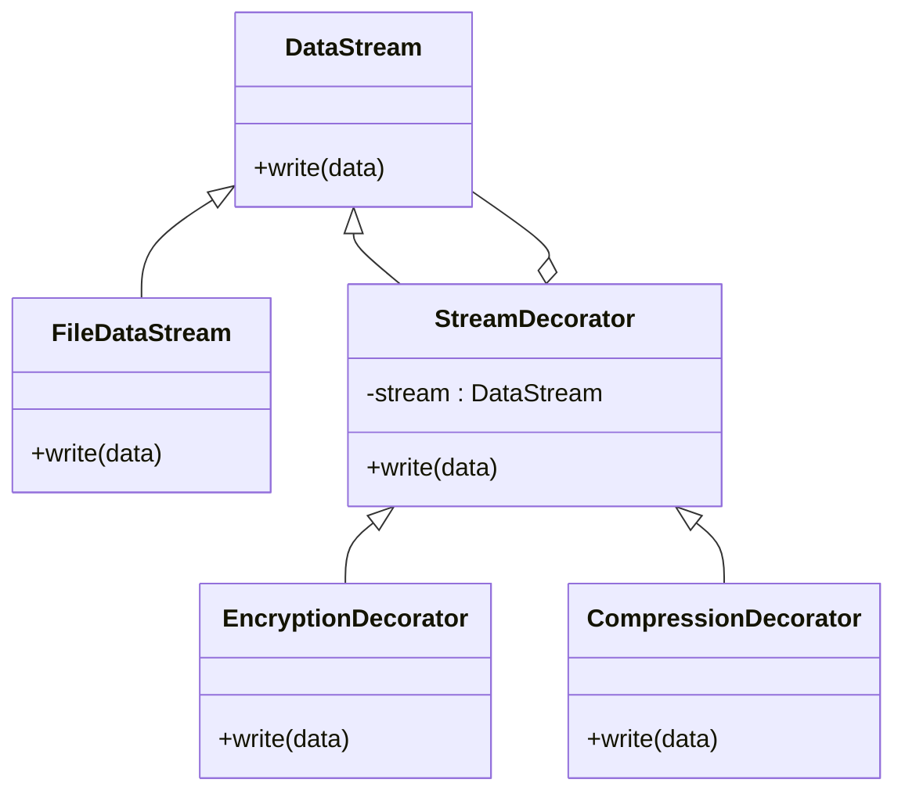

## 6.4.3 Implementation in JavaScript

In modern software design, the ability to extend and enhance the functionality of objects dynamically is crucial, especially in languages like JavaScript that thrive on flexibility. The **Decorator pattern** is a structural design pattern that allows behavior to be added to individual objects, either statically or dynamically, without affecting the behavior of other objects from the same class. This pattern is particularly powerful in JavaScript, where the dynamic nature of the language allows for elegant and flexible implementations.

### Understanding the Decorator Pattern

Before diving into the implementation, let's revisit the core concepts of the Decorator pattern:

- **Purpose:** The Decorator pattern is used to add new functionality to an existing object without altering its structure. It is a structural pattern, providing a flexible alternative to subclassing for extending functionality.
- **Components:**
  - **Component Interface:** An abstract interface or class that defines the behavior that can be dynamically added.
  - **Concrete Component:** The original object that will have new behavior added.
  - **Decorator Base Class:** A class that wraps the component and provides a mechanism for adding new behavior.
  - **Concrete Decorators:** Specific classes that extend the base decorator to add new functionality.

### Implementation Steps in JavaScript

In JavaScript, implementing the Decorator pattern involves leveraging ES6 classes and the dynamic nature of the language. Here’s a step-by-step guide:

#### 1. Define the Component Interface

In JavaScript, interfaces are implied rather than explicitly defined. We'll start by creating a base class that outlines the `write` method.

```javascript
class DataStream {
    write(data) {
        throw new Error("Method 'write()' must be implemented.");
    }
}
```

This class acts as the interface, ensuring that any subclass implements the `write` method.

#### 2. Implement the Concrete Component

The concrete component implements the interface and provides the basic functionality.

```javascript
class FileDataStream extends DataStream {
    write(data) {
        console.log(`Writing data to file: ${data}`);
    }
}
```

Here, `FileDataStream` simulates writing data to a file by logging it to the console.

#### 3. Create a Decorator Base Class

The decorator base class extends the component interface and holds a reference to a component object.

```javascript
class StreamDecorator extends DataStream {
    constructor(stream) {
        super();
        this._stream = stream;
    }

    write(data) {
        this._stream.write(data);
    }
}
```

`StreamDecorator` serves as the base for all decorators, delegating the `write` call to the wrapped component.

#### 4. Develop Concrete Decorators

Each concrete decorator extends the base decorator and adds its own functionality.

##### Encryption Decorator

```javascript
class EncryptionDecorator extends StreamDecorator {
    write(data) {
        const encryptedData = this.encrypt(data);
        console.log("Encrypting data...");
        super.write(encryptedData);
    }

    encrypt(data) {
        // Simple mock encryption (reverse the string)
        return data.split('').reverse().join('');
    }
}
```

The `EncryptionDecorator` encrypts data by reversing the string before passing it to the wrapped stream.

##### Compression Decorator

```javascript
class CompressionDecorator extends StreamDecorator {
    write(data) {
        const compressedData = this.compress(data);
        console.log("Compressing data...");
        super.write(compressedData);
    }

    compress(data) {
        // Simple mock compression (remove vowels)
        return data.replace(/[aeiou]/gi, '');
    }
}
```

The `CompressionDecorator` compresses data by removing vowels before passing it to the wrapped stream.

### Example Scenario: Enhancing a Data Streaming Service

Let’s consider a practical example where we enhance a basic data streaming service with encryption and compression decorators.

#### Client Code

```javascript
function main() {
    let stream = new FileDataStream();
    stream.write("Important Data");

    // Decorate the stream with encryption
    stream = new EncryptionDecorator(stream);
    // Decorate the stream with compression
    stream = new CompressionDecorator(stream);

    console.log("\nAfter adding decorators:");
    stream.write("Important Data");
}

main();
```

**Explanation:**

- **DataStream (Component Base Class):** Defines the `write` method to be implemented.
- **FileDataStream (Concrete Component):** Implements `write` to output data to a file (simulated with console output).
- **StreamDecorator (Decorator Base Class):** Extends `DataStream` and holds a reference to another `DataStream`.
- **Concrete Decorators:**
  - **EncryptionDecorator:** Overrides `write` to encrypt data before passing it to the wrapped stream.
  - **CompressionDecorator:** Overrides `write` to compress data before passing it to the wrapped stream.
- **Client Code:** Demonstrates how decorators can be added at runtime to enhance the functionality of the stream.

### Best Practices for Using Decorators

- **Layering Decorators:** Decorators can wrap other decorators, allowing for multiple enhancements. This is a powerful feature of the Decorator pattern, enabling complex behaviors to be composed from simpler ones.
- **Method Delegation:** Ensure that decorators call `super.write(data)` to delegate to the wrapped component. This maintains the chain of responsibility and ensures all decorators in the chain are executed.
- **Non-invasive Enhancement:** Decorators should not modify the interface of the component, ensuring compatibility and interchangeability of components and decorators.

### Visual Representation

To better understand the structure of the Decorator pattern, let's look at a class diagram illustrating the relationships between the components:



### Key Points to Emphasize

- **Dynamic Behavior Addition:** The Decorator pattern in JavaScript leverages the language's flexibility to add behaviors dynamically, making it a powerful tool for enhancing objects without altering their structure.
- **Reduced Complexity:** By avoiding extensive subclassing, the Decorator pattern reduces complexity and improves maintainability.
- **Composability:** Decorators can be easily composed to combine multiple functionalities, allowing developers to build complex systems from simple components.

### Conclusion

The Decorator pattern is a versatile and powerful tool in the JavaScript developer's toolkit. By understanding and implementing this pattern, developers can create flexible, maintainable, and dynamic systems that can adapt to changing requirements without the need for extensive refactoring. As you continue to explore design patterns, consider how the Decorator pattern can be applied to your own projects to enhance functionality and improve code organization.

## Quiz Time!



### What is the primary purpose of the Decorator pattern?

- [x] To add new functionality to an existing object without altering its structure.
- [ ] To create a new class hierarchy for each new feature.
- [ ] To simplify the implementation of complex algorithms.
- [ ] To enforce strict type checking in dynamic languages.

> **Explanation:** The Decorator pattern is used to add new functionality to an existing object without changing its structure, providing a flexible alternative to subclassing.

### In JavaScript, how is the component interface typically defined?

- [x] By creating a base class with methods that subclasses must implement.
- [ ] By using the `interface` keyword.
- [ ] By defining a set of global functions.
- [ ] By using TypeScript's `interface` keyword.

> **Explanation:** In JavaScript, interfaces are implied rather than explicitly defined. A base class can be used to outline methods that subclasses must implement.

### What does the `StreamDecorator` class do in the provided example?

- [x] It acts as a base class for all decorators, delegating the `write` call to the wrapped component.
- [ ] It encrypts the data before writing it.
- [ ] It compresses the data before writing it.
- [ ] It writes data directly to the console.

> **Explanation:** `StreamDecorator` serves as the base for all decorators, delegating the `write` call to the wrapped component.

### How does the `EncryptionDecorator` modify data in the example?

- [x] It encrypts data by reversing the string.
- [ ] It encrypts data by converting it to binary.
- [ ] It encrypts data by hashing it.
- [ ] It encrypts data by encoding it in Base64.

> **Explanation:** The `EncryptionDecorator` encrypts data by reversing the string before passing it to the wrapped stream.

### Which of the following is a best practice when using decorators?

- [x] Ensure that decorators call `super.write(data)` to delegate to the wrapped component.
- [ ] Modify the interface of the component to add new methods.
- [ ] Use decorators to replace the original functionality completely.
- [ ] Avoid using decorators in dynamic languages like JavaScript.

> **Explanation:** It is a best practice to ensure that decorators call `super.write(data)` to maintain the chain of responsibility and ensure all decorators are executed.

### What is the advantage of layering decorators?

- [x] It allows for multiple enhancements to be composed from simpler ones.
- [ ] It simplifies the code by reducing the number of classes.
- [ ] It ensures that only one decorator is applied at a time.
- [ ] It prevents any changes to the original object's behavior.

> **Explanation:** Layering decorators allows for complex behaviors to be composed from simpler ones, providing flexibility and reusability.

### Why should decorators not modify the interface of the component?

- [x] To ensure compatibility and interchangeability of components and decorators.
- [ ] To simplify the implementation of the decorator pattern.
- [ ] To prevent errors in dynamic languages like JavaScript.
- [ ] To ensure that only one decorator can be applied at a time.

> **Explanation:** Decorators should not modify the interface to ensure compatibility and interchangeability of components and decorators.

### How does the `CompressionDecorator` modify data in the example?

- [x] It compresses data by removing vowels.
- [ ] It compresses data by converting it to binary.
- [ ] It compresses data by encoding it in Base64.
- [ ] It compresses data by hashing it.

> **Explanation:** The `CompressionDecorator` compresses data by removing vowels before passing it to the wrapped stream.

### What is a key benefit of using the Decorator pattern in JavaScript?

- [x] It leverages the language's flexibility to add behaviors dynamically.
- [ ] It enforces strict type checking.
- [ ] It simplifies the implementation of complex algorithms.
- [ ] It provides a way to create immutable objects.

> **Explanation:** The Decorator pattern leverages JavaScript's flexibility to add behaviors dynamically, making it a powerful tool for enhancing objects.

### True or False: The Decorator pattern requires extensive subclassing to add new functionality.

- [ ] True
- [x] False

> **Explanation:** False. The Decorator pattern avoids the need for extensive subclassing by allowing new functionality to be added dynamically through composition.


