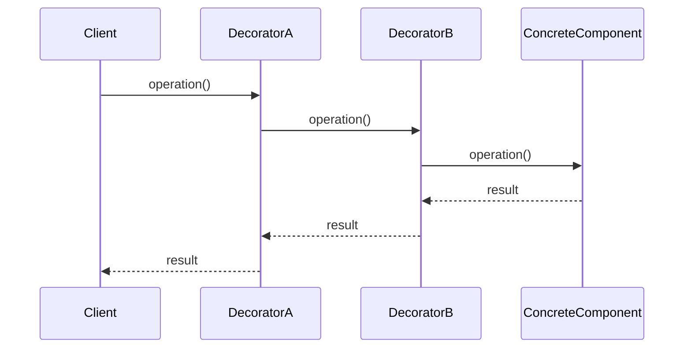

## 6.4.4 Use Cases and Best Practices

The Decorator pattern is a structural design pattern that allows behavior to be added to individual objects, dynamically, without affecting the behavior of other objects from the same class. This pattern is particularly useful in scenarios where you need to extend the functionality of objects in a flexible and reusable manner. In this section, we will delve into the practical use cases of the Decorator pattern, explore its benefits, and discuss best practices for its implementation.

### Use Cases of the Decorator Pattern

#### Dynamic Behavior Addition

One of the primary use cases of the Decorator pattern is to add responsibilities to individual objects without affecting others. This is particularly useful in environments where objects need to be extended with new behaviors dynamically.

**Example Scenario:** Consider a graphical user interface (GUI) application where you need to add features like scrollbars, borders, or shadows to visual components. Using the Decorator pattern, you can wrap these components with decorators that add the desired functionalities.

```python
class VisualComponent:
    def draw(self):
        pass

class TextView(VisualComponent):
    def draw(self):
        print("Drawing text view")

class BorderDecorator(VisualComponent):
    def __init__(self, component):
        self._component = component

    def draw(self):
        self._component.draw()
        self._draw_border()

    def _draw_border(self):
        print("Drawing border")

text_view = TextView()
bordered_text_view = BorderDecorator(text_view)
bordered_text_view.draw()
```

In this example, `BorderDecorator` adds a border to a `TextView` object without altering the `TextView` class itself.

#### Extending Functionality at Runtime

The Decorator pattern shines in situations where subclassing is impractical due to a large number of potential combinations of behaviors. By using decorators, you can extend functionality at runtime without the need for an extensive class hierarchy.

**Example Scenario:** In a logging system, you might want to add different logging behaviors such as writing to a file, sending logs to a remote server, or formatting logs in various ways. Using decorators, you can combine these behaviors at runtime.

```javascript
class Logger {
    log(message) {
        console.log(message);
    }
}

class TimestampDecorator {
    constructor(logger) {
        this.logger = logger;
    }

    log(message) {
        const timestampedMessage = `${new Date().toISOString()}: ${message}`;
        this.logger.log(timestampedMessage);
    }
}

class FileLoggerDecorator {
    constructor(logger, filePath) {
        this.logger = logger;
        this.filePath = filePath;
    }

    log(message) {
        // Simulate writing to a file
        console.log(`Writing to ${this.filePath}: ${message}`);
        this.logger.log(message);
    }
}

// Usage
const logger = new Logger();
const timestampedLogger = new TimestampDecorator(logger);
const fileLogger = new FileLoggerDecorator(timestampedLogger, '/var/log/app.log');

fileLogger.log('This is a log message');
```

Here, `TimestampDecorator` and `FileLoggerDecorator` can be combined in different ways to achieve the desired logging behavior without modifying the `Logger` class.

#### Interchangeable Wrappers

Another powerful use case for the Decorator pattern is when you need to add or remove features dynamically, such as in user interface components. Decorators allow you to create interchangeable wrappers that can be applied as needed.

**Example Scenario:** In a web application, you might have different UI components that require additional features like tooltips, drag-and-drop support, or animations. Using decorators, you can apply these features to components interchangeably.

```javascript
class UIComponent {
    render() {
        console.log('Rendering component');
    }
}

class TooltipDecorator {
    constructor(component, tooltipText) {
        this.component = component;
        this.tooltipText = tooltipText;
    }

    render() {
        this.component.render();
        this._addTooltip();
    }

    _addTooltip() {
        console.log(`Adding tooltip: ${this.tooltipText}`);
    }
}

class AnimationDecorator {
    constructor(component) {
        this.component = component;
    }

    render() {
        this.component.render();
        this._addAnimation();
    }

    _addAnimation() {
        console.log('Adding animation');
    }
}

// Usage
const component = new UIComponent();
const tooltipComponent = new TooltipDecorator(component, 'This is a tooltip');
const animatedComponent = new AnimationDecorator(tooltipComponent);

animatedComponent.render();
```

In this example, you can add tooltips and animations to a `UIComponent` without altering its base implementation, maintaining flexibility and reusability.

### Benefits of the Decorator Pattern

#### Flexibility

The Decorator pattern provides flexibility by allowing behaviors to be composed at runtime through composition rather than inheritance. This means you can mix and match decorators to achieve the desired functionality without modifying existing code.

#### Adherence to the Open/Closed Principle

The Decorator pattern adheres to the Open/Closed Principle, which states that software entities should be open for extension but closed for modification. By using decorators, you can extend the functionality of objects without altering their existing code.

#### Reusability

Individual decorators can be reused across different components, reducing code duplication and promoting maintainability. This reusability is a key advantage of the Decorator pattern, as it allows you to apply the same decorator to multiple objects.

#### Simplification of Class Hierarchy

By using decorators, you can reduce the need for numerous subclasses to cover all combinations of features. This simplifies the class hierarchy and makes the codebase easier to understand and maintain.

### Best Practices for Implementing the Decorator Pattern

#### Interface Consistency

Decorators should implement the same interface as the components they wrap to ensure interchangeability. This consistency allows clients to interact with decorated objects in the same way they would with undecorated objects.

#### Avoid Over-Decoration

While the Decorator pattern offers great flexibility, it's important to avoid creating excessively deep layers of decorators. Over-decoration can complicate debugging and degrade performance, so it's crucial to strike a balance between flexibility and simplicity.

#### Single Responsibility

Each decorator should focus on a single enhancement to maintain clarity and reusability. By adhering to the Single Responsibility Principle, you can ensure that each decorator has a clear purpose and can be easily understood and maintained.

#### Transparency

Clients should not need to be aware of whether they are working with a component or a decorated component. This transparency is achieved by ensuring that decorators maintain the interface and behavior of the components they wrap.

### Considerations When Using the Decorator Pattern

#### Performance Impact

While the Decorator pattern offers many benefits, it's important to consider the potential performance impact of additional layers. Each layer introduces a slight overhead, so it's important to assess whether the benefits of decoration outweigh the performance costs.

#### Complexity in Debugging

Multiple layers of decorators can make it more difficult to trace method calls and identify the source of issues. To mitigate this complexity, it's helpful to use logging and debugging tools that can provide insights into the behavior of decorated objects.

### Examples in Industry

#### Middleware in Web Servers

In web servers, middleware is a common use case for the Decorator pattern. HTTP requests pass through layers of middleware, each adding functionality such as authentication, logging, or data transformation. This modular approach allows developers to compose middleware dynamically based on the needs of the application.

#### Formatting Streams

In I/O libraries, streams can be wrapped with decorators to add features such as buffering, encoding, or encryption. This allows developers to build complex data processing pipelines by combining different decorators to achieve the desired behavior.

### Visual Representation of the Decorator Pattern

To illustrate how the Decorator pattern works, consider the following sequence diagram, which shows the flow of method calls through a stack of decorators:



In this diagram, the `Client` initiates an operation on `DecoratorA`, which delegates the operation to `DecoratorB`, and finally to the `ConcreteComponent`. The result propagates back through the decorators to the client, demonstrating the flow of control and data.

### Key Points to Emphasize

- The Decorator pattern is a powerful tool for adding functionality to objects without modifying existing code.
- It provides a high level of flexibility and adheres to key design principles such as the Open/Closed Principle.
- Understanding when and how to use decorators can greatly enhance the design of a system, allowing for more modular, maintainable, and extensible code.

By following these guidelines and best practices, you can effectively leverage the Decorator pattern to enhance the functionality of your software systems while maintaining a clean and manageable codebase.

## Quiz Time!



### What is one primary use case of the Decorator pattern?

- [x] Adding responsibilities to individual objects without affecting others
- [ ] Creating a new class hierarchy
- [ ] Implementing a singleton pattern
- [ ] Managing database connections

> **Explanation:** The Decorator pattern is used to add responsibilities to individual objects dynamically without affecting others.

### How does the Decorator pattern adhere to the Open/Closed Principle?

- [x] By allowing classes to be extended without modification
- [ ] By requiring all classes to be abstract
- [ ] By enforcing strict type checking
- [ ] By using inheritance exclusively

> **Explanation:** The Decorator pattern allows classes to be extended with new behaviors without modifying their existing code, adhering to the Open/Closed Principle.

### What is a potential drawback of using too many decorators?

- [x] Increased complexity and performance overhead
- [ ] Reduced code reuse
- [ ] Inability to add new behaviors
- [ ] Difficulty in creating subclasses

> **Explanation:** Using too many decorators can lead to increased complexity and performance overhead, making debugging and maintenance more challenging.

### In which scenario might you choose decorators over subclassing?

- [x] When subclassing leads to a large number of combinations
- [ ] When you need to enforce strict type hierarchies
- [ ] When all behaviors are known at compile time
- [ ] When performance is the primary concern

> **Explanation:** Decorators are preferred over subclassing when there are many potential combinations of behaviors, as they allow for more flexible runtime composition.

### Which of the following is an example of using the Decorator pattern in industry?

- [x] Middleware in web servers
- [ ] Singleton database connections
- [ ] Factory pattern for object creation
- [ ] Observer pattern for event handling

> **Explanation:** Middleware in web servers is a common use case for the Decorator pattern, where requests pass through layers of functionality.

### What should decorators maintain to ensure transparency?

- [x] The same interface as the components they wrap
- [ ] A separate logging mechanism
- [ ] A unique identifier for each decorator
- [ ] Direct access to client code

> **Explanation:** Decorators should maintain the same interface as the components they wrap to ensure transparency and interchangeability.

### What is the primary benefit of using decorators for UI components?

- [x] Dynamic addition and removal of features
- [ ] Static feature set at compile time
- [ ] Simplified user interface design
- [ ] Reduced need for event handling

> **Explanation:** Decorators allow for the dynamic addition and removal of features in UI components, providing flexibility in design.

### What is a best practice when implementing decorators?

- [x] Each decorator should focus on a single enhancement
- [ ] Decorators should always be abstract classes
- [ ] Decorators should modify the core component's state
- [ ] All decorators should be applied at compile time

> **Explanation:** Each decorator should focus on a single enhancement to maintain clarity and reusability.

### How can decorators affect performance?

- [x] They introduce slight performance overhead due to additional layers
- [ ] They significantly reduce memory usage
- [ ] They optimize CPU usage by parallel processing
- [ ] They have no impact on performance

> **Explanation:** Decorators can introduce slight performance overhead due to the additional layers they add to the method call stack.

### True or False: Decorators can be used to modify the behavior of objects at runtime.

- [x] True
- [ ] False

> **Explanation:** True. Decorators allow for the modification of object behavior at runtime by adding new functionalities dynamically.


