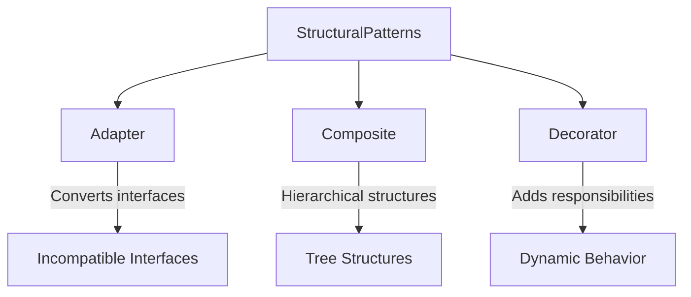

## Conclusion of Chapter 6

As we conclude Chapter 6 of "Design Patterns 101: A Beginner's Guide to Software Design," we find ourselves at a pivotal point in our journey through the realm of design patterns. This chapter has been dedicated to exploring structural design patterns, which are essential tools in the software engineer's toolkit. They focus on how classes and objects can be combined to form larger, more complex structures. The structural patterns we've discussed are key to simplifying software design, promoting flexibility, and enhancing reusability.

### Recap of Structural Patterns

Structural design patterns are concerned with the composition of classes and objects. They help ensure that if one part of a system changes, the entire system doesn't need to follow suit. This decoupling is crucial for maintaining and scaling software systems. By using structural patterns, developers can build systems that are easier to understand, modify, and extend.

#### Key Patterns Discussed

1. **Adapter Pattern**: This pattern allows objects with incompatible interfaces to collaborate. By introducing an adapter class, we can bridge the gap between disparate interfaces, enabling them to work together seamlessly. This is particularly useful in scenarios where you need to integrate new components into an existing system without modifying the system's core.

2. **Composite Pattern**: The composite pattern is all about treating individual objects and compositions of objects uniformly. It is particularly useful in building hierarchical structures such as trees, where you want to treat both individual elements and groups of elements in the same way. This pattern is often used in graphical user interfaces and file system structures.

3. **Decorator Pattern**: The decorator pattern provides a flexible alternative to subclassing for extending functionality. It allows responsibilities to be added to objects dynamically. This pattern is invaluable when you need to add functionality to objects without altering their structure, making it ideal for situations where you want to add features to individual objects at runtime.

### Key Takeaways

#### Understanding of Each Pattern

Understanding when and how to apply each structural pattern is crucial. Each pattern has its specific use cases and benefits:

- **Adapter Pattern**: Best used when you need to integrate incompatible interfaces or legacy systems with new systems.
- **Composite Pattern**: Ideal for scenarios where you need to represent part-whole hierarchies, allowing clients to treat individual objects and compositions uniformly.
- **Decorator Pattern**: Useful when you need to add responsibilities to objects without modifying their code, especially when these responsibilities need to be added dynamically at runtime.

#### Design Principles Reinforced

Structural patterns are excellent examples of the SOLID principles, particularly:

- **Open/Closed Principle**: Systems should be open for extension but closed for modification. Structural patterns allow you to extend systems without altering their existing code.
- **Single Responsibility Principle**: Each class should have a single responsibility. Structural patterns help maintain this principle by decoupling responsibilities across different classes.

#### Practical Application

Applying these patterns in real-world projects can significantly improve the design and maintainability of software systems. As you continue to develop your skills, consider how these patterns can be integrated into your projects to solve complex design problems efficiently.

### Looking Forward

As we transition to the next chapter, we will delve into behavioral patterns. These patterns focus on the interaction between objects and how responsibilities are distributed among them. Understanding behavioral patterns will further enhance your ability to design robust and efficient software systems.

#### Continued Learning

Reflect on how structural patterns can complement the creational patterns discussed earlier in the book. By combining different types of patterns, you can address a wide range of design challenges and create more robust solutions.

### Final Thoughts

Design patterns are more than just theoretical concepts; they are practical tools that can significantly enhance your software design capabilities. Mastering structural patterns will enable you to build flexible, scalable, and maintainable software. As you continue to practice and implement these patterns, your understanding and proficiency will deepen.

### Visual Summary

To encapsulate the essence of structural patterns discussed in this chapter, let's review the following diagram:

This diagram illustrates the relationships and key use cases for each structural pattern, providing a visual summary of their applications.

### Key Points to Emphasize

- Mastery of structural patterns enhances your ability to design flexible and scalable software.
- Structural patterns can be combined with other patterns to address complex design challenges.
- Continuous practice and application of these patterns will solidify your understanding and proficiency.

### Encouragement for Continued Practice

As you move forward, I encourage you to actively apply these patterns in your projects. Experiment with different scenarios, and don't hesitate to revisit this chapter as a reference. The more you practice, the more intuitive these patterns will become, and the more adept you will be at using them to create elegant and efficient software solutions.

## Quiz Time!



### What is the primary focus of structural design patterns?

- [x] Combining classes and objects to form larger structures
- [ ] Managing object creation
- [ ] Defining object behavior
- [ ] Optimizing code performance

> **Explanation:** Structural design patterns focus on how classes and objects can be combined to form larger structures, promoting flexibility and reusability.

### Which pattern allows incompatible interfaces to work together?

- [x] Adapter Pattern
- [ ] Composite Pattern
- [ ] Decorator Pattern
- [ ] Singleton Pattern

> **Explanation:** The Adapter Pattern allows incompatible interfaces to work together by using an adapter class to bridge the gap.

### What is the primary use case for the Composite Pattern?

- [ ] Adding responsibilities to objects
- [ ] Managing object creation
- [x] Treating individual objects and compositions uniformly
- [ ] Optimizing code performance

> **Explanation:** The Composite Pattern enables treating individual objects and compositions uniformly, making it ideal for hierarchical structures.

### How does the Decorator Pattern add responsibilities to objects?

- [ ] By modifying the object's class
- [ ] By creating a new subclass
- [x] By dynamically adding responsibilities at runtime
- [ ] By using a factory method

> **Explanation:** The Decorator Pattern adds responsibilities to objects dynamically at runtime without modifying their structure.

### Which SOLID principle is exemplified by structural patterns?

- [x] Open/Closed Principle
- [ ] Liskov Substitution Principle
- [x] Single Responsibility Principle
- [ ] Dependency Inversion Principle

> **Explanation:** Structural patterns exemplify the Open/Closed Principle by allowing systems to be extended without modification and the Single Responsibility Principle by decoupling responsibilities.

### What is a key benefit of using structural patterns?

- [x] Simplifying software design
- [ ] Increasing code complexity
- [ ] Reducing code readability
- [ ] Limiting system scalability

> **Explanation:** Structural patterns simplify software design by promoting flexibility and reusability.

### How can structural patterns be combined with other patterns?

- [x] To address complex design challenges
- [ ] To increase system dependencies
- [x] To create more robust solutions
- [ ] To limit code flexibility

> **Explanation:** Structural patterns can be combined with other patterns to address complex design challenges and create more robust solutions.

### What should you do to deepen your understanding of structural patterns?

- [x] Practice implementing them in projects
- [ ] Avoid using them in real-world scenarios
- [ ] Focus only on theoretical knowledge
- [ ] Ignore their practical applications

> **Explanation:** Practicing the implementation of structural patterns in projects will deepen your understanding and proficiency.

### What will the next chapter focus on?

- [ ] Structural Patterns
- [x] Behavioral Patterns
- [ ] Creational Patterns
- [ ] Optimization Techniques

> **Explanation:** The next chapter will focus on behavioral patterns, which deal with object interaction and responsibility.

### True or False: Structural patterns are only useful for small-scale projects.

- [ ] True
- [x] False

> **Explanation:** Structural patterns are useful for projects of all scales, as they enhance flexibility, scalability, and maintainability.



By mastering these concepts, you are well on your way to becoming a proficient software designer. Keep exploring, practicing, and applying these patterns to your projects, and you'll find that your ability to create robust, maintainable software will continue to grow.
