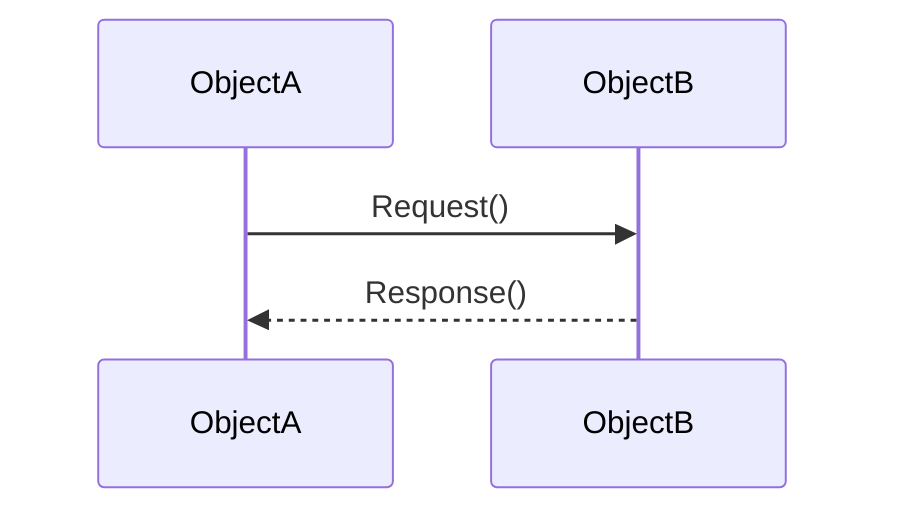

## 7.1.1 What Are Behavioral Patterns?

In the realm of software design, understanding how components interact and communicate is crucial for building robust and maintainable systems. Behavioral design patterns play a pivotal role in this context. They are concerned with the algorithms and the assignment of responsibilities between objects, focusing on the interactions and communication patterns that facilitate the realization of specific functionalities. This chapter aims to introduce you to the world of behavioral patterns, exploring their purpose, significance, and how they differ from other pattern types.

### Defining Behavioral Patterns

Behavioral design patterns are a category of design patterns that deal primarily with the interaction and communication between objects and classes. Unlike creational patterns, which are concerned with object creation, or structural patterns, which focus on the composition of classes and objects, behavioral patterns emphasize the flow and control of a program. They describe not only the patterns of communication but also the processes by which objects collaborate to perform complex tasks.

In essence, behavioral patterns are about improving communication between objects. They help define clear responsibilities and manage interactions, ensuring that each object knows its role and how to interact with others to achieve a common goal. This leads to systems that are more flexible, easier to maintain, and less prone to errors due to tightly coupled components.

### The Purpose of Behavioral Patterns

The primary purpose of behavioral patterns is to promote flexible and reusable object interactions. They achieve this by:

- **Defining Clear Interaction Protocols:** Behavioral patterns establish well-defined protocols for how objects and classes should interact, ensuring that communication is consistent and predictable.
  
- **Delegating Responsibilities:** By clearly assigning responsibilities to different objects, behavioral patterns help prevent the overloading of any single object with too many duties, which can lead to complex and error-prone code.

- **Reducing Tight Coupling:** These patterns help minimize dependencies between objects, making the system more modular and easier to modify or extend.

- **Enhancing Collaboration:** By facilitating effective communication and collaboration between objects, behavioral patterns ensure that complex functionalities can be realized through the coordinated efforts of multiple components.

### Comparison with Other Design Patterns

To fully appreciate the role of behavioral patterns, it's helpful to contrast them with other types of design patterns:

- **Creational Patterns:** These patterns focus on the process of object creation, ensuring that objects are created in a way that is suitable for the situation. Examples include Singleton, Factory, and Builder patterns. While creational patterns address the "how" of object creation, behavioral patterns focus on the "how" of object interaction.

- **Structural Patterns:** Structural patterns deal with the composition of classes and objects to form larger structures. Examples include Adapter, Composite, and Decorator patterns. While structural patterns are concerned with the organization of classes and objects, behavioral patterns are more about the processes and protocols of their interactions.

Behavioral patterns, therefore, fill a unique niche by focusing on the dynamics of object collaboration, rather than their creation or composition.

### Real-World Analogies

To better understand behavioral patterns, consider the analogy of a team working together on a project. In such a team:

- Each member has a specific role and set of responsibilities.
- Effective communication is key to ensuring that tasks are coordinated and completed efficiently.
- The team must work together, with each member contributing their expertise to achieve the project's goals.

Similarly, in software design, behavioral patterns ensure that objects work together effectively, with each object playing its part in the overall functionality of the system.

### Visualizing Behavioral Patterns

To illustrate how objects interact in a behavioral pattern, consider the following high-level diagram:

In this sequence diagram, `ObjectA` sends a request to `ObjectB`, which processes the request and sends a response back to `ObjectA`. This simple interaction highlights the essence of behavioral patterns: facilitating communication and interaction between objects to achieve a desired outcome.

### Key Points to Emphasize

- **Communication Enhancement:** Behavioral patterns are fundamentally about enhancing communication between objects, ensuring that interactions are efficient and effective.
  
- **Responsibility Assignment:** These patterns help in the clear assignment of responsibilities, preventing any single object from becoming a bottleneck or point of failure.

- **Flexibility and Reusability:** By promoting loose coupling and well-defined interactions, behavioral patterns make systems more flexible and components more reusable.

- **System Cohesion:** Through effective communication and collaboration, behavioral patterns contribute to the overall cohesion and functionality of a software system.

### Conclusion

Behavioral design patterns are an essential aspect of software design, offering solutions to common challenges in object interaction and communication. By understanding and applying these patterns, developers can create systems that are not only functional but also maintainable and scalable. As we delve deeper into specific behavioral patterns in subsequent sections, you'll gain insights into how these patterns can be implemented to solve real-world software design problems.

---

## Quiz Time!



### What is the primary focus of behavioral design patterns?

- [x] The interaction and communication between objects and classes.
- [ ] The creation of objects in a system.
- [ ] The composition of classes and objects.
- [ ] The optimization of algorithm performance.

> **Explanation:** Behavioral design patterns are primarily concerned with the interaction and communication between objects and classes, rather than creation or composition.

### How do behavioral patterns help in software design?

- [x] By defining clear interaction protocols and delegating responsibilities.
- [ ] By optimizing memory usage in applications.
- [ ] By ensuring all objects are created using a single method.
- [ ] By enforcing strict class hierarchies.

> **Explanation:** Behavioral patterns help by defining clear interaction protocols and delegating responsibilities, promoting flexible and reusable object interactions.

### Which of the following is NOT a characteristic of behavioral patterns?

- [ ] Enhancing communication between objects.
- [ ] Reducing tight coupling between components.
- [x] Focusing on object creation.
- [ ] Assigning clear responsibilities.

> **Explanation:** Behavioral patterns do not focus on object creation; this is the domain of creational patterns.

### What do behavioral patterns aim to minimize?

- [x] Dependencies between objects.
- [ ] The number of classes in a system.
- [ ] The use of inheritance.
- [ ] The size of the codebase.

> **Explanation:** Behavioral patterns aim to minimize dependencies between objects, making systems more modular.

### In the team analogy, what role do behavioral patterns play?

- [x] They ensure effective communication and coordination between team members.
- [ ] They define the hiring process for new team members.
- [ ] They determine the physical layout of the office.
- [ ] They specify the tools each team member must use.

> **Explanation:** Behavioral patterns ensure effective communication and coordination between team members, similar to how they facilitate object interactions in software.

### What is the main difference between behavioral and structural patterns?

- [x] Behavioral patterns focus on object interactions, while structural patterns focus on object composition.
- [ ] Behavioral patterns deal with object creation, while structural patterns handle object deletion.
- [ ] Behavioral patterns enforce single inheritance, while structural patterns allow multiple inheritance.
- [ ] Behavioral patterns are used in GUI applications, while structural patterns are used in databases.

> **Explanation:** The main difference is that behavioral patterns focus on object interactions, while structural patterns focus on object composition.

### Which pattern type is concerned with the flow and control of programs?

- [x] Behavioral patterns.
- [ ] Creational patterns.
- [ ] Structural patterns.
- [ ] Functional patterns.

> **Explanation:** Behavioral patterns are concerned with the flow and control of programs, focusing on how objects interact and communicate.

### What is a key benefit of using behavioral patterns?

- [x] They promote flexible and reusable object interactions.
- [ ] They reduce the need for comments in code.
- [ ] They eliminate the use of loops in programming.
- [ ] They guarantee faster execution times.

> **Explanation:** A key benefit of using behavioral patterns is that they promote flexible and reusable object interactions.

### How do behavioral patterns contribute to system cohesion?

- [x] By facilitating effective communication and collaboration between objects.
- [ ] By reducing the number of methods in a class.
- [ ] By enforcing a strict naming convention.
- [ ] By limiting the use of external libraries.

> **Explanation:** Behavioral patterns contribute to system cohesion by facilitating effective communication and collaboration between objects.

### True or False: Behavioral patterns are only applicable in object-oriented programming.

- [ ] True
- [x] False

> **Explanation:** While behavioral patterns are often used in object-oriented programming, their principles can be applied in other programming paradigms as well.


