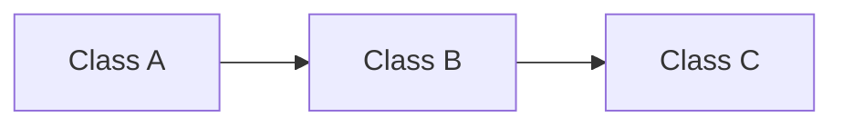
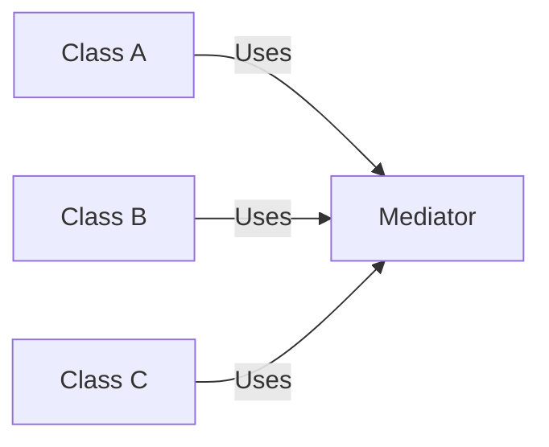

## 7.1.2 Role in Software Design

In the realm of software development, design patterns serve as a fundamental toolkit for solving common design problems. Among these, **behavioral design patterns** play a crucial role in shaping how objects interact within a system. This section delves into the importance of behavioral patterns in software design, highlighting their contribution to building robust and maintainable systems.

### Enhancing Communication

Behavioral patterns are instrumental in improving the communication between objects. They provide standardized solutions to recurring communication challenges, enabling more effective collaboration among components. By defining clear protocols for interaction, these patterns help in managing the complexity of object interactions.

#### Common Communication Challenges

In software systems, objects often need to interact with each other to perform tasks. Without a structured approach, these interactions can become chaotic, leading to tightly coupled systems where changes in one part of the system can have widespread repercussions. Behavioral patterns address these challenges by providing a framework for managing interactions.

#### Example: Observer Pattern

Consider the Observer pattern, which is commonly used in event-driven systems. It defines a one-to-many dependency between objects, allowing multiple observers to listen for changes in a subject. This pattern enhances communication by ensuring that all observers are notified of state changes in a consistent manner.

```python
class Subject:
    def __init__(self):
        self._observers = []

    def attach(self, observer):
        self._observers.append(observer)

    def detach(self, observer):
        self._observers.remove(observer)

    def notify(self, message):
        for observer in self._observers:
            observer.update(message)

class Observer:
    def update(self, message):
        print(f"Observer received: {message}")

subject = Subject()
observer1 = Observer()
observer2 = Observer()

subject.attach(observer1)
subject.attach(observer2)

subject.notify("New data available")
```

In this example, the `Subject` class maintains a list of observers and notifies them of any changes. This decouples the subject from the observers, allowing each to evolve independently.

### Assigning Responsibilities

Behavioral patterns also play a pivotal role in the clear assignment and encapsulation of responsibilities among objects. By promoting principles such as the Single Responsibility Principle (SRP) and adhering to SOLID principles, these patterns help in designing systems that are easier to understand and maintain.

#### Single Responsibility and SOLID Principles

The Single Responsibility Principle states that a class should have only one reason to change. Behavioral patterns help achieve this by encapsulating specific behaviors within dedicated classes, thus ensuring that each class has a single responsibility.

#### Example: Command Pattern

The Command pattern encapsulates a request as an object, thereby allowing for parameterization of clients with queues, requests, and operations. It promotes the separation of concerns by decoupling the object that invokes the operation from the one that knows how to perform it.

```python
class Command:
    def execute(self):
        pass

class LightOnCommand(Command):
    def __init__(self, light):
        self.light = light

    def execute(self):
        self.light.turn_on()

class Light:
    def turn_on(self):
        print("The light is on")

light = Light()
light_on_command = LightOnCommand(light)
light_on_command.execute()
```

In this example, the `LightOnCommand` class encapsulates the action of turning on a light. The `Command` interface allows for different commands to be executed interchangeably, adhering to the Open/Closed Principle.

### Reducing Coupling

One of the significant advantages of behavioral patterns is their ability to reduce coupling between objects. By decoupling the sender of a request from its receiver, these patterns lead to more flexible and reusable code.

#### Decoupling Sender and Receiver

In tightly coupled systems, changes in one component often necessitate changes in others. Behavioral patterns mitigate this by introducing intermediary objects or protocols that manage interactions, thus allowing components to evolve independently.

#### Example: Mediator Pattern

The Mediator pattern centralizes complex communications and control logic between related objects, promoting loose coupling.





In the diagrams above, the left diagram illustrates a tightly coupled interaction where `Class A`, `Class B`, and `Class C` directly interact. The right diagram shows how the Mediator pattern introduces a mediator to manage these interactions, reducing direct dependencies.

### Examples of Impact

Behavioral patterns have a profound impact on the maintainability and extensibility of software systems. By addressing common interaction challenges, they enable developers to build systems that are easier to understand, extend, and maintain.

#### Real-World Applications

- **Event Handling Systems:** The Observer pattern is widely used in GUI frameworks and event handling systems, where multiple components need to respond to user actions.
- **State Management:** The State pattern allows an object to alter its behavior when its internal state changes, making it ideal for state management in complex systems.
- **Command Execution:** The Command pattern is used in undo/redo functionalities, where actions are encapsulated as objects that can be executed, undone, or queued.

### Key Points to Emphasize

- **Essential for Complex Systems:** Behavioral patterns are crucial for designing systems where object interactions are complex and need to be managed effectively.
- **Improved Maintainability and Scalability:** By promoting loose coupling, these patterns improve code maintainability and scalability, allowing systems to adapt to changing requirements with minimal impact.

### Conclusion

Behavioral design patterns are a cornerstone of effective software design. They enhance communication, assign responsibilities clearly, and reduce coupling, leading to systems that are robust, maintainable, and scalable. By understanding and applying these patterns, developers can tackle complex interaction challenges and build software that stands the test of time.

## Quiz Time!



### Behavioral patterns primarily focus on:

- [x] Improving object interactions
- [ ] Enhancing data storage
- [ ] Optimizing algorithms
- [ ] Managing memory usage

> **Explanation:** Behavioral patterns are designed to improve the way objects interact and communicate within a system.

### Which pattern is used to encapsulate a request as an object?

- [x] Command Pattern
- [ ] Observer Pattern
- [ ] Strategy Pattern
- [ ] Singleton Pattern

> **Explanation:** The Command pattern encapsulates a request as an object, allowing for parameterization of clients with queues, requests, and operations.

### What principle does the Command pattern promote by decoupling the invoker from the receiver?

- [x] Single Responsibility Principle
- [ ] Liskov Substitution Principle
- [ ] Interface Segregation Principle
- [ ] Dependency Inversion Principle

> **Explanation:** The Command pattern promotes the Single Responsibility Principle by separating the invoker of an operation from the object that knows how to perform it.

### In the Observer pattern, the object that notifies others of changes is called:

- [x] Subject
- [ ] Observer
- [ ] Mediator
- [ ] Command

> **Explanation:** In the Observer pattern, the `Subject` is the object that maintains a list of observers and notifies them of any changes.

### What is a key benefit of using the Mediator pattern?

- [x] Reducing direct dependencies between classes
- [ ] Increasing data processing speed
- [ ] Simplifying user interface design
- [ ] Enhancing database performance

> **Explanation:** The Mediator pattern reduces direct dependencies between classes by centralizing communication through a mediator.

### Which pattern is ideal for implementing undo/redo functionality?

- [x] Command Pattern
- [ ] Observer Pattern
- [ ] State Pattern
- [ ] Strategy Pattern

> **Explanation:** The Command pattern is ideal for implementing undo/redo functionality as it encapsulates actions as objects that can be executed, undone, or queued.

### Behavioral patterns contribute to:

- [x] Loose coupling
- [ ] Tight coupling
- [x] Clear responsibility assignment
- [ ] Increased memory usage

> **Explanation:** Behavioral patterns contribute to loose coupling and clear responsibility assignment, making systems more maintainable and scalable.

### What is the primary goal of the State pattern?

- [x] Allowing an object to alter its behavior when its internal state changes
- [ ] Managing communication between objects
- [ ] Encapsulating a request as an object
- [ ] Defining a one-to-many dependency

> **Explanation:** The State pattern allows an object to alter its behavior when its internal state changes, making it ideal for state management.

### Which pattern defines a one-to-many dependency between objects?

- [x] Observer Pattern
- [ ] Command Pattern
- [ ] Mediator Pattern
- [ ] State Pattern

> **Explanation:** The Observer pattern defines a one-to-many dependency between objects, where multiple observers listen for changes in a subject.

### Behavioral patterns are essential for systems where:

- [x] Object interactions are complex
- [ ] Data storage is the primary concern
- [ ] User interface design is critical
- [ ] Performance optimization is needed

> **Explanation:** Behavioral patterns are essential for systems where object interactions are complex and need to be managed effectively.


