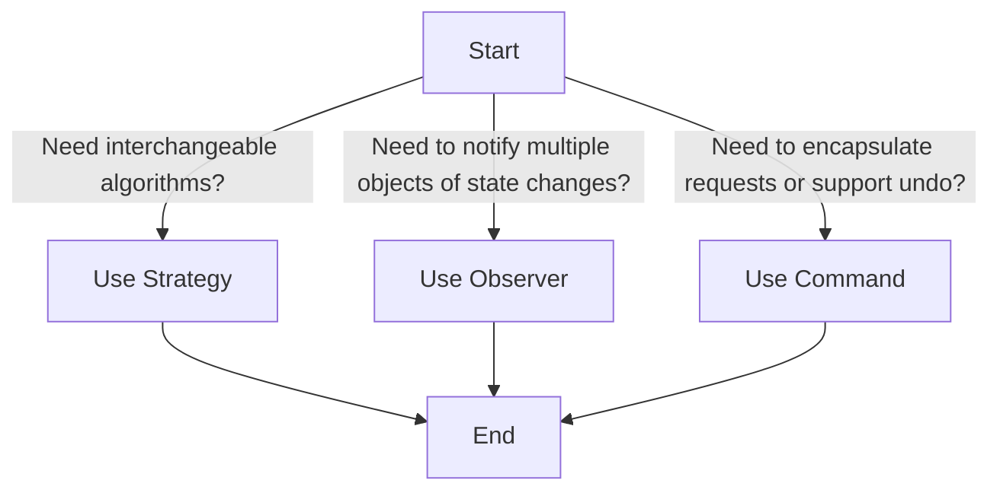

## 7.1.4 Selecting Behavioral Patterns

In the realm of software design, choosing the appropriate behavioral pattern is a pivotal decision that can significantly influence the maintainability, flexibility, and scalability of your application. Behavioral design patterns, as the name suggests, focus on the interaction and responsibility delegation between objects. This section aims to guide you through the process of selecting the right behavioral pattern by analyzing interaction requirements, understanding pattern suitability, and leveraging decision-making tips.

### Understanding Interaction Requirements

Before diving into specific patterns, it's essential to thoroughly understand the interaction requirements of your application. This involves analyzing how objects communicate and delegate responsibilities to achieve desired functionalities. Here are some key considerations:

#### Communication Needs

- **Direct vs. Indirect Communication:** Determine if objects need to communicate directly with each other or if an intermediary is necessary to facilitate communication.
- **Frequency and Timing:** Consider how often and at what times the communication occurs. Is it event-driven, periodic, or continuous?
- **Data Flow:** Analyze the type and amount of data being exchanged between objects. Is it simple notifications or complex data structures?

#### Responsibility Delegation

- **Single Responsibility Principle:** Ensure that each object has a clear responsibility and that responsibilities are not overlapping unnecessarily.
- **Delegation Needs:** Identify which objects need to delegate tasks to others and how this delegation should occur.

#### Flexibility and Change Management

- **Adaptability:** Consider how easily the system can adapt to changes in requirements. This involves assessing how flexible the interaction model is.
- **Scalability:** Evaluate whether the design can handle increased load or complexity without significant restructuring.

#### Complexity of Interactions

- **Simple vs. Complex Interactions:** Determine if interactions are straightforward or if they involve complex sequences of operations.
- **Error Handling:** Consider how errors in interactions are managed and communicated across objects.

### Pattern Suitability

Once you have a clear understanding of the interaction requirements, you can begin to assess which behavioral patterns are most suitable for your needs. Here are some common behavioral patterns and scenarios where they excel:

#### Strategy Pattern

The Strategy Pattern is ideal when you need to switch between different algorithms or strategies at runtime. It allows you to define a family of algorithms, encapsulate each one, and make them interchangeable. This pattern is particularly useful in scenarios where:

- **Dynamic Behavior:** You need to change the behavior of an object dynamically based on runtime conditions.
- **Algorithm Variability:** Multiple algorithms can achieve the same goal, and you want to choose the most appropriate one based on the context.
- **Decoupling:** You aim to decouple the algorithm from the client using it, promoting a more modular design.

#### Observer Pattern

The Observer Pattern is appropriate when changes in one object should trigger updates in other objects. It defines a one-to-many dependency between objects so that when one object changes state, all its dependents are notified and updated automatically. Use this pattern when:

- **Event-Driven Systems:** Your application is heavily reliant on events and notifications.
- **Loose Coupling:** You want to maintain a loose coupling between the subject and its observers.
- **Dynamic Subscription:** Observers can be added or removed dynamically without affecting the subject.

#### Command Pattern

The Command Pattern is useful when you need to parameterize objects with operations or support undoable operations. It encapsulates a request as an object, thereby allowing for parameterization of clients with queues, requests, and operations. This pattern is beneficial in cases where:

- **Undo/Redo Functionality:** You need to implement undo and redo capabilities in your application.
- **Queueing Operations:** Operations need to be queued, logged, or scheduled.
- **Decoupled Invoker and Receiver:** You want to decouple the object that invokes the operation from the one that performs it.

### Decision-Making Tips

Selecting the right pattern involves careful consideration of current requirements and potential future changes. Here are some tips to aid your decision-making process:

#### Use a Decision Tree

A decision tree can be a valuable tool in visualizing the decision-making process for selecting the appropriate pattern. Here's a simple example to guide you:

#### Consider Future Extensibility

- **Anticipate Changes:** Think about how the system might need to evolve. Choose patterns that provide flexibility for anticipated changes.
- **Modularity:** Aim for modular designs that allow parts of the system to be changed independently.

#### Evaluate Complexity vs. Benefits

- **Complexity Assessment:** Weigh the complexity introduced by the pattern against the benefits it provides. Avoid over-engineering solutions.
- **Simplicity First:** Start with the simplest solution that works and only introduce patterns if they offer clear advantages.

### Conclusion

Selecting the appropriate behavioral pattern is crucial for effective software design. By understanding the interaction requirements, assessing pattern suitability, and using decision-making tools like decision trees, you can make informed decisions that enhance the design and functionality of your application. Remember, the goal is to create a system that is not only functional but also maintainable and adaptable to future needs.

In the following sections, we will explore each of these patterns in detail, providing code examples and real-world applications to illustrate their use and benefits.

## Quiz Time!



### When should you use the Strategy Pattern?

- [x] When you need to switch between different algorithms or strategies at runtime.
- [ ] When you need to notify multiple objects of state changes.
- [ ] When you need to encapsulate requests or support undo operations.
- [ ] When you want to simplify object interactions.

> **Explanation:** The Strategy Pattern is used when you need to switch between different algorithms or strategies at runtime, providing flexibility in choosing the appropriate algorithm for a given context.

### What is a key benefit of the Observer Pattern?

- [x] It allows objects to be notified of changes in another object.
- [ ] It enables encapsulation of requests.
- [ ] It simplifies the implementation of algorithms.
- [ ] It allows switching between different strategies.

> **Explanation:** The Observer Pattern allows objects to be notified of changes in another object, establishing a one-to-many dependency between objects.

### Which pattern is suitable for implementing undo/redo functionality?

- [x] Command Pattern
- [ ] Strategy Pattern
- [ ] Observer Pattern
- [ ] Singleton Pattern

> **Explanation:** The Command Pattern is suitable for implementing undo/redo functionality as it encapsulates requests as objects, allowing operations to be queued, logged, or undone.

### What should you consider when selecting a behavioral pattern?

- [x] Interaction requirements and responsibility delegation needs.
- [ ] Only the complexity of the pattern.
- [ ] The number of classes involved.
- [ ] The programming language used.

> **Explanation:** When selecting a behavioral pattern, consider interaction requirements and responsibility delegation needs to ensure the pattern aligns with the design goals.

### What is a key feature of the Strategy Pattern?

- [x] It allows defining a family of algorithms and making them interchangeable.
- [ ] It establishes a one-to-many dependency between objects.
- [ ] It encapsulates requests as objects.
- [ ] It simplifies direct communication between objects.

> **Explanation:** The Strategy Pattern allows defining a family of algorithms and making them interchangeable, providing flexibility in choosing the appropriate algorithm for a given context.

### Why is it important to consider future extensibility when choosing a pattern?

- [x] To ensure the design can accommodate future changes without significant restructuring.
- [ ] To minimize the number of classes in the system.
- [ ] To reduce the need for documentation.
- [ ] To ensure the code is as simple as possible.

> **Explanation:** Considering future extensibility ensures the design can accommodate future changes without significant restructuring, promoting maintainability and adaptability.

### How does the Observer Pattern achieve loose coupling?

- [x] By allowing observers to be added or removed dynamically without affecting the subject.
- [ ] By encapsulating requests as objects.
- [ ] By defining interchangeable algorithms.
- [ ] By simplifying direct communication between objects.

> **Explanation:** The Observer Pattern achieves loose coupling by allowing observers to be added or removed dynamically without affecting the subject, maintaining a flexible and adaptable design.

### When is the Command Pattern particularly useful?

- [x] When you need to encapsulate requests or support undo operations.
- [ ] When you need to switch between different algorithms.
- [ ] When you need to notify multiple objects of state changes.
- [ ] When you want to simplify object interactions.

> **Explanation:** The Command Pattern is particularly useful when you need to encapsulate requests or support undo operations, providing flexibility in managing operations.

### What is the primary goal of using behavioral patterns?

- [x] To enhance the interaction and responsibility delegation between objects.
- [ ] To reduce the number of classes in the system.
- [ ] To simplify the implementation of algorithms.
- [ ] To ensure the code is as simple as possible.

> **Explanation:** The primary goal of using behavioral patterns is to enhance the interaction and responsibility delegation between objects, promoting a more efficient and maintainable design.

### True or False: The Strategy Pattern is used to notify multiple objects of state changes.

- [ ] True
- [x] False

> **Explanation:** False. The Strategy Pattern is used to switch between different algorithms or strategies at runtime, not to notify multiple objects of state changes.


