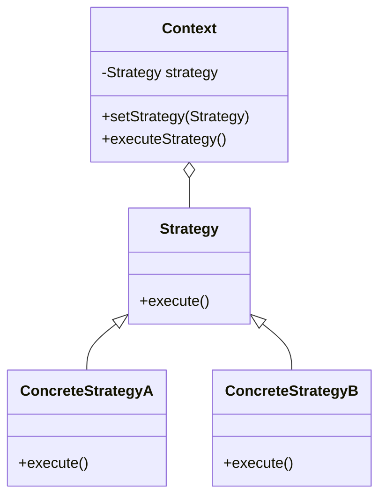

## 7.2.1 Understanding the Strategy Pattern

In the realm of software design, the Strategy pattern stands out as a powerful tool for managing algorithms and behaviors in a flexible and interchangeable manner. As part of the behavioral design patterns family, the Strategy pattern focuses on the delegation of responsibilities and the dynamic selection of behaviors. This section delves into the intricacies of the Strategy pattern, exploring its definition, the problems it addresses, and the solutions it offers, all while grounding these concepts in real-world analogies and practical applications.

### Definition of the Strategy Pattern

The Strategy pattern is a behavioral design pattern that defines a family of algorithms, encapsulates each one, and makes them interchangeable. The essence of this pattern is to allow the algorithm to vary independently from the clients that use it. By encapsulating algorithms in separate classes, the Strategy pattern provides a mechanism for selecting an algorithm at runtime, thereby enhancing flexibility and promoting code reusability.

#### Key Characteristics:

- **Encapsulation of Algorithms:** Each algorithm is encapsulated in its own class, adhering to the Single Responsibility Principle.
- **Interchangeability:** Algorithms can be swapped without altering the client code, promoting the Open/Closed Principle.
- **Independent Variation:** Clients can change the algorithm they use without modifying their own code.

### Problem Statement

In software development, there are scenarios where an object needs to support multiple behaviors or algorithms. Traditionally, developers might resort to using massive conditional statements or inflexible inheritance structures to achieve this. However, these approaches can lead to several issues:

- **Code Duplication:** Hardcoding algorithms across different parts of the application can result in duplicated code, making maintenance cumbersome.
- **Lack of Flexibility:** Conditional logic can become complex and difficult to manage, hindering the ability to introduce new behaviors seamlessly.
- **Inflexible Inheritance:** Relying on inheritance to define behaviors can lead to rigid class hierarchies that are difficult to extend or modify.

Consider a payment processing system that supports multiple payment methods such as credit cards, PayPal, and bank transfers. Implementing each payment method with conditional statements or through a rigid inheritance structure can quickly become unmanageable as new payment methods are introduced or existing ones are modified.

### Solution Provided by Strategy

The Strategy pattern addresses these challenges by encapsulating algorithms in separate classes and allowing the client to choose which algorithm to use at runtime. This approach offers several benefits:

- **Modularity:** Each algorithm is encapsulated within its own class, promoting modular design and separation of concerns.
- **Flexibility:** Clients can switch between algorithms dynamically, enhancing the system's adaptability to changing requirements.
- **Maintainability:** By reducing conditional logic and avoiding rigid inheritance structures, the Strategy pattern simplifies code maintenance and evolution.

### Real-World Analogy: Transportation Strategy

To better understand the Strategy pattern, let's consider a real-world analogy involving transportation. Imagine you need to reach a destination, and you have several modes of transportation at your disposal: car, bike, and bus. The choice of transportation depends on various factors such as traffic conditions, cost, and personal preferences. 

In this scenario, each mode of transportation represents a different strategy. By encapsulating each transportation mode as a separate strategy, you can dynamically choose the most suitable mode based on the context. This analogy mirrors the Strategy pattern's approach to encapsulating algorithms and allowing dynamic selection.

### Visuals and Diagrams

To visualize the structure of the Strategy pattern, consider the following class diagram:

#### Diagram Explanation:

- **Context:** The context class maintains a reference to a strategy object and delegates the execution of the algorithm to the strategy.
- **Strategy Interface:** Defines a common interface for all supported algorithms. This interface allows the context to interact with any concrete strategy.
- **Concrete Strategies:** Implement the strategy interface, encapsulating specific algorithms or behaviors.

### Key Points to Emphasize

The Strategy pattern is a cornerstone of flexible and maintainable software design. Here are some key points to emphasize:

- **Promotes the Open/Closed Principle:** The Strategy pattern allows new algorithms to be added without modifying existing code, adhering to the Open/Closed Principle.
- **Reduces Conditional Logic:** By encapsulating algorithms, the Strategy pattern reduces the need for conditional logic, improving code readability and maintainability.
- **Enhances Code Flexibility:** The ability to switch between algorithms at runtime provides unparalleled flexibility, allowing systems to adapt to changing requirements seamlessly.

### Conclusion

The Strategy pattern is an invaluable tool for managing algorithms and behaviors in a flexible, interchangeable manner. By encapsulating algorithms in separate classes, the Strategy pattern promotes modularity, flexibility, and maintainability. Whether you're designing a payment processing system, implementing a transportation strategy, or tackling any scenario involving multiple behaviors, the Strategy pattern offers a robust solution to enhance your software's design.

## Quiz Time!



### What is the main purpose of the Strategy pattern?

- [x] To define a family of algorithms, encapsulate each one, and make them interchangeable.
- [ ] To create a single algorithm that can be used in various contexts.
- [ ] To enforce a strict class hierarchy for algorithms.
- [ ] To simplify complex algorithms by merging them.

> **Explanation:** The Strategy pattern is designed to define a family of algorithms, encapsulate each one, and make them interchangeable, allowing the algorithm to vary independently from the clients that use it.

### Which principle does the Strategy pattern promote?

- [x] Open/Closed Principle
- [ ] Single Responsibility Principle
- [ ] Liskov Substitution Principle
- [ ] Interface Segregation Principle

> **Explanation:** The Strategy pattern promotes the Open/Closed Principle by allowing new algorithms to be added without modifying existing code.

### What problem does the Strategy pattern primarily address?

- [x] The need to support multiple behaviors or algorithms without massive conditional statements or inflexible inheritance structures.
- [ ] The need to simplify complex algorithms by merging them.
- [ ] The need to enforce strict class hierarchies for algorithms.
- [ ] The need to reduce the number of classes in a system.

> **Explanation:** The Strategy pattern addresses the problem of supporting multiple behaviors or algorithms without resorting to massive conditional statements or inflexible inheritance structures.

### How does the Strategy pattern improve code maintainability?

- [x] By reducing conditional logic and avoiding rigid inheritance structures.
- [ ] By merging all algorithms into a single class.
- [ ] By enforcing a strict class hierarchy for algorithms.
- [ ] By eliminating the need for interfaces.

> **Explanation:** The Strategy pattern improves code maintainability by encapsulating algorithms, reducing conditional logic, and avoiding rigid inheritance structures.

### In the transportation analogy, what does each mode of transportation represent?

- [x] A different strategy
- [ ] A different context
- [ ] A different algorithm
- [ ] A different client

> **Explanation:** In the transportation analogy, each mode of transportation (car, bike, bus) represents a different strategy that can be chosen based on context.

### What is the role of the context class in the Strategy pattern?

- [x] To maintain a reference to a strategy object and delegate the execution of the algorithm to the strategy.
- [ ] To define a common interface for all supported algorithms.
- [ ] To implement specific algorithms or behaviors.
- [ ] To enforce a strict class hierarchy for strategies.

> **Explanation:** The context class maintains a reference to a strategy object and delegates the execution of the algorithm to the strategy.

### How does the Strategy pattern enhance code flexibility?

- [x] By allowing clients to switch between algorithms at runtime.
- [ ] By enforcing a strict class hierarchy for algorithms.
- [ ] By merging all algorithms into a single class.
- [ ] By eliminating the need for interfaces.

> **Explanation:** The Strategy pattern enhances code flexibility by allowing clients to switch between algorithms at runtime, adapting to changing requirements.

### What is encapsulated in the Strategy pattern?

- [x] Algorithms
- [ ] Clients
- [ ] Contexts
- [ ] Interfaces

> **Explanation:** In the Strategy pattern, algorithms are encapsulated in separate classes, allowing them to be interchangeable.

### Why is code duplication a problem in traditional algorithm implementation?

- [x] It makes maintenance cumbersome and increases the risk of errors.
- [ ] It simplifies the code structure.
- [ ] It enhances code readability.
- [ ] It enforces a strict class hierarchy.

> **Explanation:** Code duplication makes maintenance cumbersome and increases the risk of errors, as changes need to be replicated across multiple locations.

### True or False: The Strategy pattern can be used to enforce a strict class hierarchy.

- [ ] True
- [x] False

> **Explanation:** False. The Strategy pattern is not used to enforce a strict class hierarchy; rather, it promotes flexibility by allowing interchangeable algorithms.


