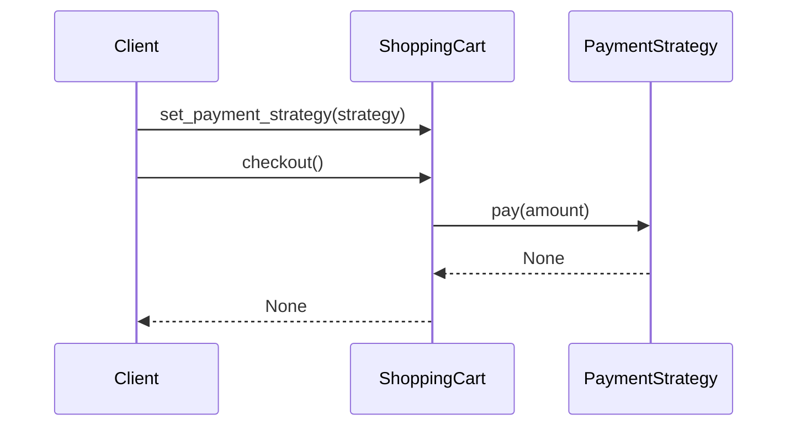

## 7.2.2 Implementation in Python

In the realm of software design, the **Strategy Pattern** stands out as a powerful tool for promoting flexibility and maintainability. It allows developers to define a family of algorithms, encapsulate each one, and make them interchangeable. This pattern is particularly useful when you need to switch algorithms or behaviors at runtime without altering the client code. In this section, we'll explore how to implement the Strategy Pattern in Python, using a practical example of a payment processing system.

### Understanding the Strategy Pattern

Before diving into the implementation, let's briefly recap what the Strategy Pattern is and why it's useful:

- **Definition:** The Strategy Pattern defines a family of algorithms, encapsulates each one, and makes them interchangeable. This pattern lets the algorithm vary independently from clients that use it.
- **Purpose:** It allows you to select an algorithm at runtime, promoting flexibility and adherence to the Open/Closed Principle.
- **Benefits:**
  - **Encapsulation:** Each strategy encapsulates its own algorithm, promoting single responsibility.
  - **Interchangeability:** Strategies are interchangeable, adhering to the same interface.
  - **Avoid Conditional Logic:** Reduces complex conditional statements by delegating to strategy objects.

### Implementation Steps

To implement the Strategy Pattern in Python, we'll follow these steps:

1. **Define the Strategy Interface:**
   - Create an abstract `Strategy` class with a method `execute()`.
2. **Implement Concrete Strategies:**
   - Develop multiple concrete strategy classes that implement the `Strategy` interface.
3. **Create the Context Class:**
   - The `Context` class has a reference to a `Strategy` object.
   - Includes a method to set or change the strategy at runtime.
   - Delegates algorithm execution to the strategy object.

### Example Scenario: Payment Processing System

Imagine a payment processing system that supports multiple payment methods, such as Credit Card, PayPal, and Bitcoin. Users can choose their preferred payment method at runtime. This scenario is ideal for applying the Strategy Pattern.

#### Step 1: Define the Strategy Interface

We'll start by defining an abstract class `PaymentStrategy` with a method `pay()` that all concrete strategies will implement.

```python
from abc import ABC, abstractmethod

class PaymentStrategy(ABC):
    @abstractmethod
    def pay(self, amount):
        pass
```

#### Step 2: Implement Concrete Strategies

Next, we'll create concrete strategy classes for each payment method.

- **Credit Card Payment Strategy:**

```python
class CreditCardPayment(PaymentStrategy):
    def __init__(self, card_number, expiry_date, cvv):
        self.card_number = card_number
        self.expiry_date = expiry_date
        self.cvv = cvv

    def pay(self, amount):
        print(f"Processing credit card payment of ${amount}")
        # Implement payment logic here
```

- **PayPal Payment Strategy:**

```python
class PayPalPayment(PaymentStrategy):
    def __init__(self, email, password):
        self.email = email
        self.password = password

    def pay(self, amount):
        print(f"Processing PayPal payment of ${amount}")
        # Implement payment logic here
```

- **Bitcoin Payment Strategy:**

```python
class BitcoinPayment(PaymentStrategy):
    def __init__(self, wallet_address):
        self.wallet_address = wallet_address

    def pay(self, amount):
        print(f"Processing Bitcoin payment of ${amount}")
        # Implement payment logic here
```

#### Step 3: Create the Context Class

The `ShoppingCart` class will act as the context. It holds a reference to a `PaymentStrategy` and delegates the payment process to the strategy.

```python
class ShoppingCart:
    def __init__(self):
        self.items = []
        self.total = 0

    def add_item(self, item, price):
        self.items.append(item)
        self.total += price

    def set_payment_strategy(self, strategy):
        self.payment_strategy = strategy

    def checkout(self):
        self.payment_strategy.pay(self.total)
```

#### Client Code

The client code demonstrates how to use the `ShoppingCart` with different payment strategies.

```python
def main():
    cart = ShoppingCart()
    cart.add_item("Book", 29.99)
    cart.add_item("Pen", 3.99)

    # User chooses payment method
    payment_method = input("Choose payment method (credit/paypal/bitcoin): ")

    if payment_method == "credit":
        strategy = CreditCardPayment("1234567890123456", "12/24", "123")
    elif payment_method == "paypal":
        strategy = PayPalPayment("user@example.com", "securepassword")
    elif payment_method == "bitcoin":
        strategy = BitcoinPayment("1A1zP1eP5QGefi2DMPTfTL5SLmv7DivfNa")
    else:
        print("Invalid payment method")
        return

    cart.set_payment_strategy(strategy)
    cart.checkout()

if __name__ == "__main__":
    main()
```

### Explanation

- **Strategy Interface (`PaymentStrategy`):** Defines the `pay` method to be implemented by concrete strategies.
- **Concrete Strategies:** 
  - **`CreditCardPayment`, `PayPalPayment`, and `BitcoinPayment`** implement `pay` differently based on the payment method.
- **Context (`ShoppingCart`):** Holds a reference to a `PaymentStrategy`. The `checkout` method delegates payment processing to the strategy.
- **Client Code:** The user selects the payment method at runtime. The appropriate strategy is instantiated and set in the `ShoppingCart`. This demonstrates how strategies can be swapped without altering the `ShoppingCart` code.

### Best Practices

- **Encapsulation:** Each strategy encapsulates its own algorithm, promoting single responsibility.
- **Interchangeability:** Strategies should be interchangeable, adhering to the same interface.
- **Avoiding Conditional Logic:** Instead of using conditionals to select algorithms, delegate to the strategy objects.

### Visuals and Diagrams

To further illustrate how the Strategy Pattern works, let's look at a sequence diagram that shows the interaction between the client, the `ShoppingCart`, and the `PaymentStrategy`.



### Key Points to Emphasize

- The Strategy Pattern allows algorithms to be selected at runtime, providing flexibility and adaptability in software design.
- It promotes the Open/Closed Principle by allowing new strategies to be added without modifying existing code, thus enhancing maintainability.
- It reduces complex conditional statements in the code, making the codebase cleaner and easier to understand.

### Conclusion

The Strategy Pattern is a versatile design pattern that can greatly enhance the flexibility and maintainability of your code. By encapsulating algorithms and making them interchangeable, you can easily adapt to changing requirements and extend functionality without modifying existing code. This pattern is particularly useful in scenarios like payment processing, where different algorithms (or strategies) need to be selected and executed at runtime.

By following the implementation steps outlined in this section, you can effectively apply the Strategy Pattern in your Python projects, ensuring that your code remains clean, modular, and adaptable to future changes.

## Quiz Time!



### What is the primary purpose of the Strategy Pattern?

- [x] To allow algorithms to be selected at runtime
- [ ] To encapsulate data within objects
- [ ] To provide a way to create objects without specifying their concrete classes
- [ ] To ensure a class has only one instance

> **Explanation:** The Strategy Pattern allows algorithms to be selected at runtime, providing flexibility in choosing different strategies.

### Which of the following best describes a `PaymentStrategy` in the context of the Strategy Pattern?

- [x] An interface that defines the `pay` method
- [ ] A concrete class that processes payments
- [ ] A class that holds payment details
- [ ] A method that calculates payment amounts

> **Explanation:** `PaymentStrategy` is an interface that defines the `pay` method, which concrete strategy classes implement.

### In the Strategy Pattern, what role does the `ShoppingCart` class play?

- [x] Context
- [ ] Strategy
- [ ] Concrete Strategy
- [ ] Client

> **Explanation:** The `ShoppingCart` class acts as the context, holding a reference to a `PaymentStrategy` and delegating payment processing to it.

### What is a key benefit of using the Strategy Pattern?

- [x] It reduces complex conditional statements in the code
- [ ] It increases the number of classes in the system
- [ ] It makes the code harder to understand
- [ ] It limits the ability to add new strategies

> **Explanation:** The Strategy Pattern reduces complex conditional statements by delegating algorithm selection to strategy objects.

### How does the Strategy Pattern promote the Open/Closed Principle?

- [x] By allowing new strategies to be added without modifying existing code
- [ ] By making all classes final and unmodifiable
- [ ] By requiring all methods to be static
- [ ] By using inheritance to extend functionality

> **Explanation:** The Strategy Pattern promotes the Open/Closed Principle by allowing new strategies to be added without modifying existing code, enhancing maintainability.

### Which of the following is NOT a concrete strategy in the payment processing example?

- [ ] CreditCardPayment
- [ ] PayPalPayment
- [ ] BitcoinPayment
- [x] ShoppingCart

> **Explanation:** `ShoppingCart` is the context class, not a concrete strategy.

### What method does the `ShoppingCart` class use to delegate payment processing?

- [x] checkout()
- [ ] add_item()
- [ ] set_payment_strategy()
- [ ] calculate_total()

> **Explanation:** The `checkout()` method in the `ShoppingCart` class delegates payment processing to the strategy.

### In the client code, how is the appropriate payment strategy selected?

- [x] Based on user input
- [ ] By defaulting to the first strategy
- [ ] Using a random selection
- [ ] By hardcoding the strategy

> **Explanation:** The appropriate payment strategy is selected based on user input in the client code.

### What is the advantage of encapsulating each strategy in its own class?

- [x] It promotes single responsibility and modularity
- [ ] It increases code duplication
- [ ] It makes the code less flexible
- [ ] It complicates the design

> **Explanation:** Encapsulating each strategy in its own class promotes single responsibility and modularity, making the code more maintainable.

### True or False: The Strategy Pattern can only be used for payment processing systems.

- [x] False
- [ ] True

> **Explanation:** False. The Strategy Pattern is versatile and can be used in a variety of scenarios beyond payment processing systems.


