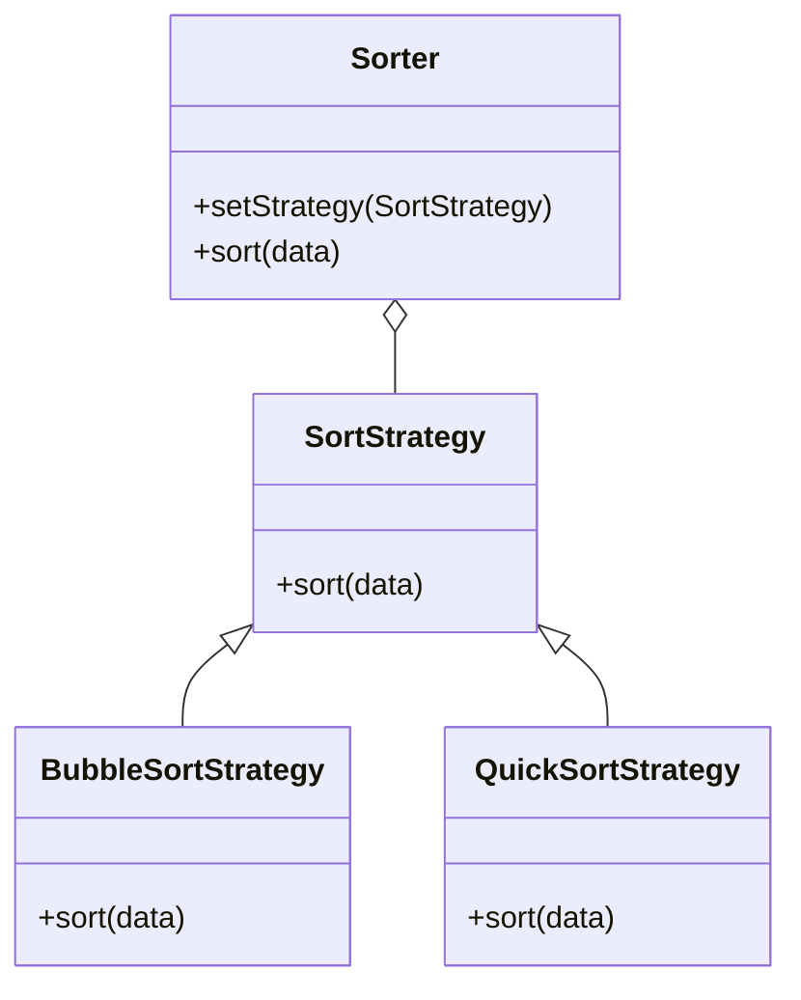

## 7.2.3 Implementation in JavaScript

In this section, we will delve into the Strategy Pattern, a behavioral design pattern that enables selecting an algorithm's implementation at runtime. This pattern is particularly useful in scenarios where multiple algorithms can be applied to a problem, and the choice of algorithm might change depending on the context. We will explore how to implement this pattern in JavaScript using ES6 classes, focusing on a practical example involving a data sorting application.

### Understanding the Strategy Pattern

The Strategy Pattern is a design pattern that defines a family of algorithms, encapsulates each one, and makes them interchangeable. This pattern lets the algorithm vary independently from clients that use it. In JavaScript, due to its dynamic nature and support for first-class functions, implementing the Strategy Pattern can be both intuitive and flexible.

#### Key Components of the Strategy Pattern

1. **Strategy Interface**: Declares an interface common to all supported algorithms. The `SortStrategy` interface in our example will define a `sort` method.
2. **Concrete Strategies**: Implement the algorithm defined in the Strategy interface. We will demonstrate this with `BubbleSortStrategy` and `QuickSortStrategy`.
3. **Context**: Maintains a reference to a strategy object and delegates the algorithm execution to the current strategy. In our case, this will be the `Sorter` class.

### Implementing the Strategy Pattern in JavaScript

Let's walk through the implementation of the Strategy Pattern in JavaScript using a data sorting application as our example scenario. This application will allow users to choose between different sorting algorithms at runtime.

#### Step 1: Define the Strategy Interface

JavaScript does not have interfaces in the traditional sense, but we can define a base class with a method that throws an error if not implemented. This acts as our interface.

```javascript
class SortStrategy {
    sort(data) {
        throw new Error("Method 'sort()' must be implemented.");
    }
}
```

This `SortStrategy` class serves as a blueprint for all concrete strategy classes, ensuring they implement the `sort` method.

#### Step 2: Implement Concrete Strategies

Each concrete strategy will implement the `sort` method, providing a different sorting algorithm.

**Bubble Sort Strategy:**

```javascript
class BubbleSortStrategy extends SortStrategy {
    sort(data) {
        console.log("Sorting using Bubble Sort");
        let n = data.length;
        for (let i = 0; i < n - 1; i++) {
            for (let j = 0; j < n - i - 1; j++) {
                if (data[j] > data[j + 1]) {
                    // Swap data[j] and data[j+1]
                    [data[j], data[j + 1]] = [data[j + 1], data[j]];
                }
            }
        }
        return data;
    }
}
```

**Quick Sort Strategy:**

```javascript
class QuickSortStrategy extends SortStrategy {
    sort(data) {
        console.log("Sorting using Quick Sort");
        return this.quickSort(data, 0, data.length - 1);
    }

    quickSort(arr, low, high) {
        if (low < high) {
            let pi = this.partition(arr, low, high);
            this.quickSort(arr, low, pi - 1);
            this.quickSort(arr, pi + 1, high);
        }
        return arr;
    }

    partition(arr, low, high) {
        let pivot = arr[high];
        let i = (low - 1);
        for (let j = low; j < high; j++) {
            if (arr[j] < pivot) {
                i++;
                [arr[i], arr[j]] = [arr[j], arr[i]];
            }
        }
        [arr[i + 1], arr[high]] = [arr[high], arr[i + 1]];
        return i + 1;
    }
}
```

#### Step 3: Create the Context Class

The `Sorter` class will use a strategy to perform sorting. It will hold a reference to a `SortStrategy` and delegate sorting to it.

```javascript
class Sorter {
    setStrategy(strategy) {
        this.strategy = strategy;
    }

    sort(data) {
        return this.strategy.sort(data);
    }
}
```

#### Step 4: Implement Client Code

The client code will allow the user to select a sorting strategy at runtime.

```javascript
function main() {
    const sorter = new Sorter();
    const data = [5, 2, 9, 1, 5, 6];

    // User chooses sorting strategy
    const sortMethod = prompt("Choose sorting method (bubble/quick):");

    if (sortMethod === "bubble") {
        sorter.setStrategy(new BubbleSortStrategy());
    } else if (sortMethod === "quick") {
        sorter.setStrategy(new QuickSortStrategy());
    } else {
        console.log("Invalid sorting method");
        return;
    }

    const sortedData = sorter.sort(data);
    console.log(sortedData);
}

main();
```

### Explanation of the Implementation

- **Strategy Interface (`SortStrategy`)**: Acts as a blueprint for concrete strategies. It ensures that each strategy implements the `sort` method.
- **Concrete Strategies**: `BubbleSortStrategy` and `QuickSortStrategy` provide specific implementations of the sorting algorithms.
- **Context (`Sorter`)**: Maintains a reference to a `SortStrategy` and delegates the sorting task to it. This allows the sorting algorithm to be changed at runtime without modifying the `Sorter` class.
- **Client Code**: Interacts with the user to select a sorting strategy and perform sorting. This demonstrates the flexibility of the Strategy Pattern in allowing dynamic algorithm selection.

### Best Practices

- **Consistency**: Ensure that all strategies adhere to the same interface, making them interchangeable.
- **Loose Coupling**: The `Sorter` class is decoupled from the concrete strategy implementations, promoting flexibility and maintainability.
- **Dynamic Selection**: The pattern allows strategies to be selected or changed at runtime, accommodating varying requirements and user preferences.

### Visual Representation

To better understand the relationships between the components, here is a class diagram illustrating the Strategy Pattern in our sorting application:



### Key Points to Emphasize

- **Flexibility of JavaScript**: JavaScript's dynamic typing and first-class functions make it an ideal language for implementing the Strategy Pattern. It allows for easy swapping and modification of strategies at runtime.
- **Clean and Focused Context**: The `Sorter` class remains clean and focused on its primary responsibility, delegating the sorting logic to the strategy objects.

### Conclusion

The Strategy Pattern is a powerful tool for designing flexible and maintainable software. By encapsulating algorithms within strategy classes, you can easily switch between different implementations without altering the context class. In JavaScript, this pattern is particularly effective due to the language's dynamic capabilities.

By implementing the Strategy Pattern in a data sorting application, we've demonstrated how to apply this pattern to solve real-world problems. This approach not only improves code organization but also enhances the application's ability to adapt to changing requirements.

For further exploration, consider experimenting with additional sorting algorithms or applying the Strategy Pattern to other domains, such as payment processing or file compression.

## Quiz Time!



### What is the main purpose of the Strategy Pattern?

- [x] To define a family of algorithms, encapsulate each one, and make them interchangeable.
- [ ] To create a single algorithm that can handle all tasks.
- [ ] To optimize performance by using a single algorithm.
- [ ] To ensure algorithms are always executed in parallel.

> **Explanation:** The Strategy Pattern is designed to define a family of algorithms, encapsulate them, and make them interchangeable, allowing the algorithm to vary independently from the clients that use it.

### In the Strategy Pattern, what role does the Context class play?

- [x] It maintains a reference to a strategy object and delegates the algorithm execution to it.
- [ ] It implements the algorithm directly.
- [ ] It serves as an interface for strategy classes.
- [ ] It selects which strategy to use at compile time.

> **Explanation:** The Context class maintains a reference to a strategy object and delegates the algorithm execution to it, allowing the strategy to be changed at runtime.

### How does JavaScript's dynamic typing benefit the implementation of the Strategy Pattern?

- [x] It allows for flexible swapping and modification of strategies at runtime.
- [ ] It enforces strict type checking for strategies.
- [ ] It requires strategies to be defined at compile time.
- [ ] It limits the number of strategies that can be used.

> **Explanation:** JavaScript's dynamic typing allows for flexible swapping and modification of strategies at runtime, making it ideal for implementing the Strategy Pattern.

### What method must concrete strategies implement in the given JavaScript example?

- [x] sort
- [ ] execute
- [ ] run
- [ ] process

> **Explanation:** In the given JavaScript example, concrete strategies must implement the `sort` method as defined by the `SortStrategy` class.

### Which class in the example acts as the Strategy Interface?

- [x] SortStrategy
- [ ] Sorter
- [ ] BubbleSortStrategy
- [ ] QuickSortStrategy

> **Explanation:** The `SortStrategy` class acts as the Strategy Interface by defining the `sort` method that all concrete strategies must implement.

### What is a key benefit of using the Strategy Pattern?

- [x] It allows algorithms to be changed at runtime without modifying the context class.
- [ ] It reduces the number of classes needed in a program.
- [ ] It ensures all algorithms are executed in parallel.
- [ ] It enforces strict type checking on algorithms.

> **Explanation:** A key benefit of the Strategy Pattern is that it allows algorithms to be changed at runtime without modifying the context class, promoting flexibility and maintainability.

### Which sorting algorithms are implemented as concrete strategies in the example?

- [x] Bubble Sort
- [x] Quick Sort
- [ ] Merge Sort
- [ ] Insertion Sort

> **Explanation:** The example implements Bubble Sort and Quick Sort as concrete strategies, demonstrating different sorting algorithms.

### What would happen if a strategy does not implement the `sort` method in the example?

- [x] An error would be thrown when the method is called.
- [ ] The program would silently fail.
- [ ] The context class would handle the missing method.
- [ ] The strategy would default to a built-in method.

> **Explanation:** If a strategy does not implement the `sort` method, an error would be thrown when the method is called, as the base `SortStrategy` class throws an error if `sort` is not implemented.

### Why is loose coupling important in the Strategy Pattern?

- [x] It allows the context class to be independent of the concrete strategies.
- [ ] It ensures all strategies are executed in sequence.
- [ ] It reduces the number of strategies needed.
- [ ] It enforces strict type checking on strategies.

> **Explanation:** Loose coupling is important in the Strategy Pattern because it allows the context class to be independent of the concrete strategies, promoting flexibility and easier maintenance.

### True or False: The Strategy Pattern can only be used for sorting algorithms.

- [x] False
- [ ] True

> **Explanation:** False. The Strategy Pattern is not limited to sorting algorithms; it can be applied to any scenario where multiple algorithms are applicable and interchangeable.


