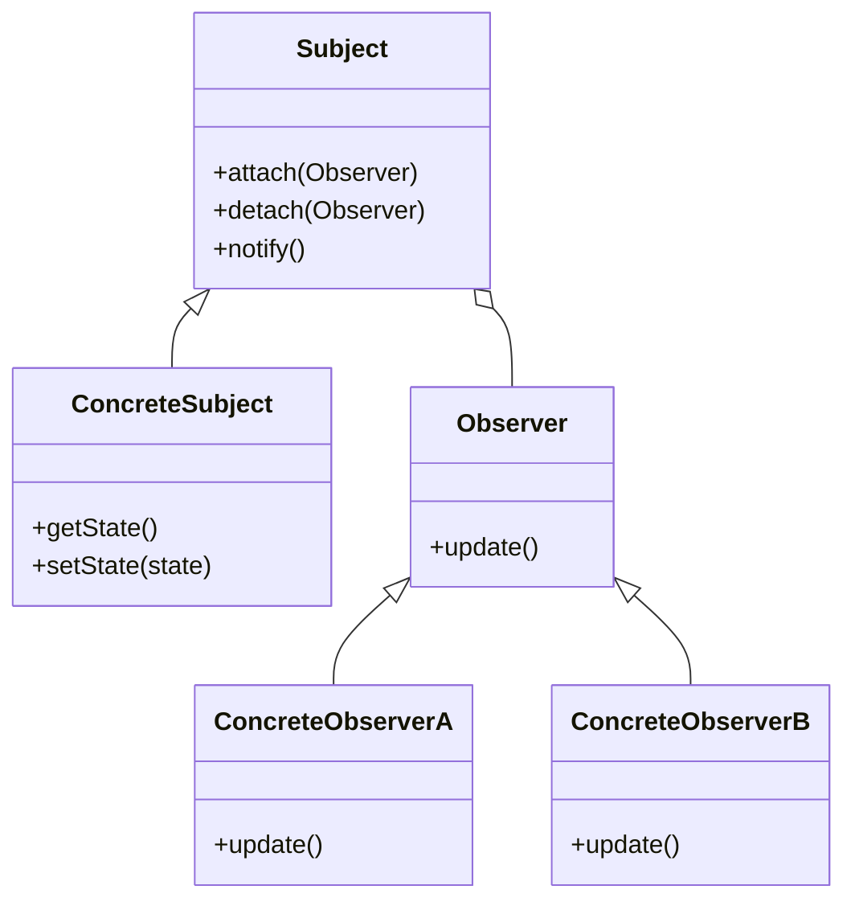

## 7.3.1 Concept of the Observer Pattern

In the world of software design, the Observer pattern stands out as a quintessential solution for managing complex systems where multiple objects need to stay in sync without being tightly coupled. This pattern is a cornerstone of behavioral design patterns, facilitating a seamless flow of information between objects, often in real-time. Understanding the Observer pattern is crucial for developers aiming to build scalable and maintainable software systems.

### Understanding the Observer Pattern

#### Definition

The **Observer pattern** is a behavioral design pattern that establishes a one-to-many dependency between objects. In this setup, a single object, known as the **subject**, maintains a list of dependents, called **observers**, and notifies them of any state changes, usually by calling one of their methods. This notification mechanism ensures that all observers are updated automatically whenever the subject changes its state.

#### Problem Statement

In software development, there are numerous scenarios where changes to one object need to be reflected in other objects. A classic example is a graphical user interface (GUI) where user interactions or data updates need to be reflected across various components. Without a structured approach, such dependencies can lead to tightly coupled code, making the system rigid and difficult to maintain or extend.

Consider the following scenarios:

- **Data Binding in GUIs:** When a user updates a form field, the change should be reflected in the data model and possibly other UI components.
- **Event Handling Systems:** When an event occurs (e.g., a user clicks a button), multiple components may need to respond to the event.
- **Real-Time Data Updates:** In applications like stock tickers or news feeds, updates from a data source should be propagated to all interested components.

These situations demand a mechanism to keep objects in sync without creating a tangled web of dependencies.

#### Solution Provided by the Observer Pattern

The Observer pattern addresses these challenges by decoupling the subject from its observers. This decoupling is achieved through a **publish-subscribe mechanism**, where the subject acts as the publisher of changes, and observers subscribe to these changes. This approach offers several advantages:

- **Dynamic Addition and Removal:** Observers can be added or removed at runtime without altering the subject. This flexibility is particularly useful in systems where components can be plugged in or removed dynamically.
- **Loose Coupling:** The subject and observers interact through a common interface, reducing dependencies and enhancing modularity.
- **Scalability:** New observers can be added with minimal impact on existing code, supporting scalability and evolution of the system.

### Real-World Analogy: Magazine Subscription

To better understand the Observer pattern, consider the analogy of a magazine subscription:

- **Magazine (Subject):** The magazine is the subject that publishes new issues.
- **Subscribers (Observers):** Subscribers are the observers who receive new issues whenever they are published.
- **Subscription Mechanism:** Subscribers can choose to subscribe or unsubscribe to the magazine at any time, reflecting the dynamic nature of observer management.

Whenever a new issue is published, it is automatically sent to all active subscribers, ensuring they are always up-to-date with the latest content. This analogy perfectly encapsulates the essence of the Observer pattern, where the magazine (subject) manages a list of subscribers (observers) and notifies them of new publications (state changes).

### Visual Representation

To visualize the Observer pattern, consider the following class diagram:

#### Diagram Explanation

- **Subject:** The central entity that maintains a list of observers and provides methods to attach, detach, and notify them.
- **ConcreteSubject:** A specific implementation of the subject that holds the state and provides methods to get and set this state.
- **Observer:** An interface or abstract class that defines the update method, which is called by the subject to notify observers of changes.
- **ConcreteObserverA and ConcreteObserverB:** Specific implementations of observers that respond to updates from the subject.

### Key Points to Emphasize

1. **Loose Coupling:** The Observer pattern promotes loose coupling between the subject and its observers, allowing each to evolve independently.
2. **Dynamic Flexibility:** Observers can be added or removed dynamically, providing flexibility in how systems are composed and interact.
3. **Scalability and Maintainability:** By decoupling the subject and observers, the pattern enhances the scalability and maintainability of the system, making it easier to introduce new features or modify existing ones without disrupting the entire architecture.

### Conclusion

The Observer pattern is an invaluable tool in the software design arsenal, offering a robust solution for managing dependencies between objects. By facilitating a one-to-many relationship, it ensures that systems remain responsive and adaptable to change, a critical requirement in today's fast-paced software development landscape. As we delve deeper into the implementation and applications of the Observer pattern in subsequent sections, remember the core principles of decoupling and dynamic interaction that make this pattern a staple in effective software design.

## Quiz Time!



### What is the primary purpose of the Observer pattern?

- [x] To establish a one-to-many dependency between objects
- [ ] To encapsulate a request as an object
- [ ] To define a family of algorithms
- [ ] To provide a way to access the elements of an aggregate object sequentially

> **Explanation:** The Observer pattern is designed to establish a one-to-many dependency between objects, where a single subject notifies multiple observers of state changes.

### In the Observer pattern, what role does the subject play?

- [x] It maintains a list of observers and notifies them of state changes
- [ ] It defines the update interface for observers
- [ ] It represents a specific observer implementation
- [ ] It encapsulates the algorithm to be used

> **Explanation:** The subject maintains a list of observers and is responsible for notifying them of any state changes.

### Which of the following scenarios is NOT a typical use case for the Observer pattern?

- [ ] Real-time data updates
- [ ] Event handling systems
- [x] Sorting a list of numbers
- [ ] Data binding in GUIs

> **Explanation:** Sorting a list of numbers is not a use case for the Observer pattern, which is used for managing dependencies and updates between objects.

### How does the Observer pattern promote loose coupling?

- [x] By using a common interface for interaction between the subject and observers
- [ ] By embedding observer logic directly into the subject
- [ ] By ensuring all observers are tightly integrated with the subject
- [ ] By using inheritance to share behavior

> **Explanation:** The Observer pattern promotes loose coupling by defining a common interface for interaction, allowing subjects and observers to interact without being tightly bound to each other's implementations.

### What is a real-world analogy often used to explain the Observer pattern?

- [x] Magazine subscription
- [ ] Restaurant menu
- [ ] Library book borrowing
- [ ] Traffic light system

> **Explanation:** The magazine subscription analogy is commonly used to explain the Observer pattern, where subscribers (observers) receive updates (new issues) from the magazine (subject).

### Can observers be dynamically added or removed in the Observer pattern?

- [x] Yes
- [ ] No

> **Explanation:** One of the key features of the Observer pattern is the ability to dynamically add or remove observers at runtime.

### What method does the subject use to notify observers of state changes?

- [x] notify()
- [ ] update()
- [ ] attach()
- [ ] detach()

> **Explanation:** The subject uses the notify() method to inform all registered observers about state changes.

### Which of the following is a benefit of using the Observer pattern?

- [x] Improved scalability and maintainability
- [ ] Reduced code complexity
- [ ] Guaranteed performance improvements
- [ ] Elimination of all dependencies

> **Explanation:** The Observer pattern improves scalability and maintainability by decoupling the subject and observers, allowing for easier updates and extensions.

### What is the role of a ConcreteObserver in the Observer pattern?

- [x] It implements the update interface to respond to subject changes
- [ ] It maintains the list of observers
- [ ] It defines the subject's state
- [ ] It encapsulates the notification logic

> **Explanation:** A ConcreteObserver implements the update interface, allowing it to respond to changes in the subject's state.

### True or False: The Observer pattern is only applicable in GUI applications.

- [ ] True
- [x] False

> **Explanation:** False. While the Observer pattern is commonly used in GUI applications, it is applicable in any scenario where a one-to-many dependency is needed, such as event handling systems and real-time data updates.


