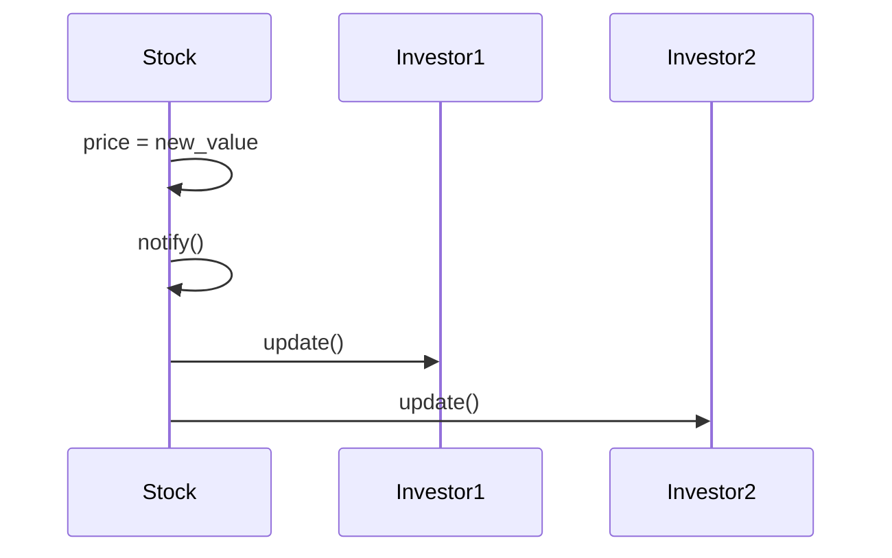

## 7.3.2 Implementation in Python

In the realm of software design, the **Observer pattern** is a quintessential behavioral pattern that enables an object, known as the **subject**, to maintain a list of dependents, called **observers**, and automatically notify them of any state changes, typically by calling one of their methods. This pattern is particularly beneficial in scenarios where a change in one object requires changes in others, but the objects are loosely coupled.

### Understanding the Observer Pattern

The Observer pattern is akin to a subscription model where observers subscribe to a subject. When the subject's state changes, it broadcasts updates to all its subscribers. This pattern is widely used in various domains, including user interface frameworks, event handling systems, and real-time data streaming applications.

#### Key Concepts

- **Subject Interface:** Defines methods to attach, detach, and notify observers.
- **Concrete Subject:** Maintains the state of interest and notifies observers about state changes.
- **Observer Interface:** Contains an `update` method that gets called when the subject's state changes.
- **Concrete Observers:** Implement the `update` method to respond to state changes.

### Implementing the Observer Pattern in Python

Let's delve into a practical implementation of the Observer pattern in Python using a stock market system as our example. In this system, investors (observers) receive updates whenever a stock's (subject's) price changes.

#### Step-by-Step Implementation

##### 1. Define the Subject Interface

The subject interface includes methods for attaching, detaching, and notifying observers. Here is a simple implementation in Python:

```python
class Subject:
    def __init__(self):
        self._observers = []

    def attach(self, observer):
        self._observers.append(observer)

    def detach(self, observer):
        self._observers.remove(observer)

    def notify(self):
        for observer in self._observers:
            observer.update(self)
```

In this code, the `Subject` class manages a list of observers and provides methods to attach, detach, and notify them.

##### 2. Implement the Concrete Subject

The concrete subject holds the state of interest (e.g., stock price) and notifies observers when this state changes. Below is the implementation of a `Stock` class:

```python
class Stock(Subject):
    def __init__(self, name, price):
        super().__init__()
        self.name = name
        self._price = price

    @property
    def price(self):
        return self._price

    @price.setter
    def price(self, value):
        if self._price != value:
            self._price = value
            self.notify()
```

The `Stock` class inherits from `Subject` and uses a property setter to trigger notifications when the price changes.

##### 3. Define the Observer Interface

The observer interface includes an `update` method that gets called when the subject's state changes:

```python
class Observer:
    def update(self, subject):
        pass
```

This interface provides a template for concrete observers to implement their update logic.

##### 4. Implement Concrete Observers

Concrete observers implement the `update` method to respond to changes in the subject's state. Here's an implementation of an `Investor` class:

```python
class Investor(Observer):
    def __init__(self, name):
        self.name = name

    def update(self, subject):
        print(f"{self.name} notified: {subject.name}'s stock price changed to ${subject.price}")
```

The `Investor` class responds to stock price changes by printing a notification message.

##### 5. Client Code

The client code demonstrates how to create subjects and observers, attach/detach observers, and change the subject's state:

```python
def main():
    # Create a stock and investors
    google_stock = Stock("Google", 1345.56)
    investor1 = Investor("Alice")
    investor2 = Investor("Bob")

    # Attach investors to the stock
    google_stock.attach(investor1)
    google_stock.attach(investor2)

    # Change the stock price
    google_stock.price = 1350.00
    google_stock.price = 1360.75

    # Detach an investor
    google_stock.detach(investor1)

    # Change the stock price again
    google_stock.price = 1375.00

if __name__ == "__main__":
    main()
```

This code sets up a stock and two investors, attaches the investors to the stock, and simulates stock price changes.

### Explanation of the Implementation

- **Subject (`Stock`):** Manages a list of observers and notifies them when its `price` changes. The `notify` method iterates over the list of observers and calls their `update` methods.
- **Observer (`Investor`):** Implements the `update` method to receive notifications. The investor responds by printing a message with the updated stock price.
- **Client Code:** Demonstrates the attachment and detachment of observers and shows how observers receive updates when the subject's state changes.

### Best Practices

#### Memory Management

To prevent memory leaks, ensure that observers are properly detached when they are no longer needed. This can be achieved by explicitly calling the `detach` method.

#### Thread Safety

In a multithreaded environment, consider using thread-safe data structures or synchronization mechanisms to manage the list of observers. This ensures that the attachment, detachment, and notification processes are thread-safe.

#### Avoiding Update Loops

If observers modify the subject, ensure that it doesn't lead to infinite update loops. This can be avoided by implementing checks to prevent unnecessary notifications.

### Visual Representation

The following sequence diagram illustrates the interaction between a stock and its investors when the stock price changes:



### Key Points to Emphasize

- **Decoupling:** The Observer pattern allows subjects to notify observers without knowing their concrete implementations, promoting loose coupling between components.
- **Publish-Subscribe Relationship:** This pattern establishes a publish-subscribe relationship where the subject publishes updates and observers subscribe to receive them.

### Real-World Applications

The Observer pattern is prevalent in various real-world applications, including:

- **Graphical User Interfaces (GUIs):** Event listeners in GUIs act as observers that respond to user interactions.
- **Real-Time Systems:** In systems where real-time data updates are crucial, such as financial markets or IoT applications, the Observer pattern facilitates efficient data dissemination.
- **Notification Systems:** Email or messaging systems use the Observer pattern to notify users about new messages or updates.

### Conclusion

The Observer pattern is a powerful tool for managing dependencies between objects in a decoupled manner. By implementing this pattern in Python, developers can create systems where changes in one part of the application automatically propagate to other parts, enhancing modularity and flexibility.

### Further Reading and Resources

To deepen your understanding of the Observer pattern and its applications, consider exploring the following resources:

- **Books:**
  - "Design Patterns: Elements of Reusable Object-Oriented Software" by Erich Gamma et al.
  - "Head First Design Patterns" by Eric Freeman and Elisabeth Robson
- **Online Courses:**
  - Coursera's "Design Patterns" course by the University of Alberta
  - Udemy's "Design Patterns in Python" course
- **Documentation:**
  - [Python Official Documentation](https://docs.python.org/3/)

### Quiz Time!



### What is the primary purpose of the Observer pattern?

- [x] To allow objects to notify other objects about changes in their state
- [ ] To manage object creation
- [ ] To define a one-to-one dependency between objects
- [ ] To encapsulate algorithms

> **Explanation:** The Observer pattern enables an object (subject) to notify other objects (observers) about changes in its state, promoting a one-to-many dependency.

### In the Observer pattern, what role does the `Subject` play?

- [x] It maintains a list of observers and notifies them of state changes
- [ ] It implements the `update` method
- [ ] It is responsible for receiving notifications
- [ ] It defines the interface for observers

> **Explanation:** The `Subject` is responsible for managing observers and notifying them when its state changes.

### How does the `Stock` class notify its observers of a price change?

- [x] By calling the `notify` method
- [ ] By directly updating each observer
- [ ] By sending an email
- [ ] By logging the change to a file

> **Explanation:** The `Stock` class calls the `notify` method, which iterates over the list of observers and calls their `update` methods.

### What is a key benefit of using the Observer pattern?

- [x] It promotes loose coupling between components
- [ ] It reduces the number of classes in a system
- [ ] It simplifies object creation
- [ ] It eliminates the need for interfaces

> **Explanation:** The Observer pattern promotes loose coupling by allowing subjects to notify observers without knowing their concrete implementations.

### Which method do observers implement to respond to notifications?

- [x] `update`
- [ ] `notify`
- [ ] `attach`
- [ ] `detach`

> **Explanation:** Observers implement the `update` method to respond to notifications from the subject.

### What should be considered when implementing the Observer pattern in a multithreaded environment?

- [x] Thread safety and synchronization
- [ ] Reducing the number of observers
- [ ] Simplifying the subject's logic
- [ ] Using global variables

> **Explanation:** In a multithreaded environment, thread safety and synchronization are important to ensure the correct management of observers.

### How can memory leaks be prevented in the Observer pattern?

- [x] By properly detaching observers when they are no longer needed
- [ ] By using more observers
- [ ] By increasing the frequency of notifications
- [ ] By using global variables

> **Explanation:** Properly detaching observers when they are no longer needed helps prevent memory leaks.

### What real-world application commonly uses the Observer pattern?

- [x] Graphical User Interfaces (GUIs)
- [ ] Database Management Systems
- [ ] Operating Systems
- [ ] Compilers

> **Explanation:** GUIs commonly use the Observer pattern to manage event listeners that respond to user interactions.

### In the provided Python implementation, what happens when the `detach` method is called?

- [x] The specified observer is removed from the list of observers
- [ ] All observers are notified
- [ ] The subject's state is reset
- [ ] The subject is deleted

> **Explanation:** The `detach` method removes the specified observer from the list of observers, preventing it from receiving further notifications.

### True or False: The Observer pattern can lead to infinite update loops if not carefully implemented.

- [x] True
- [ ] False

> **Explanation:** If observers modify the subject and trigger further notifications, it can lead to infinite update loops. Proper checks should be implemented to avoid this.


