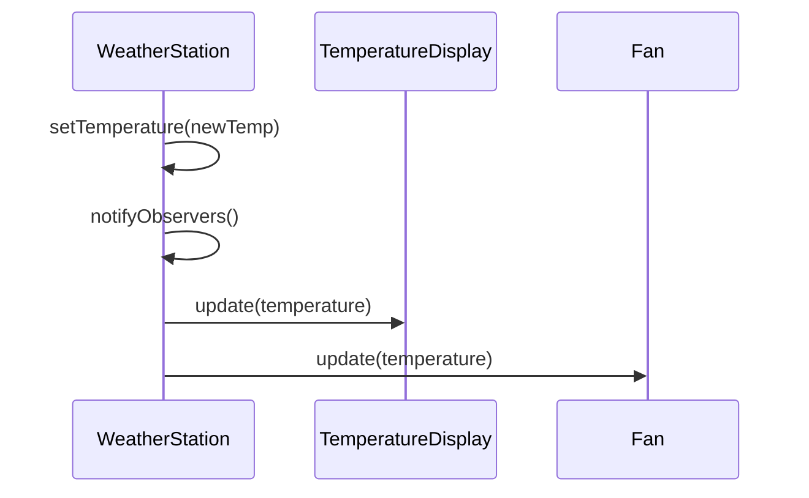

## 7.3.3 Implementation in JavaScript

In the realm of software design, the Observer pattern stands out as a quintessential solution for managing changes and updates across an application. This pattern is particularly well-suited to JavaScript, given its inherent event-driven nature. In this section, we will delve into the implementation of the Observer pattern in JavaScript, providing a detailed walkthrough, practical examples, and insights into its real-world applications.

### Understanding the Observer Pattern

The Observer pattern is a behavioral design pattern that defines a one-to-many dependency between objects. When the state of one object (the subject) changes, all its dependents (observers) are notified and updated automatically. This pattern is commonly used in scenarios where a change in one part of an application needs to be reflected across other parts without tight coupling.

#### Key Concepts

- **Subject (Observable):** The core object that holds the state and notifies observers about changes.
- **Observer:** An entity that wants to be informed about changes in the subject.
- **Event Notification:** The mechanism through which observers are informed about changes.

### Implementation Steps in JavaScript

JavaScript's event-driven architecture makes it an ideal candidate for implementing the Observer pattern. We will explore the implementation through a practical example: a Weather Station application.

#### Step 1: Define the Subject (Observable)

The Subject, or Observable, is responsible for maintaining a list of observers and notifying them of any state changes. Here's how we can define a `WeatherStation` class in JavaScript:

```javascript
class WeatherStation {
    constructor() {
        this.observers = [];
        this.temperature = null;
    }

    addObserver(observer) {
        this.observers.push(observer);
    }

    removeObserver(observer) {
        const index = this.observers.indexOf(observer);
        if (index > -1) {
            this.observers.splice(index, 1);
        }
    }

    notifyObservers() {
        for (const observer of this.observers) {
            observer.update(this.temperature);
        }
    }

    setTemperature(temp) {
        console.log(`WeatherStation: new temperature is ${temp}°C`);
        this.temperature = temp;
        this.notifyObservers();
    }
}
```

In this implementation:
- **`addObserver`**: Adds an observer to the list.
- **`removeObserver`**: Removes an observer from the list.
- **`notifyObservers`**: Notifies all registered observers of a state change.
- **`setTemperature`**: Updates the temperature and triggers notifications.

#### Step 2: Define the Observer Interface

Observers need to implement an `update` method to receive notifications. Here's a basic Observer class:

```javascript
class Observer {
    update(data) {
        // To be implemented by concrete observers
    }
}
```

This class serves as a blueprint for concrete observers, which will implement the `update` method.

#### Step 3: Implement Concrete Observers

Concrete observers react to changes in the subject's state. Let's implement two observers: `TemperatureDisplay` and `Fan`.

**TemperatureDisplay Observer:**

```javascript
class TemperatureDisplay extends Observer {
    update(temperature) {
        console.log(`TemperatureDisplay: I need to update my display to ${temperature}°C`);
    }
}
```

**Fan Observer:**

```javascript
class Fan extends Observer {
    update(temperature) {
        if (temperature > 25) {
            console.log("Fan: It's hot! Turning on...");
        } else {
            console.log("Fan: Temperature is comfortable. Turning off...");
        }
    }
}
```

These observers demonstrate different reactions to the same data update.

#### Step 4: Client Code

The client code ties everything together, demonstrating how observers are added, removed, and notified of changes.

```javascript
function main() {
    const weatherStation = new WeatherStation();

    const tempDisplay = new TemperatureDisplay();
    const fan = new Fan();

    weatherStation.addObserver(tempDisplay);
    weatherStation.addObserver(fan);

    weatherStation.setTemperature(20);
    weatherStation.setTemperature(30);

    weatherStation.removeObserver(tempDisplay);

    weatherStation.setTemperature(18);
}

main();
```

### Explanation of the Implementation

- **Subject (`WeatherStation`):** Manages the list of observers and notifies them whenever the temperature changes.
- **Observers (`TemperatureDisplay`, `Fan`):** Implement the `update` method to perform actions based on the temperature.
- **Client Code:** Demonstrates the dynamic nature of the pattern by adding and removing observers and observing their reactions to temperature changes.

### Best Practices and Enhancements

#### Event Emitter Alternative

In Node.js, the built-in `EventEmitter` class provides a robust alternative for managing events and listeners. It simplifies the implementation of the Observer pattern by abstracting the event management logic.

#### Using Anonymous Functions

For simplicity, anonymous functions or callbacks can be used as observers. This approach is particularly useful for small-scale applications or when the observer logic is straightforward.

#### Handling Asynchronous Updates

If updates involve asynchronous operations, such as fetching data from an API, ensure proper handling with Promises or `async/await`. This ensures that observers are notified correctly after the asynchronous operation completes.

### Visual Representation

To better understand the flow of interactions in the Observer pattern, consider the following sequence diagram:



### Real-World Applications

The Observer pattern is widely used in modern software development, especially in frameworks and libraries for state management and event handling. Examples include:

- **React.js:** The pattern is integral to state management solutions like Redux, where components subscribe to state changes.
- **Angular:** Utilizes observables extensively for handling asynchronous data streams.
- **Vue.js:** Implements a reactive data-binding system based on the Observer pattern.

### Key Points to Emphasize

- **Event-Driven Architecture:** JavaScript's event-driven nature aligns seamlessly with the Observer pattern, making it a natural fit for implementing this pattern.
- **Decoupling:** The pattern promotes loose coupling between components, enhancing modularity and maintainability.
- **Scalability:** As applications grow, the Observer pattern allows for flexible and scalable architecture by managing dependencies effectively.

### Conclusion

The Observer pattern is a powerful tool in the software engineer's toolkit, particularly in JavaScript applications. By understanding and implementing this pattern, developers can create more responsive, maintainable, and scalable applications. As you continue your journey in software design, consider how the Observer pattern can be applied to your projects to manage dynamic relationships and state changes effectively.

## Quiz Time!



### What is the primary purpose of the Observer pattern?

- [x] To define a one-to-many dependency between objects
- [ ] To encapsulate a request as an object
- [ ] To provide a surrogate or placeholder for another object
- [ ] To ensure a class has only one instance

> **Explanation:** The Observer pattern is used to define a one-to-many dependency between objects so that when one object changes state, all its dependents are notified and updated automatically.

### In the Observer pattern, what is the role of the Subject?

- [x] To maintain a list of observers and notify them of changes
- [ ] To implement the `update` method
- [ ] To act as a proxy for another object
- [ ] To encapsulate algorithms

> **Explanation:** The Subject maintains a list of observers and is responsible for notifying them about any state changes.

### Which JavaScript feature makes it particularly well-suited for implementing the Observer pattern?

- [x] Event-driven architecture
- [ ] Object-oriented programming
- [ ] Functional programming
- [ ] Prototype-based inheritance

> **Explanation:** JavaScript's event-driven architecture aligns well with the Observer pattern, facilitating the management of events and notifications.

### What method must an Observer implement in the Observer pattern?

- [x] update
- [ ] notify
- [ ] register
- [ ] dispatch

> **Explanation:** Observers must implement the `update` method to receive notifications from the subject.

### In the provided Weather Station example, what triggers the notification of observers?

- [x] Setting a new temperature
- [ ] Adding a new observer
- [ ] Removing an observer
- [ ] Initializing the WeatherStation

> **Explanation:** Observers are notified when a new temperature is set, triggering the `notifyObservers` method.

### How can asynchronous updates be handled in the Observer pattern?

- [x] Using Promises or async/await
- [ ] Using synchronous callbacks
- [ ] Using global variables
- [ ] Using setTimeout

> **Explanation:** Asynchronous updates can be effectively handled using Promises or async/await to ensure proper notification after asynchronous operations.

### Which Node.js class can be used as an alternative to implement the Observer pattern?

- [x] EventEmitter
- [ ] Buffer
- [ ] Stream
- [ ] FileSystem

> **Explanation:** The `EventEmitter` class in Node.js provides a built-in mechanism for managing events and listeners, making it a suitable alternative for implementing the Observer pattern.

### What is a potential benefit of using anonymous functions as observers?

- [x] Simplicity for small-scale applications
- [ ] Improved performance
- [ ] Enhanced security
- [ ] Increased coupling

> **Explanation:** Anonymous functions can simplify the implementation of observers, especially in small-scale applications or when the observer logic is straightforward.

### What is a key advantage of the Observer pattern in software design?

- [x] Promotes loose coupling between components
- [ ] Increases code complexity
- [ ] Reduces code reusability
- [ ] Encourages tight coupling

> **Explanation:** The Observer pattern promotes loose coupling between components, which enhances modularity and maintainability.

### True or False: The Observer pattern is only applicable in JavaScript.

- [ ] True
- [x] False

> **Explanation:** The Observer pattern is a fundamental design pattern applicable in many programming languages and contexts, not just JavaScript.



By understanding and implementing the Observer pattern in JavaScript, you can harness its power to create dynamic, responsive, and maintainable applications. This pattern is a cornerstone in event-driven programming and is widely applicable across various domains and technologies.
