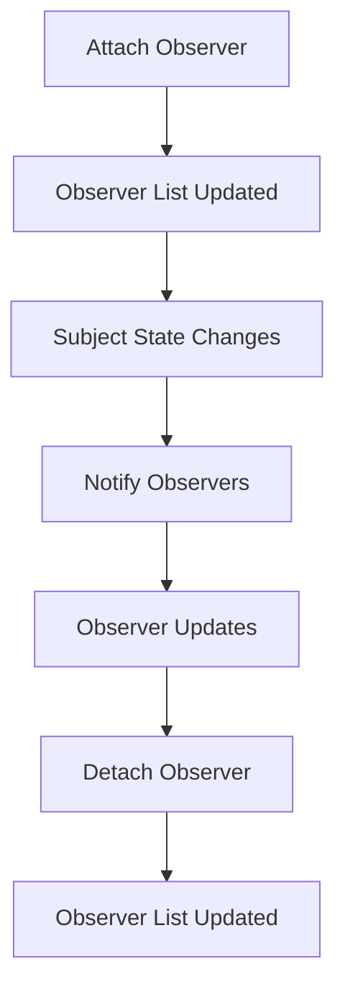

---

linkTitle: "7.3.4 Use Cases and Considerations"
title: "Observer Pattern: Use Cases and Considerations for Effective Software Design"
description: "Explore the Observer pattern's use cases in software design, including event handling, data binding, notification systems, and real-time data feeds, along with considerations and best practices for implementation."
categories:
- Software Design
- Design Patterns
- Behavioral Patterns
tags:
- Observer Pattern
- Event-Driven Architecture
- Software Engineering
- Real-Time Systems
- Design Best Practices
date: 2024-10-25
type: docs
nav_weight: 7340

---

## 7.3.4 Use Cases and Considerations

In the realm of software design, the Observer pattern stands out as a cornerstone of event-driven architecture. It facilitates a dynamic relationship between objects, allowing them to communicate efficiently and respond to changes in real time. This section delves into the use cases, benefits, considerations, and best practices associated with the Observer pattern, providing a comprehensive guide for its effective implementation.

### Use Cases

The Observer pattern is particularly useful in scenarios where the state of one object (the subject) needs to be monitored by other objects (the observers). Here are some common use cases where the Observer pattern is invaluable:

#### Event Handling Systems

In graphical user interfaces (GUIs), event handling is a critical component. The Observer pattern is extensively used to manage user interactions with GUI components. For instance, when a user clicks a button, the button (subject) notifies its listeners (observers) to perform specific actions.

**Example in GUI:**

Imagine a simple GUI application where a button click updates a label. Here's how the Observer pattern can be implemented in Python using a basic example:

```python
class Button:
    def __init__(self):
        self._observers = []

    def click(self):
        print("Button clicked!")
        self.notify_observers()

    def add_observer(self, observer):
        self._observers.append(observer)

    def remove_observer(self, observer):
        self._observers.remove(observer)

    def notify_observers(self):
        for observer in self._observers:
            observer.update()

class Label:
    def update(self):
        print("Label updated in response to button click.")

button = Button()
label = Label()

button.add_observer(label)
button.click()
```

In this example, the `Button` class acts as the subject, and the `Label` class is the observer that updates itself when the button is clicked.

#### Data Binding in UI Frameworks

Modern UI frameworks often employ data binding to automatically update UI elements when the underlying data model changes. The Observer pattern is integral to this process, ensuring that any change in the data model is immediately reflected in the UI.

**Example in JavaScript:**

Consider a web application where a change in a data model updates a corresponding UI element:

```javascript
class DataModel {
    constructor() {
        this.data = {};
        this.observers = [];
    }

    set(key, value) {
        this.data[key] = value;
        this.notifyObservers();
    }

    addObserver(observer) {
        this.observers.push(observer);
    }

    removeObserver(observer) {
        this.observers = this.observers.filter(obs => obs !== observer);
    }

    notifyObservers() {
        this.observers.forEach(observer => observer.update(this.data));
    }
}

class UIComponent {
    update(data) {
        console.log("UI updated with data:", data);
    }
}

// Usage
const model = new DataModel();
const uiComponent = new UIComponent();

model.addObserver(uiComponent);
model.set('name', 'John Doe');
```

In this JavaScript example, the `DataModel` class is the subject, and `UIComponent` acts as the observer, updating the UI whenever the data changes.

#### Notification Systems

Notification systems require a mechanism to alert subscribers about updates or events. The Observer pattern is ideal for such systems, enabling applications to send notifications to multiple subscribers efficiently.

**Example in Notification Systems:**

Consider an application that sends alerts to users when certain conditions are met:

```python
class NotificationSystem:
    def __init__(self):
        self._subscribers = []

    def subscribe(self, subscriber):
        self._subscribers.append(subscriber)

    def unsubscribe(self, subscriber):
        self._subscribers.remove(subscriber)

    def notify(self, message):
        for subscriber in self._subscribers:
            subscriber.receive_notification(message)

class User:
    def receive_notification(self, message):
        print(f"User received notification: {message}")

notification_system = NotificationSystem()
user1 = User()
user2 = User()

notification_system.subscribe(user1)
notification_system.subscribe(user2)

notification_system.notify("New event available!")
```

In this Python example, the `NotificationSystem` class is the subject, and `User` instances are observers that receive notifications.

#### Real-Time Data Feeds

Applications that require real-time updates, such as stock tickers or live sports scores, benefit significantly from the Observer pattern. It allows these systems to broadcast updates to all interested parties without delay.

**Example in Real-Time Data Feeds:**

Consider a stock market application that updates subscribers with the latest stock prices:

```python
class StockMarket:
    def __init__(self):
        self._observers = []
        self._stock_data = {}

    def add_observer(self, observer):
        self._observers.append(observer)

    def remove_observer(self, observer):
        self._observers.remove(observer)

    def set_stock_data(self, symbol, price):
        self._stock_data[symbol] = price
        self.notify_observers()

    def notify_observers(self):
        for observer in self._observers:
            observer.update(self._stock_data)

class StockObserver:
    def update(self, stock_data):
        print("Stock data updated:", stock_data)

market = StockMarket()
observer = StockObserver()

market.add_observer(observer)
market.set_stock_data('AAPL', 150.00)
```

In this example, the `StockMarket` class is the subject, and `StockObserver` instances are observers that receive real-time updates.

### Benefits

The Observer pattern offers several advantages that make it a popular choice in software design:

#### Loose Coupling

One of the primary benefits of the Observer pattern is the loose coupling it provides between subjects and observers. This decoupling allows for greater flexibility and maintainability, as changes to one component do not necessitate changes to others.

#### Dynamic Relationships

The Observer pattern supports dynamic relationships between objects. Observers can be added or removed at runtime, allowing systems to adapt to changing requirements without significant restructuring.

#### Scalability

The pattern is inherently scalable, as it allows multiple observers to be attached to a single subject without requiring changes to the subject's code. This scalability is crucial in systems where the number of observers may vary significantly over time.

### Considerations

While the Observer pattern offers numerous benefits, there are also considerations to keep in mind to ensure its effective use:

#### Potential Performance Impact

In systems with a large number of observers, the process of notifying all observers can become resource-intensive. It's essential to consider the performance implications and optimize the notification process where possible.

#### Memory Leaks

A common issue with the Observer pattern is the potential for memory leaks if observers are not properly detached when they are no longer needed. This can be mitigated by implementing mechanisms to ensure observers are removed from the subject's list when they are destroyed or no longer in use.

#### Update Consistency

When multiple observers depend on each other's updates, the order of notifications can become critical. Careful design is required to ensure that updates are consistent and do not lead to unexpected behavior.

#### Error Handling

Exceptions in observer updates should not prevent other observers from receiving notifications. Implementing robust error handling mechanisms ensures that the notification process remains reliable even in the presence of errors.

### Best Practices

To maximize the effectiveness of the Observer pattern, consider the following best practices:

#### Use Weak References (if available)

In languages that support weak references, such as Java, using weak references for observers can help prevent memory leaks by allowing the garbage collector to reclaim observer objects when they are no longer in use.

#### Notification Payloads

Providing sufficient context or data in notifications allows observers to act appropriately. This can include information about what changed and any relevant data needed by the observers.

#### Avoid Circular Dependencies

Circular dependencies can lead to infinite loops and other issues. It's crucial to design the system to prevent mutual subscriptions that could result in such dependencies.

### Examples in Industry

The Observer pattern is widely used in various industries and technologies:

#### Publish-Subscribe Systems

Messaging systems like MQTT and event buses in applications use the Observer pattern to facilitate communication between components. These systems allow components to publish messages to a central broker, which then notifies all subscribed components.

#### Reactive Programming

Libraries like RxJS leverage the Observer pattern to handle asynchronous data streams. In reactive programming, data flows are managed using observables, which notify subscribers of changes in real time.

### Visuals and Diagrams

To further illustrate the Observer pattern, consider the following flowchart depicting the lifecycle of an observer:



This flowchart outlines the key steps in the lifecycle of an observer, from attachment to detachment, highlighting the dynamic nature of the pattern.

### Key Points to Emphasize

- **Fundamental for Event-Driven Architectures:** The Observer pattern is a foundational element of event-driven systems, enabling components to respond to changes in real time.
- **Efficient and Maintainable Systems:** Proper implementation of the Observer pattern ensures that systems are both efficient and maintainable, with clear separation of concerns.
- **Mindful of Potential Pitfalls:** By being aware of potential pitfalls, such as memory leaks and performance issues, developers can create robust applications that leverage the full power of the Observer pattern.

### Conclusion

The Observer pattern is a versatile and powerful tool in the software designer's toolkit. By understanding its use cases, benefits, considerations, and best practices, developers can harness its potential to create responsive, scalable, and maintainable systems. As you continue your journey in software design, remember that the Observer pattern is not just a theoretical concept but a practical solution to real-world challenges.

## Quiz Time!



### Which of the following is a common use case for the Observer pattern?

- [x] Event Handling Systems
- [ ] Data Storage Systems
- [ ] File Compression
- [ ] Image Processing

> **Explanation:** Event handling systems, such as GUI applications, are a common use case for the Observer pattern, where components respond to user actions.

### What is a primary benefit of using the Observer pattern?

- [x] Loose Coupling
- [ ] Increased Complexity
- [ ] Reduced Flexibility
- [ ] Tight Coupling

> **Explanation:** The Observer pattern provides loose coupling between subjects and observers, allowing for greater flexibility and maintainability.

### In the context of the Observer pattern, what is a potential performance concern?

- [x] Resource-Intensive Notifications
- [ ] Lack of Observers
- [ ] Data Redundancy
- [ ] Excessive Logging

> **Explanation:** With a large number of observers, the notification process can become resource-intensive, impacting performance.

### How can memory leaks be prevented when using the Observer pattern?

- [x] Properly Detach Observers
- [ ] Increase Memory Allocation
- [ ] Use Strong References
- [ ] Avoid Using Observers

> **Explanation:** Memory leaks can be prevented by ensuring observers are properly detached when they are no longer needed.

### What should be included in notification payloads to ensure observers can act appropriately?

- [x] Sufficient Context or Data
- [ ] Observer Count
- [ ] Subject Metadata
- [ ] Notification Time

> **Explanation:** Providing sufficient context or data in notifications allows observers to act appropriately based on the changes.

### Which of the following is a best practice for implementing the Observer pattern?

- [x] Avoid Circular Dependencies
- [ ] Use Strong References
- [ ] Notify Observers Sequentially
- [ ] Limit the Number of Observers

> **Explanation:** Avoiding circular dependencies is a best practice to prevent infinite loops and other issues in observer systems.

### In which programming paradigm is the Observer pattern commonly used?

- [x] Reactive Programming
- [ ] Procedural Programming
- [ ] Functional Programming
- [ ] Object-Oriented Programming

> **Explanation:** The Observer pattern is commonly used in reactive programming to handle asynchronous data streams.

### What is a common issue if exceptions occur during observer updates?

- [x] Other Observers May Not Receive Updates
- [ ] Observers Receive Duplicate Updates
- [ ] Observers Are Automatically Detached
- [ ] Subject State is Reset

> **Explanation:** Exceptions in observer updates can prevent other observers from receiving notifications, so robust error handling is crucial.

### What is a typical component of a Publish-Subscribe system using the Observer pattern?

- [x] Central Broker
- [ ] Data Warehouse
- [ ] File System
- [ ] Web Server

> **Explanation:** In publish-subscribe systems, a central broker facilitates communication between components, using the Observer pattern.

### True or False: The Observer pattern can dynamically add or remove observers at runtime.

- [x] True
- [ ] False

> **Explanation:** The Observer pattern supports dynamic relationships, allowing observers to be added or removed at runtime.


