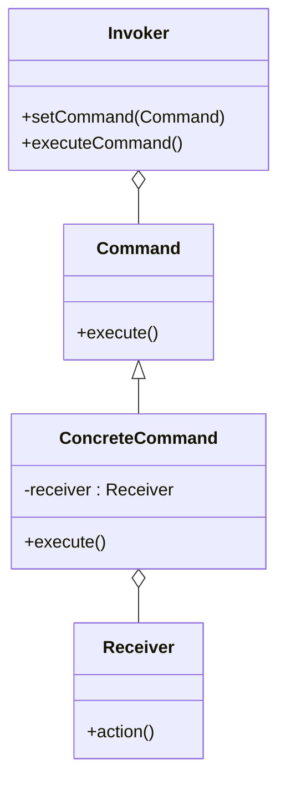

## 7.4.1 Understanding the Command Pattern

In the vast landscape of software design patterns, the Command pattern stands out as a powerful tool for encapsulating requests as objects. This capability not only allows for flexible command execution but also enables advanced features such as undo/redo operations, command logging, and task scheduling. In this section, we will delve into the intricacies of the Command pattern, exploring its definition, problem-solving capabilities, and practical applications through real-world analogies and theoretical discussions.

### Definition of the Command Pattern

The Command pattern is a **behavioral design pattern** that encapsulates a request as an object. This encapsulation allows clients to parameterize objects with operations, queue or log requests, and support undoable operations. By turning a request into a standalone object, the pattern decouples the object that invokes the operation from the one that knows how to perform it. This separation promotes flexibility and extensibility in software design.

### Problem Statement

In many software applications, there arises a need to issue requests to objects without having detailed knowledge about the nature of the operation being requested or the identity of the receiver. This scenario is common in applications that require:

- **Undo/Redo Functionality:** Allowing users to reverse or reapply actions, such as in text editors or graphic design software.
- **Transaction Management:** Managing complex operations that need to be executed in a specific order or rolled back in case of failure.
- **Task Scheduling:** Deferring the execution of operations to a later time or executing them in a specific sequence.

For instance, consider a scenario where a user interacts with a graphical user interface (GUI) to perform actions like opening, closing, or saving files. The GUI components should not be tightly coupled with the file operations themselves. Instead, they should issue commands that can be executed, undone, or redone as needed.

### Solution Provided by the Command Pattern

The Command pattern addresses these challenges by encapsulating each request as an object, effectively decoupling the invoker of the request from the receiver that executes it. This approach offers several advantages:

- **Decoupling Invoker and Receiver:** The pattern separates the concerns of initiating a request from executing it, allowing for greater flexibility in modifying either component independently.
- **Command Queuing and Logging:** Commands can be stored in queues or logs, facilitating batch processing or auditing of operations.
- **Undo/Redo Capability:** By maintaining a history of command objects, applications can implement undo and redo functionalities seamlessly.
- **Dynamic Command Execution:** The pattern enables dynamic and flexible command execution, allowing commands to be parameterized and executed in various contexts.

### Real-World Analogy: The Remote Control

To better understand the Command pattern, consider the analogy of a remote control for electronic devices. The remote control serves as an **invoker**, with buttons that issue commands to various devices such as a TV, DVD player, or stereo system (the **receivers**). Each button on the remote corresponds to a command object that encapsulates the request, such as turning on the TV or increasing the volume.

The remote control itself does not need to know how these operations are performed; it merely issues the command. This abstraction allows for easy modification and extension of the system. For example, a new device can be added without altering the remote control's interface, as long as the device can interpret the commands.

### Visual Representation: Class Diagram

To visualize the structure of the Command pattern, consider the following class diagram:

- **Invoker:** The component that initiates the request. It holds a reference to a command object and triggers its execution.
- **Command:** An abstract interface that declares the `execute` method.
- **ConcreteCommand:** Implements the `Command` interface and defines the binding between a receiver and an action.
- **Receiver:** The component that knows how to perform the operations associated with carrying out a request.

### Key Points to Emphasize

1. **Decoupling:** The Command pattern promotes decoupling between objects that issue requests and those that execute them. This separation of concerns enhances the modularity and flexibility of the system.

2. **Undo/Redo and Logging:** By encapsulating requests as objects, the pattern enables advanced features such as undo/redo operations and command logging, which are essential in many modern applications.

3. **Flexibility and Extensibility:** The pattern supports the dynamic composition and execution of commands, allowing for easy extension and modification of the system without disrupting existing functionality.

4. **Real-World Applicability:** The Command pattern is widely applicable in scenarios requiring task scheduling, transaction management, and user interaction handling, making it a valuable tool in the software developer's toolkit.

### Conclusion

The Command pattern is a quintessential example of how design patterns can simplify complex software architectures by promoting separation of concerns and enhancing flexibility. By encapsulating requests as objects, the pattern enables a wide range of functionalities, from undo/redo operations to dynamic command execution. Understanding and applying the Command pattern can significantly improve the design and maintainability of software systems, making it an indispensable pattern for developers to master.

---

## Quiz Time!



### What is the primary intent of the Command pattern?

- [x] To encapsulate a request as an object, allowing for parameterization and flexible execution.
- [ ] To establish a one-to-one relationship between classes.
- [ ] To provide a way to create objects without specifying their concrete classes.
- [ ] To define a family of algorithms and make them interchangeable.

> **Explanation:** The Command pattern encapsulates a request as an object, which allows for parameterization of clients with queues, logs, and undoable operations.

### Which of the following scenarios is NOT a typical use case for the Command pattern?

- [ ] Implementing undo/redo functionality.
- [ ] Transaction management.
- [ ] Scheduling tasks.
- [x] Establishing a database connection.

> **Explanation:** The Command pattern is typically used for encapsulating requests, not for establishing database connections.

### In the Command pattern, what role does the Invoker play?

- [x] It initiates the request by calling the execute method on a command.
- [ ] It performs the action associated with the command.
- [ ] It defines the binding between a receiver and an action.
- [ ] It stores the history of commands for undo functionality.

> **Explanation:** The Invoker is responsible for initiating the request by calling the execute method on the command object.

### How does the Command pattern promote decoupling?

- [x] By separating the object that invokes the operation from the one that knows how to perform it.
- [ ] By using inheritance to share code among classes.
- [ ] By allowing objects to communicate directly with each other.
- [ ] By enforcing a strict order of execution.

> **Explanation:** The Command pattern decouples the invoker from the receiver by encapsulating the request as an object.

### Which component in the Command pattern knows how to perform the operations associated with a request?

- [ ] Invoker
- [ ] Command
- [ ] ConcreteCommand
- [x] Receiver

> **Explanation:** The Receiver is the component that knows how to perform the operations associated with carrying out a request.

### What advantage does encapsulating requests as objects provide?

- [x] It allows for queuing, logging, and supporting undoable operations.
- [ ] It ensures all objects are created in a standard way.
- [ ] It provides a direct communication path between classes.
- [ ] It simplifies the user interface design.

> **Explanation:** Encapsulating requests as objects allows for flexible handling of commands, including queuing and logging.

### Which of the following best describes the role of a ConcreteCommand?

- [ ] It declares the execute method.
- [x] It implements the Command interface and defines the binding between a receiver and an action.
- [ ] It initiates the request by calling the execute method.
- [ ] It performs the action associated with the command.

> **Explanation:** The ConcreteCommand implements the Command interface and defines the binding between a receiver and an action.

### What feature does the Command pattern enable that is crucial for applications with complex user interactions?

- [x] Undo/Redo functionality
- [ ] Direct object manipulation
- [ ] Simplified database transactions
- [ ] Automatic code generation

> **Explanation:** The Command pattern enables undo/redo functionality by maintaining a history of command objects.

### Why is the Command pattern particularly useful in implementing task scheduling?

- [x] Because it allows commands to be queued and executed at a later time.
- [ ] Because it provides a direct interface to the operating system's scheduler.
- [ ] Because it simplifies the creation of new tasks.
- [ ] Because it ensures tasks are executed in parallel.

> **Explanation:** The Command pattern allows commands to be queued and executed at a later time, making it ideal for task scheduling.

### True or False: The Command pattern can only be used in desktop applications.

- [ ] True
- [x] False

> **Explanation:** False. The Command pattern is versatile and can be used in various types of applications, including web, mobile, and enterprise systems.


