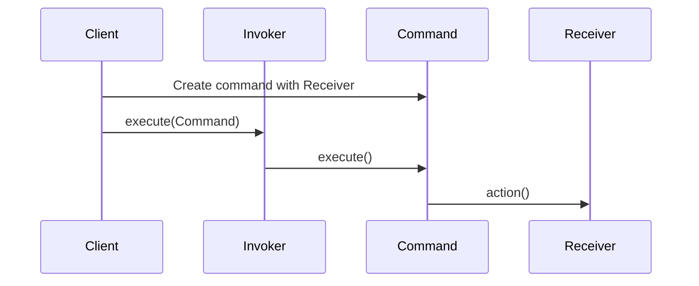

## 7.4.2 Implementing Command Pattern in Python

The Command Pattern is a behavioral design pattern that turns a request into a stand-alone object containing all the information about the request. This transformation allows for parameterization of clients with queues, requests, and operations, as well as the support of undoable operations. In this section, we'll delve into the implementation of the Command Pattern in Python, providing a detailed guide and practical examples to illustrate its use.

### Understanding the Command Pattern

Before diving into the implementation, let's understand the core components of the Command Pattern:

- **Command Interface**: Declares an interface for executing operations.
- **Concrete Command**: Defines a binding between a Receiver object and an action. Implements the Command interface by invoking the corresponding operation(s) on Receiver.
- **Receiver**: Knows how to perform the operations associated with carrying out a request. Any class can act as a Receiver.
- **Invoker**: Asks the command to carry out the request.
- **Client**: Creates a ConcreteCommand object and sets its Receiver.

### Implementation Steps

Let's implement the Command Pattern in Python through a step-by-step guide.

#### Step 1: Define the Command Interface

The first step in implementing the Command Pattern is to define the Command interface. This interface will declare the `execute` and `undo` methods, which concrete commands must implement.

```python
from abc import ABC, abstractmethod

class Command(ABC):
    @abstractmethod
    def execute(self):
        pass

    @abstractmethod
    def undo(self):
        pass
```

#### Step 2: Implement Concrete Commands

Concrete Commands implement the Command interface and define the relationship between the action and the receiver. Here, we'll create two commands: `WriteCommand` and `DeleteCommand`.

```python
class WriteCommand(Command):
    def __init__(self, editor, content):
        self.editor = editor
        self.content = content

    def execute(self):
        self.editor.write(self.content)

    def undo(self):
        self.editor.delete(len(self.content))

class DeleteCommand(Command):
    def __init__(self, editor, num_chars):
        self.editor = editor
        self.num_chars = num_chars
        self.deleted_text = ""

    def execute(self):
        self.deleted_text = self.editor.text[-self.num_chars:]
        self.editor.delete(self.num_chars)

    def undo(self):
        self.editor.write(self.deleted_text)
```

#### Step 3: Create the Receiver Classes

The Receiver class contains the business logic to perform the actions. In our example, the `TextEditor` class acts as the receiver.

```python
class TextEditor:
    def __init__(self):
        self.text = ""

    def write(self, content):
        self.text += content

    def delete(self, num_chars):
        self.text = self.text[:-num_chars]

    def __str__(self):
        return self.text
```

#### Step 4: Implement the Invoker

The Invoker class is responsible for executing commands. It can also maintain a history of commands for undo/redo functionality.

```python
class CommandHistory:
    def __init__(self):
        self.history = []
        self.redo_stack = []

    def execute(self, command):
        command.execute()
        self.history.append(command)
        self.redo_stack.clear()

    def undo(self):
        if self.history:
            command = self.history.pop()
            command.undo()
            self.redo_stack.append(command)

    def redo(self):
        if self.redo_stack:
            command = self.redo_stack.pop()
            command.execute()
            self.history.append(command)
```

#### Step 5: Client Code

The client code creates command objects, sets the receiver, and assigns commands to the invoker.

```python
def main():
    editor = TextEditor()
    history = CommandHistory()

    write_cmd1 = WriteCommand(editor, "Hello, ")
    history.execute(write_cmd1)
    print(editor)

    write_cmd2 = WriteCommand(editor, "World!")
    history.execute(write_cmd2)
    print(editor)

    # Undo last command
    history.undo()
    print("After undo:", editor)

    # Redo last command
    history.redo()
    print("After redo:", editor)

    # Delete last 6 characters
    delete_cmd = DeleteCommand(editor, 6)
    history.execute(delete_cmd)
    print(editor)

    # Undo delete
    history.undo()
    print("After undo delete:", editor)

if __name__ == "__main__":
    main()
```

### Example Scenario: Text Editor with Undo/Redo Functionality

In this example, we implemented a simple text editor that supports writing and deleting text with undo and redo functionality. The `TextEditor` class acts as the receiver, while `WriteCommand` and `DeleteCommand` encapsulate actions that can be executed or undone.

### Best Practices

- **Command Interface Consistency**: Ensure all commands implement the same interface for `execute` and `undo`.
- **Encapsulation**: Commands encapsulate actions and can store state for undo operations.
- **Extensibility**: New commands can be added without modifying existing code.

### Visuals and Diagrams

To better understand the flow of the Command Pattern, consider the following sequence diagram:



### Key Points to Emphasize

- The Command pattern decouples the object that invokes the operation from the one that knows how to perform it.
- It facilitates implementing undoable operations and macro commands.
- Commands can be queued, logged, or scheduled for execution.

### Conclusion

The Command Pattern is a powerful tool in software design, allowing for flexible and decoupled code. By encapsulating requests as objects, it enables easy implementation of undo/redo functionality and other complex operations. As you explore this pattern, consider how it can be applied to your projects to enhance modularity and maintainability.

## Quiz Time!



### What is the primary purpose of the Command Pattern?

- [x] To encapsulate a request as an object
- [ ] To define a family of algorithms
- [ ] To provide a way to access the elements of an aggregate object sequentially
- [ ] To separate the construction of a complex object from its representation

> **Explanation:** The Command Pattern encapsulates a request as an object, allowing for parameterization and queuing of requests.

### Which method must be implemented by all concrete commands in the Command Pattern?

- [x] execute
- [x] undo
- [ ] run
- [ ] perform

> **Explanation:** Concrete commands implement both `execute` and `undo` methods to perform and reverse actions.

### In the Command Pattern, what role does the Invoker play?

- [x] It executes commands
- [ ] It performs business logic
- [ ] It creates commands
- [ ] It stores command data

> **Explanation:** The Invoker is responsible for executing commands and may also manage command history for undo/redo.

### What is the role of the Receiver in the Command Pattern?

- [x] It contains the business logic to perform actions
- [ ] It creates command objects
- [ ] It executes commands
- [ ] It manages command history

> **Explanation:** The Receiver contains the business logic and performs the actual operations required by the commands.

### Which of the following is a benefit of using the Command Pattern?

- [x] It decouples the invoker from the receiver
- [x] It allows for easy implementation of undo/redo
- [ ] It simplifies complex algorithms
- [ ] It directly modifies the client's requests

> **Explanation:** The Command Pattern decouples the invoker from the receiver, allowing for flexible command management and undo/redo functionality.

### How can new commands be added in the Command Pattern?

- [x] By creating new concrete command classes
- [ ] By modifying the existing command interface
- [ ] By changing the invoker logic
- [ ] By altering the receiver's methods

> **Explanation:** New commands are added by creating new concrete command classes that implement the command interface.

### What is the significance of the `undo` method in the Command Pattern?

- [x] It allows reversing the effects of a command
- [ ] It initializes command parameters
- [ ] It validates command execution
- [ ] It logs command history

> **Explanation:** The `undo` method allows reversing the effects of a command, enabling undo functionality.

### Which component of the Command Pattern is responsible for maintaining a history of commands?

- [x] Invoker
- [ ] Receiver
- [ ] Client
- [ ] Command Interface

> **Explanation:** The Invoker often maintains a history of commands to implement undo/redo functionality.

### In the provided text editor example, what does the `WriteCommand` do?

- [x] It appends text to the editor
- [ ] It deletes text from the editor
- [ ] It saves the editor's state
- [ ] It initializes the editor

> **Explanation:** The `WriteCommand` appends specified text to the editor.

### True or False: The Command Pattern can be used to implement macro commands.

- [x] True
- [ ] False

> **Explanation:** True, the Command Pattern can be used to implement macro commands, which are commands that execute a sequence of other commands.



By understanding and implementing the Command Pattern in Python, you can design systems that are more flexible, maintainable, and capable of handling complex command operations with ease.
