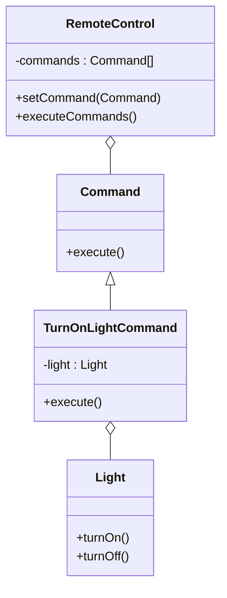

## 7.4.3 Implementing Command Pattern in JavaScript

In this section, we will delve into the implementation of the **Command Pattern** in JavaScript, using a practical example of smart home automation. This pattern is particularly useful for decoupling the sender of a request from its receiver, allowing for more flexible and maintainable code. Through this exploration, we will cover the essential components of the pattern, provide detailed code examples, and discuss best practices and potential pitfalls.

### Understanding the Command Pattern

The Command Pattern is a behavioral design pattern that turns a request into a stand-alone object containing all information about the request. This transformation allows for parameterization of methods with different requests, queuing of requests, and logging the requests. It also provides support for undoable operations.

**Key Components:**

1. **Command Interface**: Declares the `execute` method, which all concrete commands must implement.
2. **Concrete Commands**: Implement the `execute` method by invoking operations on the receiver.
3. **Receiver**: Contains the business logic and performs the actual work.
4. **Invoker**: Asks the command to carry out the request.
5. **Client**: Creates the command and sets its receiver.

### Implementing the Command Pattern in JavaScript

#### Step-by-Step Implementation

Let's walk through the implementation of the Command Pattern in JavaScript using a smart home automation scenario. We will control devices like lights and thermostats using commands.

#### 1. Define the Command Interface

In JavaScript, we can simulate an interface using a base class with a method that throws an error if not implemented.

```javascript
class Command {
    execute() {
        throw new Error("Method 'execute()' must be implemented.");
    }
}
```

#### 2. Implement Receiver Classes

The receivers are the components that perform the actual operations. In our scenario, we have a `Light` and a `Thermostat`.

**Light Receiver:**

```javascript
class Light {
    turnOn() {
        console.log("Light is ON");
    }

    turnOff() {
        console.log("Light is OFF");
    }
}
```

**Thermostat Receiver:**

```javascript
class Thermostat {
    setTemperature(value) {
        console.log(`Thermostat temperature set to ${value}°C`);
    }
}
```

#### 3. Create Concrete Commands

Concrete commands implement the `Command` interface and define the binding between the action and the receiver.

**TurnOnLightCommand:**

```javascript
class TurnOnLightCommand extends Command {
    constructor(light) {
        super();
        this.light = light;
    }

    execute() {
        this.light.turnOn();
    }
}
```

**TurnOffLightCommand:**

```javascript
class TurnOffLightCommand extends Command {
    constructor(light) {
        super();
        this.light = light;
    }

    execute() {
        this.light.turnOff();
    }
}
```

**SetThermostatCommand:**

```javascript
class SetThermostatCommand extends Command {
    constructor(thermostat, value) {
        super();
        this.thermostat = thermostat;
        this.value = value;
    }

    execute() {
        this.thermostat.setTemperature(this.value);
    }
}
```

#### 4. Implement the Invoker

The invoker is responsible for executing the commands. It can store commands and execute them at a later time.

```javascript
class RemoteControl {
    constructor() {
        this.commands = [];
    }

    setCommand(command) {
        this.commands.push(command);
    }

    executeCommands() {
        for (const command of this.commands) {
            command.execute();
        }
        this.commands = []; // Clear commands after execution
    }
}
```

#### 5. Client Code

The client is responsible for creating command objects and associating them with the invoker.

```javascript
function main() {
    const light = new Light();
    const thermostat = new Thermostat();

    const turnOnLight = new TurnOnLightCommand(light);
    const turnOffLight = new TurnOffLightCommand(light);
    const setTemp = new SetThermostatCommand(thermostat, 22);

    const remote = new RemoteControl();
    remote.setCommand(turnOnLight);
    remote.setCommand(setTemp);
    remote.setCommand(turnOffLight);

    remote.executeCommands();
}

main();
```

### Explanation of the Implementation

- **Command Interface (`Command`)**: Declares the `execute` method that must be implemented by all concrete commands.
- **Concrete Commands**: Encapsulate the actions to be performed on the receivers (`Light`, `Thermostat`). They implement the `execute` method to perform specific actions.
- **Receivers**: Implement the actual actions for devices like turning on/off the light or setting the thermostat temperature.
- **Invoker (`RemoteControl`)**: Stores commands and executes them, providing a way to queue and execute multiple commands.
- **Client Code**: Demonstrates how to create commands and assign them to the invoker, showcasing the execution of multiple commands.

### Best Practices and Advanced Concepts

#### Command Queuing and Scheduling

Commands can be queued for later execution, allowing for scheduling tasks at specific times or intervals. This is particularly useful in scenarios where operations need to be deferred or batched.

#### Macro Commands

Macro commands are composite commands that execute multiple commands in sequence. This facilitates complex operations that require multiple steps.

#### Logging and Undo Functionality

Commands can be stored for logging purposes or to implement undo functionality. By maintaining a history of executed commands, it's possible to reverse actions by implementing an `undo` method in each command.

### Visual Representation

Below is a class diagram illustrating the structure of the Command Pattern in our smart home automation example.



### Key Points to Emphasize

- **JavaScript's Flexibility**: JavaScript's first-class functions and closures provide significant flexibility in implementing the Command Pattern. Commands can be defined as objects or functions, and closures can capture the state needed for execution.
- **Decoupling**: The pattern effectively decouples the invoker from the receiver, promoting loose coupling and enhancing maintainability.
- **Extensibility**: Commands can be easily extended to support additional features like undo/redo, logging, and more complex operations through macro commands.

### Conclusion

The Command Pattern is a powerful tool in the software engineer's toolkit, providing a robust way to encapsulate requests as objects. This not only decouples the sender from the receiver but also opens up possibilities for command queuing, scheduling, and undo functionality. By leveraging JavaScript's capabilities, developers can implement this pattern in a flexible and efficient manner, as demonstrated in our smart home automation example.

### Further Exploration

For those interested in exploring the Command Pattern further, consider implementing additional features such as:

- **Undo/Redo Mechanism**: Implement an `undo` method in each command and modify the invoker to support undo operations.
- **Advanced Scheduling**: Integrate a scheduling library to execute commands at specific times.
- **Real-World Scenarios**: Apply the Command Pattern to other domains, such as game development or financial transactions.

By experimenting with these advanced concepts, you'll gain a deeper understanding of the pattern's versatility and power.

## Quiz Time!



### What is the primary purpose of the Command Pattern?

- [x] To encapsulate a request as an object
- [ ] To directly link a sender and a receiver
- [ ] To optimize data storage
- [ ] To simplify database queries

> **Explanation:** The Command Pattern encapsulates a request as an object, allowing for parameterization and queuing of requests.

### In the Command Pattern, what role does the Invoker play?

- [x] It stores and executes commands
- [ ] It performs the business logic
- [ ] It creates command objects
- [ ] It defines the command interface

> **Explanation:** The Invoker stores commands and is responsible for executing them, decoupling the sender from the receiver.

### Which JavaScript feature enhances the flexibility of the Command Pattern?

- [x] First-class functions and closures
- [ ] Synchronous execution
- [ ] Static typing
- [ ] Global variables

> **Explanation:** JavaScript's first-class functions and closures allow for flexible command implementations and state capturing.

### How can commands be extended to support undo functionality?

- [x] By implementing an `undo` method in each command
- [ ] By storing commands in a database
- [ ] By using global variables
- [ ] By creating a new command interface

> **Explanation:** Implementing an `undo` method in each command allows for reversing actions and supporting undo functionality.

### What is a macro command?

- [x] A composite command that executes multiple commands
- [ ] A command that executes instantly
- [x] A command that logs execution details
- [ ] A command with no receiver

> **Explanation:** Macro commands are composite commands that execute multiple commands in sequence, facilitating complex operations.

### Which of the following is NOT a benefit of the Command Pattern?

- [ ] Decoupling sender and receiver
- [x] Reducing code complexity by removing objects
- [ ] Allowing for queuing and scheduling
- [ ] Supporting undo operations

> **Explanation:** The Command Pattern does not reduce complexity by removing objects; it encapsulates requests as objects, which can increase clarity and flexibility.

### What is the role of the Receiver in the Command Pattern?

- [x] It performs the actual work or business logic
- [ ] It stores and executes commands
- [ ] It creates command objects
- [ ] It defines the command interface

> **Explanation:** The Receiver performs the actual work or business logic as instructed by the command.

### How does the Command Pattern promote loose coupling?

- [x] By decoupling the sender from the receiver
- [ ] By using global variables
- [ ] By directly linking the sender and receiver
- [ ] By simplifying the command interface

> **Explanation:** The Command Pattern promotes loose coupling by decoupling the sender from the receiver, allowing for more flexible and maintainable code.

### What is an example of a real-world application of the Command Pattern?

- [x] Smart home automation
- [ ] Database indexing
- [ ] HTML rendering
- [ ] File compression

> **Explanation:** Smart home automation is a real-world application where the Command Pattern can be used to control devices like lights and thermostats.

### The Command Pattern can be used to implement which feature in software applications?

- [x] Undo/Redo functionality
- [ ] Direct memory access
- [ ] Data encryption
- [ ] Real-time data streaming

> **Explanation:** The Command Pattern can be used to implement undo/redo functionality by maintaining a history of executed commands and reversing them as needed.


