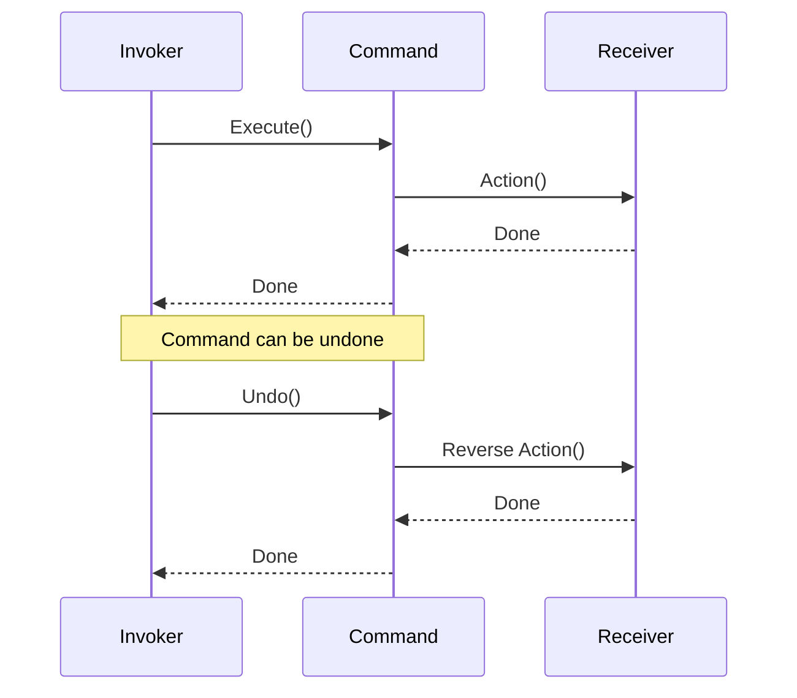

## 7.4.4 Benefits and Practical Applications

The Command pattern is a behavioral design pattern that turns a request into a stand-alone object that contains all information about the request. This transformation is beneficial for various reasons, including decoupling the sender of a request from its receiver, enabling command logging, supporting undoable operations, and more. In this section, we will delve into the benefits of the Command pattern and explore its practical applications in modern software development.

### Benefits of the Command Pattern

The Command pattern offers several advantages that make it a valuable tool in software design:

#### Decoupling Invoker and Receiver

One of the primary benefits of the Command pattern is the decoupling it provides between the invoker and the receiver. The invoker is the component that triggers the command, while the receiver is the one that performs the action. By encapsulating the request as an object, the invoker does not need to know the specifics of the receiver's implementation. This separation of concerns leads to more modular and maintainable code.

##### Example

Consider a simple remote control application where buttons are mapped to different actions like turning on the light or the TV. Without the Command pattern, the remote control (invoker) would need to know how to interact directly with each device (receiver). With the Command pattern, each button press can be encapsulated in a command object, allowing the remote control to operate without knowledge of the specific devices.

```python
class Light:
    def turn_on(self):
        print("The light is on")

class LightOnCommand:
    def __init__(self, light):
        self.light = light

    def execute(self):
        self.light.turn_on()

class RemoteControl:
    def __init__(self):
        self.command = None

    def set_command(self, command):
        self.command = command

    def press_button(self):
        if self.command:
            self.command.execute()

light = Light()
light_on_command = LightOnCommand(light)
remote = RemoteControl()
remote.set_command(light_on_command)
remote.press_button()
```

In this example, the `RemoteControl` class is decoupled from the `Light` class, only interacting with the `LightOnCommand`.

#### Extensibility

The Command pattern enhances extensibility by allowing new commands to be added without altering existing code. This aligns with the Open/Closed Principle, which states that software entities should be open for extension but closed for modification.

##### Example

If you need to add a new feature to the remote control, such as turning off the light, you can simply create a new command class without modifying the existing classes.

```python
class LightOffCommand:
    def __init__(self, light):
        self.light = light

    def execute(self):
        self.light.turn_off()

```

By adding the `LightOffCommand`, the system is extended without altering existing functionality.

#### Supports Undoable Operations

Another significant advantage of the Command pattern is its support for undoable operations. By storing command history and implementing an `undo` method, operations can be reversed, providing a powerful mechanism for applications requiring undo functionality, such as text editors or drawing applications.

##### Example

Consider a text editor where each edit action can be undone. Each action is encapsulated in a command object that can be executed and undone.

```python
class TextEditor:
    def __init__(self):
        self.text = ""

    def write(self, text):
        self.text += text

    def erase(self, length):
        self.text = self.text[:-length]

class WriteCommand:
    def __init__(self, editor, text):
        self.editor = editor
        self.text = text

    def execute(self):
        self.editor.write(self.text)

    def undo(self):
        self.editor.erase(len(self.text))

editor = TextEditor()
write_command = WriteCommand(editor, "Hello, World!")
write_command.execute()
print(editor.text)  # Output: Hello, World!
write_command.undo()
print(editor.text)  # Output: 
```

In this example, the `WriteCommand` class supports both execution and undo, allowing the text editor to revert changes.

#### Flexible Command Management

The Command pattern provides flexibility in command management, allowing commands to be queued, logged, or scheduled. This flexibility is particularly useful in scenarios where operations need to be controlled or deferred.

##### Example

In a task scheduling system, commands can be queued for execution at specific times, enabling asynchronous processing and efficient resource utilization.

```python
import time
from queue import Queue

class TaskScheduler:
    def __init__(self):
        self.queue = Queue()

    def add_task(self, command):
        self.queue.put(command)

    def run(self):
        while not self.queue.empty():
            command = self.queue.get()
            command.execute()

scheduler = TaskScheduler()
scheduler.add_task(write_command)
scheduler.run()
```

The `TaskScheduler` class manages a queue of commands, executing them in sequence.

#### Macro Commands

Macro commands are a powerful feature of the Command pattern, allowing multiple commands to be composed into a single command. This composition enables complex actions to be executed through the execution of multiple commands, providing a high level of abstraction.

##### Example

Consider a scenario where a macro command is used to set up a workspace by opening several applications and documents.

```python
class MacroCommand:
    def __init__(self):
        self.commands = []

    def add(self, command):
        self.commands.append(command)

    def execute(self):
        for command in self.commands:
            command.execute()

macro = MacroCommand()
macro.add(write_command)
macro.execute()
```

The `MacroCommand` class aggregates multiple commands, executing them in sequence.

### Practical Applications of the Command Pattern

The Command pattern is widely used in various domains due to its flexibility and power. Here are some practical applications:

#### GUI Button Actions

In graphical user interfaces, the Command pattern is commonly used to assign actions to buttons or menu items. This approach decouples the UI components from the logic that performs the actions, allowing for more flexible and maintainable code.

##### Example

In a GUI application, each button can be associated with a command object that encapsulates the action to be performed.

```javascript
class Button {
    constructor(command) {
        this.command = command;
    }

    click() {
        this.command.execute();
    }
}

class PrintCommand {
    execute() {
        console.log("Print command executed");
    }
}

// Client code
const printCommand = new PrintCommand();
const printButton = new Button(printCommand);
printButton.click();
```

In this JavaScript example, the `Button` class is decoupled from the specific action it triggers, relying on the `PrintCommand` to perform the task.

#### Task Scheduling

The Command pattern is ideal for task scheduling systems where commands need to be queued and executed at specific times. This application is common in job scheduling systems and batch processing.

##### Example

In a job scheduling system, each job can be encapsulated as a command, allowing for flexible scheduling and execution.

```python
from datetime import datetime, timedelta

class ScheduledCommand:
    def __init__(self, command, execute_time):
        self.command = command
        self.execute_time = execute_time

    def execute(self):
        if datetime.now() >= self.execute_time:
            self.command.execute()

execute_time = datetime.now() + timedelta(seconds=10)
scheduled_command = ScheduledCommand(write_command, execute_time)
```

The `ScheduledCommand` class wraps a command with an execution time, allowing the scheduler to execute it when the time is right.

#### Transaction Management

In databases or financial systems, commands can represent transactions that can be committed or rolled back. This application is crucial for maintaining data integrity and consistency.

##### Example

In a banking application, each transaction can be encapsulated as a command that supports execution and rollback.

```python
class TransactionCommand:
    def __init__(self, account, amount):
        self.account = account
        self.amount = amount

    def execute(self):
        self.account.deposit(self.amount)

    def undo(self):
        self.account.withdraw(self.amount)

transaction = TransactionCommand(account, 100)
transaction.execute()
transaction.undo()
```

The `TransactionCommand` class provides methods for executing and undoing transactions, ensuring flexibility in transaction management.

#### Networking Requests

The Command pattern can be used to encapsulate network calls as commands, enabling features like retries or offline queuing. This approach is beneficial in applications that require robust network communication.

##### Example

In a network application, each request can be encapsulated as a command, allowing for retries in case of failure.

```javascript
class NetworkRequestCommand {
    constructor(url) {
        this.url = url;
    }

    execute() {
        fetch(this.url)
            .then(response => response.json())
            .then(data => console.log(data))
            .catch(error => console.error('Error:', error));
    }
}

// Client code
const requestCommand = new NetworkRequestCommand('https://api.example.com/data');
requestCommand.execute();
```

In this example, the `NetworkRequestCommand` class encapsulates a network request, providing a mechanism for execution and error handling.

#### Game Development

In game development, the Command pattern is used to implement actions and moves that can be undone or replayed. This application is essential for features like undoing moves or recording gameplay.

##### Example

In a game, each player action can be encapsulated as a command that can be executed and undone.

```python
class MoveCommand:
    def __init__(self, player, direction):
        self.player = player
        self.direction = direction

    def execute(self):
        self.player.move(self.direction)

    def undo(self):
        self.player.move(-self.direction)

move_command = MoveCommand(player, 'north')
move_command.execute()
move_command.undo()
```

The `MoveCommand` class provides methods for executing and undoing player moves, enhancing gameplay flexibility.

### Considerations for Using the Command Pattern

While the Command pattern offers numerous benefits, there are considerations to keep in mind:

#### Increased Complexity

Implementing the Command pattern may introduce additional classes and objects, increasing the complexity of the system. It's important to evaluate whether the added flexibility justifies the complexity in your specific use case.

#### Memory Overhead

Storing command history for undo functionality can consume more memory. This overhead should be considered, especially in memory-constrained environments.

#### Command Granularity

Determining the appropriate level of granularity for commands is crucial. Too fine-grained commands can lead to performance issues, while too coarse-grained commands may reduce flexibility. Striking a balance is key.

### Best Practices for Implementing the Command Pattern

To maximize the benefits of the Command pattern, consider the following best practices:

#### Implement Undo/Redo Thoughtfully

Ensure that commands store the necessary state to reverse actions. This consideration is crucial for applications requiring undo/redo functionality.

#### Use Command Queues

For asynchronous or delayed execution, consider placing commands in queues. This approach provides control over when and how commands are executed.

#### Logging Commands

Logging executed commands can aid in debugging and auditing, providing a record of actions performed by the system.

#### Avoid Overusing

While the Command pattern is powerful, it should be applied where it provides clear benefits. Overuse can lead to unnecessary complexity without significant advantages.

### Examples in Industry

The Command pattern is used in various industries to solve real-world problems:

#### Text Editors

Text editors often use the Command pattern to implement undo/redo functionality, allowing users to revert changes easily.

#### Macro Recording

Applications that support macro recording, such as spreadsheet software, use the Command pattern to record user actions as commands that can be replayed later.

#### Remote APIs

In applications interacting with remote APIs, the Command pattern is used to encapsulate API calls, enabling features like retry mechanisms and offline queuing.

### Visuals and Diagrams

Below is a diagram illustrating the flow of command execution and undo:



This diagram shows the interaction between the invoker, command, and receiver, highlighting the execution and undo processes.

### Key Points to Emphasize

- The Command pattern is powerful for scenarios requiring decoupled request handling and flexible command management.
- It aligns with design principles like the Open/Closed Principle and encourages modular design.
- Proper implementation leads to systems that are easier to extend, maintain, and test.

By understanding the benefits and practical applications of the Command pattern, you can leverage its power to create flexible and maintainable software solutions.

## Quiz Time!



### What is a primary benefit of the Command pattern?

- [x] Decoupling the invoker from the receiver
- [ ] Reducing the number of classes
- [ ] Simplifying the codebase
- [ ] Increasing execution speed

> **Explanation:** The Command pattern decouples the invoker from the receiver, allowing for more modular and maintainable code.

### How does the Command pattern support undoable operations?

- [x] By storing command history and implementing an undo method
- [ ] By using fewer classes
- [ ] By simplifying method signatures
- [ ] By reducing memory usage

> **Explanation:** The Command pattern supports undoable operations by storing command history and implementing an undo method, allowing actions to be reversed.

### What is a macro command?

- [x] A command composed of multiple commands
- [ ] A command that executes faster
- [ ] A command that requires fewer resources
- [ ] A command that cannot be undone

> **Explanation:** A macro command is composed of multiple commands, allowing complex actions to be executed through the execution of multiple commands.

### In which application is the Command pattern commonly used?

- [x] GUI button actions
- [ ] File compression
- [ ] Data encryption
- [ ] Network routing

> **Explanation:** The Command pattern is commonly used in GUI applications to assign actions to buttons or menu items.

### What is a consideration when using the Command pattern?

- [x] Increased complexity
- [ ] Reduced functionality
- [x] Memory overhead
- [ ] Faster execution

> **Explanation:** The Command pattern may introduce increased complexity and memory overhead, which should be considered in its implementation.

### How can commands be managed flexibly?

- [x] By queuing, logging, or scheduling them
- [ ] By reducing their number
- [ ] By simplifying their logic
- [ ] By using fewer classes

> **Explanation:** Commands can be managed flexibly by queuing, logging, or scheduling them, providing control over when and how operations are executed.

### What is a best practice for implementing undo/redo functionality?

- [x] Ensure commands store necessary state to reverse actions
- [ ] Use fewer command classes
- [x] Use command queues for execution
- [ ] Simplify command logic

> **Explanation:** To implement undo/redo functionality, ensure that commands store the necessary state to reverse actions and consider using command queues for execution.

### Which industry example involves using the Command pattern?

- [x] Text editors for undo/redo functionality
- [ ] Image processing for filters
- [ ] Data compression for files
- [ ] Network security for firewalls

> **Explanation:** Text editors often use the Command pattern to implement undo/redo functionality, allowing users to revert changes easily.

### What is a key point of the Command pattern?

- [x] It aligns with the Open/Closed Principle
- [ ] It reduces the number of classes
- [ ] It simplifies code logic
- [ ] It increases execution speed

> **Explanation:** The Command pattern aligns with the Open/Closed Principle, encouraging modular design and allowing for easy extension.

### The Command pattern is particularly useful for decoupling request handling and flexible command management.

- [x] True
- [ ] False

> **Explanation:** The Command pattern is indeed useful for decoupling request handling and providing flexible command management, making it a powerful tool in software design.



By understanding the benefits and practical applications of the Command pattern, you can leverage its power to create flexible and maintainable software solutions.
