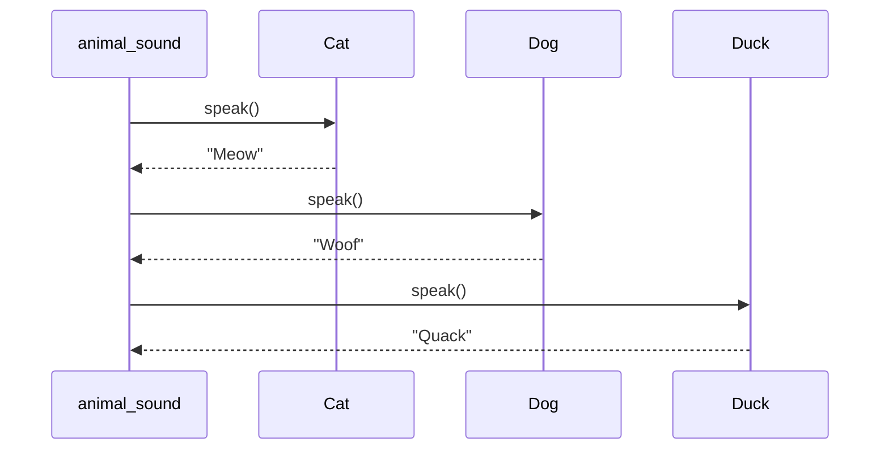

## 8.1.1 Dynamic Typing and Duck Typing

In the realm of software development, Python stands out for its simplicity and flexibility, largely due to its dynamic typing and duck typing capabilities. These features play a crucial role in how design patterns are implemented and utilized in Python, offering both opportunities and challenges. This section delves into the essence of dynamic typing and duck typing, illustrating their impact on design patterns and demonstrating their use through practical examples.

### Understanding Dynamic Typing

#### Definition and Explanation

Dynamic typing is a programming language feature where the type of a variable is determined at runtime rather than at compile time. This means that in Python, variables are not bound to a specific data type, allowing them to hold objects of any type. The type can change during execution, providing a high degree of flexibility.

```python
variable = 10        # variable is an integer
print(type(variable))  # Output: <class 'int'>

variable = "Hello"   # variable is now a string
print(type(variable))  # Output: <class 'str'>
```

In the example above, `variable` initially holds an integer and later a string, showcasing Python's dynamic typing.

#### Implications for Design Patterns

Dynamic typing significantly influences how design patterns are implemented in Python:

- **Flexibility and Generic Code**: With dynamic typing, functions and classes can be written to operate on any type of data, making the code more generic and reusable. This reduces the need for complex class hierarchies and explicit type declarations, simplifying the design.

- **Simplified Class Hierarchies**: Since there is no need to declare types explicitly, class hierarchies can be streamlined. This allows developers to focus on the behavior and functionality of objects rather than their types.

- **Potential Pitfalls**: The flexibility of dynamic typing comes with the risk of runtime type errors. Without compile-time type checks, errors may only surface during execution, necessitating thorough testing and careful design to mitigate these risks.

#### Examples of Dynamic Typing in Action

Consider a function that can accept parameters of any type:

```python
def process_data(data):
    if isinstance(data, str):
        return data.upper()
    elif isinstance(data, (int, float)):
        return data * 2
    else:
        return "Unsupported type"

print(process_data("hello"))  # Output: HELLO
print(process_data(10))       # Output: 20
```

In this example, `process_data` handles strings and numbers differently, demonstrating how dynamic typing allows for flexible function definitions.

### Exploring Duck Typing

#### Definition and Philosophy

Duck typing is a concept that emphasizes an object's behavior over its explicit type. The philosophy is encapsulated in the phrase: "If it walks like a duck and quacks like a duck, it is a duck." In Python, this means that an object's suitability for a task is determined by the presence of certain methods and properties rather than its type.

#### Impact on Design Patterns

Duck typing has profound implications for design patterns:

- **Strategy Pattern**: In patterns like Strategy, duck typing allows for the interchangeable use of objects that implement the required methods. The interface of the strategy is not enforced but assumed, enabling more flexible and adaptable code.

- **Interchangeability**: As long as an object implements the necessary methods, it can be used in place of another, promoting polymorphism and reducing the dependency on specific types.

#### Examples of Duck Typing

Consider the following example demonstrating duck typing:

```python
class Cat:
    def speak(self):
        return "Meow"

class Dog:
    def speak(self):
        return "Woof"

class Duck:
    def speak(self):
        return "Quack"

def animal_sound(animal):
    print(animal.speak())

animals = [Cat(), Dog(), Duck()]
for animal in animals:
    animal_sound(animal)
```

In this example, `animal_sound` accepts any object with a `speak` method, illustrating how different classes can be used interchangeably.

#### Visualizing Duck Typing with a Sequence Diagram

To further understand the interaction between the `animal_sound` function and various animal objects, consider the following sequence diagram:



This diagram illustrates the flow of calls and responses between the `animal_sound` function and the `Cat`, `Dog`, and `Duck` objects, highlighting the flexibility provided by duck typing.

### Leveraging Dynamic and Duck Typing in Design Patterns

#### Embracing Flexibility

Python's dynamic typing and duck typing provide developers with the tools to write more flexible and reusable code. By leveraging these features, you can create designs that are adaptable to change and capable of handling a wide variety of inputs.

#### Ensuring Robustness

While dynamic typing and duck typing offer significant advantages, they also require careful design to avoid runtime errors. Here are some best practices to consider:

- **Comprehensive Testing**: Implement thorough testing to catch type-related issues early. Unit tests can help ensure that functions behave correctly with different types of inputs.

- **Clear Documentation**: Document the expected behavior of functions and methods, including the types of inputs they can handle. This helps maintain code clarity and aids future developers in understanding the codebase.

- **Use of Type Hints**: Although Python is dynamically typed, using type hints can improve code readability and provide hints to developers about the expected types, reducing potential errors.

### Conclusion

Dynamic typing and duck typing are powerful features of Python that significantly influence the implementation of design patterns. By understanding and leveraging these features, developers can write more flexible, efficient, and reusable code. However, it is crucial to balance this flexibility with careful design and testing to ensure robust and error-free applications.

## Quiz Time!



### What is dynamic typing?

- [x] A feature where the type of a variable is determined at runtime.
- [ ] A feature where the type of a variable is determined at compile time.
- [ ] A feature where variables are bound to a specific data type.
- [ ] A feature that requires explicit type declarations.

> **Explanation:** Dynamic typing means that the type of a variable is determined at runtime, allowing variables to hold objects of any type.

### How does dynamic typing affect design patterns?

- [x] It allows for more generic and flexible code.
- [ ] It requires explicit type declarations.
- [ ] It enforces strict type checks at compile time.
- [x] It simplifies class hierarchies.

> **Explanation:** Dynamic typing allows for more generic code and simplifies class hierarchies by removing the need for explicit type declarations.

### What is duck typing?

- [x] A concept where an object's suitability is determined by its methods and properties.
- [ ] A concept where an object's type is explicitly declared.
- [ ] A concept where objects must belong to a specific class.
- [ ] A concept that enforces type checks at compile time.

> **Explanation:** Duck typing determines an object's suitability based on its methods and properties rather than its type.

### How does duck typing impact the Strategy pattern?

- [x] It allows objects to be used interchangeably if they implement required methods.
- [ ] It requires objects to belong to a specific class.
- [ ] It enforces strict type checks.
- [ ] It limits the flexibility of the pattern.

> **Explanation:** Duck typing allows objects to be used interchangeably in the Strategy pattern as long as they implement the required methods.

### In the provided code example, which method is required for duck typing?

- [x] `speak`
- [ ] `walk`
- [ ] `run`
- [ ] `fly`

> **Explanation:** The `speak` method is required for duck typing in the example, as it is the method called by `animal_sound`.

### What is a potential pitfall of dynamic typing?

- [x] Runtime type errors.
- [ ] Compile-time type errors.
- [ ] Inflexible code.
- [ ] Increased complexity of class hierarchies.

> **Explanation:** Dynamic typing can lead to runtime type errors if not managed carefully, as type checks are not performed at compile time.

### How can developers mitigate the risks associated with dynamic typing?

- [x] Implement thorough testing.
- [ ] Avoid using dynamic typing.
- [x] Use type hints.
- [ ] Rely solely on documentation.

> **Explanation:** Thorough testing and the use of type hints can help mitigate the risks associated with dynamic typing.

### What is the main advantage of duck typing?

- [x] Flexibility in using objects interchangeably.
- [ ] Enforcing strict type checks.
- [ ] Requiring explicit type declarations.
- [ ] Limiting the use of polymorphism.

> **Explanation:** Duck typing offers flexibility by allowing objects to be used interchangeably based on their methods and properties.

### Which of the following best describes the philosophy of duck typing?

- [x] "If it walks like a duck and quacks like a duck, it is a duck."
- [ ] "Objects must belong to a specific class."
- [ ] "Type checks are enforced at compile time."
- [ ] "Variables are bound to a specific data type."

> **Explanation:** The philosophy of duck typing is encapsulated in the phrase: "If it walks like a duck and quacks like a duck, it is a duck."

### True or False: Dynamic typing requires explicit type declarations.

- [ ] True
- [x] False

> **Explanation:** Dynamic typing does not require explicit type declarations, as the type of a variable is determined at runtime.


