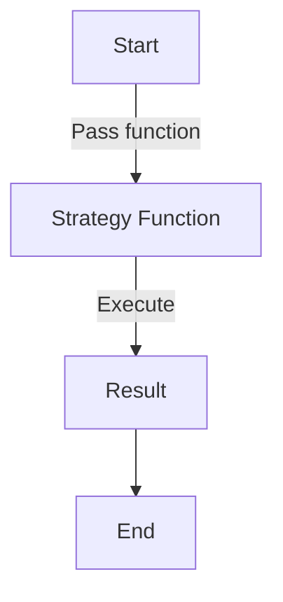

## 8.1.2 First-Class Functions and Closures

In the realm of software design, Python stands out with its expressive syntax and powerful features that facilitate the implementation of design patterns. Two such features are **first-class functions** and **closures**. These concepts not only simplify code but also provide a more flexible approach to encapsulating behavior and state. This section will delve into these features, illustrating their utility in design patterns, and providing practical examples to solidify understanding.

### Understanding First-Class Functions

#### Definition

In Python, functions are treated as first-class citizens. This means that functions can be:

- **Assigned to variables**
- **Passed as arguments to other functions**
- **Returned from other functions**

This flexibility allows developers to use functions in a way similar to objects, making them incredibly versatile in the context of design patterns.

#### Applications in Design Patterns

First-class functions can significantly simplify the implementation of certain design patterns. For instance, in the **Strategy Pattern**, functions can replace entire classes, encapsulating behavior without the overhead of class definitions. Similarly, in the **Command Pattern**, functions can encapsulate actions to be performed, reducing boilerplate code.

##### Example: Strategy Pattern

Consider the traditional class-based implementation of the Strategy Pattern:

```python
class AdditionStrategy:
    def execute(self, a, b):
        return a + b

class SubtractionStrategy:
    def execute(self, a, b):
        return a - b

class Calculator:
    def __init__(self, strategy):
        self.strategy = strategy

    def calculate(self, a, b):
        return self.strategy.execute(a, b)

calculator = Calculator(AdditionStrategy())
print(calculator.calculate(5, 3))  # Output: 8
```

Now, let's simplify this using first-class functions:

```python
def addition(a, b):
    return a + b

def subtraction(a, b):
    return a - b

class Calculator:
    def __init__(self, strategy):
        self.strategy = strategy

    def calculate(self, a, b):
        return self.strategy(a, b)

calculator = Calculator(addition)
print(calculator.calculate(5, 3))  # Output: 8
```

By using functions, we eliminate the need for separate strategy classes, making the code more concise and easier to maintain.

#### Practical Examples

First-class functions shine in scenarios where behavior needs to be passed around or modified dynamically. Let's explore some practical examples:

**Passing Functions as Parameters**

```python
def greet(name):
    return f"Hello, {name}!"

def welcome(func, name):
    print(func(name))

welcome(greet, "Alice")  # Output: Hello, Alice!
```

In this example, the `greet` function is passed as an argument to the `welcome` function, demonstrating the flexibility of first-class functions.

**Using Built-In Functions**

Python's built-in functions like `map()`, `filter()`, and `sorted()` leverage first-class functions to operate on collections.

```python
def square(x):
    return x * x

numbers = [1, 2, 3, 4]
squared_numbers = map(square, numbers)
print(list(squared_numbers))  # Output: [1, 4, 9, 16]

words = ["banana", "apple", "cherry"]
sorted_words = sorted(words, key=len)
print(sorted_words)  # Output: ['apple', 'banana', 'cherry']
```

These examples illustrate how functions can be used as arguments to transform data, providing a powerful tool for functional programming in Python.

### Exploring Closures

#### Definition

A **closure** is a function that retains access to variables from its enclosing lexical scope, even after that scope has finished executing. Closures allow functions to capture and remember the environment in which they were created.

#### Relevance to Design Patterns

Closures are particularly useful in design patterns that require maintaining state or encapsulating behavior with state. They can be used to create function-based implementations of patterns like **Iterator** and **Observer**, providing a lightweight alternative to classes.

##### Example: Using Closures

Consider the following example, where a closure is used to create a multiplier function:

```python
def make_multiplier(factor):
    def multiplier(number):
        return number * factor
    return multiplier

times_two = make_multiplier(2)
times_three = make_multiplier(3)

print(times_two(5))    # Output: 10
print(times_three(5))  # Output: 15
```

In this example, the `multiplier` function retains access to the `factor` variable, even after `make_multiplier` has finished executing. This allows `times_two` and `times_three` to maintain their own state independently.

#### Benefits of Closures

Closures offer several advantages:

- **State Encapsulation:** Closures can encapsulate state without the need for a class.
- **Reduced Boilerplate:** By using closures, you can reduce the amount of boilerplate code required for maintaining state.
- **Enhanced Readability:** Code that uses closures can be more readable and concise, as it focuses on the logic rather than the structure.

### Visualizing First-Class Functions and Closures

To better understand how first-class functions and closures work, consider the following flowchart:



This diagram illustrates the process of passing a function as a strategy and executing it, highlighting the flow of data and control.

### Key Points to Emphasize

- **Simplicity and Flexibility:** First-class functions and closures simplify code by reducing the need for boilerplate and providing flexible ways to encapsulate behavior and state.
- **Design Pattern Implementation:** These features offer elegant solutions for implementing design patterns, particularly those that require dynamic behavior or state management.
- **Consideration of Functions:** When designing software, consider using functions as alternatives to classes where appropriate, leveraging Python's strengths to write more concise and maintainable code.

### Conclusion

First-class functions and closures are powerful tools in Python's arsenal, enabling developers to write more flexible and concise code. By understanding and utilizing these features, you can simplify the implementation of design patterns, enhance code readability, and reduce maintenance overhead. As you continue your journey in software design, consider how these concepts can be applied to solve complex problems with elegance and efficiency.

## Quiz Time!



### What does it mean for functions to be first-class citizens in Python?

- [x] Functions can be assigned to variables, passed as arguments, and returned from other functions.
- [ ] Functions can only be used as methods within classes.
- [ ] Functions must always return a value.
- [ ] Functions cannot be used as arguments to other functions.

> **Explanation:** First-class citizenship means functions can be treated like any other variable, allowing them to be passed around and used flexibly.

### How do first-class functions simplify the Strategy Pattern?

- [x] By allowing functions to replace entire classes for encapsulating behavior.
- [ ] By requiring additional classes to manage function execution.
- [ ] By enforcing strict type checking on function parameters.
- [ ] By eliminating the need for any function definitions.

> **Explanation:** First-class functions enable behavior encapsulation without the overhead of defining separate strategy classes.

### What is a closure in Python?

- [x] A function that retains access to variables from its enclosing scope.
- [ ] A function that cannot access variables outside its own scope.
- [ ] A method that is only available within a class.
- [ ] A data structure for storing functions.

> **Explanation:** Closures allow functions to capture and remember the environment in which they were created, retaining access to variables from their enclosing scope.

### How can closures be used in design patterns?

- [x] By maintaining state and encapsulating behavior with state.
- [ ] By eliminating the need for any state management.
- [ ] By providing a way to execute functions asynchronously.
- [ ] By enforcing strict inheritance hierarchies.

> **Explanation:** Closures can encapsulate state and behavior, making them useful for patterns like Iterator and Observer.

### Which of the following is a benefit of using closures?

- [x] State encapsulation without the need for a class.
- [ ] Increased code complexity.
- [ ] Requirement for additional boilerplate code.
- [ ] Reduced readability.

> **Explanation:** Closures encapsulate state in a lightweight manner, reducing the need for classes and boilerplate code.

### In the provided multiplier example, what does the `multiplier` function retain access to?

- [x] The `factor` variable from the enclosing `make_multiplier` function.
- [ ] Only the `number` parameter passed to it.
- [ ] The global scope variables.
- [ ] No variables from the enclosing scope.

> **Explanation:** The `multiplier` function is a closure that retains access to the `factor` variable from `make_multiplier`.

### What is a key advantage of using first-class functions in Python?

- [x] They allow for more concise and flexible code.
- [ ] They enforce strict typing on all parameters.
- [ ] They require less memory than traditional functions.
- [ ] They eliminate the need for any error handling.

> **Explanation:** First-class functions enhance code flexibility and conciseness by allowing functions to be used as variables.

### How does Python's `map()` function utilize first-class functions?

- [x] By applying a function to each item in an iterable.
- [ ] By sorting items in an iterable based on a function.
- [ ] By filtering items in an iterable that match a condition.
- [ ] By converting functions into classes.

> **Explanation:** `map()` applies a given function to each item in an iterable, demonstrating the use of functions as first-class citizens.

### What is the output of `times_two(5)` in the multiplier closure example?

- [x] 10
- [ ] 5
- [ ] 15
- [ ] 20

> **Explanation:** `times_two` is a closure that multiplies its input by 2, so `times_two(5)` outputs 10.

### True or False: Closures can only be created within classes.

- [ ] True
- [x] False

> **Explanation:** Closures can be created within any function, not just within classes, as they are a feature of the function's scope.


