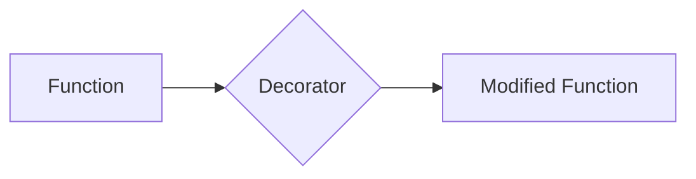

## 8.1.4 Metaclasses and Decorators

In the realm of Python programming, metaclasses and decorators are two powerful features that extend the language's flexibility and capability. These tools allow developers to modify and enhance the behavior of classes and functions in ways that are both elegant and efficient. In this section, we will delve into the intricacies of metaclasses and decorators, exploring how they can be leveraged to implement and refine design patterns.

### Understanding Metaclasses

#### What are Metaclasses?

Metaclasses can be thought of as the "classes of classes". Just as a class defines the behavior of its instances, a metaclass defines the behavior of classes themselves. This means that metaclasses can control the creation and configuration of classes, allowing for dynamic alterations and enhancements.

In Python, everything is an object, including classes. When a class is defined, Python uses a metaclass to create it. By default, the metaclass for all classes is `type`, but you can define your own metaclasses to customize class creation.

#### How Metaclasses Work

When you define a class in Python, the interpreter executes the class body and collects its attributes. The metaclass is then called to create the class object. You can customize this process by defining a metaclass and overriding its special methods, such as `__new__` or `__init__`.

Here's a simple example of a metaclass:

```python
class MyMeta(type):
    def __new__(cls, name, bases, dct):
        print(f"Creating class {name}")
        return super().__new__(cls, name, bases, dct)

class MyClass(metaclass=MyMeta):
    pass

```

In this example, `MyMeta` is a metaclass that prints a message every time a class is created with it. `MyClass` is created using `MyMeta`, so the message is displayed.

#### Using Metaclasses in Design Patterns

Metaclasses can be particularly useful in implementing certain design patterns, such as the Singleton pattern. The Singleton pattern ensures that a class has only one instance and provides a global point of access to it. By using a metaclass, you can enforce this behavior at the class creation level.

Here's how you can implement a Singleton pattern using a metaclass:

```python
class SingletonMeta(type):
    _instances = {}

    def __call__(cls, *args, **kwargs):
        if cls not in cls._instances:
            cls._instances[cls] = super().__call__(*args, **kwargs)
        return cls._instances[cls]

class SingletonClass(metaclass=SingletonMeta):
    def __init__(self):
        print("Creating instance")

singleton1 = SingletonClass()
singleton2 = SingletonClass()

# Only one instance is created, and both variables point to the same instance
assert singleton1 is singleton2
```

In this implementation, `SingletonMeta` overrides the `__call__` method to control the instantiation of the class. It checks if an instance already exists, and if not, it creates one and stores it in a dictionary. Subsequent calls return the existing instance.

### Exploring Decorators

#### What are Decorators?

Decorators are a powerful feature in Python that allow you to modify the behavior of functions or classes. They are essentially functions that wrap other functions or classes, providing a way to add functionality to existing code without modifying it directly.

Decorators are often used for logging, access control, memoization, and more. They provide a clean and readable way to apply these enhancements.

#### Function Decorators

Function decorators take a function as an argument and return a new function that usually extends the behavior of the original. Here's a simple example of a function decorator:

```python
def logger(func):
    def wrapper(*args, **kwargs):
        print(f"Calling {func.__name__} with arguments {args} and {kwargs}")
        result = func(*args, **kwargs)
        print(f"{func.__name__} returned {result}")
        return result
    return wrapper

@logger
def add(a, b):
    return a + b

add(3, 4)

# Calling add with arguments (3, 4) and {}
```

In this example, the `logger` decorator adds logging functionality to the `add` function, displaying information about the function call and its result.

#### Class Decorators

Class decorators work similarly to function decorators, but they modify classes instead. They can be used to add methods, modify attributes, or enforce certain behaviors on classes.

Here's an example of a class decorator:

```python
def add_method(cls):
    def new_method(self):
        print("New method added!")
    cls.new_method = new_method
    return cls

@add_method
class MyClass:
    pass

instance = MyClass()
instance.new_method()

```

In this example, the `add_method` decorator adds a new method to `MyClass`, demonstrating how decorators can enhance class functionality.

#### Decorators in Design Patterns

Decorators play a crucial role in the Decorator pattern, which is used to add responsibilities to objects dynamically. The Decorator pattern is a structural pattern that allows you to wrap objects with additional behavior.

Here's a simple implementation of the Decorator pattern using Python decorators:

```python
class Coffee:
    def cost(self):
        return 5

def milk_decorator(coffee):
    def wrapper():
        return coffee.cost() + 1
    return wrapper

def sugar_decorator(coffee):
    def wrapper():
        return coffee.cost() + 0.5
    return wrapper

coffee = Coffee()
coffee_with_milk = milk_decorator(coffee)
coffee_with_milk_and_sugar = sugar_decorator(coffee_with_milk)

print(coffee_with_milk_and_sugar())  # Output: 6.5
```

In this example, decorators are used to add milk and sugar to a basic coffee object, increasing its cost dynamically.

#### Visualizing Decorator Flow

To better understand how decorators wrap functions, consider the following Mermaid.js diagram:



This diagram illustrates the flow of a function being wrapped by a decorator, resulting in a modified function with additional behavior.

### Key Points to Emphasize

- **Metaclasses** are advanced features that control class creation. They should be used judiciously, as they can make code harder to understand and maintain.
- **Decorators** provide a powerful mechanism for modifying behavior without changing the original code. They are versatile and can be applied to both functions and classes.
- Understanding these features can significantly enhance the implementation of design patterns, offering elegant solutions to complex problems.

### Best Practices and Common Pitfalls

#### Best Practices

- **Use Metaclasses Sparingly:** Metaclasses are powerful but can complicate code. Use them only when necessary, such as when implementing design patterns like Singleton.
- **Leverage Decorators for Reusability:** Decorators can encapsulate cross-cutting concerns like logging and access control, promoting code reuse and separation of concerns.
- **Keep Decorators Simple:** Aim for decorators that are easy to understand and maintain. Complex logic in decorators can lead to difficult-to-debug code.

#### Common Pitfalls

- **Overusing Metaclasses:** Avoid using metaclasses for simple problems that can be solved with other patterns or techniques.
- **Misunderstanding Decorator Order:** When stacking multiple decorators, the order matters. Be mindful of how decorators are applied to ensure the desired behavior.
- **Ignoring Side Effects:** Decorators can introduce side effects, such as modifying global state. Ensure that decorators are designed to minimize unintended consequences.

### Conclusion

Metaclasses and decorators are advanced Python features that offer powerful ways to enhance and implement design patterns. By understanding and applying these tools judiciously, you can create more flexible, maintainable, and efficient software designs. As you continue to explore Python's capabilities, consider how metaclasses and decorators can be leveraged to solve complex design challenges in your projects.

## Quiz Time!



### What is a metaclass in Python?

- [x] A class of a class that defines how a class behaves.
- [ ] A function that modifies the behavior of another function.
- [ ] A module that contains multiple classes.
- [ ] A type of decorator used for classes.

> **Explanation:** A metaclass is a class of a class that defines how a class behaves. It's used to create classes in Python.

### How can metaclasses be used in design patterns?

- [x] To enforce Singleton behavior by controlling class instantiation.
- [ ] To add logging functionality to functions.
- [ ] To cache the results of function calls.
- [ ] To create decorators dynamically.

> **Explanation:** Metaclasses can be used to enforce Singleton behavior by controlling how instances of a class are created, ensuring only one instance exists.

### What is a decorator in Python?

- [x] A function that takes another function and extends its behavior without modifying it.
- [ ] A class that controls the instantiation of other classes.
- [ ] A module that contains utility functions.
- [ ] A type of loop used for iterating over sequences.

> **Explanation:** A decorator is a function that takes another function and extends its behavior without modifying the original function.

### Which of the following is a valid use of a function decorator?

- [x] Adding logging to a function.
- [ ] Creating a new class.
- [ ] Modifying the attributes of a class.
- [ ] Instantiating an object.

> **Explanation:** Function decorators are often used to add logging, timing, or access control to functions.

### What is the primary purpose of the Decorator pattern?

- [x] To add responsibilities to objects dynamically.
- [ ] To enforce Singleton behavior.
- [ ] To create abstract classes.
- [ ] To manage object creation.

> **Explanation:** The Decorator pattern is used to add responsibilities to objects dynamically, allowing for flexible and extensible designs.

### How do you apply a decorator to a function in Python?

- [x] By using the `@decorator_name` syntax above the function definition.
- [ ] By passing the function as an argument to the decorator.
- [ ] By importing the decorator module.
- [ ] By defining the decorator inside the function.

> **Explanation:** In Python, you apply a decorator to a function using the `@decorator_name` syntax directly above the function definition.

### What is a common pitfall when using decorators?

- [x] Misunderstanding the order of stacked decorators.
- [ ] Using decorators to create classes.
- [ ] Applying decorators to non-callable objects.
- [ ] Using decorators in loops.

> **Explanation:** The order of stacked decorators is important because it affects the final behavior of the decorated function.

### Which method is commonly overridden in a metaclass to customize class creation?

- [x] `__new__`
- [ ] `__init__`
- [ ] `__call__`
- [ ] `__del__`

> **Explanation:** The `__new__` method is commonly overridden in a metaclass to customize how classes are created.

### What is the role of the `wrapper` function in a decorator?

- [x] To encapsulate additional behavior and call the original function.
- [ ] To define a new class.
- [ ] To modify the attributes of a class.
- [ ] To import necessary modules.

> **Explanation:** The `wrapper` function in a decorator encapsulates additional behavior and calls the original function, extending its functionality.

### True or False: Metaclasses are suitable for every design pattern.

- [ ] True
- [x] False

> **Explanation:** False. Metaclasses are powerful but should be used judiciously, as they are not suitable for every design pattern and can complicate code.


