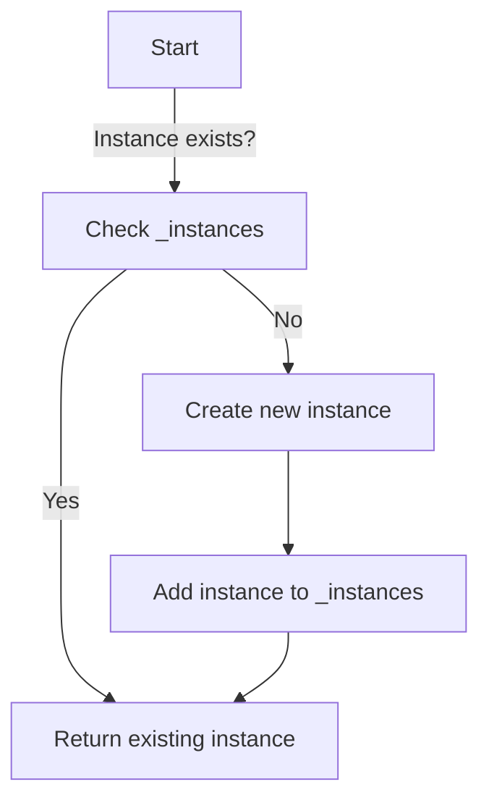

## 8.2.1 Implementing Singleton Pattern in Python

Design patterns are fundamental to crafting robust and scalable software architectures. Among these, the Singleton pattern stands out for its simplicity and utility. This chapter delves into the Singleton pattern, exploring its purpose, implementation techniques in Python, and considerations for thread safety and testing. By the end of this section, you will have a comprehensive understanding of how to implement and utilize the Singleton pattern effectively in your Python projects.

### Understanding the Singleton Pattern

The Singleton pattern is a creational design pattern that ensures a class has only one instance and provides a global point of access to that instance. This is particularly useful in scenarios where a single shared resource, such as a configuration manager or logging service, is needed across different parts of an application.

#### Key Characteristics of Singleton Pattern

- **Unique Instance:** Ensures only one instance of a class exists.
- **Global Access Point:** Provides a way to access the instance from anywhere in the application.
- **Controlled Access:** Manages the instantiation process to prevent multiple instances.

### Implementation Methods in Python

Python offers several ways to implement the Singleton pattern, each with its own advantages and use cases. Let's explore these methods in detail.

#### 1. Using a Metaclass

Metaclasses in Python provide a powerful mechanism to control class creation. By defining a custom metaclass, you can enforce Singleton behavior across any class that uses it.

```python
class SingletonMeta(type):
    _instances = {}

    def __call__(cls, *args, **kwargs):
        if cls not in cls._instances:
            cls._instances[cls] = super().__call__(*args, **kwargs)
        return cls._instances[cls]

class Logger(metaclass=SingletonMeta):
    def __init__(self):
        self.log_file = "app.log"

    def log(self, message):
        with open(self.log_file, 'a') as file:
            file.write(f"{message}\n")
```

**Explanation:**

- **SingletonMeta:** This metaclass maintains a dictionary `_instances` to track existing instances.
- **__call__ Method:** Overrides the default behavior to check if an instance already exists. If not, it creates one and stores it in `_instances`.
- **Logger Class:** Uses `SingletonMeta` as its metaclass, ensuring only one `Logger` instance exists.

#### 2. Using a Decorator

Decorators in Python offer a flexible way to modify or enhance functions and classes. A singleton decorator can wrap a class to ensure only one instance is created.

```python
def singleton(cls):
    instances = {}

    def get_instance(*args, **kwargs):
        if cls not in instances:
            instances[cls] = cls(*args, **kwargs)
        return instances[cls]
    return get_instance

@singleton
class ConfigurationManager:
    def __init__(self):
        self.settings = {}

    def set(self, key, value):
        self.settings[key] = value

    def get(self, key):
        return self.settings.get(key)
```

**Explanation:**

- **singleton Decorator:** Maintains an `instances` dictionary to store class instances.
- **get_instance Function:** Checks if an instance exists; if not, it creates and stores one.
- **ConfigurationManager Class:** Decorated with `@singleton`, ensuring a single instance across the application.

#### 3. Using Modules

Python modules are inherently singletons. When a module is imported, it is initialized once and subsequent imports return the same object.

```python
class ConfigurationManager:
    def __init__(self):
        self.settings = {}

    def set(self, key, value):
        self.settings[key] = value

    def get(self, key):
        return self.settings.get(key)

config_manager = ConfigurationManager()
```

**Usage:**

```python
from config import config_manager

config_manager.set('theme', 'dark')
print(config_manager.get('theme'))  # Output: dark
```

**Explanation:**

- **Module Singleton:** The `ConfigurationManager` instance `config_manager` is created once and can be imported and used across different modules.

### Thread Safety Considerations

In multi-threaded applications, ensuring thread safety in Singleton implementations is crucial. Without proper synchronization, multiple threads might create separate instances, violating the Singleton pattern.

#### Implementing Thread-Safe Singleton

Using Python's `threading` module, you can employ locks to ensure that only one thread can create an instance at a time.

```python
import threading

class ThreadSafeSingletonMeta(type):
    _instances = {}
    _lock: threading.Lock = threading.Lock()

    def __call__(cls, *args, **kwargs):
        with cls._lock:
            if cls not in cls._instances:
                cls._instances[cls] = super().__call__(*args, **kwargs)
        return cls._instances[cls]

class DatabaseConnection(metaclass=ThreadSafeSingletonMeta):
    def __init__(self):
        self.connection = "Database Connection Established"
```

**Explanation:**

- **_lock Attribute:** A class-level lock ensures that only one thread can execute the instance creation code at a time.
- **ThreadSafeSingletonMeta:** Uses the lock in the `__call__` method to prevent race conditions during instance creation.

### Pros and Cons of Singleton Pattern

While the Singleton pattern is useful, it comes with its own set of advantages and drawbacks.

#### Pros

- **Controlled Access:** Provides a controlled access point to a shared resource.
- **Memory Efficiency:** Reduces memory footprint by limiting the number of instances.
- **Consistency:** Ensures consistent access to resources across the application.

#### Cons

- **Global State:** Introduces global state, which can lead to tight coupling and difficulties in testing.
- **Single Responsibility Principle Violation:** A class might take on additional responsibilities beyond its primary function.
- **Concurrency Issues:** Requires careful handling to ensure thread safety.

### Visual Representation of Singleton Instance Creation

To better understand the flow of instance creation in the Singleton pattern, refer to the following flowchart:



### Key Points to Remember

- **Multiple Approaches:** Choose the implementation method based on the context of your application.
- **Testing Implications:** Singleton patterns can complicate testing due to their global nature.
- **Thread Safety:** Consider thread safety if the Singleton is accessed from multiple threads.

### Conclusion

The Singleton pattern is a powerful tool in a developer's arsenal, providing a structured way to manage shared resources. By understanding and implementing the various techniques discussed, you can leverage the Singleton pattern effectively in your Python projects. Remember to consider the implications on testing and thread safety to ensure a robust and maintainable codebase.

## Quiz Time!



### What is the primary purpose of the Singleton pattern?

- [x] To ensure a class has only one instance
- [ ] To allow multiple instances of a class
- [ ] To enhance the performance of a class
- [ ] To simplify the class structure

> **Explanation:** The Singleton pattern ensures that a class has only one instance and provides a global point of access to it.

### Which method uses a metaclass to implement Singleton behavior in Python?

- [x] SingletonMeta
- [ ] singleton decorator
- [ ] Module-based Singleton
- [ ] Threading-based Singleton

> **Explanation:** The `SingletonMeta` metaclass controls instance creation, ensuring only one instance of a class exists.

### How does the singleton decorator ensure a class has only one instance?

- [x] By maintaining an instances dictionary
- [ ] By using a global variable
- [ ] By overriding the __init__ method
- [ ] By using a metaclass

> **Explanation:** The singleton decorator maintains an `instances` dictionary to track and return the single instance of a class.

### What inherent property of Python modules makes them suitable for Singleton implementation?

- [x] Modules are initialized once and subsequent imports return the same object
- [ ] Modules are thread-safe by default
- [ ] Modules can be easily modified
- [ ] Modules support multiple instances

> **Explanation:** Python modules are initialized once, making them inherently suitable for Singleton implementation as they return the same object on subsequent imports.

### Why is thread safety important in Singleton implementations?

- [x] To prevent multiple threads from creating separate instances
- [ ] To ensure faster execution
- [ ] To allow multiple instances in different threads
- [ ] To simplify the code structure

> **Explanation:** Thread safety is crucial to prevent race conditions where multiple threads might create separate instances, violating the Singleton pattern.

### Which Python module is commonly used to ensure thread safety in Singleton implementations?

- [x] threading
- [ ] asyncio
- [ ] multiprocessing
- [ ] concurrent.futures

> **Explanation:** The `threading` module provides locks that can be used to ensure thread safety in Singleton implementations.

### What is a potential downside of using the Singleton pattern?

- [x] It introduces global state, which can lead to tight coupling
- [ ] It simplifies testing
- [ ] It allows multiple instances of a class
- [ ] It increases memory usage

> **Explanation:** The Singleton pattern introduces global state, which can lead to tight coupling and difficulties in testing.

### Which implementation method uses a class-level lock to ensure thread safety?

- [x] ThreadSafeSingletonMeta
- [ ] singleton decorator
- [ ] Module-based Singleton
- [ ] SingletonMeta

> **Explanation:** The `ThreadSafeSingletonMeta` uses a class-level lock to ensure that only one thread can create an instance at a time, ensuring thread safety.

### What is a benefit of the Singleton pattern?

- [x] It provides a controlled access point to a shared resource
- [ ] It allows for multiple instances of a class
- [ ] It increases the complexity of the code
- [ ] It reduces the flexibility of the code

> **Explanation:** The Singleton pattern provides a controlled access point to a shared resource, ensuring consistent access across the application.

### The Singleton pattern can violate which design principle?

- [x] Single Responsibility Principle
- [ ] Open/Closed Principle
- [ ] Liskov Substitution Principle
- [ ] Interface Segregation Principle

> **Explanation:** The Singleton pattern can violate the Single Responsibility Principle if a class takes on additional responsibilities beyond its primary function.


