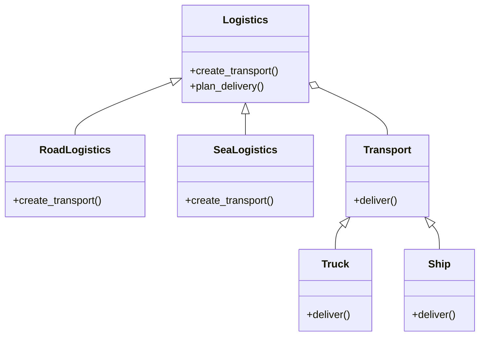
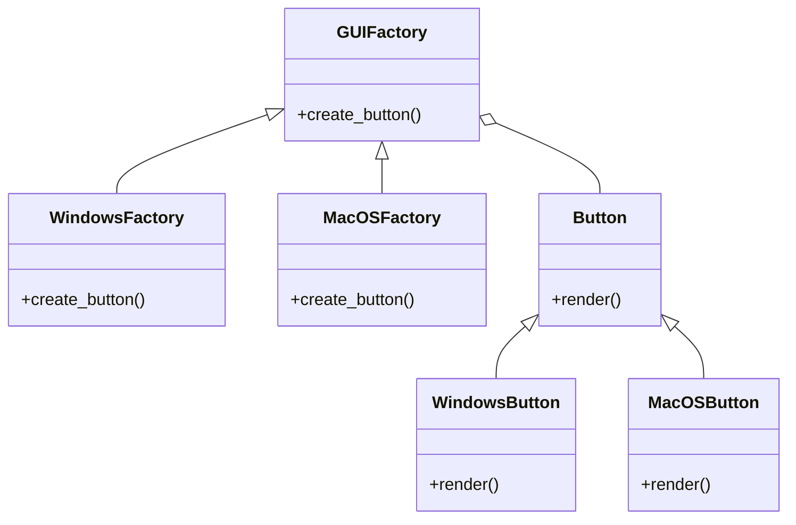

## 8.2.2 Factory Method and Abstract Factory

Design patterns are essential tools in a software developer's toolkit, providing time-tested solutions to common design problems. Among these, creational patterns focus on object creation mechanisms, aiming to create objects in a manner suitable to the situation. This section delves into two pivotal creational patterns: the **Factory Method** and the **Abstract Factory**. By understanding these patterns, you can create systems that are more flexible, scalable, and maintainable.

### Factory Method Pattern

#### Definition

The **Factory Method pattern** is a creational design pattern that provides an interface for creating objects in a superclass but allows subclasses to alter the type of objects that will be created. This pattern promotes loose coupling by delegating the responsibility of instantiating objects to subclasses, which can decide the class of objects to instantiate.

#### Implementation

To implement the Factory Method pattern, you typically define a base creator class with a factory method. Subclasses override this method to create specific types of objects. This approach allows for extending the object creation process without modifying existing code, adhering to the Open/Closed Principle.

##### Example Scenario: Transportation Methods

Consider a logistics company that needs to plan deliveries using different modes of transport. The company has trucks for land deliveries and ships for sea deliveries. Using the Factory Method pattern, we can create a flexible system that can be easily extended to include new transport types.

```python
from abc import ABC, abstractmethod

class Transport(ABC):
    @abstractmethod
    def deliver(self):
        pass

class Truck(Transport):
    def deliver(self):
        print("Delivering by land in a truck.")

class Ship(Transport):
    def deliver(self):
        print("Delivering by sea in a ship.")

class Logistics(ABC):
    @abstractmethod
    def create_transport(self):
        pass

    def plan_delivery(self):
        transport = self.create_transport()
        transport.deliver()

class RoadLogistics(Logistics):
    def create_transport(self):
        return Truck()

class SeaLogistics(Logistics):
    def create_transport(self):
        return Ship()

logistics = RoadLogistics()
logistics.plan_delivery()
```

In this example, `Logistics` is the creator class, and `RoadLogistics` and `SeaLogistics` are concrete subclasses that override the `create_transport` method to instantiate specific transport types.

#### Visual Representation



This diagram illustrates the relationship between the `Logistics` creator class and its subclasses, as well as the `Transport` product class and its implementations.

### Abstract Factory Pattern

#### Definition

The **Abstract Factory pattern** is a creational design pattern that provides an interface for creating families of related or dependent objects without specifying their concrete classes. This pattern is particularly useful when a system must be independent of how its objects are created or represented.

#### Implementation

To implement the Abstract Factory pattern, you define abstract interfaces for both the factory and the products it creates. Concrete factories implement these interfaces to create specific products. This approach allows for creating entire product families without changing existing code.

##### Example Scenario: GUI Elements for Different Operating Systems

Consider an application that needs to render GUI elements differently based on the operating system. Using the Abstract Factory pattern, we can create a system that generates GUI elements like buttons for Windows and macOS without altering the client code.

```python
from abc import ABC, abstractmethod

class Button(ABC):
    @abstractmethod
    def render(self):
        pass

class WindowsButton(Button):
    def render(self):
        print("Rendering Windows button.")

class MacOSButton(Button):
    def render(self):
        print("Rendering macOS button.")

class GUIFactory(ABC):
    @abstractmethod
    def create_button(self):
        pass

class WindowsFactory(GUIFactory):
    def create_button(self):
        return WindowsButton()

class MacOSFactory(GUIFactory):
    def create_button(self):
        return MacOSButton()

def application(factory):
    button = factory.create_button()
    button.render()

factory = WindowsFactory()
application(factory)
```

In this example, `GUIFactory` is the abstract factory interface, and `WindowsFactory` and `MacOSFactory` are concrete factories that create specific button types.

#### Visual Representation



This diagram shows the relationship between the `GUIFactory` interface and its concrete implementations, as well as the `Button` interface and its concrete products.

### Comparison and Use Cases

Understanding when to use the Factory Method versus the Abstract Factory pattern is crucial for designing flexible and scalable systems.

- **Factory Method** is ideal when a class cannot anticipate the class of objects it must create. It allows subclasses to specify the object types, making it suitable for situations where a class needs to delegate the instantiation process to subclasses.

- **Abstract Factory** is best used when a system must be independent of how its objects are created and represented. It is particularly useful when a system needs to work with multiple families of products, ensuring that products from the same family are used together.

#### Scalability and Complexity Considerations

- **Factory Method** is simpler and more straightforward, making it easier to implement and understand. However, it may require more subclasses if many different object types need to be created.

- **Abstract Factory** provides a higher level of abstraction, allowing for greater flexibility and scalability. However, it can introduce more complexity due to the need for multiple interfaces and classes.

### Key Points to Emphasize

- **Decoupling Object Creation:** Both patterns help in decoupling the creation of objects from the code that uses them, promoting loose coupling and adherence to the Open/Closed Principle.

- **Choosing the Right Pattern:** The choice between Factory Method and Abstract Factory depends on the complexity and relationships of the objects being created. Consider the system's requirements and future scalability when choosing a pattern.

- **Adherence to Principles:** Both patterns emphasize the importance of adhering to design principles such as the Open/Closed Principle, ensuring that systems can be extended without modifying existing code.

By mastering these creational patterns, you can design systems that are more robust, maintainable, and adaptable to change. Whether you're creating a simple application or a complex system, understanding and applying these patterns will enhance your software design skills.

## Quiz Time!



### What is the primary purpose of the Factory Method pattern?

- [x] To provide an interface for creating objects in a superclass but allow subclasses to alter the type of objects that will be created.
- [ ] To create a single object with a complex construction process.
- [ ] To define an interface for creating a single product.
- [ ] To create objects without exposing the instantiation logic.

> **Explanation:** The Factory Method pattern provides an interface for creating objects in a superclass but allows subclasses to alter the type of objects that will be created, promoting flexibility and scalability.

### In the Factory Method pattern, what is the role of the creator class?

- [x] To define the factory method that subclasses will override.
- [ ] To directly instantiate objects.
- [ ] To implement the product interface.
- [ ] To create a family of related objects.

> **Explanation:** The creator class defines the factory method that subclasses will override to specify the type of objects to create, allowing for flexible object creation.

### Which pattern is best suited for creating families of related or dependent objects?

- [ ] Factory Method
- [x] Abstract Factory
- [ ] Singleton
- [ ] Builder

> **Explanation:** The Abstract Factory pattern is best suited for creating families of related or dependent objects without specifying their concrete classes.

### What is a key advantage of using the Abstract Factory pattern?

- [x] It allows for creating families of related objects without specifying their concrete classes.
- [ ] It simplifies the creation of a single complex object.
- [ ] It reduces the number of subclasses needed.
- [ ] It allows for direct object instantiation.

> **Explanation:** The Abstract Factory pattern allows for creating families of related objects without specifying their concrete classes, promoting flexibility and scalability.

### How does the Factory Method pattern adhere to the Open/Closed Principle?

- [x] By allowing new subclasses to be added without modifying existing code.
- [ ] By using a single class for all object creation.
- [ ] By exposing the instantiation logic to clients.
- [ ] By creating objects at compile time.

> **Explanation:** The Factory Method pattern adheres to the Open/Closed Principle by allowing new subclasses to be added without modifying existing code, promoting extensibility.

### In the provided code example, what does the `plan_delivery` method do?

- [x] It creates a transport object and calls its `deliver` method.
- [ ] It directly delivers goods.
- [ ] It instantiates a `Logistics` object.
- [ ] It overrides the `create_transport` method.

> **Explanation:** The `plan_delivery` method creates a transport object using the `create_transport` method and calls its `deliver` method to execute the delivery.

### Which pattern is more suitable for systems that need to work with multiple families of products?

- [ ] Factory Method
- [x] Abstract Factory
- [ ] Singleton
- [ ] Builder

> **Explanation:** The Abstract Factory pattern is more suitable for systems that need to work with multiple families of products, ensuring that products from the same family are used together.

### What is a common drawback of the Abstract Factory pattern?

- [x] It can introduce more complexity due to multiple interfaces and classes.
- [ ] It limits the number of products that can be created.
- [ ] It does not support creating families of related objects.
- [ ] It requires modifying existing code to add new products.

> **Explanation:** The Abstract Factory pattern can introduce more complexity due to the need for multiple interfaces and classes, which can make the system harder to manage.

### What is the role of the `create_transport` method in the Factory Method pattern?

- [x] To be overridden by subclasses to specify the type of transport to create.
- [ ] To directly deliver goods.
- [ ] To instantiate a `Logistics` object.
- [ ] To plan the delivery process.

> **Explanation:** The `create_transport` method is overridden by subclasses to specify the type of transport to create, allowing for flexible object creation.

### True or False: The Factory Method pattern can be used to create a single instance of an object.

- [ ] True
- [x] False

> **Explanation:** False. The Factory Method pattern is used to create objects in a way that allows subclasses to alter the type of objects that will be created, not for creating a single instance of an object.


