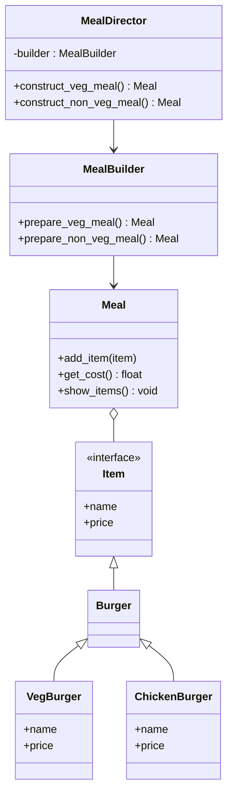

## 8.2.3 Builder Pattern in Python

Design patterns are fundamental to creating robust, scalable, and maintainable software. Among these, the Builder pattern holds a special place in scenarios where complex objects need to be constructed step by step. This chapter will delve into the Builder pattern, focusing on its implementation in Python. We will explore how this pattern helps in constructing complex objects, such as different configurations of meals in a restaurant setting, using Python's object-oriented capabilities.

### Understanding the Builder Pattern

#### Definition and Purpose

The **Builder pattern** is a creational design pattern that separates the construction of a complex object from its representation. This separation allows the same construction process to create different representations. The primary aim is to provide a flexible solution to various object creation problems in object-oriented programming.

**Key Characteristics:**

- **Separation of Concerns:** The Builder pattern isolates the complex construction logic from the object's final representation.
- **Step-by-Step Construction:** Allows objects to be constructed step by step, making it easier to manage and understand the creation process.
- **Flexibility in Representation:** Enables the creation of different representations of an object using the same construction process.

#### When to Use the Builder Pattern

The Builder pattern is particularly useful when:

- The object to be created is complex and requires multiple steps to construct.
- Different representations of the object are needed, and the construction process can be standardized.
- The construction process involves intricate logic that should be encapsulated separately from the object itself.

### Implementing the Builder Pattern in Python

To implement the Builder pattern in Python, we need to define several components:

1. **Product:** The complex object that is being constructed.
2. **Builder Interface:** An abstract interface that defines the construction steps.
3. **Concrete Builders:** Implementations of the builder interface for different representations.
4. **Director:** Orchestrates the construction process using a builder object.

#### Step 1: Define the Product

The product in our example will be a `Meal`, which consists of various `Item` objects. Each item has a name and a price.

```python
class Meal:
    def __init__(self):
        self.items = []

    def add_item(self, item):
        self.items.append(item)

    def get_cost(self):
        return sum(item.price for item in self.items)

    def show_items(self):
        for item in self.items:
            print(f"Item: {item.name}, Price: {item.price}")

class Item(ABC):
    @property
    @abstractmethod
    def name(self):
        pass

    @property
    @abstractmethod
    def price(self):
        pass
```

#### Step 2: Create Concrete Items

We will define concrete item classes that represent different types of burgers.

```python
class Burger(Item):
    pass

class VegBurger(Burger):
    @property
    def name(self):
        return "Veg Burger"

    @property
    def price(self):
        return 5.0

class ChickenBurger(Burger):
    @property
    def name(self):
        return "Chicken Burger"

    @property
    def price(self):
        return 7.0
```

#### Step 3: Define the Builder Interface

The builder interface outlines the methods required for constructing different parts of the product.

```python
class MealBuilder:
    def prepare_veg_meal(self):
        meal = Meal()
        meal.add_item(VegBurger())
        return meal

    def prepare_non_veg_meal(self):
        meal = Meal()
        meal.add_item(ChickenBurger())
        return meal
```

#### Step 4: Implement the Director

The director class uses the builder to construct the product. It orchestrates the building process, ensuring that the product is constructed correctly.

```python
class MealDirector:
    def __init__(self, builder):
        self._builder = builder

    def construct_veg_meal(self):
        return self._builder.prepare_veg_meal()

    def construct_non_veg_meal(self):
        return self._builder.prepare_non_veg_meal()
```

### Example Scenario: Building Different Meal Configurations

Let's consider a real-world scenario where a restaurant offers different meal configurations. We will use the Builder pattern to construct these meals.

#### Code Example: Meal Construction

```python
builder = MealBuilder()
director = MealDirector(builder)

veg_meal = director.construct_veg_meal()
veg_meal.show_items()
print(f"Total Cost: {veg_meal.get_cost()}")

non_veg_meal = director.construct_non_veg_meal()
non_veg_meal.show_items()
print(f"Total Cost: {non_veg_meal.get_cost()}")
```

### Visual Representation

To better understand the relationships among the components in the Builder pattern, let's look at a class diagram.



### Key Points to Emphasize

1. **Separation of Concerns:** The Builder pattern effectively separates the construction process from the final product, making the codebase cleaner and more maintainable.
2. **Flexibility and Reusability:** By defining different builders, we can create various representations of the product, enhancing flexibility and reusability.
3. **Control Over Construction:** The director class provides control over the construction process, ensuring that the product is built correctly.

### Best Practices and Common Pitfalls

#### Best Practices

- **Encapsulate Complex Construction Logic:** Use the Builder pattern to encapsulate complex construction logic, keeping it separate from the product.
- **Use Directors for Standardization:** Employ a director to standardize the construction process, ensuring consistency across different builders.
- **Leverage Python's Object-Oriented Features:** Utilize Python's object-oriented features, such as inheritance and polymorphism, to implement the Builder pattern effectively.

#### Common Pitfalls

- **Overcomplicating Simple Objects:** Avoid using the Builder pattern for simple objects that do not require step-by-step construction.
- **Neglecting Flexibility:** Ensure that the builder interface is flexible enough to accommodate future changes or additions to the product.

### Real-World Applications

The Builder pattern is widely used in software development, particularly in scenarios involving complex object creation. Here are a few real-world applications:

- **Graphical User Interfaces (GUIs):** Constructing complex UI components with multiple configurations.
- **Document Generation:** Building complex documents, such as reports or invoices, with varying content and formatting.
- **Game Development:** Creating complex game objects or levels with different configurations and properties.

### Conclusion

The Builder pattern is a powerful tool in the software developer's toolkit, providing a structured approach to constructing complex objects. By separating the construction process from the final representation, the Builder pattern enhances flexibility, maintainability, and clarity in your codebase. As you continue your journey in software design, consider the Builder pattern whenever you encounter complex object creation scenarios.

### Quiz Time!



### What is the primary purpose of the Builder pattern?

- [x] To separate the construction of a complex object from its representation
- [ ] To provide a single interface for a family of related objects
- [ ] To ensure a class has only one instance
- [ ] To define a skeleton of an algorithm in an operation

> **Explanation:** The Builder pattern's primary purpose is to separate the construction of a complex object from its representation, allowing the same construction process to create different representations.

### When is the Builder pattern particularly useful?

- [x] When the object to be created is complex and requires multiple steps
- [ ] When there is a need to enforce a single instance of a class
- [ ] When objects need to be created dynamically at runtime
- [ ] When the object creation process is straightforward

> **Explanation:** The Builder pattern is particularly useful when the object to be created is complex and requires multiple steps to construct, allowing for flexibility and control over the creation process.

### What role does the director play in the Builder pattern?

- [x] It orchestrates the building process using a builder object
- [ ] It defines the interface for creating parts of the product
- [ ] It implements the construction steps for a specific product
- [ ] It represents the complex object being constructed

> **Explanation:** The director orchestrates the building process using a builder object, ensuring that the product is constructed correctly according to a predefined sequence.

### In the provided code example, what does the `MealBuilder` class do?

- [x] It prepares different meal configurations
- [ ] It represents the meal being constructed
- [ ] It orchestrates the construction process
- [ ] It defines the interface for meal construction

> **Explanation:** The `MealBuilder` class prepares different meal configurations, acting as a concrete builder that implements the construction steps for specific meal types.

### Which of the following is a concrete item in the provided example?

- [x] VegBurger
- [ ] Meal
- [ ] MealBuilder
- [ ] MealDirector

> **Explanation:** `VegBurger` is a concrete item in the example, representing a specific type of burger with defined properties such as name and price.

### What is a common pitfall when using the Builder pattern?

- [x] Overcomplicating simple objects that do not require step-by-step construction
- [ ] Using the pattern for creating single instances of a class
- [ ] Applying the pattern to enforce a single interface for related objects
- [ ] Utilizing the pattern for straightforward object creation

> **Explanation:** A common pitfall when using the Builder pattern is overcomplicating simple objects that do not require step-by-step construction, leading to unnecessary complexity.

### How does the Builder pattern enhance flexibility?

- [x] By allowing different representations of the product using the same construction process
- [ ] By providing a single interface for multiple product families
- [ ] By enforcing a single instance of a class
- [ ] By defining a skeleton of an algorithm

> **Explanation:** The Builder pattern enhances flexibility by allowing different representations of the product to be created using the same construction process, accommodating various needs and configurations.

### What is the benefit of using a director in the Builder pattern?

- [x] It standardizes the construction process, ensuring consistency
- [ ] It defines the interface for creating parts of the product
- [ ] It represents the complex object being constructed
- [ ] It implements specific construction steps

> **Explanation:** Using a director standardizes the construction process, ensuring consistency and correctness across different builders and product representations.

### True or False: The Builder pattern is best suited for simple object creation.

- [ ] True
- [x] False

> **Explanation:** False. The Builder pattern is best suited for complex object creation where multiple steps are required, not for simple object creation.

### Which of the following is NOT a component of the Builder pattern?

- [ ] Product
- [ ] Builder Interface
- [ ] Concrete Builders
- [x] Singleton

> **Explanation:** The Singleton is not a component of the Builder pattern. The Builder pattern consists of the Product, Builder Interface, Concrete Builders, and Director.


