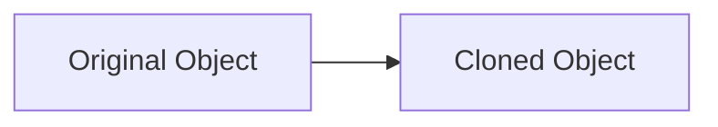

## 8.2.4 Prototype Pattern with Copy Module

In the realm of software design, the Prototype Pattern is an essential creational pattern that allows for the creation of new objects by copying existing ones, known as prototypes. This pattern is particularly useful when object creation is resource-intensive and can be simplified by cloning an existing instance. In this section, we will delve into the Prototype Pattern, focusing on its implementation in Python using the `copy` module. We will explore the nuances of shallow and deep copying, illustrate the pattern with practical examples, and discuss its applications in modern software development.

### Understanding the Prototype Pattern

The Prototype Pattern is a design pattern that involves creating new objects by duplicating an existing object, referred to as the prototype. This pattern is advantageous in scenarios where the cost of creating a new instance is high, and a similar object already exists. By cloning the prototype, we can bypass the complexities of object creation, such as initialization and configuration.

#### Key Characteristics of the Prototype Pattern

- **Cloning Over Creation:** Instead of constructing a new object from scratch, the pattern relies on copying an existing instance.
- **Flexibility:** It allows for dynamic object creation, where new objects can be created at runtime without knowing their exact types.
- **Efficiency:** Reduces the overhead associated with object creation, especially when objects are complex or resource-intensive.

### Implementing the Prototype Pattern in Python

Python's `copy` module provides a straightforward way to implement the Prototype Pattern by enabling both shallow and deep copying of objects. Let's explore how to use this module to clone objects effectively.

#### The `copy` Module

The `copy` module in Python offers two primary functions for copying objects:

- **`copy.copy()`**: Performs a shallow copy of the object.
- **`copy.deepcopy()`**: Performs a deep copy of the object.

##### Shallow vs. Deep Copy

- **Shallow Copy**: Creates a new object, but inserts references into it to the objects found in the original. This means that changes to mutable objects in the original will reflect in the shallow copy.
- **Deep Copy**: Creates a new object and recursively copies all objects found in the original, ensuring that changes in the original do not affect the copy.

Let's illustrate these concepts with examples:

```python
import copy

original_list = [[1, 2, 3], [4, 5, 6]]
shallow_copied_list = copy.copy(original_list)

original_list[0][0] = 'X'

print("Original List:", original_list)  # Output: [['X', 2, 3], [4, 5, 6]]
print("Shallow Copied List:", shallow_copied_list)  # Output: [['X', 2, 3], [4, 5, 6]]

deep_copied_list = copy.deepcopy(original_list)

original_list[0][0] = 'Y'

print("Original List:", original_list)  # Output: [['Y', 2, 3], [4, 5, 6]]
print("Deep Copied List:", deep_copied_list)  # Output: [['X', 2, 3], [4, 5, 6]]
```

In the above examples, modifying the original list affects the shallow copy but not the deep copy, illustrating the difference between the two.

### Cloning Objects with the Prototype Pattern

Now, let's implement the Prototype Pattern using the `copy` module. We'll create a simple example involving shapes in a graphical application.

#### Example Scenario: Cloning Shapes

Consider a graphical application where you need to clone shapes. Each shape has properties such as type, position, and color. Using the Prototype Pattern, we can clone existing shapes to create new ones with similar properties.

```python
import copy

class Prototype:
    def clone(self):
        return copy.deepcopy(self)

class Shape(Prototype):
    def __init__(self, shape_type):
        self.shape_type = shape_type
        self.x = 0
        self.y = 0
        self.color = "black"

    def draw(self):
        print(f"Drawing {self.color} {self.shape_type} at ({self.x}, {self.y})")

circle = Shape("Circle")
circle.x = 10
circle.y = 20
circle.color = "red"
circle.draw()

circle_clone = circle.clone()
circle_clone.x = 30
circle_clone.draw()
```

In this example, the `Shape` class inherits from `Prototype`, which provides the `clone()` method using `copy.deepcopy()`. The `circle` object is cloned, and the clone's position is modified without affecting the original object.

#### Diagram: Cloning Process

To visualize the cloning process, consider the following diagram:



This diagram illustrates how a clone is derived from the original object, maintaining its properties.

### Practical Applications and Considerations

The Prototype Pattern is particularly useful in scenarios where:

- **Complex Initialization**: Objects require complex initialization that can be bypassed by cloning.
- **Performance**: Object creation is costly, and cloning provides a more efficient alternative.
- **Dynamic Object Creation**: New objects need to be created at runtime without knowing their exact types.

#### Best Practices

- **Use Deep Copy for Mutable Objects**: When objects contain mutable attributes, use deep copy to ensure complete independence from the original.
- **Registry of Prototypes**: Maintain a registry of prototypes that can be cloned, allowing for easy access and management of prototypes.

#### Common Pitfalls

- **Unintended Sharing**: Be cautious of shallow copies leading to unintended sharing of mutable objects.
- **Performance Overhead**: Deep copying can be resource-intensive; use it judiciously.

### Conclusion

The Prototype Pattern, when implemented using Python's `copy` module, provides a powerful mechanism for efficient object cloning. By understanding the nuances of shallow and deep copying, and utilizing the pattern effectively, developers can enhance the flexibility and efficiency of their applications.

### Further Exploration

To delve deeper into the Prototype Pattern and its applications, consider exploring the following resources:

- [Python's Official Documentation on the `copy` Module](https://docs.python.org/3/library/copy.html)
- [Design Patterns: Elements of Reusable Object-Oriented Software](https://en.wikipedia.org/wiki/Design_Patterns) by Erich Gamma, Richard Helm, Ralph Johnson, and John Vlissides
- Online courses on design patterns and software architecture

## Quiz Time!



### What is the primary purpose of the Prototype Pattern?

- [x] To create new objects by copying existing ones
- [ ] To manage object dependencies
- [ ] To provide a way to access elements of a collection
- [ ] To define a family of algorithms

> **Explanation:** The Prototype Pattern is used to create new objects by copying existing objects, known as prototypes.

### What Python module is commonly used to implement the Prototype Pattern?

- [ ] os
- [ ] sys
- [x] copy
- [ ] json

> **Explanation:** The `copy` module in Python is used to perform shallow and deep copies of objects, making it ideal for implementing the Prototype Pattern.

### What is a shallow copy?

- [ ] A copy that includes all nested objects
- [x] A copy that includes references to nested objects
- [ ] A copy that duplicates only primitive data types
- [ ] A copy that converts objects to strings

> **Explanation:** A shallow copy creates a new object but inserts references to the objects found in the original, rather than duplicating them.

### Which function is used to perform a deep copy in Python?

- [ ] copy.shallow()
- [ ] copy.create()
- [ ] copy.clone()
- [x] copy.deepcopy()

> **Explanation:** The `copy.deepcopy()` function is used to perform a deep copy, creating a new object and recursively copying all objects found in the original.

### In the provided code example, what color is the cloned circle drawn with?

- [x] red
- [ ] blue
- [ ] green
- [ ] black

> **Explanation:** The cloned circle inherits the color "red" from the original circle, as the color attribute is copied during the cloning process.

### What is a potential drawback of using deep copy?

- [ ] It does not copy nested objects
- [x] It can be resource-intensive
- [ ] It only works with primitive data types
- [ ] It alters the original object

> **Explanation:** Deep copying can be resource-intensive because it involves recursively copying all objects found in the original.

### Why might you use a registry of prototypes?

- [x] To manage and access prototypes easily
- [ ] To enforce a single instance of a class
- [ ] To convert objects to strings
- [ ] To manage object dependencies

> **Explanation:** A registry of prototypes allows for easy management and access to prototypes that can be cloned.

### What is the output of `circle.draw()` in the example code?

- [ ] Drawing black Circle at (0, 0)
- [x] Drawing red Circle at (10, 20)
- [ ] Drawing blue Circle at (10, 20)
- [ ] Drawing green Circle at (0, 0)

> **Explanation:** The `circle` object is initialized with the color "red" and coordinates (10, 20), which are used in the `draw()` method.

### How does a deep copy differ from a shallow copy?

- [x] A deep copy duplicates all objects, while a shallow copy references nested objects
- [ ] A deep copy references nested objects, while a shallow copy duplicates all objects
- [ ] Both perform the same operation
- [ ] Neither duplicates any objects

> **Explanation:** A deep copy duplicates all objects found in the original, whereas a shallow copy references nested objects without duplicating them.

### The Prototype Pattern is especially useful when object creation is:

- [x] Costly or complex
- [ ] Simple and fast
- [ ] Rarely needed
- [ ] Only performed once

> **Explanation:** The Prototype Pattern is beneficial when object creation is costly or complex, as it allows for efficient cloning of existing objects.


