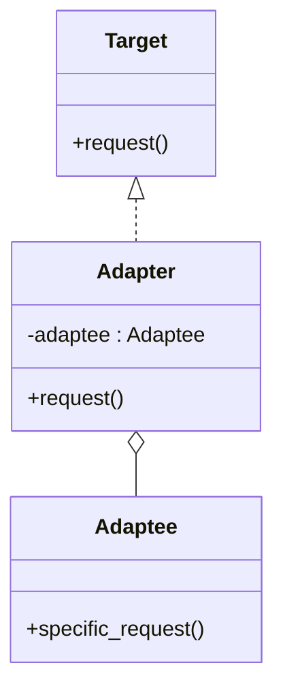

## 8.3.1 Adapter Pattern Using Inheritance and Composition

In the landscape of software development, design patterns are invaluable tools that provide tested solutions to recurring problems. Among these patterns, the Adapter Pattern stands out as a structural pattern that allows incompatible interfaces to work together. This chapter delves into the implementation of the Adapter Pattern in Python, focusing on two approaches: inheritance and composition. We will explore the nuances of each method, provide practical examples, and discuss when to use each approach.

### Understanding the Adapter Pattern

Before diving into the implementations, let's revisit the core purpose of the Adapter Pattern. The Adapter Pattern is designed to allow two incompatible interfaces to work together. It acts as a bridge between the client code and a class with a different interface, enabling interaction without modifying the existing code. This pattern is particularly useful when integrating third-party libraries or legacy systems that do not match the expected interface of your application.

### Implementation Using Inheritance

Inheritance in Python allows a class to derive properties and behaviors from another class. When implementing the Adapter Pattern using inheritance, the adapter class inherits from both the target interface and the adaptee class. This approach can be straightforward but comes with limitations due to Python's method resolution order (MRO) and the lack of strict interface enforcement.

#### Code Example: Adapter Using Inheritance

Let's illustrate this with a code example:

```python
class Target:
    def request(self):
        pass

class Adaptee:
    def specific_request(self):
        return "Adaptee's specific request"

class Adapter(Adaptee, Target):
    def request(self):
        return self.specific_request()

def client_code(target: Target):
    print(target.request())

adapter = Adapter()
client_code(adapter)
```

#### Explanation

- **Inheritance Structure:** The `Adapter` class inherits from both `Adaptee` and `Target`. This allows the adapter to access the methods of the `Adaptee` while also conforming to the `Target` interface.
- **Method Mapping:** The `request` method in the `Adapter` class is mapped to the `specific_request` method of the `Adaptee`. This mapping enables the client code to use the adapter as if it were a `Target`.
- **Client Interaction:** The client code interacts with the `Adapter` class through the `Target` interface, ensuring compatibility without altering the `Adaptee`.

#### Limitations of Inheritance

While inheritance can be a quick way to implement the Adapter Pattern, it has several drawbacks:

- **Flexibility Issues:** Inheritance is less flexible compared to composition. It tightly couples the adapter to the adaptee, making it difficult to change or extend behavior without modifying the adapter class.
- **Multiple Inheritance Complexity:** Python supports multiple inheritance, but it can lead to complex MRO issues, especially when dealing with deep or complex class hierarchies.
- **Interface Enforcement:** Python does not enforce interfaces strictly, which can lead to runtime errors if the adapter does not fully implement the target interface.

### Implementation Using Composition

Composition is a design principle where a class is composed of one or more objects, allowing it to delegate responsibilities to these objects. In the context of the Adapter Pattern, composition involves creating an adapter class that holds a reference to the adaptee and delegates calls to it. This approach is generally preferred in Python due to its flexibility and maintainability.

#### Code Example: Adapter Using Composition

Here's how you can implement the Adapter Pattern using composition:

```python
class Adapter(Target):
    def __init__(self, adaptee):
        self.adaptee = adaptee

    def request(self):
        return self.adaptee.specific_request()

adaptee = Adaptee()
adapter = Adapter(adaptee)
client_code(adapter)
```

#### Explanation

- **Composition Structure:** The `Adapter` class implements the `Target` interface and holds a reference to an instance of the `Adaptee`. This setup allows the adapter to delegate method calls to the adaptee.
- **Delegation:** The `request` method in the `Adapter` class calls the `specific_request` method of the `Adaptee`, effectively bridging the interface gap.
- **Client Interaction:** The client code remains unchanged, interacting with the adapter through the `Target` interface.

#### Advantages of Composition

- **Greater Flexibility:** Composition provides greater flexibility than inheritance. It allows the adapter to be easily modified or extended without altering the adaptee.
- **Decoupling:** By holding a reference to the adaptee rather than inheriting from it, composition decouples the adapter from the adaptee, promoting better separation of concerns.
- **Simplified MRO:** Composition avoids the complexities of Python's MRO, making it easier to manage and understand class hierarchies.

### Best Practices for Using the Adapter Pattern

When implementing the Adapter Pattern in Python, consider the following best practices:

- **Prefer Composition Over Inheritance:** In most cases, composition is preferred due to its flexibility and maintainability. It allows for easier modification and extension of behavior without altering existing code.
- **Ensure Interface Compatibility:** Make sure the adapter class fully implements the target interface. This ensures that the client code can interact with the adapter seamlessly.
- **Use Clear Naming Conventions:** Use clear and descriptive names for adapter classes and methods to enhance code readability and maintainability.
- **Test Thoroughly:** Thoroughly test the adapter implementation to ensure that it correctly maps and delegates method calls between the target interface and the adaptee.

### Visualizing the Adapter Pattern

To further illustrate the Adapter Pattern, let's use a class diagram to visualize the composition-based adapter:



In this diagram, the `Adapter` class implements the `Target` interface and contains a reference to the `Adaptee`, highlighting the use of composition.

### Key Points to Emphasize

- **Flexibility of Composition:** Composition-based adapters are more flexible and easier to maintain in Python. They allow for better separation of concerns and easier modification of behavior.
- **Integration of Incompatible Interfaces:** The Adapter Pattern is essential when integrating third-party libraries or legacy code with incompatible interfaces, promoting code reusability and decoupling client code from specific implementations.
- **Decoupling and Reusability:** By implementing the Adapter Pattern, you promote code reusability and decouple client code from specific implementations, making your codebase more modular and adaptable to change.

### Conclusion

The Adapter Pattern is a powerful tool in the software design toolkit, allowing developers to integrate incompatible interfaces seamlessly. By understanding and applying both inheritance and composition approaches, you can choose the most suitable method for your specific use case. Remember to prioritize flexibility and maintainability, opting for composition when possible to create robust and adaptable software solutions.

---

## Quiz Time!



### What is the main purpose of the Adapter Pattern?

- [x] To allow incompatible interfaces to work together
- [ ] To enhance the performance of a system
- [ ] To simplify complex algorithms
- [ ] To manage resource allocation

> **Explanation:** The Adapter Pattern is designed to allow incompatible interfaces to work together by converting the interface of one class into another that clients expect.

### Which approach is generally preferred in Python for implementing the Adapter Pattern?

- [x] Composition
- [ ] Inheritance
- [ ] Singleton
- [ ] Factory

> **Explanation:** Composition is generally preferred in Python due to its flexibility and ability to decouple the adapter from the adaptee.

### What is a drawback of using inheritance for the Adapter Pattern in Python?

- [x] It can lead to complex method resolution order (MRO) issues
- [ ] It is always slower than composition
- [ ] It requires more memory
- [ ] It cannot be used with third-party libraries

> **Explanation:** Inheritance can lead to complex MRO issues in Python, especially with multiple inheritance, making it less flexible than composition.

### In the context of the Adapter Pattern, what does composition involve?

- [x] Holding a reference to the adaptee and delegating calls to it
- [ ] Inheriting methods from the adaptee
- [ ] Creating multiple instances of the adaptee
- [ ] Using a factory to create adapters

> **Explanation:** Composition involves creating an adapter class that holds a reference to the adaptee and delegates calls to it, promoting flexibility and decoupling.

### Which of the following is a benefit of using composition for the Adapter Pattern?

- [x] Greater flexibility and easier modification
- [ ] Faster execution speed
- [ ] Reduced code size
- [ ] Automatic interface enforcement

> **Explanation:** Composition provides greater flexibility and easier modification of behavior without altering existing code, making it a preferred approach.

### How does the Adapter Pattern promote code reusability?

- [x] By decoupling client code from specific implementations
- [ ] By reducing the number of classes
- [ ] By enforcing strict type checking
- [ ] By minimizing memory usage

> **Explanation:** The Adapter Pattern promotes code reusability by decoupling client code from specific implementations, allowing for easier integration of different interfaces.

### What should be ensured when implementing an adapter class?

- [x] The adapter class fully implements the target interface
- [ ] The adapter class uses a singleton pattern
- [ ] The adapter class inherits from multiple classes
- [ ] The adapter class minimizes method calls

> **Explanation:** Ensuring that the adapter class fully implements the target interface is crucial for seamless interaction with client code.

### What is a potential issue with using multiple inheritance in Python?

- [x] Complex method resolution order (MRO)
- [ ] Increased execution speed
- [ ] Simplified class hierarchies
- [ ] Automatic error handling

> **Explanation:** Multiple inheritance can lead to complex MRO issues in Python, making it challenging to manage and understand class hierarchies.

### Why is clear naming important in adapter implementations?

- [x] To enhance code readability and maintainability
- [ ] To reduce execution time
- [ ] To enforce strict typing
- [ ] To minimize memory usage

> **Explanation:** Clear naming conventions in adapter implementations enhance code readability and maintainability, making it easier to understand and modify.

### True or False: The Adapter Pattern is only useful for integrating third-party libraries.

- [ ] True
- [x] False

> **Explanation:** The Adapter Pattern is useful for integrating not only third-party libraries but also legacy systems and any scenario where incompatible interfaces need to work together.


