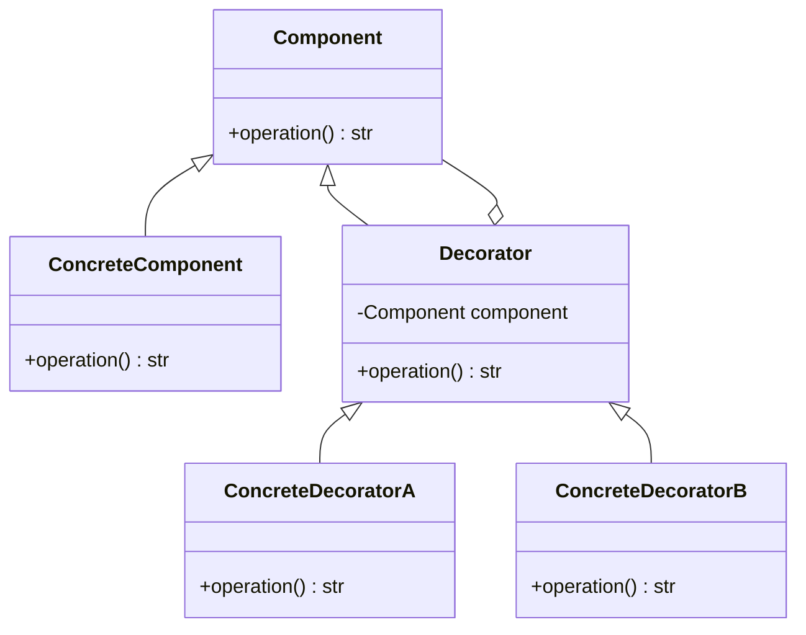

## 8.3.2 Decorator Pattern with Function and Class Decorators

In the realm of software design patterns, the **Decorator Pattern** stands out as a versatile tool that allows developers to add behavior to individual objects dynamically. This is achieved without altering the behavior of other objects from the same class, thus adhering to the Open/Closed Principle. In Python, this pattern is elegantly implemented using function and class decorators. In this section, we will delve into the intricacies of the Decorator Pattern, exploring both function and class-based decorators, and how they can be leveraged to enhance code flexibility and modularity.

### Understanding the Decorator Pattern

The Decorator Pattern is a structural pattern that enables the addition of responsibilities to objects dynamically. It provides a flexible alternative to subclassing for extending functionality. By wrapping an object, decorators can add new behaviors or responsibilities, effectively creating a chain of decorators that can be applied in various combinations.

**Key Characteristics of the Decorator Pattern:**

- **Dynamic Behavior Addition:** Allows additional functionality to be added to objects at runtime.
- **Single Responsibility Principle:** Each decorator focuses on a single aspect of behavior, promoting cleaner code.
- **Open/Closed Principle:** New functionality can be added without modifying existing code.

### Function Decorators in Python

Function decorators in Python are a powerful feature that allows you to modify the behavior of a function or method. They are essentially functions that take another function as an argument and extend its behavior without altering its source code.

#### Explanation

A function decorator is a higher-order function that wraps another function. The wrapped function is passed as an argument to the decorator, which returns a new function that typically calls the original function, adding some pre- or post-processing.

#### Code Example

Let's explore a simple example of function decorators in Python:

```python
def bold_decorator(func):
    def wrapper(*args, **kwargs):
        return f"<b>{func(*args, **kwargs)}</b>"
    return wrapper

def italics_decorator(func):
    def wrapper(*args, **kwargs):
        return f"<i>{func(*args, **kwargs)}</i>"
    return wrapper

@bold_decorator
@italics_decorator
def greet(name):
    return f"Hello, {name}"

print(greet("Alice"))  # Output: <b><i>Hello, Alice</i></b>
```

**Explanation:**

- **Decorators Application Order:** The `greet` function is first wrapped by `italics_decorator`, then by `bold_decorator`. This means the `italics_decorator` is applied first, followed by the `bold_decorator`.
- **Wrapper Function:** Each decorator defines a `wrapper` function that adds HTML tags around the output of the original function.
- **Flexibility:** This approach allows for flexible and reusable enhancements to functions.

### Class-based Decorators

While function decorators are suitable for many scenarios, class-based decorators offer more control and the ability to maintain state across function calls. This is particularly useful when the decorator needs to manage resources or track state information.

#### Explanation

A class-based decorator involves defining a class with an `__init__` method to capture the function to be decorated and a `__call__` method to execute it. This allows the decorator to maintain state and perform more complex operations.

#### Code Example

Here's an example of a class-based decorator:

```python
class Decorator:
    def __init__(self, func):
        self.func = func

    def __call__(self, *args, **kwargs):
        # Pre-processing
        print("Before calling the function.")
        result = self.func(*args, **kwargs)
        # Post-processing
        print("After calling the function.")
        return result

@Decorator
def say_hello(name):
    print(f"Hello, {name}!")

say_hello("Bob")
```

**Explanation:**

- **Callable Objects:** The `Decorator` class makes instances callable by implementing the `__call__` method.
- **State Management:** The class can maintain state across multiple calls, allowing for sophisticated behavior tracking.
- **Pre- and Post-Processing:** The decorator can perform actions before and after the function call, such as logging or resource management.

### Implementing the Decorator Pattern with Classes

In addition to function and class-based decorators, the Decorator Pattern can be implemented using class inheritance and composition. This approach involves creating a hierarchy of decorator classes that wrap components and extend their behavior.

#### Explanation

The class-based implementation of the Decorator Pattern involves defining a base component interface, concrete components, and decorators that extend the component interface.

#### Code Example

```python
class Component:
    def operation(self):
        pass

class ConcreteComponent(Component):
    def operation(self):
        return "ConcreteComponent"

class Decorator(Component):
    def __init__(self, component):
        self.component = component

    def operation(self):
        return self.component.operation()

class ConcreteDecoratorA(Decorator):
    def operation(self):
        return f"ConcreteDecoratorA({self.component.operation()})"

class ConcreteDecoratorB(Decorator):
    def operation(self):
        return f"ConcreteDecoratorB({self.component.operation()})"

simple = ConcreteComponent()
decorated = ConcreteDecoratorB(ConcreteDecoratorA(simple))
print(decorated.operation())  # Output: ConcreteDecoratorB(ConcreteDecoratorA(ConcreteComponent))
```

**Explanation:**

- **Component Interface:** `Component` defines the interface for objects that can have responsibilities added to them dynamically.
- **Concrete Component:** `ConcreteComponent` is the object to which additional responsibilities can be attached.
- **Decorator Class:** `Decorator` maintains a reference to a component object and defines an interface that conforms to the component's interface.
- **Concrete Decorators:** `ConcreteDecoratorA` and `ConcreteDecoratorB` extend the functionality of the component by overriding the `operation` method.

### Visual Representation

To better understand the class-based decorator implementation, consider the following UML class diagram:



### Key Points to Emphasize

- **Dynamic Behavior Enhancement:** The Decorator Pattern allows for the dynamic addition of behavior to objects without modifying existing code.
- **Python's Syntactic Sugar:** Python's decorators provide a concise and expressive way to implement this pattern, leveraging the language's syntactic sugar.
- **Flexibility and Modularity:** Function decorators are ideal for simple enhancements, while class-based decorators offer more control and state management capabilities.
- **Open/Closed Principle:** The pattern promotes code that is open for extension but closed for modification, enhancing maintainability.

### Best Practices and Common Pitfalls

#### Best Practices

- **Use Descriptive Names:** Name your decorators clearly to convey their purpose.
- **Keep Decorators Simple:** Each decorator should focus on a single aspect of behavior to maintain clarity and modularity.
- **Combine Decorators Wisely:** When stacking decorators, be mindful of their order and potential interactions.

#### Common Pitfalls

- **Complexity Overhead:** Avoid overusing decorators, as excessive layering can lead to complex and hard-to-debug code.
- **State Management Challenges:** When using class-based decorators, ensure proper state management to avoid unintended side effects.

### Conclusion

The Decorator Pattern is a powerful tool in a developer's arsenal, enabling the dynamic addition of behavior to objects in a flexible and modular manner. By leveraging Python's function and class decorators, developers can implement this pattern with elegance and efficiency. As you continue your journey in software design, consider the Decorator Pattern as a means to enhance code functionality while adhering to best practices in modularity and maintainability.

## Quiz Time!



### What is the main purpose of the Decorator Pattern?

- [x] To add behavior to individual objects dynamically without affecting others
- [ ] To create a new class hierarchy
- [ ] To simplify code by reducing the number of classes
- [ ] To enforce strict type checking

> **Explanation:** The Decorator Pattern allows behavior to be added to individual objects dynamically without affecting the behavior of other objects from the same class.

### Which of the following best describes a function decorator in Python?

- [x] A function that takes another function as an argument and returns a new function
- [ ] A class that wraps another class
- [ ] A function that modifies global variables
- [ ] A method that changes the behavior of a class

> **Explanation:** Function decorators in Python are functions that take another function as an argument, extend its behavior, and return a new function.

### In the given function decorator example, which decorator is applied first?

- [ ] `bold_decorator`
- [x] `italics_decorator`
- [ ] Both are applied simultaneously
- [ ] Neither is applied

> **Explanation:** Decorators are applied from the bottom up, so `italics_decorator` is applied before `bold_decorator`.

### What is a key advantage of using class-based decorators over function decorators?

- [x] They can maintain state across function calls
- [ ] They are easier to write
- [ ] They automatically handle exceptions
- [ ] They do not require a `__call__` method

> **Explanation:** Class-based decorators can maintain state across function calls, providing more control and flexibility.

### In the class-based decorator example, what does the `__call__` method do?

- [x] It allows the class instance to be called like a function
- [ ] It initializes the class
- [ ] It defines the class's attributes
- [ ] It decorates the function

> **Explanation:** The `__call__` method allows an instance of the class to be called like a function, executing the wrapped function with additional behavior.

### What is the role of the `Decorator` class in the class-based implementation of the Decorator Pattern?

- [x] It acts as a base class for concrete decorators
- [ ] It provides a user interface
- [ ] It stores data in a database
- [ ] It performs logging

> **Explanation:** The `Decorator` class acts as a base class for concrete decorators, maintaining a reference to the component and defining the interface.

### How does the Decorator Pattern adhere to the Open/Closed Principle?

- [x] By allowing new functionality to be added without modifying existing code
- [ ] By enforcing strict typing
- [ ] By using fewer classes
- [ ] By simplifying the inheritance hierarchy

> **Explanation:** The Decorator Pattern allows new functionality to be added to objects without modifying existing code, adhering to the Open/Closed Principle.

### What is a potential drawback of overusing decorators?

- [x] Increased complexity and difficulty in debugging
- [ ] Reduced code execution speed
- [ ] Increased memory usage
- [ ] Decreased code readability

> **Explanation:** Overusing decorators can lead to increased complexity and difficulty in debugging due to excessive layering.

### Which of the following is NOT a benefit of the Decorator Pattern?

- [ ] Enhances code modularity
- [x] Ensures type safety
- [ ] Allows dynamic behavior addition
- [ ] Promotes code reuse

> **Explanation:** While the Decorator Pattern enhances modularity, allows dynamic behavior addition, and promotes code reuse, it does not inherently ensure type safety.

### True or False: Function decorators can only be applied to functions and not methods.

- [ ] True
- [x] False

> **Explanation:** Function decorators can be applied to both functions and methods in Python, extending their behavior.



By understanding and applying the Decorator Pattern in Python, you can create more flexible, modular, and maintainable software. Experiment with both function and class-based decorators to see how they can enhance your code's capabilities and adhere to best practices in design patterns.
