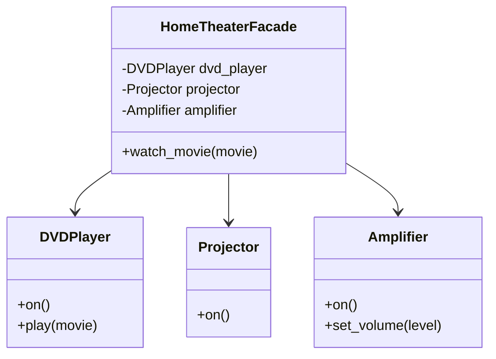

## 8.3.3 Facade Pattern in Python

### Introduction to the Facade Pattern

In the world of software design, complexity is often an inevitable challenge. As systems grow, they become intricate webs of interconnected components, each with its own set of interfaces and behaviors. Managing these components can become a daunting task, particularly for clients who need to interact with multiple subsystems to accomplish a single task. This is where the **Facade Pattern** comes into play.

The Facade Pattern is a structural design pattern that provides a simplified interface to a complex subsystem. It acts as a front-facing interface, masking the more complex underlying code and interactions. This pattern is particularly useful in scenarios where a system is made up of numerous subsystems, each with its own complex API. By introducing a facade, we can reduce the complexity exposed to the client, making the system easier to use and understand.

### Understanding the Facade Pattern

The primary goal of the Facade Pattern is to provide a unified and straightforward interface to a set of interfaces in a subsystem. This pattern is not about adding new functionality but about simplifying the way clients interact with existing functionality. The facade achieves this by:

- **Reducing Complexity:** By offering a single entry point to multiple subsystems, the facade reduces the number of interactions a client must manage.
- **Decoupling Clients from Subsystems:** Clients interact with the facade rather than directly with the subsystem components, promoting loose coupling.
- **Improving Usability:** By hiding the intricate details of the subsystem, the facade makes the system more user-friendly.

### Implementing the Facade Pattern in Python

To implement the Facade Pattern in Python, we need to follow these steps:

1. **Identify the Subsystem Components:** Determine which parts of the system are complex and require simplification.
2. **Create a Facade Class:** Develop a class that provides a simplified interface, delegating calls to the subsystem components.
3. **Use the Facade:** Clients interact with the facade to perform operations, rather than dealing with the subsystem directly.

#### Example Scenario: Home Theater System

Let's consider a home theater system, which is a perfect candidate for the Facade Pattern. A home theater might consist of several components such as a DVD player, a projector, and an amplifier. Each of these components has its own set of operations, making the system complex to operate.

**Subsystem Classes:**

```python
class DVDPlayer:
    def on(self):
        print("DVD Player on.")
    def play(self, movie):
        print(f"Playing '{movie}'.")

class Projector:
    def on(self):
        print("Projector on.")

class Amplifier:
    def on(self):
        print("Amplifier on.")
    def set_volume(self, level):
        print(f"Amplifier volume set to {level}.")
```

In this example, each component has its own methods to perform specific tasks. The complexity arises when a user wants to watch a movie, as they need to interact with multiple components.

**Creating the Facade:**

```python
class HomeTheaterFacade:
    def __init__(self, dvd_player, projector, amplifier):
        self.dvd_player = dvd_player
        self.projector = projector
        self.amplifier = amplifier

    def watch_movie(self, movie):
        print("Get ready to watch a movie...")
        self.dvd_player.on()
        self.projector.on()
        self.amplifier.on()
        self.amplifier.set_volume(5)
        self.dvd_player.play(movie)
```

The `HomeTheaterFacade` class provides a simple `watch_movie` method that encapsulates the complexity of interacting with the individual components. The client simply calls this method to start a movie, without worrying about the underlying operations.

**Using the Facade:**

```python
dvd_player = DVDPlayer()
projector = Projector()
amplifier = Amplifier()

home_theater = HomeTheaterFacade(dvd_player, projector, amplifier)
home_theater.watch_movie("Inception")
```

Here, the client creates instances of the subsystem components and passes them to the `HomeTheaterFacade`. By calling `watch_movie`, the client can start a movie without dealing with the individual components directly.

### Best Practices for Using the Facade Pattern

- **Keep the Interface Simple:** The facade should provide the simplest possible interface to the client. Avoid exposing unnecessary details or operations.
- **Do Not Alter Subsystem Functionality:** The facade should not change the behavior of the subsystem components. It should only simplify the interaction.
- **Maintain Loose Coupling:** Subsystem classes should not be aware of the facade. This ensures that the facade can be modified or replaced without affecting the subsystems.

### Visualizing the Facade Pattern

To better understand the relationships between the facade and the subsystem components, let's look at a class diagram:



In this diagram, the `HomeTheaterFacade` class is shown as a central interface that interacts with the `DVDPlayer`, `Projector`, and `Amplifier` classes. The facade delegates calls to these subsystem components, providing a simplified interface to the client.

### Benefits of the Facade Pattern

The Facade Pattern offers several advantages:

- **Simplified Client Interactions:** Clients deal with a single interface rather than multiple subsystem interfaces, reducing complexity.
- **Improved System Organization:** By centralizing control in the facade, the system becomes more organized and easier to manage.
- **Enhanced Maintainability:** Changes to the subsystem can be made without affecting the client, as long as the facade interface remains consistent.

### Real-World Applications of the Facade Pattern

The Facade Pattern is widely used in software development, particularly in large systems with complex subsystems. Some common applications include:

- **Library and Framework Interfaces:** Many libraries and frameworks provide a facade to simplify interactions with their complex internal structures.
- **API Gateways:** In microservices architectures, an API gateway can serve as a facade, providing a unified interface to multiple backend services.
- **User Interfaces:** Facades can be used to simplify the interaction between the user interface and the underlying business logic.

### Conclusion

The Facade Pattern is a powerful tool for managing complexity in software systems. By providing a simplified interface to complex subsystems, it enhances usability, promotes loose coupling, and improves maintainability. Whether you're dealing with a home theater system or a large-scale software application, the Facade Pattern can help you streamline interactions and reduce the cognitive load on your clients.

### Quiz Time!



### What is the primary purpose of the Facade Pattern?

- [x] To provide a simplified interface to a complex subsystem
- [ ] To add new functionality to a system
- [ ] To improve the performance of a system
- [ ] To enforce security in a system

> **Explanation:** The Facade Pattern aims to provide a simplified interface to a complex subsystem, making it easier for clients to interact with it.

### Which of the following is an example of using the Facade Pattern?

- [x] An API gateway that provides a unified interface to multiple backend services
- [ ] A database connection pool that manages database connections
- [ ] A caching mechanism that stores frequently accessed data
- [ ] A logging framework that records application logs

> **Explanation:** An API gateway acts as a facade by providing a single interface to multiple backend services, simplifying client interactions.

### In the Facade Pattern, should subsystem classes be aware of the facade?

- [ ] Yes, they should know about the facade
- [x] No, they should not be aware of the facade
- [ ] It depends on the implementation
- [ ] Only if the facade modifies their behavior

> **Explanation:** Subsystem classes should not be aware of the facade to maintain loose coupling and allow the facade to be modified or replaced independently.

### What is a key benefit of using the Facade Pattern?

- [x] It reduces the complexity exposed to the client
- [ ] It increases the number of interfaces a client must interact with
- [ ] It makes the system more tightly coupled
- [ ] It requires clients to understand all subsystem details

> **Explanation:** The Facade Pattern reduces the complexity exposed to the client by providing a simplified interface, making the system easier to use.

### Which principle does the Facade Pattern promote by decoupling clients from subsystems?

- [x] Loose coupling
- [ ] Tight coupling
- [ ] High cohesion
- [ ] Low cohesion

> **Explanation:** The Facade Pattern promotes loose coupling by decoupling clients from subsystems, allowing changes to the subsystem without affecting the client.

### In the provided code example, what does the `watch_movie` method do?

- [x] It simplifies the process of starting a movie by interacting with multiple subsystems
- [ ] It modifies the behavior of the DVD player
- [ ] It directly controls the projector
- [ ] It changes the volume of the amplifier

> **Explanation:** The `watch_movie` method simplifies the process of starting a movie by interacting with the DVD player, projector, and amplifier subsystems.

### Why is the Facade Pattern particularly useful in large systems?

- [x] It simplifies interactions with complex subsystems
- [ ] It increases the complexity of the system
- [ ] It makes the system more difficult to maintain
- [ ] It requires clients to manage multiple interfaces

> **Explanation:** The Facade Pattern is useful in large systems because it simplifies interactions with complex subsystems, reducing the cognitive load on clients.

### Which of the following best describes the role of a facade in a system?

- [x] A facade acts as a front-facing interface that masks the complexity of underlying subsystems
- [ ] A facade is a subsystem that provides additional functionality
- [ ] A facade is a client that interacts with multiple subsystems
- [ ] A facade is a database that stores system data

> **Explanation:** A facade acts as a front-facing interface that masks the complexity of underlying subsystems, providing a simplified way for clients to interact with them.

### Can the Facade Pattern be used to add new functionality to a system?

- [ ] Yes, it is primarily used to add new functionality
- [x] No, it is used to simplify existing functionality
- [ ] It depends on the system architecture
- [ ] Only if the facade is extended

> **Explanation:** The Facade Pattern is used to simplify existing functionality by providing a unified interface, not to add new functionality.

### True or False: The Facade Pattern can improve system performance by reducing the number of interactions with subsystems.

- [ ] True
- [x] False

> **Explanation:** The Facade Pattern does not inherently improve system performance; its main purpose is to simplify interactions by providing a unified interface.



By understanding and applying the Facade Pattern, you can create more manageable and user-friendly systems. Remember, the key is to simplify, not to add complexity. As you continue your journey in software design, consider how the Facade Pattern can help you streamline interactions and enhance the usability of your systems.
