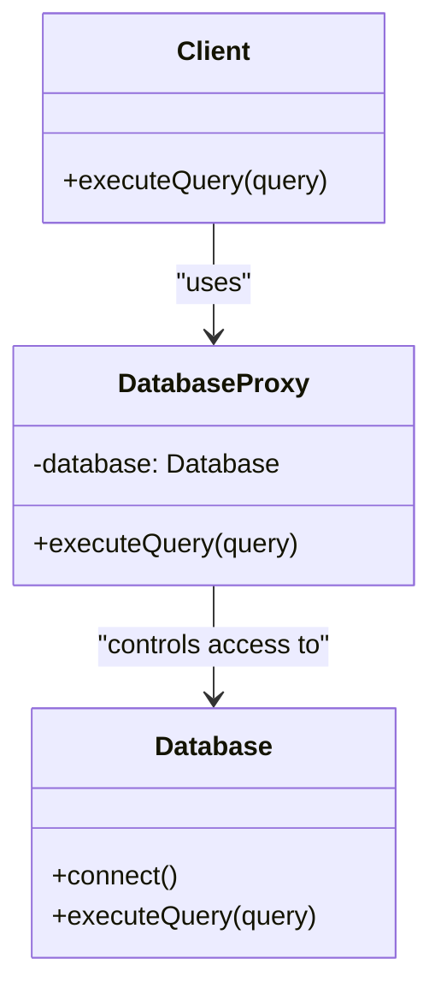

## 8.3.4 Proxy Pattern and Lazy Initialization

In the realm of software design patterns, the **Proxy Pattern** stands out as a versatile tool for controlling access to objects. It introduces a level of indirection, allowing developers to manage, protect, or optimize the way clients interact with these objects. One of the most compelling uses of the Proxy Pattern is in implementing **lazy initialization**, a technique that can significantly enhance performance by deferring resource-intensive operations until absolutely necessary.

### Understanding the Proxy Pattern

The Proxy Pattern provides a surrogate or placeholder for another object to control access to it. This pattern is particularly useful when dealing with resource-intensive objects, security-sensitive operations, or remote objects located in different address spaces. By interposing a proxy, developers can introduce additional functionality such as access control, logging, caching, or lazy initialization without modifying the original object.

#### Key Concepts of the Proxy Pattern

1. **Surrogate Control:** The proxy acts as an intermediary, managing access to the real subject.
2. **Decoupling:** Clients interact with the proxy as if it were the real object, promoting loose coupling.
3. **Flexibility:** The pattern allows for dynamic behavior changes, such as loading resources only when needed.

### Virtual Proxy and Lazy Initialization

A **Virtual Proxy** is a specific type of proxy that defers the creation of a resource-intensive object until it is actually needed. This is where lazy initialization comes into play, optimizing resource usage and improving application performance.

#### Use Case: Virtual Proxy for Database Connection

Consider a scenario where an application needs to interact with a database. Establishing a database connection can be a costly operation, both in terms of time and resources. By using a virtual proxy, we can delay this operation until a query is actually executed.

##### Code Example: Implementing a Virtual Proxy

```python
class Database:
    def connect(self):
        print("Establishing database connection...")
        # Simulate heavy initialization
    def execute_query(self, query):
        print(f"Executing query: {query}")

class DatabaseProxy:
    def __init__(self):
        self.database = None

    def execute_query(self, query):
        if self.database is None:
            self.database = Database()
            self.database.connect()
        self.database.execute_query(query)

db_proxy = DatabaseProxy()
db_proxy.execute_query("SELECT * FROM users")  # Connection established upon first query
db_proxy.execute_query("SELECT * FROM orders")  # Connection already established
```

**Explanation:**

- The `DatabaseProxy` class acts as a stand-in for the `Database` class.
- The actual database connection is deferred until the first query is executed, demonstrating lazy initialization.
- Subsequent queries do not require re-establishing the connection, thus optimizing resource usage.

### Other Types of Proxies

While the virtual proxy is focused on lazy initialization, the Proxy Pattern encompasses several other types of proxies, each serving different purposes:

1. **Protection Proxy:** Controls access to the real object based on permissions. This is useful in scenarios where different users have different access rights.
   
2. **Remote Proxy:** Provides a local representative for an object located in a different address space, such as in remote procedure calls (RPC) or distributed systems.

3. **Caching Proxy:** Stores the results of expensive operations and returns cached results to improve performance.

4. **Smart Proxy:** Adds additional functionality, such as reference counting or logging, to the real object.

### Best Practices for Implementing Proxies

When implementing the Proxy Pattern, consider the following best practices:

- **Interface Consistency:** Ensure that the proxy implements the same interface as the real subject. This allows clients to interact with the proxy and the real object interchangeably.
  
- **Thread Safety:** If the real object or the proxy is accessed by multiple threads, ensure that access is thread-safe to prevent data corruption or inconsistent states.

- **Performance Considerations:** While proxies can improve performance through lazy initialization or caching, they can also introduce overhead. Profile your application to ensure that the benefits outweigh the costs.

- **Security and Access Control:** Use protection proxies to enforce security policies and manage access rights effectively.

### Visualizing the Proxy Pattern

To better understand the structure of the Proxy Pattern, consider the following class diagram:



In this diagram, the `Client` interacts with the `DatabaseProxy`, which in turn manages access to the `Database`. This encapsulation allows the proxy to control when and how the database connection is established.

### Key Points to Emphasize

- **Indirection and Control:** The Proxy Pattern adds a level of indirection, allowing developers to control access to the real object.
  
- **Lazy Initialization:** By deferring resource-intensive operations, lazy initialization can significantly improve performance, especially in applications with limited resources or high startup costs.

- **Security and Flexibility:** Proxies can enhance security by controlling access and provide flexibility by allowing dynamic changes to object behavior.

### Conclusion

The Proxy Pattern, particularly when used for lazy initialization, is a powerful tool in a developer's toolkit. It allows for efficient resource management, improved performance, and enhanced control over object interactions. By understanding and implementing this pattern, developers can create more robust, flexible, and maintainable software systems.

As you continue your journey in software design, consider how the Proxy Pattern and lazy initialization can be applied to your projects to optimize performance and resource usage.

## Quiz Time!



### What is the primary purpose of the Proxy Pattern?

- [x] To provide a surrogate or placeholder for another object to control access to it.
- [ ] To create new objects dynamically.
- [ ] To simplify complex interfaces.
- [ ] To enforce strict type checking.

> **Explanation:** The Proxy Pattern provides a surrogate or placeholder for another object to control access to it, adding a level of indirection.

### What is a virtual proxy used for?

- [x] To defer the creation of a resource-intensive object until it is needed.
- [ ] To protect objects with access control.
- [ ] To cache results of operations.
- [ ] To provide a local representative for remote objects.

> **Explanation:** A virtual proxy defers the creation of a resource-intensive object until it is needed, optimizing resource usage.

### In the provided code example, when is the database connection established?

- [x] When the first query is executed.
- [ ] When the `DatabaseProxy` is instantiated.
- [ ] When the `Database` class is defined.
- [ ] When the application starts.

> **Explanation:** The database connection is established when the first query is executed, demonstrating lazy initialization.

### Which type of proxy is used to control access based on permissions?

- [x] Protection Proxy
- [ ] Virtual Proxy
- [ ] Remote Proxy
- [ ] Smart Proxy

> **Explanation:** A protection proxy controls access to the real object based on permissions, enforcing security policies.

### What should be ensured when implementing a proxy?

- [x] The proxy should implement the same interface as the real subject.
- [ ] The proxy should have a different interface than the real subject.
- [x] Access should be thread-safe if required.
- [ ] The proxy should always cache results.

> **Explanation:** The proxy should implement the same interface as the real subject to allow interchangeable use, and access should be thread-safe if required.

### What is a remote proxy?

- [x] A proxy that provides a local representative for an object in a different address space.
- [ ] A proxy that caches results.
- [ ] A proxy that controls access based on permissions.
- [ ] A proxy that defers object creation.

> **Explanation:** A remote proxy provides a local representative for an object located in a different address space, such as in distributed systems.

### Why is lazy initialization beneficial?

- [x] It improves performance by delaying resource-intensive operations.
- [ ] It simplifies code by reducing the number of classes.
- [x] It optimizes resource usage.
- [ ] It enforces strict access control.

> **Explanation:** Lazy initialization improves performance by delaying resource-intensive operations and optimizes resource usage.

### Which type of proxy adds additional functionality like logging?

- [x] Smart Proxy
- [ ] Remote Proxy
- [ ] Protection Proxy
- [ ] Virtual Proxy

> **Explanation:** A smart proxy adds additional functionality, such as logging or reference counting, to the real object.

### What is a caching proxy used for?

- [x] To store the results of expensive operations and return cached results.
- [ ] To control access based on permissions.
- [ ] To defer object creation.
- [ ] To provide a local representative for remote objects.

> **Explanation:** A caching proxy stores the results of expensive operations and returns cached results to improve performance.

### True or False: The Proxy Pattern can enhance security by controlling access to objects.

- [x] True
- [ ] False

> **Explanation:** True. The Proxy Pattern can enhance security by controlling access to objects, such as through protection proxies.


