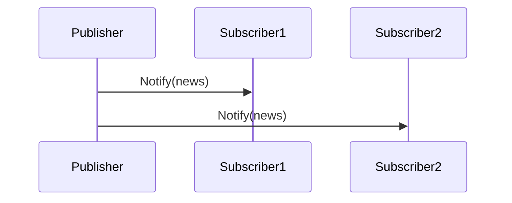

## 8.4.1 Observer Pattern with Callbacks and Signals

In the realm of software design, the Observer pattern plays a pivotal role in facilitating communication between objects in a system. This pattern is particularly useful in scenarios where changes in one object need to be communicated to other interested objects without creating tight coupling between them. In this section, we will delve into the implementation of the Observer pattern in Python, utilizing callbacks and signals to manage subscribers and notifications efficiently.

### Understanding the Observer Pattern

The Observer pattern establishes a one-to-many dependency between objects. When an object changes state, all its dependents are notified and updated automatically. This pattern is quintessential in event-driven programming, where the flow of the program is determined by events such as user interactions, sensor outputs, or messages from other programs.

#### Key Components of the Observer Pattern

- **Subject (Publisher):** The core component that maintains a list of observers and notifies them of any state changes.
- **Observer (Subscriber):** An object that registers interest in the subject's state changes and receives updates.
- **Notification Mechanism:** The process by which the subject informs observers of changes, often implemented via callbacks or signals.

### Implementing the Observer Pattern Using Callbacks

Callbacks in Python are functions that are passed as arguments to other functions and are invoked after a specific event or condition is met. This mechanism is a straightforward way to implement the Observer pattern.

#### Code Implementation

Let's explore a simple implementation of the Observer pattern using callbacks in Python:

```python
class NewsPublisher:
    def __init__(self):
        self.subscribers = []

    def register(self, subscriber):
        self.subscribers.append(subscriber)

    def unregister(self, subscriber):
        self.subscribers.remove(subscriber)

    def notify_subscribers(self, news):
        for subscriber in self.subscribers:
            subscriber(news)

def subscriber_one(news):
    print(f"Subscriber One received news: {news}")

def subscriber_two(news):
    print(f"Subscriber Two received news: {news}")

publisher = NewsPublisher()
publisher.register(subscriber_one)
publisher.register(subscriber_two)
publisher.notify_subscribers("Breaking News!")
```

#### Explanation

- **NewsPublisher:** Acts as the subject, maintaining a list of subscribers (observers).
- **register/unregister:** Methods to add or remove subscribers.
- **notify_subscribers:** Iterates over the list of subscribers and calls each one with the news update.
- **subscriber_one and subscriber_two:** Functions that act as observers, receiving updates from the publisher.

This implementation showcases how callbacks can be used to notify multiple observers of changes in the subject. However, as the number of subscribers grows, managing them efficiently becomes crucial.

### Implementing the Observer Pattern Using Signals

Signals provide a more robust and scalable mechanism for implementing the Observer pattern. In Python, the `blinker` library offers a simple yet powerful way to manage signals and slots.

#### Installing Blinker

To use `blinker`, you need to install it via pip:

```bash
pip install blinker
```

#### Code Implementation

Here is how you can implement the Observer pattern using signals with `blinker`:

```python
from blinker import signal

news_signal = signal('news')

def subscriber_one(sender, **kwargs):
    print(f"Subscriber One received news from {sender}: {kwargs['news']}")

def subscriber_two(sender, **kwargs):
    print(f"Subscriber Two received news from {sender}: {kwargs['news']}")

news_signal.connect(subscriber_one)
news_signal.connect(subscriber_two)

class NewsPublisher:
    def publish_news(self, news):
        news_signal.send(self, news=news)

publisher = NewsPublisher()
publisher.publish_news("Breaking News with Signals!")
```

#### Explanation

- **Signal Definition:** A signal named 'news' is created, which will be used to notify subscribers.
- **Observers:** Functions `subscriber_one` and `subscriber_two` are defined to handle the news updates.
- **Connection:** Observers are connected to the signal using `connect`.
- **NewsPublisher:** Sends the signal with the news content, notifying all connected observers.

### Best Practices for Using Signals

1. **Use Weak References:** To prevent memory leaks, especially in long-running applications, use weak references when connecting observers. This ensures that the garbage collector can reclaim unused objects.
   
   ```python
   news_signal.connect(subscriber_one, weak=True)
   ```

2. **Decouple Observers from Subjects:** Ensure that observers do not have direct dependencies on the subject. This promotes loose coupling and enhances modularity.

3. **Error Handling:** Implement error handling within observer functions to prevent failures in one observer from affecting others.

4. **Documentation and Naming Conventions:** Use clear naming conventions for signals and document their purpose to maintain readability and ease of maintenance.

### Visualizing the Observer Pattern

To better understand the flow of notifications from the subject to the observers, consider the following diagram:



In this sequence diagram, the `Publisher` sends notifications to `Subscriber1` and `Subscriber2`, illustrating the one-to-many relationship inherent in the Observer pattern.

### Key Points to Emphasize

- **Simplicity and Power of Python:** Python's functions and libraries make implementing the Observer pattern straightforward, offering both simplicity and power.
- **Signals for Robust Communication:** Signals provide a robust mechanism for decoupled communication, ideal for complex systems with numerous interactions.
- **Critical Role in Event-Driven Programming:** The Observer pattern is critical for event-driven programming, enabling responsive and interactive applications.

### Real-World Applications

The Observer pattern is widely used in various domains, including:

- **User Interface (UI) Frameworks:** To update UI components in response to user actions.
- **Distributed Systems:** For propagating changes across distributed nodes.
- **Notification Systems:** To alert users or systems about events or changes.

### Conclusion

The Observer pattern is a fundamental design pattern that facilitates communication between objects while maintaining loose coupling. By leveraging callbacks and signals in Python, developers can implement this pattern efficiently, creating systems that are both responsive and maintainable. As you continue to explore design patterns, consider how the Observer pattern can be applied to your projects, enhancing their modularity and scalability.

## Quiz Time!



### What is the primary purpose of the Observer pattern?

- [x] To establish a one-to-many dependency between objects
- [ ] To create a one-to-one relationship between objects
- [ ] To manage memory allocation in a program
- [ ] To enhance the speed of a program

> **Explanation:** The Observer pattern is designed to establish a one-to-many dependency, where changes in one object lead to notifications to its dependents.

### In the Observer pattern, what role does the 'subject' play?

- [x] It maintains a list of observers and notifies them of state changes
- [ ] It acts as a subscriber that receives updates
- [ ] It processes data and performs calculations
- [ ] It is responsible for rendering the user interface

> **Explanation:** The subject in the Observer pattern maintains a list of observers and is responsible for notifying them of any state changes.

### How are callbacks used in the Observer pattern?

- [x] Observers register callback functions with the subject
- [ ] The subject registers callback functions with the observers
- [ ] Callbacks are used to manage memory allocation
- [ ] Callbacks are irrelevant to the Observer pattern

> **Explanation:** In the Observer pattern, observers register callback functions with the subject, which are invoked when the subject's state changes.

### Which library in Python provides a robust mechanism for implementing signals?

- [x] Blinker
- [ ] NumPy
- [ ] Pandas
- [ ] Matplotlib

> **Explanation:** The `blinker` library in Python provides a robust mechanism for implementing signals and managing communication between objects.

### What is a key benefit of using signals over callbacks?

- [x] Signals provide a more decoupled communication mechanism
- [ ] Signals are faster than callbacks
- [ ] Signals require less memory than callbacks
- [ ] Signals are easier to implement than callbacks

> **Explanation:** Signals provide a more decoupled communication mechanism, allowing for better modularity and maintainability in complex systems.

### What is a best practice when using signals to prevent memory leaks?

- [x] Use weak references when connecting observers
- [ ] Use strong references when connecting observers
- [ ] Avoid using signals in long-running applications
- [ ] Always disconnect signals manually

> **Explanation:** Using weak references when connecting observers helps prevent memory leaks by allowing the garbage collector to reclaim unused objects.

### Why is it important to decouple observers from the subject?

- [x] To promote loose coupling and enhance modularity
- [ ] To increase the execution speed of the program
- [ ] To reduce the complexity of the observer code
- [ ] To ensure that the subject can operate independently

> **Explanation:** Decoupling observers from the subject promotes loose coupling and enhances modularity, making the system more maintainable and flexible.

### In the provided code example, what does the `notify_subscribers` method do?

- [x] It calls each registered subscriber with the news update
- [ ] It removes all subscribers from the list
- [ ] It adds a new subscriber to the list
- [ ] It sends a signal to unregister all subscribers

> **Explanation:** The `notify_subscribers` method iterates over the list of subscribers and calls each one with the news update.

### What is a common application of the Observer pattern in software development?

- [x] User Interface (UI) frameworks
- [ ] Database management
- [ ] File compression
- [ ] Network routing

> **Explanation:** The Observer pattern is commonly used in UI frameworks to update components in response to user actions or other events.

### True or False: The Observer pattern is only useful in object-oriented programming.

- [ ] True
- [x] False

> **Explanation:** The Observer pattern is not limited to object-oriented programming; it can be applied in various programming paradigms to manage dependencies and notifications.



By understanding and implementing the Observer pattern using callbacks and signals, you can create more dynamic and responsive applications. This pattern is a cornerstone of event-driven programming, enabling systems to react to changes and events efficiently.
