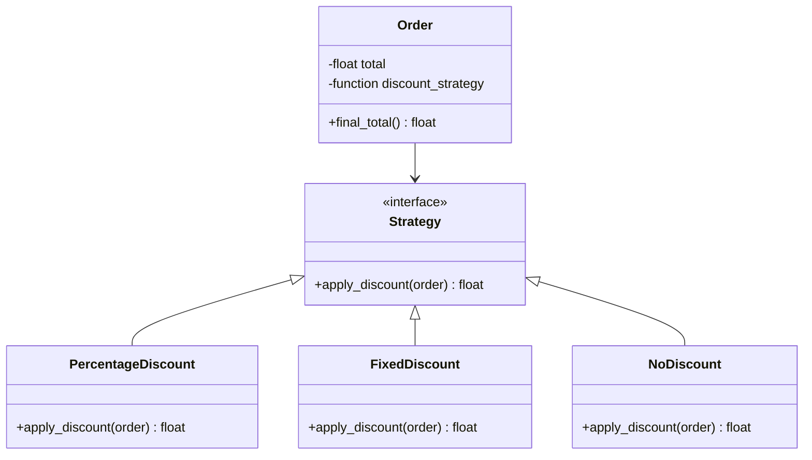

## 8.4.2 Strategy Pattern with Function Objects

In the realm of software design, the Strategy pattern stands out as a powerful tool for enabling flexibility and reusability. By allowing the selection of algorithms at runtime, it provides a way to define a family of algorithms, encapsulate each one, and make them interchangeable. This section delves into the implementation of the Strategy pattern in Python, utilizing the language's capability to treat functions as first-class objects.

### Understanding the Strategy Pattern

The Strategy pattern is a behavioral design pattern that defines a family of algorithms, encapsulates each one, and makes them interchangeable. This pattern lets the algorithm vary independently from clients that use it. In simpler terms, the Strategy pattern allows you to select an algorithm's behavior at runtime, which can be particularly useful when you need to switch between different methods of processing data or handling tasks.

#### Key Concepts

1. **Context**: This is the class that contains a reference to a strategy object. The context delegates the execution of the algorithm to the strategy object.
2. **Strategy**: This is an interface common to all concrete strategies. The context uses this interface to call the algorithm defined by a concrete strategy.
3. **Concrete Strategy**: These are classes that implement the strategy interface. Each concrete strategy implements a specific algorithm.

### Using Functions as Strategies in Python

Python's support for first-class functions allows us to use functions as strategies, simplifying the implementation of the Strategy pattern. Functions in Python can be passed around as objects, assigned to variables, and used as arguments to other functions. This flexibility makes them ideal for implementing the Strategy pattern without the need for additional classes.

#### Explanation

In Python, a function can encapsulate an algorithm and be passed around as an object. This means that instead of creating separate classes for each strategy, you can define functions that perform the desired operations and pass them to the context.

### Example Scenario: Discount Strategies in a Shopping Cart

Consider a shopping cart system where different discount strategies can be applied to an order. We can implement these strategies as functions and use them in our `Order` class to calculate the final total after applying the discount.

#### Code Example

```python
def percentage_discount(order):
    return order.total * 0.9  # 10% discount

def fixed_discount(order):
    return order.total - 5  # $5 discount

def no_discount(order):
    return order.total

class Order:
    def __init__(self, total, discount_strategy):
        self.total = total
        self.discount_strategy = discount_strategy

    def final_total(self):
        return self.discount_strategy(self)

order1 = Order(100, percentage_discount)
order2 = Order(100, fixed_discount)
order3 = Order(100, no_discount)

print(order1.final_total())  # Output: 90.0
print(order2.final_total())  # Output: 95.0
print(order3.final_total())  # Output: 100.0
```

#### Explanation

- **Order Class**: The `Order` class acts as the context in the Strategy pattern. It holds a reference to a discount strategy, which is a function in this case.
- **Discount Strategies**: The discount strategies are defined as functions. Each function takes an `Order` object as an argument and returns the total after applying the discount.
- **Flexibility**: The strategy can be easily changed by passing a different function to the `Order` class. This makes the system flexible and easy to extend with new strategies.

### Best Practices

When implementing the Strategy pattern using function objects in Python, consider the following best practices:

1. **Stateless Strategies**: Keep strategies stateless if possible. This ensures that the functions do not depend on any external state, making them easier to test and reuse.
2. **Consistent Interfaces**: Ensure that all strategy functions have consistent interfaces. This means that they should accept the same parameters and return similar types of results.
3. **Readability and Maintainability**: Using functions as strategies reduces boilerplate code and improves readability. It also makes the system easier to maintain, as adding new strategies is as simple as defining a new function.

### Visuals and Diagrams

To better understand the relationship between the context and strategies, consider the following diagram:



In this diagram, the `Order` class is the context that uses a strategy to calculate the final total. The strategy functions are represented as classes implementing the `Strategy` interface for illustrative purposes.

### Key Points to Emphasize

- **First-Class Functions**: Python's support for first-class functions simplifies the implementation of the Strategy pattern. By using functions as strategies, we reduce the need for additional classes and interfaces.
- **Reduced Boilerplate**: This approach minimizes boilerplate code, making the system more concise and easier to understand.
- **Improved Readability**: Functions provide a clear and direct way to implement strategies, enhancing the readability of the code.

### Real-World Applications

The Strategy pattern with function objects can be applied in various real-world scenarios, such as:

- **Payment Processing**: Different payment methods (credit card, PayPal, bank transfer) can be implemented as strategies.
- **Sorting Algorithms**: Different sorting algorithms (quick sort, merge sort, bubble sort) can be selected at runtime based on the data characteristics.
- **Logging Strategies**: Different logging strategies (console, file, remote server) can be used to handle log messages.

### Conclusion

The Strategy pattern is a versatile design pattern that, when implemented using function objects in Python, offers a clean and efficient way to manage interchangeable algorithms. By leveraging Python's capabilities, developers can create flexible, maintainable, and readable code that adapts to changing requirements with ease.

### Encourage Continued Learning

To further your understanding of design patterns and their applications in Python, consider exploring additional resources and experimenting with different patterns in your projects. Practice implementing the Strategy pattern in various contexts to solidify your grasp of its concepts and benefits.

## Quiz Time!



### What is the primary purpose of the Strategy pattern?

- [x] To allow the selection of an algorithm at runtime
- [ ] To provide a way to create complex objects
- [ ] To define a one-to-many dependency between objects
- [ ] To ensure a class has only one instance

> **Explanation:** The Strategy pattern allows for selecting an algorithm at runtime, making it flexible and adaptable to different scenarios.

### How are strategies implemented in the provided Python example?

- [x] As functions
- [ ] As classes
- [ ] As modules
- [ ] As objects

> **Explanation:** In the example, strategies are implemented as functions, taking advantage of Python's first-class functions.

### What is a benefit of using functions as strategies in Python?

- [x] Reduced boilerplate code
- [ ] Increased complexity
- [ ] Slower execution
- [ ] More memory usage

> **Explanation:** Using functions as strategies reduces boilerplate code, making the implementation more concise and readable.

### Which of the following is a best practice when implementing strategies?

- [x] Keep strategies stateless
- [ ] Use global variables
- [ ] Hardcode strategy logic
- [ ] Use complex inheritance

> **Explanation:** Keeping strategies stateless ensures they are easy to test and reuse, improving maintainability.

### What does the `Order` class represent in the Strategy pattern?

- [x] The context
- [ ] The strategy
- [ ] The concrete strategy
- [ ] The interface

> **Explanation:** The `Order` class acts as the context that holds a reference to a strategy function to calculate the final total.

### What is the role of the `final_total` method in the `Order` class?

- [x] To apply the selected discount strategy
- [ ] To initialize the order
- [ ] To create a new strategy
- [ ] To display order details

> **Explanation:** The `final_total` method applies the selected discount strategy to calculate the final total of the order.

### Which of the following is NOT a characteristic of the Strategy pattern?

- [x] It ensures a class has only one instance
- [ ] It allows algorithms to be selected at runtime
- [ ] It defines a family of algorithms
- [ ] It makes algorithms interchangeable

> **Explanation:** Ensuring a class has only one instance is a characteristic of the Singleton pattern, not the Strategy pattern.

### How can new strategies be added in the provided Python example?

- [x] By defining a new function
- [ ] By modifying the `Order` class
- [ ] By creating a new module
- [ ] By changing existing functions

> **Explanation:** New strategies can be added by simply defining a new function that implements the desired algorithm.

### What is a potential real-world application of the Strategy pattern?

- [x] Payment processing with different methods
- [ ] Creating a single instance of a class
- [ ] Defining a complex object structure
- [ ] Establishing a dependency between objects

> **Explanation:** The Strategy pattern can be used for payment processing, where different payment methods can be selected as strategies.

### True or False: The Strategy pattern can only be implemented using classes in Python.

- [ ] True
- [x] False

> **Explanation:** False. The Strategy pattern can be implemented using functions in Python, leveraging the language's support for first-class functions.


