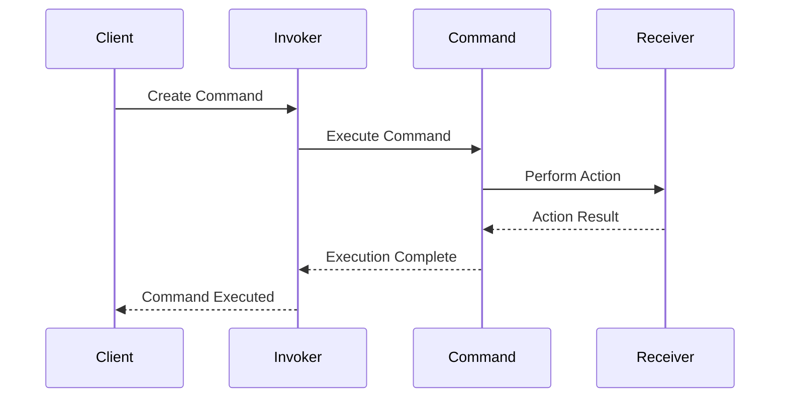

## 8.4.3 Command Pattern with Callable Objects

In the realm of software design patterns, the Command pattern stands out as a powerful tool for encapsulating requests as objects. This encapsulation allows for parameterization, queuing, logging, and even undoable operations. In this section, we will delve into the Command pattern, specifically focusing on its implementation in Python using callable objects. This approach not only leverages Python's dynamic nature but also provides a clean and flexible way to manage actions within your applications.

### Understanding the Command Pattern

Before we dive into the specifics of using callable objects in Python, let's briefly review the Command pattern itself. The Command pattern is a behavioral design pattern that turns a request into a stand-alone object containing all information about the request. This transformation allows requests to be parameterized with different inputs, delayed or queued for later execution, and even undone.

#### Core Components of the Command Pattern

1. **Command Interface**: This defines the interface for executing an operation.
2. **Concrete Command**: This implements the Command interface and defines the binding between a Receiver and an action.
3. **Receiver**: This is the object that performs the actual work when the command is executed.
4. **Invoker**: This asks the command to carry out the request.
5. **Client**: This creates a command and sets its receiver.

### Using Callable Objects in Python

In Python, any object that implements the `__call__` method is considered callable. This means that the object can be used like a function. This feature is particularly useful when implementing the Command pattern, as it allows us to encapsulate actions within objects that can be easily invoked.

#### Callable Objects: A Pythonic Approach

Callable objects in Python provide a flexible way to implement the Command pattern. By defining a class with a `__call__` method, we can create objects that behave like functions. This approach is beneficial when the command needs to maintain state or provide additional methods, such as an undo operation.

### Example Scenario: A Simple Calculator with Undo Functionality

To illustrate the use of callable objects in implementing the Command pattern, let's consider a simple calculator application. This calculator will support operations such as addition and will provide an undo functionality to revert the last operation.

#### Implementing the Calculator

We'll start by defining a `Calculator` class that maintains a current value and applies operations using command objects.

```python
class Calculator:
    def __init__(self):
        self.value = 0

    def operation(self, command):
        self.value = command(self.value)
        print(f"Current value: {self.value}")
```

In this implementation, the `operation` method takes a command object, invokes it with the current value, and updates the calculator's state.

#### Defining the AddCommand Class

Next, we'll create a `AddCommand` class that implements the `__call__` method to perform addition.

```python
class AddCommand:
    def __init__(self, operand):
        self.operand = operand

    def __call__(self, current_value):
        return current_value + self.operand

    def undo(self, current_value):
        return current_value - self.operand
```

The `AddCommand` class encapsulates an addition operation. It takes an operand during initialization and defines a `__call__` method to add this operand to a given value. The `undo` method provides the ability to reverse the operation.

#### Using the Command Pattern

Let's see how we can use these classes to perform operations and undo them.

```python
calculator = Calculator()
add_five = AddCommand(5)
calculator.operation(add_five)  # Output: Current value: 5
calculator.operation(add_five)  # Output: Current value: 10

calculator.value = add_five.undo(calculator.value)
print(f"After undo: {calculator.value}")  # Output: After undo: 5
```

In this example, we create a `Calculator` instance and an `AddCommand` to add 5. We perform the addition twice, then use the `undo` method to revert the last operation.

### Best Practices for Using Callable Objects

When implementing the Command pattern with callable objects in Python, consider the following best practices:

- **Encapsulation**: Ensure that each command object encapsulates all information needed for execution and undo. This includes any operands or parameters required for the operation.
- **State Management**: Use callable classes when the command needs to maintain state or provide additional methods beyond execution.
- **Flexibility and Extensibility**: Design your command objects to be easily extendable. This allows for adding new operations without modifying existing code, adhering to the Open/Closed Principle.

### Visualizing Command Execution

To better understand the flow of command execution, let's visualize the interaction between the components using a diagram.



In this sequence diagram, the Client creates a command and passes it to the Invoker. The Invoker executes the command, which interacts with the Receiver to perform the desired action. The result is then passed back through the command to the Invoker and finally to the Client.

### Key Points to Emphasize

- **Callable Objects**: Utilizing callable objects in Python provides a clean and intuitive way to implement the Command pattern. This approach leverages Python's dynamic nature and enhances code readability and maintainability.
- **Flexibility**: The Command pattern, when implemented with callable objects, enhances the flexibility and extensibility of action management within applications. This is particularly useful in scenarios requiring undoable operations or complex command sequences.

### Conclusion

The Command pattern is a versatile tool in software design, and implementing it using callable objects in Python offers a powerful and flexible approach. By encapsulating actions within callable objects, you can create applications that are both easy to extend and maintain. This approach not only simplifies the execution of commands but also provides a robust framework for implementing undo functionality and managing complex command sequences.

As you explore the Command pattern further, consider how callable objects can be applied to other scenarios in your projects. Whether you're building a command-line tool, a graphical user interface, or a complex enterprise application, the principles outlined here will serve as a solid foundation for effective action management.

## Quiz Time!



### What is a key benefit of using the Command pattern?

- [x] It encapsulates a request as an object, allowing for parameterization and queuing.
- [ ] It improves the performance of the application.
- [ ] It simplifies the user interface design.
- [ ] It reduces the memory usage of the application.

> **Explanation:** The Command pattern encapsulates a request as an object, which allows for parameterization, queuing, and even undoable operations.

### In Python, what makes an object callable?

- [x] Implementing the `__call__` method.
- [ ] Having a `run` method.
- [ ] Being an instance of a function.
- [ ] Having a `__main__` method.

> **Explanation:** In Python, any object that implements the `__call__` method is considered callable, meaning it can be used like a function.

### What is the role of the `Invoker` in the Command pattern?

- [x] It asks the command to carry out the request.
- [ ] It performs the actual work of the command.
- [ ] It defines the interface for executing an operation.
- [ ] It creates a command and sets its receiver.

> **Explanation:** The Invoker is responsible for asking the command to carry out the request, acting as a trigger for the command's execution.

### Which method in the `AddCommand` class is responsible for reversing the operation?

- [x] `undo`
- [ ] `__call__`
- [ ] `execute`
- [ ] `reverse`

> **Explanation:** The `undo` method in the `AddCommand` class is responsible for reversing the addition operation.

### Why are callable objects useful in implementing the Command pattern?

- [x] They provide a clean way to implement commands with state and additional methods.
- [ ] They are faster than regular functions.
- [ ] They simplify the user interface design.
- [ ] They reduce the memory usage of the application.

> **Explanation:** Callable objects are useful because they provide a clean and flexible way to implement commands, especially when state or additional methods are necessary.

### What is the primary purpose of the `Receiver` in the Command pattern?

- [x] To perform the actual work when the command is executed.
- [ ] To create a command and set its receiver.
- [ ] To encapsulate a request as an object.
- [ ] To ask the command to carry out the request.

> **Explanation:** The Receiver is the component that performs the actual work when the command is executed, acting on behalf of the command.

### What does the `Calculator` class do in the example?

- [x] It maintains a current value and applies operations using command objects.
- [ ] It performs addition operations directly.
- [ ] It creates command objects.
- [ ] It manages the user interface of the calculator.

> **Explanation:** The `Calculator` class maintains a current value and applies operations using command objects, demonstrating the use of the Command pattern.

### How does the `AddCommand` class encapsulate its operation?

- [x] By storing the operand and defining a `__call__` method to perform addition.
- [ ] By directly modifying the calculator's value.
- [ ] By using a global variable to store the operand.
- [ ] By implementing a `calculate` method.

> **Explanation:** The `AddCommand` class encapsulates its operation by storing the operand and defining a `__call__` method to perform addition when invoked.

### What is the benefit of using the `undo` method in command objects?

- [x] It allows for reversing the last operation, providing undo functionality.
- [ ] It speeds up the execution of commands.
- [ ] It simplifies the command execution process.
- [ ] It reduces the complexity of the command objects.

> **Explanation:** The `undo` method allows for reversing the last operation, providing undo functionality, which is a key feature of the Command pattern.

### True or False: The Command pattern is only useful in Python.

- [x] False
- [ ] True

> **Explanation:** The Command pattern is a general design pattern applicable in many programming languages, not just Python. It is useful wherever there is a need to encapsulate requests as objects.


