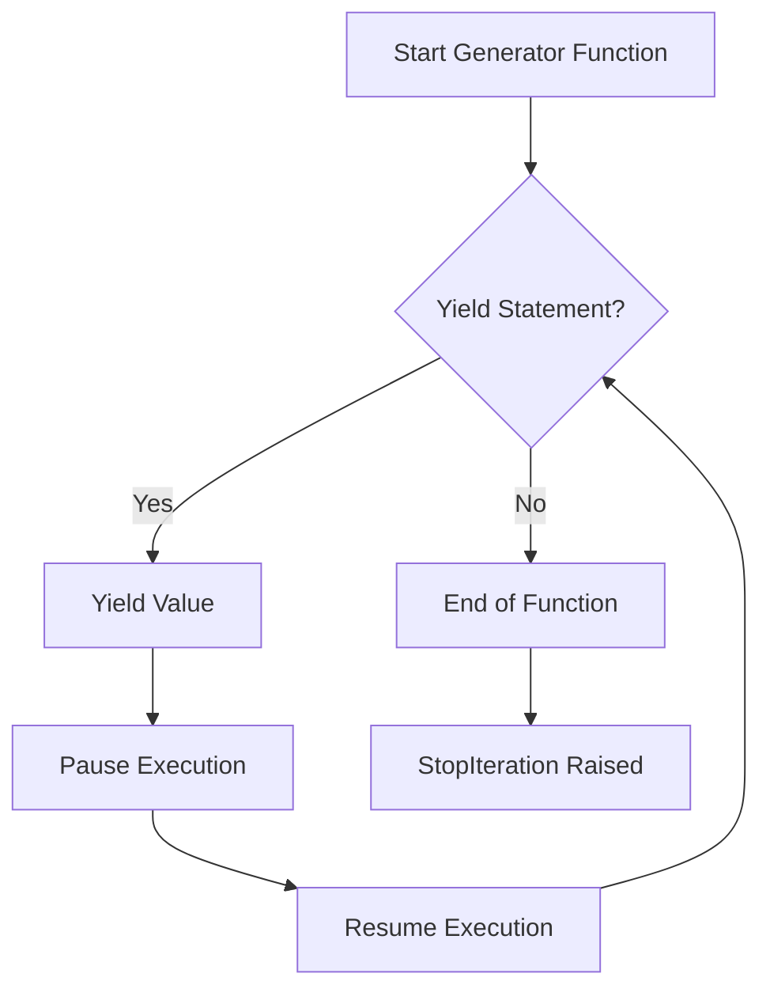

## 8.4.4 Iterator Pattern and Generator Functions

In the realm of software design, the **Iterator Pattern** is a fundamental concept that provides a way to access the elements of an aggregate object sequentially without exposing its underlying representation. This pattern is particularly useful when dealing with collections of objects, allowing for iteration over complex data structures in a consistent manner. In Python, the implementation of this pattern is greatly simplified by the language's native support for iterators and generator functions. This section will explore the Iterator Pattern in detail, focusing on how Python's features make it both natural and efficient to implement.

### Understanding the Iterator Pattern

The Iterator Pattern is a behavioral design pattern that abstracts the process of iterating over a collection of objects. It decouples the algorithm from the collection itself, allowing for flexible traversal strategies. In essence, the pattern involves the following key components:

1. **Iterator**: An object that encapsulates the iteration logic and provides access to the elements of a collection.
2. **Aggregate**: The collection of objects that the iterator will traverse.
3. **Client**: The entity that uses the iterator to access elements of the aggregate.

The primary goal of the Iterator Pattern is to provide a uniform interface for traversing different types of collections, enabling clients to iterate over them without needing to know their internal structure.

### Python's Iterator Protocol

Python's iterator protocol is a core part of the language, providing a standardized way to implement iteration. It consists of two main methods:

- `__iter__()`: Returns the iterator object itself. This method is called when an iterator is initialized.
- `__next__()`: Returns the next item from the collection. If there are no more items, it raises the `StopIteration` exception.

Here's a simple example to illustrate the iterator protocol:

```python
class SimpleIterator:
    def __init__(self, data):
        self.data = data
        self.index = 0

    def __iter__(self):
        return self

    def __next__(self):
        if self.index < len(self.data):
            result = self.data[self.index]
            self.index += 1
            return result
        else:
            raise StopIteration

simple_iter = SimpleIterator([1, 2, 3])
for item in simple_iter:
    print(item)  # Output: 1 2 3
```

In this example, `SimpleIterator` implements the iterator protocol, allowing it to be used in a `for` loop.

### Generator Functions: A Pythonic Approach

Python provides a more concise and elegant way to create iterators using **generator functions**. A generator function is defined like a normal function but uses the `yield` statement to return data. Each time `yield` is called, the function's state is saved, and it can be resumed later from where it left off. This makes generators an ideal tool for implementing the Iterator Pattern.

#### How Generators Work

When a generator function is called, it returns a generator object without starting execution immediately. Each call to the generator's `__next__()` method resumes execution until the next `yield` statement is encountered. Here's a simple example:

```python
def simple_generator():
    yield 1
    yield 2
    yield 3

for value in simple_generator():
    print(value)  # Output: 1 2 3
```

In this example, `simple_generator` yields values one at a time, pausing between each yield.

#### Fibonacci Sequence Example

To illustrate the power of generators, let's consider a function that generates numbers in the Fibonacci sequence:

```python
def fibonacci(n):
    a, b = 0, 1
    while a < n:
        yield a
        a, b = b, a + b

for num in fibonacci(10):
    print(num)  # Output: 0 1 1 2 3 5 8
```

**Explanation**: The `fibonacci` function yields numbers in the Fibonacci sequence up to `n`. Each call to `yield` pauses the function, allowing it to resume later and continue generating the sequence.

### Implementing Custom Iterables

While generators provide a simple way to create iterators, there are cases where you may need to implement custom iterable objects. This involves defining a class with `__iter__()` and `__next__()` methods.

#### Custom Range Example

Consider a custom range class that mimics Python's built-in `range` function:

```python
class CustomRange:
    def __init__(self, start, end):
        self.current = start
        self.end = end

    def __iter__(self):
        return self

    def __next__(self):
        if self.current >= self.end:
            raise StopIteration
        value = self.current
        self.current += 1
        return value

for num in CustomRange(1, 5):
    print(num)  # Output: 1 2 3 4
```

**Explanation**: The `CustomRange` class implements the iterator protocol, allowing it to be used in a `for` loop. The `__next__()` method raises `StopIteration` when the end of the range is reached.

### Best Practices for Iterators and Generators

To effectively use iterators and generators in Python, consider the following best practices:

- **Use Generators for Simplicity**: Generators provide a clean and concise way to implement iterators. They are especially useful for large datasets or streams where you want to avoid loading everything into memory at once.
  
- **Handle StopIteration Gracefully**: When implementing custom iterators, ensure that `StopIteration` is raised appropriately to signal the end of iteration. This is crucial for proper functioning in loops.

- **Leverage Python's Built-in Iterators**: Python offers a variety of built-in iterators such as `range`, `enumerate`, and `zip`. These can often be used directly, reducing the need for custom implementations.

### Visualizing Generator Flow

To better understand how generator functions work, consider the following control flow diagram:



This diagram illustrates the flow of control in a generator function. Execution starts, and each `yield` statement pauses the function, allowing it to resume later.

### Key Points to Emphasize

- **Python's Native Support**: Python's built-in iterator protocol and generator functions make implementing the Iterator Pattern straightforward and efficient. These features are integral to Python's design, providing powerful tools for iteration.

- **Crucial for Python Programming**: Understanding iterators and generators is essential for effective Python programming. They are widely used in Python's standard library and many third-party packages.

### Conclusion

The Iterator Pattern is a vital concept in software design, providing a consistent way to traverse collections of objects. In Python, the implementation of this pattern is greatly simplified by the language's support for iterators and generator functions. By leveraging these features, you can create efficient and elegant solutions for iterating over data.

As you continue your journey in software design, remember the power of Python's iterators and generators. They are not only tools for iteration but also gateways to more advanced programming techniques such as lazy evaluation and asynchronous programming.

---

## Quiz Time!



### What is the primary purpose of the Iterator Pattern?

- [x] To provide a way to access elements of an aggregate object sequentially without exposing its underlying representation.
- [ ] To modify elements of an aggregate object.
- [ ] To sort elements of an aggregate object.
- [ ] To delete elements from an aggregate object.

> **Explanation:** The Iterator Pattern provides a way to access elements of an aggregate object sequentially without exposing its underlying representation, allowing for flexible traversal strategies.

### Which method must be implemented to make a class iterable in Python?

- [x] `__iter__()`
- [ ] `__str__()`
- [ ] `__len__()`
- [ ] `__repr__()`

> **Explanation:** To make a class iterable, it must implement the `__iter__()` method, which returns an iterator object.

### What exception is raised to signal the end of iteration in Python?

- [x] `StopIteration`
- [ ] `EndOfIteration`
- [ ] `IterationComplete`
- [ ] `NoMoreItems`

> **Explanation:** The `StopIteration` exception is raised to signal the end of iteration in Python.

### What does the `yield` keyword do in a generator function?

- [x] Pauses the function and returns a value to the caller.
- [ ] Ends the function immediately.
- [ ] Continues the function without returning a value.
- [ ] Raises an exception.

> **Explanation:** The `yield` keyword pauses the function and returns a value to the caller. The function can be resumed later from where it left off.

### How do you resume a generator function after it has been paused?

- [x] By calling the generator's `__next__()` method.
- [ ] By calling the generator's `resume()` method.
- [ ] By restarting the generator function.
- [ ] By calling the generator's `reset()` method.

> **Explanation:** A generator function is resumed by calling its `__next__()` method, which continues execution until the next `yield` statement is encountered.

### In the context of iterators, what is the role of the `__next__()` method?

- [x] To return the next item from the collection.
- [ ] To initialize the iterator.
- [ ] To reset the iterator.
- [ ] To delete the current item.

> **Explanation:** The `__next__()` method returns the next item from the collection and raises `StopIteration` when there are no more items.

### Which of the following is a built-in Python iterator?

- [x] `range`
- [ ] `list`
- [x] `enumerate`
- [ ] `dict`

> **Explanation:** Both `range` and `enumerate` are built-in Python iterators, providing efficient ways to iterate over sequences.

### What is a key advantage of using generator functions in Python?

- [x] They provide a memory-efficient way to iterate over large datasets.
- [ ] They automatically sort data.
- [ ] They increase the speed of iteration.
- [ ] They convert data into strings.

> **Explanation:** Generator functions provide a memory-efficient way to iterate over large datasets because they yield items one at a time, rather than loading the entire dataset into memory.

### What happens if a generator function does not contain a `yield` statement?

- [x] It returns a regular function object instead of a generator object.
- [ ] It raises a `SyntaxError`.
- [ ] It returns `None`.
- [ ] It runs indefinitely.

> **Explanation:** If a generator function does not contain a `yield` statement, it returns a regular function object instead of a generator object.

### True or False: Generators can be used to implement asynchronous programming in Python.

- [x] True
- [ ] False

> **Explanation:** True. Generators can be used to implement asynchronous programming in Python, especially with the introduction of `async` and `await` in Python 3.5, which allow generators to be used in asynchronous contexts.


