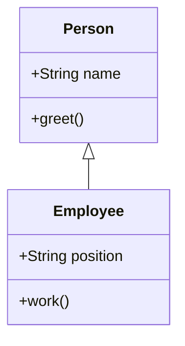

## 9.1.1 Prototypal Inheritance and ES6 Classes

JavaScript, with its unique approach to inheritance and object orientation, stands apart from many classical programming languages. This chapter delves into the intricacies of JavaScript's prototypal inheritance and the modern ES6 class syntax, illustrating their significance in the realm of design patterns.

### Understanding Prototypal Inheritance

JavaScript's inheritance model is based on prototypes, a concept that can be initially perplexing to those accustomed to classical inheritance. In JavaScript, objects inherit directly from other objects, forming a chain known as the prototype chain.

#### Definition and Explanation

In JavaScript, every object has an internal property called `[[Prototype]]`. This prototype can be accessed via `Object.getPrototypeOf(obj)` or the `__proto__` property. Unlike class-based languages, where classes define the blueprint for objects, JavaScript uses this prototype-based approach to share properties and methods across objects.

##### The Prototype Chain

The prototype chain is a mechanism by which JavaScript objects inherit properties and methods. When a property or method is accessed on an object, JavaScript first looks for it on the object itself. If not found, it traverses up the prototype chain, checking each prototype until it either finds the property or reaches the end of the chain.

```javascript
// Example of a prototype chain
function Animal(name) {
  this.name = name;
}

Animal.prototype.speak = function() {
  console.log(`${this.name} makes a noise.`);
};

function Dog(name, breed) {
  Animal.call(this, name);
  this.breed = breed;
}

Dog.prototype = Object.create(Animal.prototype);
Dog.prototype.constructor = Dog;

Dog.prototype.bark = function() {
  console.log(`${this.name} barks.`);
};

const rex = new Dog('Rex', 'German Shepherd');
rex.speak(); // Output: Rex makes a noise.
rex.bark();  // Output: Rex barks.
```

In this example, `Dog` inherits from `Animal`, and both `speak` and `bark` methods are accessible to instances of `Dog` due to the prototype chain.

##### Creating Objects

JavaScript offers several ways to create objects, each with its nuances and use cases:

1. **Object Literals:**

   The simplest way to create objects is using object literals.

   ```javascript
   const car = {
     make: 'Toyota',
     model: 'Corolla',
     drive() {
       console.log('Driving...');
     }
   };
   ```

2. **Constructor Functions:**

   Constructor functions are a traditional way to create objects and set up inheritance.

   ```javascript
   function Car(make, model) {
     this.make = make;
     this.model = model;
   }

   Car.prototype.drive = function() {
     console.log('Driving...');
   };

   const myCar = new Car('Toyota', 'Corolla');
   ```

3. **`Object.create()`:**

   This method creates a new object with the specified prototype object and properties.

   ```javascript
   const vehicle = {
     start() {
       console.log('Starting...');
     }
   };

   const bike = Object.create(vehicle);
   bike.start(); // Output: Starting...
   ```

#### Examples of Prototypal Inheritance

Let's explore a practical example using a constructor function and prototypes:

```javascript
function Person(name) {
  this.name = name;
}

Person.prototype.greet = function() {
  console.log(`Hello, my name is ${this.name}.`);
};

const alice = new Person('Alice');
alice.greet();  // Output: Hello, my name is Alice.
```

In this example, `Person` is a constructor function, and `greet` is a method added to `Person.prototype`. Instances of `Person` can access `greet` through the prototype chain.

### ES6 Classes: A Modern Approach

With the introduction of ES6 (ECMAScript 2015), JavaScript gained a new syntax for creating objects and handling inheritance: classes. While classes in JavaScript do not introduce new functionality, they provide a more familiar syntax for developers coming from class-based languages.

#### Introduction to ES6 Classes

ES6 classes are syntactic sugar over JavaScript's existing prototype-based inheritance. They offer a cleaner and more concise way to create objects and handle inheritance, making the code more readable and maintainable.

Classes in JavaScript are essentially functions. They provide a way to define constructor methods, instance methods, static methods, and inheritance through the `extends` keyword.

#### Class Syntax

Here's how you define a class in JavaScript using the `class` keyword:

```javascript
class Person {
  constructor(name) {
    this.name = name;
  }

  greet() {
    console.log(`Hello, my name is ${this.name}.`);
  }
}

const bob = new Person('Bob');
bob.greet();  // Output: Hello, my name is Bob.
```

In this example, `Person` is a class with a constructor method and an instance method `greet`.

##### Inheritance with ES6 Classes

ES6 classes make inheritance straightforward using the `extends` keyword and the `super` function to call the parent class's constructor.

```javascript
class Employee extends Person {
  constructor(name, position) {
    super(name);
    this.position = position;
  }

  work() {
    console.log(`${this.name} is working as a ${this.position}.`);
  }
}

const carol = new Employee('Carol', 'Developer');
carol.greet();  // Output: Hello, my name is Carol.
carol.work();   // Output: Carol is working as a Developer.
```

In this example, `Employee` extends `Person`, inheriting its properties and methods while adding its own.

### Impact on Design Patterns

Understanding JavaScript's inheritance model is crucial for implementing design patterns effectively. Both prototypal inheritance and ES6 classes play significant roles in this context.

#### Prototypal Inheritance and Patterns

Prototypal inheritance is fundamental for implementing patterns that rely on inheritance, such as the **Decorator** and **Observer** patterns. By leveraging prototypes, developers can extend objects dynamically and create flexible, reusable components.

#### ES6 Classes and Patterns

ES6 classes simplify the implementation of class-based patterns, making the code more intuitive and maintainable. Patterns such as **Singleton**, **Factory**, and **Strategy** can be implemented more cleanly using ES6 class syntax.

### Visualizing Inheritance with Diagrams

To better understand the relationships between classes and prototypes, let's use a Mermaid.js class diagram:



This diagram illustrates how `Employee` inherits from `Person`, showcasing the hierarchical relationship.

### Key Points to Emphasize

- **JavaScript Prototypes:** Prototypes provide the foundation for inheritance in JavaScript, allowing objects to inherit properties and methods from other objects.
- **ES6 Classes:** While classes offer a cleaner syntax, they are built on top of the prototype-based system, making an understanding of prototypes essential.
- **Design Patterns:** Both prototypal inheritance and ES6 classes are instrumental in implementing design patterns, offering flexibility and readability.

### Conclusion

JavaScript's approach to inheritance, through both prototypal inheritance and ES6 classes, offers powerful tools for developers. By understanding these concepts, you can effectively implement design patterns, creating robust and maintainable code. Whether you prefer the traditional prototype-based approach or the modern class syntax, both paradigms provide the flexibility needed to tackle complex software design challenges.

## Quiz Time!



### What is the primary mechanism for inheritance in JavaScript?

- [x] Prototypes
- [ ] Classes
- [ ] Interfaces
- [ ] Modules

> **Explanation:** JavaScript uses prototypes as the primary mechanism for inheritance, allowing objects to inherit directly from other objects.

### How can you access the prototype of an object in JavaScript?

- [x] `Object.getPrototypeOf(obj)`
- [ ] `obj.prototype`
- [ ] `Object.prototypeOf(obj)`
- [ ] `obj.getPrototype()`

> **Explanation:** The prototype of an object can be accessed using `Object.getPrototypeOf(obj)`.

### What keyword is used to define a class in ES6?

- [x] `class`
- [ ] `function`
- [ ] `object`
- [ ] `prototype`

> **Explanation:** The `class` keyword is used to define a class in ES6.

### How do you call a parent class's constructor in an ES6 class?

- [x] `super()`
- [ ] `parent()`
- [ ] `base()`
- [ ] `constructor()`

> **Explanation:** The `super()` function is used to call the parent class's constructor in an ES6 class.

### Which method is used to create an object with a specified prototype?

- [x] `Object.create()`
- [ ] `new Object()`
- [ ] `Object.prototype()`
- [ ] `Object.new()`

> **Explanation:** `Object.create()` is used to create an object with a specified prototype.

### In ES6, how do you extend a class to create a subclass?

- [x] `extends`
- [ ] `inherits`
- [ ] `derives`
- [ ] `subclass`

> **Explanation:** The `extends` keyword is used to create a subclass in ES6.

### What is the output of the following code snippet?

```javascript
class Animal {
  constructor(name) {
    this.name = name;
  }
  speak() {
    console.log(`${this.name} makes a noise.`);
  }
}

class Dog extends Animal {
  speak() {
    console.log(`${this.name} barks.`);
  }
}

const dog = new Dog('Rex');
dog.speak();
```

- [x] Rex barks.
- [ ] Rex makes a noise.
- [ ] Error
- [ ] undefined

> **Explanation:** The `speak` method in `Dog` overrides the `speak` method in `Animal`, so it outputs "Rex barks."

### Which of the following statements about ES6 classes is true?

- [x] They are syntactic sugar over JavaScript's existing prototype-based inheritance.
- [ ] They introduce a new inheritance model in JavaScript.
- [ ] They eliminate the need for prototypes.
- [ ] They are not related to functions.

> **Explanation:** ES6 classes are syntactic sugar over the existing prototype-based inheritance model in JavaScript.

### What is the purpose of the `constructor` method in an ES6 class?

- [x] To initialize object properties
- [ ] To define static methods
- [ ] To create private variables
- [ ] To inherit from other classes

> **Explanation:** The `constructor` method is used to initialize object properties when a new instance of the class is created.

### True or False: ES6 classes cannot have static methods.

- [ ] True
- [x] False

> **Explanation:** False. ES6 classes can have static methods, which are called on the class itself rather than on instances of the class.


