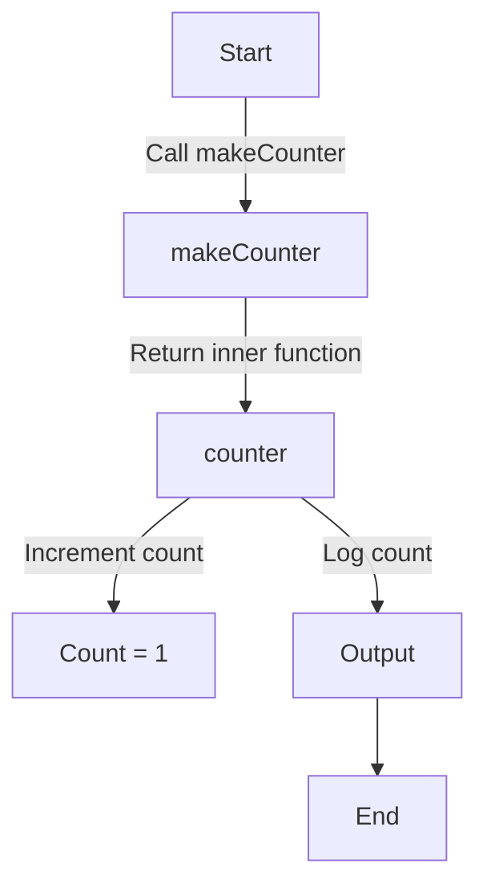

## 9.1.2 Closures and Scope

JavaScript is a language rich with features that lend themselves well to implementing design patterns. Among these features, closures and scope are fundamental concepts that enable developers to write flexible and encapsulated code. This section will explore these concepts in depth, illustrating how they can be leveraged to implement robust design patterns.

### Understanding JavaScript's Function and Block Scope

JavaScript's handling of scope is crucial for understanding how closures work. Scope determines the accessibility of variables and functions at various parts of your code. JavaScript primarily uses two types of scope: function scope and block scope.

#### Function Scope

Function scope means that variables declared within a function are only accessible within that function. This is achieved using the `var` keyword. Consider the following example:

```javascript
function greet() {
  var message = "Hello, World!";
  console.log(message); // Output: Hello, World!
}

greet();
console.log(message); // Error: message is not defined
```

In this example, `message` is only accessible within the `greet` function. Attempting to access it outside results in an error.

#### Block Scope

Block scope, introduced in ECMAScript 6 (ES6), allows variables to be scoped to the nearest enclosing block, which can be a function, loop, or conditional. This is achieved using `let` and `const`.

```javascript
if (true) {
  let blockScoped = "I am block scoped!";
  console.log(blockScoped); // Output: I am block scoped!
}

console.log(blockScoped); // Error: blockScoped is not defined
```

Here, `blockScoped` is only accessible within the `if` block. This behavior is different from `var`, which does not respect block boundaries.

#### Variable Hoisting

JavaScript's variable hoisting is a behavior where variable declarations are moved to the top of their containing scope during the compile phase. However, only the declarations are hoisted, not the initializations.

```javascript
console.log(hoistedVar); // Output: undefined
var hoistedVar = "This is hoisted!";
```

In this example, `hoistedVar` is declared at the top of its scope, but it is initialized where it appears in the code. This can lead to unexpected behavior if not understood properly.

### Closures: A Powerful Feature of JavaScript

Closures are one of the most powerful and often misunderstood features of JavaScript. A closure is a function that retains access to its lexical scope, even when the function is executed outside of its original scope.

#### Definition and Creation of Closures

A closure is created when a function is defined within another function, and the inner function accesses variables from the outer function. This allows the inner function to "remember" its environment.

```javascript
function makeCounter() {
  let count = 0;
  return function() {
    count += 1;
    console.log(count);
  };
}

const counter = makeCounter();
counter();  // Output: 1
counter();  // Output: 2
```

In this example, `makeCounter` returns a function that increments and logs the `count` variable. The `counter` function retains access to the `count` variable even after `makeCounter` has finished executing, demonstrating a closure.

#### How Closures Work

To understand how closures work, consider the lifecycle of the `count` variable. When `makeCounter` is called, it creates a new execution context with its own `count` variable. The returned function maintains a reference to this context, allowing it to access and modify `count` even after `makeCounter` has completed.

This behavior is what makes closures so powerful—they enable functions to have private variables that persist across multiple invocations.

### Applications of Closures in Design Patterns

Closures play a crucial role in implementing several design patterns in JavaScript, particularly those that require encapsulation and private state.

#### The Module Pattern

The Module Pattern is a classic design pattern used to encapsulate private data and expose public methods. It leverages closures to create private variables and functions.

```javascript
const Module = (function() {
  let privateVar = 'I am private';

  function privateMethod() {
    console.log(privateVar);
  }

  return {
    publicMethod: function() {
      privateMethod();
    }
  };
})();

Module.publicMethod();  // Output: I am private
```

In this example, `privateVar` and `privateMethod` are not accessible from outside the module, but `publicMethod` can access them through closure. This encapsulation is a fundamental aspect of the Module Pattern.

#### Relevance to Other Patterns

Closures are also integral to other design patterns such as Singleton, Observer, and Strategy.

- **Singleton Pattern:** Closures can ensure that a class has only one instance by encapsulating the instance variable within a closure.
- **Observer Pattern:** Closures can maintain a list of subscribers and notify them of changes, encapsulating the subscription logic.
- **Strategy Pattern:** Closures allow different algorithms to be encapsulated and swapped out, maintaining state across function calls.

### Visualizing Closures

Understanding closures can be enhanced with visual aids. The following flowchart illustrates the creation and execution of closures in the `makeCounter` example:



This diagram shows how the `makeCounter` function returns an inner function that retains access to the `count` variable, allowing it to persist across multiple calls to `counter`.

### Key Points to Emphasize

- **Encapsulation:** Closures enable data encapsulation, allowing functions to have private variables that persist across invocations.
- **Flexibility:** By retaining access to their lexical scope, closures provide flexibility in managing state and behavior.
- **Design Patterns:** Understanding closures is essential for implementing design patterns effectively, as they facilitate the encapsulation of state and behavior.

### Conclusion

Closures and scope are fundamental concepts in JavaScript that empower developers to write more encapsulated and flexible code. By understanding and leveraging these features, you can implement design patterns more effectively, leading to cleaner and more maintainable codebases.

Closures, in particular, allow for powerful encapsulation techniques that are crucial in modern software development. Whether you're implementing a Module Pattern or managing state with a Singleton, closures provide the necessary tools to encapsulate data and behavior.

As you continue to explore JavaScript and its capabilities, remember that closures are not just a theoretical concept but a practical tool that can enhance your coding practices and design pattern implementations.

## Quiz Time!



### What is function scope in JavaScript?

- [x] Variables declared inside a function are only accessible within that function.
- [ ] Variables declared with `var` are globally accessible.
- [ ] Variables declared with `let` and `const` are not block-scoped.
- [ ] Variables declared inside a block are accessible outside the block.

> **Explanation:** Function scope means that variables declared within a function are only accessible within that function, which is the case with `var`.

### How does block scope differ from function scope?

- [x] Block scope allows variables to be scoped to the nearest enclosing block.
- [ ] Block scope variables are globally accessible.
- [ ] Function scope variables are accessible in any block.
- [ ] Block scope does not exist in JavaScript.

> **Explanation:** Block scope, introduced with `let` and `const`, allows variables to be scoped to the nearest enclosing block, such as loops or conditionals.

### What is variable hoisting?

- [x] The process where variable declarations are moved to the top of their containing scope during the compile phase.
- [ ] The process where variable initializations are moved to the top of their containing scope.
- [ ] A feature that only applies to `let` and `const`.
- [ ] A feature that prevents variables from being declared after use.

> **Explanation:** Variable hoisting is the behavior where variable declarations are moved to the top of their containing scope during the compile phase, but initializations are not hoisted.

### What is a closure in JavaScript?

- [x] A function that retains access to its lexical scope even when executed outside of its original scope.
- [ ] A function that can only be executed within its original scope.
- [ ] A function that does not have access to its parent scope.
- [ ] A function that is executed immediately after its declaration.

> **Explanation:** A closure is a function that retains access to its lexical scope, allowing it to access variables from its parent scope even when executed outside of that scope.

### How does the Module Pattern utilize closures?

- [x] By encapsulating private data and exposing public methods through closures.
- [ ] By making all data and methods public.
- [ ] By using global variables to store private data.
- [ ] By not using closures at all.

> **Explanation:** The Module Pattern uses closures to encapsulate private data and expose public methods, allowing for encapsulation and data hiding.

### Why are closures important for design patterns like Singleton?

- [x] They allow encapsulation of state, ensuring a single instance.
- [ ] They prevent any state from being maintained.
- [ ] They make all variables global.
- [ ] They do not affect design patterns.

> **Explanation:** Closures are important for the Singleton Pattern because they allow the encapsulation of state, ensuring that only one instance is maintained.

### What is the main benefit of using closures in the Observer Pattern?

- [x] They maintain a list of subscribers and encapsulate subscription logic.
- [ ] They prevent any state from being shared.
- [ ] They make all subscribers globally accessible.
- [ ] They do not affect the Observer Pattern.

> **Explanation:** Closures in the Observer Pattern maintain a list of subscribers and encapsulate the subscription logic, allowing for efficient state management.

### How do closures contribute to the Strategy Pattern?

- [x] They allow different algorithms to be encapsulated and swapped out.
- [ ] They prevent any algorithm from being changed.
- [ ] They make all algorithms globally accessible.
- [ ] They do not affect the Strategy Pattern.

> **Explanation:** Closures contribute to the Strategy Pattern by allowing different algorithms to be encapsulated and swapped out, maintaining state across function calls.

### What is a key feature of closures?

- [x] They enable functions to have private variables that persist across invocations.
- [ ] They make all variables globally accessible.
- [ ] They prevent any state from being maintained.
- [ ] They are only used in asynchronous programming.

> **Explanation:** A key feature of closures is that they enable functions to have private variables that persist across invocations, providing encapsulation and state management.

### True or False: Closures can only be used in JavaScript.

- [ ] True
- [x] False

> **Explanation:** False. Closures are not unique to JavaScript and can be found in many programming languages that support first-class functions and lexical scoping.


