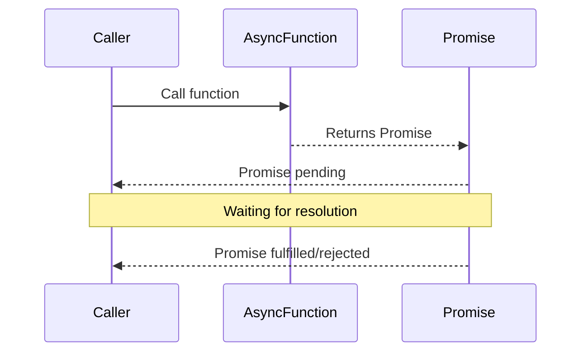

## 9.1.3 Asynchronous Programming and Promises

JavaScript, a language that powers much of the modern web, is inherently asynchronous. This asynchronous nature allows JavaScript to handle multiple tasks simultaneously, making it highly efficient for web applications where responsiveness is crucial. In this section, we will delve into how JavaScript manages asynchronous operations using Promises and async/await, and how these features impact the implementation of design patterns, particularly those involving asynchronous workflows.

### The Asynchronous Nature of JavaScript

#### The Event Loop

To understand asynchronous programming in JavaScript, one must first grasp the concept of the event loop. JavaScript is single-threaded, meaning it can execute one piece of code at a time. However, it can manage multiple tasks concurrently through the event loop, which is a fundamental part of the JavaScript runtime environment.

- **Call Stack:** This is where the execution context of code is managed. JavaScript functions are pushed onto the call stack when they are invoked and popped off when they are completed.
- **Task Queue:** Also known as the message queue, it holds messages (tasks) to be processed. These tasks are added to the queue when asynchronous operations, like network requests or timers, are completed.
- **Event Loop:** The event loop continuously checks the call stack to see if it's empty. If it is, it takes the first task from the task queue and pushes it onto the call stack, effectively executing it.

This mechanism allows JavaScript to perform non-blocking operations, enabling the execution of other code while waiting for asynchronous tasks to complete.

#### Callback Functions

Before the advent of Promises, JavaScript developers relied heavily on callback functions to handle asynchronous tasks. A callback function is a function passed as an argument to another function, which is then executed once the asynchronous operation is complete.

**Example of a Callback:**

```javascript
function fetchData(callback) {
  setTimeout(() => {
    const data = { id: 1, message: 'Hello, world!' };
    callback(null, data);
  }, 1000);
}

fetchData((error, data) => {
  if (error) {
    console.error(error);
  } else {
    console.log(data);
  }
});
```

While effective, callbacks can lead to complex code structures known as "callback hell," where multiple nested callbacks make code difficult to read and maintain.

### Promises: A Modern Solution

#### Definition

A Promise in JavaScript is an object that represents the eventual completion (or failure) of an asynchronous operation and its resulting value. Promises provide a more structured way to handle asynchronous code, avoiding the pitfalls of callback hell.

#### Creating and Using Promises

Promises have three states:

- **Pending:** The initial state, neither fulfilled nor rejected.
- **Fulfilled:** The operation completed successfully.
- **Rejected:** The operation failed.

**Basic Promise Example:**

```javascript
const fetchData = new Promise((resolve, reject) => {
  setTimeout(() => {
    const data = { id: 1, message: 'Hello, world!' };
    resolve(data);
  }, 1000);
});

fetchData
  .then(data => {
    console.log(data);
  })
  .catch(error => {
    console.error(error);
  });
```

In this example, `fetchData` is a Promise that resolves after one second with a data object. The `.then()` method is used to handle the resolved value, while `.catch()` handles any errors that occur during the operation.

#### Promise Methods

- **`.then(onFulfilled, onRejected)`:** Attaches callbacks for the resolution and rejection of the Promise.
- **`.catch(onRejected)`:** Attaches a callback for only the rejection of the Promise.
- **`.finally(onFinally)`:** Executes a callback once the Promise is settled, regardless of its outcome.

### Async/Await: Simplifying Asynchronous Code

#### Introduction

Async/await is syntactic sugar built on top of Promises, introduced in ECMAScript 2017 (ES8). It allows developers to write asynchronous code that looks and behaves like synchronous code, making it more readable and easier to debug.

#### Usage

To use async/await, you define a function with the `async` keyword. Inside this function, you can use the `await` keyword before a Promise to pause the execution of the function until the Promise is resolved.

**Async/Await Example:**

```javascript
async function getData() {
  try {
    const data = await fetchData;
    console.log(data);
  } catch (error) {
    console.error(error);
  }
}

getData();
```

In this example, `getData` is an asynchronous function that waits for `fetchData` to resolve before logging the data. If an error occurs, it is caught and logged to the console.

### Impact on Design Patterns

#### Asynchronous Patterns

Asynchronous programming has a significant impact on the implementation of design patterns, particularly those that involve event-driven or concurrent operations.

- **Observer Pattern:** In an asynchronous context, observers might need to handle events that are triggered asynchronously. Promises and async/await can be used to manage these events efficiently.
- **Command Pattern:** Commands that involve asynchronous operations, such as network requests, can benefit from Promises to ensure that commands are executed in the correct order.

#### Design Considerations

When implementing design patterns in an asynchronous environment, consider the following:

- **Error Handling:** Ensure that your pattern implementations gracefully handle errors that may occur during asynchronous operations.
- **Flow Control:** Use Promises and async/await to manage the flow of asynchronous tasks, ensuring that operations are performed in the correct sequence.
- **Scalability:** Design patterns should be scalable to handle multiple asynchronous operations without performance degradation.

### Visualizing Asynchronous Flows

To better understand the flow of Promises and async/await, consider the following sequence diagram:



This diagram illustrates the flow of control when an asynchronous function is called. The function returns a Promise, which remains pending until it is either fulfilled or rejected.

### Key Points to Emphasize

- **Integral Role:** Asynchronous programming is integral to JavaScript, enabling non-blocking operations essential for web applications.
- **Modern Constructs:** Promises and async/await provide modern, efficient ways to handle asynchronous code, improving readability and maintainability.
- **Pattern Implementation:** Understanding these constructs is crucial for implementing design patterns that involve asynchronous operations, ensuring robust and scalable software design.

By mastering asynchronous programming in JavaScript, developers can implement more efficient and maintainable design patterns, harnessing the full power of the language's capabilities.

## Quiz Time!



### What is the main purpose of the event loop in JavaScript?

- [x] To manage the execution of asynchronous operations
- [ ] To execute synchronous code only
- [ ] To compile JavaScript code
- [ ] To handle memory management

> **Explanation:** The event loop manages the execution of asynchronous operations by checking the call stack and task queue, allowing JavaScript to perform non-blocking operations.

### What is a callback function in JavaScript?

- [x] A function passed as an argument to another function
- [ ] A function that always returns a Promise
- [ ] A function that executes immediately
- [ ] A function used only for error handling

> **Explanation:** A callback function is passed as an argument to another function and is executed after an asynchronous operation is completed.

### How does a Promise improve over traditional callbacks?

- [x] By avoiding callback hell and providing a structured way to handle asynchronous operations
- [ ] By executing code synchronously
- [ ] By eliminating the need for error handling
- [ ] By making code less readable

> **Explanation:** Promises provide a more structured way to handle asynchronous operations, avoiding deeply nested callbacks known as "callback hell."

### What are the three states of a Promise?

- [x] Pending, Fulfilled, Rejected
- [ ] Start, In Progress, Complete
- [ ] Created, Running, Finished
- [ ] Open, Closed, Waiting

> **Explanation:** Promises have three states: Pending (initial state), Fulfilled (operation completed successfully), and Rejected (operation failed).

### What does the `await` keyword do in an async function?

- [x] Pauses the execution of the function until the Promise is resolved
- [ ] Immediately resolves a Promise
- [ ] Catches errors in the function
- [ ] Executes code synchronously

> **Explanation:** The `await` keyword pauses the execution of the async function until the Promise is resolved, allowing for more readable asynchronous code.

### How can you handle errors in an async function using async/await?

- [x] Using a try/catch block
- [ ] Using `.then()` and `.catch()`
- [ ] Using a callback function
- [ ] By ignoring errors

> **Explanation:** Errors in an async function can be handled using a try/catch block, which allows for clear and structured error management.

### Which design pattern can benefit from Promises in an asynchronous context?

- [x] Observer Pattern
- [ ] Singleton Pattern
- [ ] Factory Pattern
- [ ] Adapter Pattern

> **Explanation:** The Observer Pattern can benefit from Promises to manage asynchronous events efficiently.

### What is callback hell?

- [x] A situation where multiple nested callbacks make code difficult to read and maintain
- [ ] A situation where callbacks execute synchronously
- [ ] A situation where callbacks are not used
- [ ] A situation where callbacks always fail

> **Explanation:** Callback hell occurs when multiple nested callbacks make code difficult to read and maintain, often leading to errors and complexity.

### What is the role of `.finally()` in a Promise?

- [x] Executes a callback once the Promise is settled, regardless of its outcome
- [ ] Resolves the Promise immediately
- [ ] Catches errors in the Promise
- [ ] Converts a Promise to a callback

> **Explanation:** The `.finally()` method executes a callback once the Promise is settled, whether it is fulfilled or rejected, allowing for cleanup operations.

### True or False: Async/await can only be used with Promises.

- [x] True
- [ ] False

> **Explanation:** True. Async/await is syntactic sugar built on top of Promises and can only be used with Promises, not with other asynchronous constructs like callbacks.


