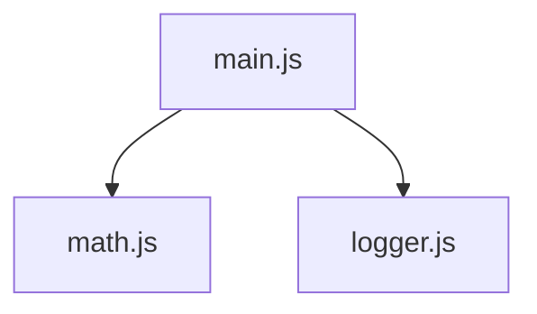

## 9.1.4 Modules and Import/Export Statements

JavaScript has come a long way in terms of how it handles modularity and code organization. Understanding JavaScript's module system is crucial for writing clean, maintainable, and scalable code, especially when implementing design patterns. In this section, we will delve into the evolution of JavaScript modules, the introduction of ES6 modules, and how they facilitate the implementation of design patterns.

### The Evolution of JavaScript Modules

JavaScript was originally designed for small scripts, and as such, it lacked built-in mechanisms for modularity. As applications grew in complexity, developers began creating patterns to simulate module-like behavior. Let's explore this evolution briefly:

#### Early Module Patterns

1. **Immediately Invoked Function Expressions (IIFE):**
   - IIFEs were one of the first patterns used to create scope and encapsulate code.
   - They allowed developers to avoid polluting the global namespace.

   ```javascript
   (function() {
     var privateVar = 'I am private';

     function privateFunction() {
       console.log(privateVar);
     }

     window.myModule = {
       publicMethod: function() {
         privateFunction();
       }
     };
   })();
   ```

2. **CommonJS:**
   - CommonJS became popular with Node.js, allowing developers to use `require` and `module.exports`.
   - This pattern was mainly used in server-side JavaScript.

   ```javascript
   // File: math.js
   function add(a, b) {
     return a + b;
   }

   function multiply(a, b) {
     return a * b;
   }

   module.exports = { add, multiply };
   ```

3. **AMD (Asynchronous Module Definition):**
   - Used primarily in browser environments, it allowed asynchronous loading of modules.
   - Required a library like RequireJS.

   ```javascript
   define(['dependency'], function(dependency) {
     return {
       method: function() {
         // ...
       }
     };
   });
   ```

### ES6 Modules: A Standardized Approach

With the advent of ES6 (ECMAScript 2015), JavaScript introduced a native module system, providing a standardized way to manage dependencies and modularize code. ES6 modules offer several advantages:

- **Static Structure:** The import and export statements are static, meaning they are resolved at compile time, enabling better optimization by tools.
- **Encapsulation:** Modules help encapsulate functionality, exposing only what is necessary.
- **Singleton Nature:** Each module is evaluated only once, making them inherently singleton-like.

#### Exporting in ES6 Modules

There are two primary ways to export from a module: named exports and default exports.

**Named Exports:**
- Allow exporting multiple variables or functions from a module.
- Each export is named and can be imported selectively.

```javascript
// File: math.js
export function add(a, b) {
  return a + b;
}

export function multiply(a, b) {
  return a * b;
}
```

**Default Exports:**
- Used to export a single value or function from a module.
- A module can have only one default export.

```javascript
// File: logger.js
export default function log(message) {
  console.log(message);
}
```

#### Importing in ES6 Modules

The import statement is used to bring in modules and their exported members into a file.

**Importing Named Exports:**
- Use curly braces to import specific exports.

```javascript
import { add, multiply } from './math.js';
```

**Importing Default Exports:**
- No curly braces are needed for default imports.

```javascript
import log from './logger.js';
```

**Combining Named and Default Imports:**
- You can import both named and default exports from a module.

```javascript
import log, { add, multiply } from './math.js';
```

### Modules and Design Patterns

Modules play a crucial role in implementing design patterns by providing a way to organize and encapsulate code. Let's explore how modules align with common design patterns:

#### Encapsulation and the Module Pattern

Modules naturally encapsulate code, similar to the traditional Module Pattern. They allow developers to expose only the necessary parts of their code, hiding the implementation details.

```javascript
// File: counter.js
let count = 0;

export function increment() {
  count++;
  return count;
}

export function decrement() {
  count--;
  return count;
}
```

In this example, the `count` variable is private to the module, and only `increment` and `decrement` functions are exposed.

#### Singleton Implementation

Modules in JavaScript are evaluated only once, making them ideal for implementing singletons. This means that any state or configuration within a module is shared across all imports.

```javascript
// File: config.js
let config = {
  apiUrl: 'https://api.example.com',
  timeout: 5000
};

export default config;
```

Any file that imports this `config.js` module will get the same instance of the `config` object.

#### Organizing Patterns into Modules

Design patterns can be organized into modules to enhance maintainability and readability. For example, a strategy pattern can be implemented using separate modules for each strategy, with a main module to select and execute the appropriate strategy.

```javascript
// File: strategies/addition.js
export function execute(a, b) {
  return a + b;
}

// File: strategies/multiplication.js
export function execute(a, b) {
  return a * b;
}

// File: strategyContext.js
import { execute as add } from './strategies/addition.js';
import { execute as multiply } from './strategies/multiplication.js';

export function performOperation(strategy, a, b) {
  switch (strategy) {
    case 'add':
      return add(a, b);
    case 'multiply':
      return multiply(a, b);
    default:
      throw new Error('Unknown strategy');
  }
}
```

### Visualizing Module Dependencies

To understand the relationships between modules, it is helpful to visualize their dependencies. The following diagram illustrates how `main.js` depends on `math.js` and `logger.js`.



### Key Points to Emphasize

- **Standardization:** ES6 modules provide a standardized way to write modular JavaScript code, improving consistency across projects.
- **Encapsulation:** Modules enhance encapsulation, allowing developers to expose only what is necessary and keep implementation details private.
- **Singleton-like Behavior:** Modules are evaluated once, making them suitable for singleton implementations.
- **Organizational Benefits:** By organizing code into modules, developers can better manage dependencies and implement design patterns more effectively.

### Best Practices and Common Pitfalls

- **Use Named Exports for Multiple Exports:** When a module needs to export multiple items, prefer named exports for clarity.
- **Default Exports for Single Export:** Use default exports when a module is designed to export a single main function or object.
- **Avoid Circular Dependencies:** Be cautious of circular dependencies, which can lead to unexpected behavior.
- **Consistent Naming Conventions:** Use consistent naming conventions for modules and exports to improve readability and maintainability.

### Conclusion

JavaScript's module system is a powerful tool for organizing code and implementing design patterns. By leveraging ES6 modules, developers can create modular, maintainable, and scalable applications. Understanding how to effectively use import and export statements is crucial for managing dependencies and encapsulating functionality.

As you continue to explore design patterns, consider how modules can enhance your code organization and help you implement patterns more effectively. Practice using modules in your projects to solidify your understanding and improve your code quality.

## Quiz Time!



### What is one of the earliest patterns used to create scope and encapsulate code in JavaScript?

- [x] Immediately Invoked Function Expressions (IIFE)
- [ ] CommonJS
- [ ] AMD
- [ ] ES6 Modules

> **Explanation:** IIFEs were used to create scope and encapsulate code, preventing global namespace pollution.

### Which module pattern became popular with Node.js?

- [ ] IIFE
- [x] CommonJS
- [ ] AMD
- [ ] ES6 Modules

> **Explanation:** CommonJS became popular with Node.js, allowing developers to use `require` and `module.exports`.

### How many default exports can a module have?

- [x] One
- [ ] Two
- [ ] Unlimited
- [ ] None

> **Explanation:** A module can have only one default export, which represents the main exported value or function.

### What is the syntax to import a default export?

- [x] `import log from './logger.js';`
- [ ] `import { log } from './logger.js';`
- [ ] `import * as log from './logger.js';`
- [ ] `import default log from './logger.js';`

> **Explanation:** Default exports are imported without curly braces, using the `import log from './logger.js';` syntax.

### Which statement is true about ES6 modules?

- [x] They are evaluated only once.
- [ ] They can have multiple default exports.
- [ ] They require a library like RequireJS.
- [ ] They are asynchronous by default.

> **Explanation:** ES6 modules are evaluated only once, making them singleton-like.

### How do ES6 modules enhance encapsulation?

- [x] By allowing developers to expose only necessary parts of their code.
- [ ] By requiring all variables to be global.
- [ ] By making all functions asynchronous.
- [ ] By using `require` statements.

> **Explanation:** ES6 modules enhance encapsulation by allowing developers to expose only the necessary parts of their code, keeping implementation details private.

### What should you be cautious of when using modules?

- [x] Circular dependencies
- [ ] Default exports
- [ ] Static imports
- [ ] Named exports

> **Explanation:** Circular dependencies can lead to unexpected behavior and should be avoided when using modules.

### What is a benefit of using named exports?

- [x] They allow exporting multiple items from a module.
- [ ] They are always faster than default exports.
- [ ] They require less code than default exports.
- [ ] They automatically resolve circular dependencies.

> **Explanation:** Named exports allow exporting multiple items from a module, providing clarity and flexibility.

### How can you import both named and default exports from a module?

- [x] `import log, { add, multiply } from './math.js';`
- [ ] `import { log, add, multiply } from './math.js';`
- [ ] `import * as math from './math.js';`
- [ ] `import default log, { add, multiply } from './math.js';`

> **Explanation:** You can import both named and default exports using the syntax `import log, { add, multiply } from './math.js';`.

### True or False: ES6 modules require a library like RequireJS for use in browsers.

- [ ] True
- [x] False

> **Explanation:** ES6 modules are natively supported in modern browsers and do not require a library like RequireJS.


