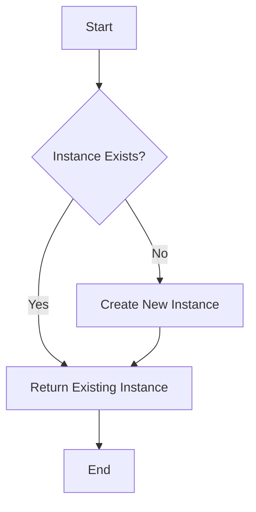

## 9.2.1 Implementing Singleton Pattern

Design patterns are essential tools in a software developer's toolkit, offering solutions to common problems in software design. Among these, the Singleton pattern is one of the most recognized and widely used creational patterns. Its primary purpose is to ensure that a class has only one instance and provides a global access point to that instance. In this section, we will delve into how to implement the Singleton pattern in JavaScript, exploring various approaches such as modules, closures, and ES6 classes.

### Understanding the Singleton Pattern

Before we dive into the implementation details, let's briefly revisit the core concept of the Singleton pattern. The Singleton pattern restricts the instantiation of a class to a single object. This is particularly useful when exactly one object is needed to coordinate actions across the system. Common scenarios include configuration settings, connection pools, or logging services where a single instance is preferable.

### Implementing Singleton in JavaScript

JavaScript, being a versatile language, offers multiple ways to implement the Singleton pattern. We'll explore three primary methods: using modules, closures with Immediately Invoked Function Expressions (IIFE), and ES6 classes.

#### 1. Using Modules

Modules in JavaScript are inherently singleton-like because they are executed once upon the first import and then cached. This makes modules a natural fit for implementing singletons.

**Explanation:**

When you export an object or a function from a module, it acts as a singleton. Every import of that module gets the same instance, making it an ideal candidate for scenarios where a singleton is needed.

**Code Example:**

```javascript
// File: config.js
const config = {
  apiUrl: 'https://api.example.com',
  apiKey: 'abcdef123456',
};

export default config;
```

**Usage:**

```javascript
// File: main.js
import config from './config.js';
console.log(config.apiUrl); // Output: 'https://api.example.com'
```

In this example, the `config` object is a singleton. Any module that imports `config.js` will receive the same instance of the `config` object.

#### 2. Using Closures and IIFE

Another approach to implementing a singleton in JavaScript is using closures combined with an Immediately Invoked Function Expression (IIFE). This method encapsulates the singleton logic, ensuring that only one instance is created.

**Explanation:**

The IIFE pattern allows us to create a private scope for our singleton logic. Within this scope, we can manage the instance creation and provide a controlled access point through closures.

**Code Example:**

```javascript
const Singleton = (function () {
  let instance;

  function createInstance() {
    const obj = new Object('I am the instance');
    return obj;
  }

  return {
    getInstance: function () {
      if (!instance) {
        instance = createInstance();
      }
      return instance;
    },
  };
})();

// Usage
const instance1 = Singleton.getInstance();
const instance2 = Singleton.getInstance();
console.log(instance1 === instance2); // Output: true
```

In this example, the `Singleton` object provides a `getInstance` method that returns the single instance of the object. The instance is created only once, and subsequent calls to `getInstance` return the same instance.

#### 3. Using ES6 Classes

With the advent of ES6, JavaScript introduced classes, providing a more structured way to define objects. We can leverage classes to implement the Singleton pattern using static methods.

**Explanation:**

By using a static property to hold the instance and a constructor to control instance creation, we can ensure that only one instance of the class is created.

**Code Example:**

```javascript
class Singleton {
  constructor() {
    if (Singleton.instance) {
      return Singleton.instance;
    }
    Singleton.instance = this;
    // Initialize your singleton instance here
  }
}

// Usage
const singletonA = new Singleton();
const singletonB = new Singleton();
console.log(singletonA === singletonB); // Output: true
```

In this example, the `Singleton` class checks if an instance already exists. If it does, it returns that instance; otherwise, it creates a new one. This ensures that only one instance of the class is ever created.

### Considerations and Best Practices

While implementing the Singleton pattern, there are several considerations and best practices to keep in mind:

#### Global Scope Issues

One of the potential pitfalls of singletons is the risk of polluting the global namespace. This can lead to conflicts, especially in large applications. To mitigate this, always encapsulate singleton logic within modules or closures.

#### Testing Challenges

Testing singleton instances can be challenging because they maintain state across tests. This can lead to flaky tests or tests that depend on the order of execution. To address this, consider designing your singleton to allow for resetting or mocking during tests.

#### Best Practices

- **Use Module Exports:** When possible, use module exports to manage single instances. This leverages JavaScript's module caching mechanism and keeps your code clean and maintainable.
- **Avoid Tight Coupling:** Be cautious with singletons in large applications to avoid tight coupling. Singletons can introduce hidden dependencies that make your code harder to maintain and test.
- **Design for Flexibility:** Consider designing your singleton to allow for configuration or customization. This can make your singleton more versatile and easier to integrate into different parts of your application.

### Visualizing Singleton Creation

To better understand how the Singleton pattern works, let's visualize the instance creation process using a flowchart.



This flowchart illustrates the decision-making process in a Singleton implementation. If an instance already exists, it returns that instance; otherwise, it creates a new one.

### Key Points to Emphasize

- **Multiple Implementation Methods:** JavaScript offers multiple ways to implement the Singleton pattern. Choose the method that best fits your project's needs and architecture.
- **Modules as Natural Singletons:** JavaScript modules are a natural fit for singletons due to their caching behavior. Use them to your advantage when implementing singletons.
- **Careful Design:** Design your singletons carefully to avoid issues with global state and ensure they are easy to test and maintain.

### Conclusion

The Singleton pattern is a powerful tool in software design, providing a controlled way to manage single instances of objects. By understanding and implementing this pattern in JavaScript using modules, closures, and ES6 classes, you can create robust and maintainable applications. Remember to consider the potential pitfalls and best practices to ensure your singletons are effective and efficient.

## Quiz Time!



### What is the main purpose of the Singleton pattern?

- [x] To ensure a class has only one instance and provides a global access point.
- [ ] To allow multiple instances of a class.
- [ ] To encapsulate a group of related classes.
- [ ] To provide a way to create complex objects.

> **Explanation:** The Singleton pattern ensures that a class has only one instance and provides a global access point to that instance.

### How do JavaScript modules naturally fit the Singleton pattern?

- [x] Modules are executed once upon the first import and then cached.
- [ ] Modules are executed every time they are imported.
- [ ] Modules cannot export objects.
- [ ] Modules can only export functions.

> **Explanation:** JavaScript modules are executed once upon the first import and then cached, making them naturally fit the Singleton pattern.

### What is the role of closures in implementing a Singleton using IIFE?

- [x] Closures encapsulate the singleton logic and manage instance creation.
- [ ] Closures allow multiple instances to be created.
- [ ] Closures are used to export modules.
- [ ] Closures are not used in Singleton implementations.

> **Explanation:** Closures encapsulate the singleton logic and manage instance creation, ensuring only one instance is created.

### In ES6 class-based Singleton implementation, how is the instance managed?

- [x] Using a static property to hold the instance.
- [ ] Using a global variable to hold the instance.
- [ ] Using a constructor function to create multiple instances.
- [ ] Using a prototype method to manage instances.

> **Explanation:** In ES6 class-based Singleton implementation, a static property is used to hold the instance, ensuring only one instance exists.

### What is a potential issue with singletons in large applications?

- [x] They can lead to tight coupling and hidden dependencies.
- [ ] They always increase performance.
- [ ] They are easy to test.
- [ ] They reduce code complexity.

> **Explanation:** Singletons can lead to tight coupling and hidden dependencies, making the code harder to maintain and test.

### Why is it important to avoid polluting the global namespace with singletons?

- [x] To prevent conflicts and maintain modularity.
- [ ] To increase execution speed.
- [ ] To allow multiple instances.
- [ ] To reduce memory usage.

> **Explanation:** Avoiding pollution of the global namespace prevents conflicts and maintains modularity, which is crucial in large applications.

### How can testing challenges with singletons be addressed?

- [x] By designing the singleton to allow for resetting or mocking.
- [ ] By avoiding tests altogether.
- [ ] By using global variables.
- [ ] By creating multiple instances for testing.

> **Explanation:** Testing challenges with singletons can be addressed by designing the singleton to allow for resetting or mocking during tests.

### What is a best practice when using module exports for singletons?

- [x] Leverage JavaScript's module caching mechanism.
- [ ] Avoid using modules for singletons.
- [ ] Use global variables instead.
- [ ] Export multiple instances.

> **Explanation:** Leveraging JavaScript's module caching mechanism is a best practice when using module exports for singletons.

### Which method can be used to implement a Singleton pattern in JavaScript?

- [x] Modules, Closures, and ES6 Classes
- [ ] Only Modules
- [ ] Only Closures
- [ ] Only ES6 Classes

> **Explanation:** The Singleton pattern in JavaScript can be implemented using Modules, Closures, and ES6 Classes.

### True or False: A Singleton pattern allows for multiple instances of a class.

- [ ] True
- [x] False

> **Explanation:** False. The Singleton pattern ensures that a class has only one instance.


