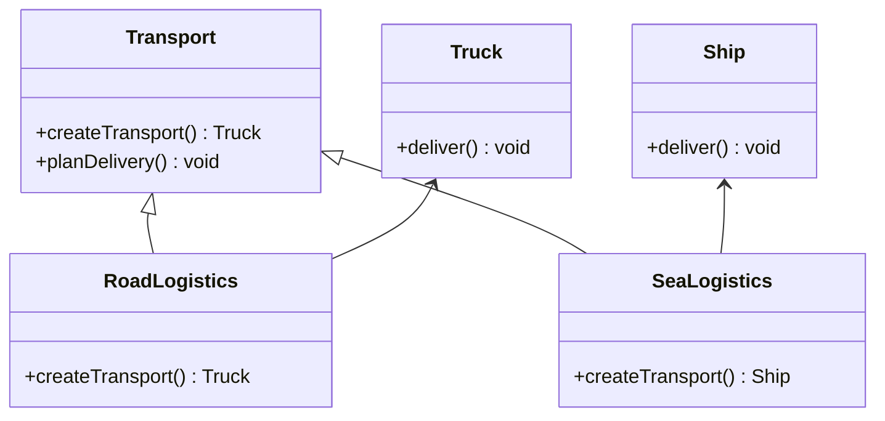
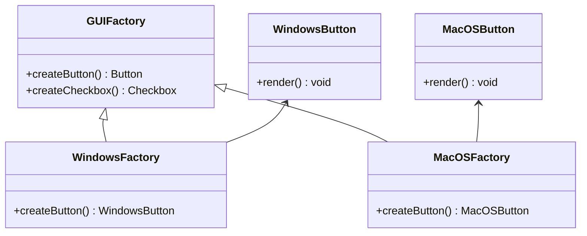

## 9.2.2 Factory Method and Abstract Factory

In the world of software design, **creational patterns** play a pivotal role in abstracting the instantiation process of objects. Among these, the **Factory Method** and **Abstract Factory** patterns stand out for their ability to create objects in a way that promotes flexibility and reusability. In this section, we will explore these patterns in the context of JavaScript, a language renowned for its dynamic and flexible nature.

### Factory Method Pattern

The Factory Method pattern is a creational design pattern that provides an interface for creating objects in a superclass but allows subclasses to alter the type of objects that will be created. This pattern is particularly useful when a class cannot anticipate the class of objects it must create.

#### Implementation in JavaScript

In JavaScript, the Factory Method pattern can be implemented by defining a creator class with a factory method that returns product objects. This allows subclasses to override the factory method to change the class of objects that will be created.

**Explanation:**

The core idea is to delegate the instantiation of objects to subclasses. This is achieved by defining a method in a base class that returns an object. Subclasses then override this method to create and return instances of specific classes.

**Code Example:**

Let's consider a logistics application that requires different types of transport for delivery. The transport can either be by land or sea, and the exact type of transport is determined at runtime.

```javascript
class Transport {
  createTransport() {
    throw new Error('Method "createTransport()" must be implemented.');
  }
  planDelivery() {
    const transport = this.createTransport();
    transport.deliver();
  }
}

class Truck {
  deliver() {
    console.log('Delivering by land in a truck.');
  }
}

class Ship {
  deliver() {
    console.log('Delivering by sea in a ship.');
  }
}

class RoadLogistics extends Transport {
  createTransport() {
    return new Truck();
  }
}

class SeaLogistics extends Transport {
  createTransport() {
    return new Ship();
  }
}

// Usage
const logistics = new RoadLogistics();
logistics.planDelivery();
```

**Explanation of the Code:**

- The `Transport` class defines a `createTransport()` method that must be implemented by subclasses. It also has a `planDelivery()` method that uses the transport object created by `createTransport()` to deliver goods.
- The `Truck` and `Ship` classes represent different types of transport, each with a `deliver()` method.
- The `RoadLogistics` and `SeaLogistics` classes extend `Transport` and override the `createTransport()` method to return instances of `Truck` and `Ship`, respectively.
- This setup allows for the creation of transport objects without specifying their concrete classes, adhering to the Factory Method pattern.

### Abstract Factory Pattern

The Abstract Factory pattern is another creational design pattern that provides an interface for creating families of related or dependent objects without specifying their concrete classes. This pattern is particularly useful when a system needs to be independent of how its objects are created, composed, and represented.

#### Implementation in JavaScript

In JavaScript, the Abstract Factory pattern can be implemented by creating an abstract factory interface with methods for creating related products. Concrete factory classes implement this interface to create specific product instances.

**Explanation:**

The Abstract Factory pattern involves creating a factory interface that defines methods for creating each type of product. Concrete factories implement this interface to produce a set of related products.

**Code Example:**

Consider a GUI application that needs to support multiple operating systems, each with its own set of UI components.

```javascript
class GUIFactory {
  createButton() {
    throw new Error('Method "createButton()" must be implemented.');
  }
  createCheckbox() {
    throw new Error('Method "createCheckbox()" must be implemented.');
  }
}

class WindowsButton {
  render() {
    console.log('Rendering Windows button.');
  }
}

class MacOSButton {
  render() {
    console.log('Rendering macOS button.');
  }
}

class WindowsFactory extends GUIFactory {
  createButton() {
    return new WindowsButton();
  }
}

class MacOSFactory extends GUIFactory {
  createButton() {
    return new MacOSButton();
  }
}

// Usage
const factory = new WindowsFactory();
const button = factory.createButton();
button.render();
```

**Explanation of the Code:**

- The `GUIFactory` class defines methods for creating UI components like buttons and checkboxes.
- The `WindowsButton` and `MacOSButton` classes represent buttons for different operating systems.
- The `WindowsFactory` and `MacOSFactory` classes extend `GUIFactory` and implement the `createButton()` method to return instances of `WindowsButton` and `MacOSButton`, respectively.
- This setup allows for the creation of UI components without specifying their concrete classes, adhering to the Abstract Factory pattern.

### Comparison and Use Cases

Understanding when to use the Factory Method versus the Abstract Factory pattern is crucial for effective software design.

- **Factory Method Pattern:**
  - **Use Case:** When a class needs to delegate the responsibility of object creation to its subclasses, and the exact class of objects to be created is determined at runtime.
  - **Example:** A logistics application that can use either land or sea transport, with the specific type of transport determined at runtime.

- **Abstract Factory Pattern:**
  - **Use Case:** When a system needs to be independent of how its objects are created, composed, and represented, and it needs to support multiple families of related products.
  - **Example:** A GUI application that needs to support multiple operating systems, each with its own set of UI components.

**Key Differences:**

- The Factory Method pattern deals with the creation of a single product, whereas the Abstract Factory pattern handles families of related products.
- The Factory Method pattern allows subclasses to decide which class to instantiate, while the Abstract Factory pattern provides an interface for creating families of related objects.

### Visuals and Diagrams

To better understand the relationships and interactions in these patterns, let's visualize them using class diagrams.

**Factory Method Pattern:**



**Abstract Factory Pattern:**



### Key Points to Emphasize

- JavaScript's dynamic nature allows for flexible implementation of factory patterns, making them particularly powerful in this language.
- Factory patterns abstract the object creation process, promoting loose coupling and enhancing code maintainability.
- These patterns are especially helpful in applications that need to switch between different families of products, such as cross-platform applications.

### Conclusion

In this section, we explored the Factory Method and Abstract Factory patterns, two essential creational design patterns in software development. By understanding their implementation and use cases in JavaScript, developers can design systems that are flexible, maintainable, and scalable. These patterns allow for the dynamic creation of objects, making them invaluable in modern software development.

## Quiz Time!



### What is the primary purpose of the Factory Method pattern?

- [x] To delegate the responsibility of object creation to subclasses
- [ ] To create families of related objects
- [ ] To define a single interface for creating objects
- [ ] To enforce a single product creation

> **Explanation:** The Factory Method pattern is used to delegate the responsibility of object creation to subclasses, allowing them to decide which class to instantiate.

### In the Factory Method pattern, what role does the creator class play?

- [x] It defines a method for creating objects that subclasses can override
- [ ] It directly creates instances of concrete classes
- [ ] It provides a single interface for all product creation
- [ ] It enforces strict type checking

> **Explanation:** The creator class in the Factory Method pattern defines a method for creating objects, which is meant to be overridden by subclasses to create specific instances.

### How does the Abstract Factory pattern differ from the Factory Method pattern?

- [x] It deals with families of related products
- [ ] It is used for creating a single product
- [ ] It is a structural pattern
- [ ] It enforces a single product creation

> **Explanation:** The Abstract Factory pattern deals with families of related products, providing an interface for creating related or dependent objects.

### Which pattern would you use for a GUI application that needs to support multiple operating systems?

- [x] Abstract Factory
- [ ] Factory Method
- [ ] Singleton
- [ ] Prototype

> **Explanation:** The Abstract Factory pattern is suitable for a GUI application that needs to support multiple operating systems, as it can handle families of related UI components.

### What is a key benefit of using factory patterns?

- [x] They promote loose coupling
- [ ] They enforce strict type checking
- [ ] They simplify object creation logic
- [ ] They are only useful for large applications

> **Explanation:** Factory patterns promote loose coupling by abstracting the object creation process, making the code more flexible and maintainable.

### In the provided Factory Method example, what does the `createTransport()` method do?

- [x] It is overridden by subclasses to create specific transport objects
- [ ] It directly delivers goods
- [ ] It logs transport details
- [ ] It checks delivery status

> **Explanation:** The `createTransport()` method is overridden by subclasses to create specific transport objects, adhering to the Factory Method pattern.

### What is the role of the `GUIFactory` class in the Abstract Factory pattern?

- [x] It defines methods for creating related UI components
- [ ] It directly renders UI components
- [ ] It enforces a single UI design
- [ ] It logs UI interactions

> **Explanation:** The `GUIFactory` class defines methods for creating related UI components, which are implemented by concrete factory classes.

### Why is the Abstract Factory pattern useful in cross-platform applications?

- [x] It allows for the creation of platform-specific families of products
- [ ] It simplifies network requests
- [ ] It enforces a single coding standard
- [ ] It reduces memory usage

> **Explanation:** The Abstract Factory pattern is useful in cross-platform applications because it allows for the creation of platform-specific families of products, ensuring compatibility and flexibility.

### How does JavaScript's dynamic nature benefit the implementation of factory patterns?

- [x] It allows for flexible and dynamic object creation
- [ ] It enforces strict type safety
- [ ] It reduces code verbosity
- [ ] It simplifies error handling

> **Explanation:** JavaScript's dynamic nature allows for flexible and dynamic object creation, making it well-suited for implementing factory patterns.

### True or False: The Factory Method pattern can only be used for creating single objects.

- [ ] True
- [x] False

> **Explanation:** False. The Factory Method pattern is typically used for creating single objects, but it can be adapted to create multiple related objects if needed.


