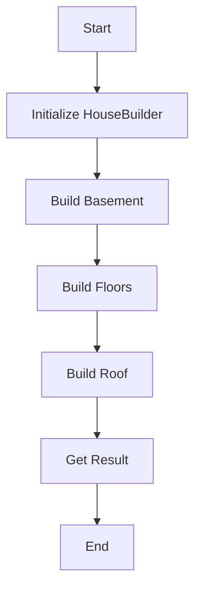

## 9.2.3 Builder Pattern with Fluent Interfaces

### Introduction

In modern software development, the need to construct complex objects with numerous configurations is common. The Builder pattern is a creational design pattern that addresses this need by providing a flexible solution for constructing objects step by step. When combined with fluent interfaces, the Builder pattern not only enhances flexibility but also significantly improves code readability and maintainability. In this section, we will delve into the implementation of the Builder pattern using fluent interfaces in JavaScript, exploring its advantages, best practices, and practical applications.

### Understanding Fluent Interfaces

#### What is a Fluent Interface?

A fluent interface is a method of designing object-oriented APIs that relies on method chaining to create more readable and expressive code. The primary goal of a fluent interface is to provide an intuitive and human-readable way to interact with an API, allowing developers to construct complex operations through a series of chained method calls.

#### Key Characteristics of Fluent Interfaces

- **Method Chaining:** Each method returns an object, typically `this`, allowing for consecutive method calls.
- **Readability:** The code reads like a natural language sentence, making it easier to understand.
- **Expressiveness:** Complex operations are expressed in a concise and clear manner.

### Implementing the Builder Pattern with Fluent Interfaces

#### Example Scenario: Building a House

To illustrate the Builder pattern with fluent interfaces, consider the scenario of constructing a house. A house can have various components such as a basement, multiple floors, and a roof. The Builder pattern allows us to construct a house with different configurations, while the fluent interface enhances the readability of the construction process.

#### Code Example

```javascript
class House {
  constructor() {
    this.hasBasement = false;
    this.numFloors = 0;
    this.hasRoof = false;
  }
}

class HouseBuilder {
  constructor() {
    this.house = new House();
  }

  buildBasement() {
    this.house.hasBasement = true;
    return this;
  }

  buildFloors(num) {
    this.house.numFloors = num;
    return this;
  }

  buildRoof() {
    this.house.hasRoof = true;
    return this;
  }

  getResult() {
    return this.house;
  }
}

// Usage
const builder = new HouseBuilder();
const house = builder
  .buildBasement()
  .buildFloors(2)
  .buildRoof()
  .getResult();

console.log(house);
```

#### Explanation

- **Chaining Methods:** Each method in the `HouseBuilder` class returns `this`, allowing methods to be chained together in a fluent manner.
- **Final Product:** The `getResult` method returns the constructed `House` object, representing the final product of the building process.

### Benefits of the Builder Pattern with Fluent Interfaces

#### Flexibility

The Builder pattern provides the flexibility to construct objects with various configurations. This is particularly useful when dealing with objects that have numerous optional parameters or complex initialization processes.

#### Readability

Fluent interfaces significantly enhance the readability of code. By allowing method chaining, they make the construction process appear more like a sequence of logical steps, improving both understanding and maintenance.

#### Separation of Concerns

The Builder pattern separates the construction of a complex object from its representation. This separation allows for different representations of the object to be constructed using the same building process.

### Best Practices for Implementing the Builder Pattern

#### Immutability

Consider making the constructed objects immutable once the building process is complete. Immutability can help prevent accidental modifications and ensure the integrity of the object.

#### Validation

Implement validation checks during the building process to ensure that the constructed object is in a valid state. This can help catch errors early and ensure that the final product meets all necessary requirements.

### Visualizing the Builder Pattern

Below is a flowchart illustrating the building steps of the `HouseBuilder`:



### Key Points to Emphasize

- **Complex Objects:** The Builder pattern is ideal for constructing complex objects with many optional parameters.
- **Fluent Interfaces:** Enhance the usability of the Builder pattern by making the code more readable and expressive.
- **JavaScript Flexibility:** JavaScript's dynamic nature makes it particularly well-suited for implementing fluent interfaces.

### Practical Applications and Real-World Examples

The Builder pattern with fluent interfaces can be applied in various real-world scenarios, such as:

- **User Interfaces:** Constructing complex UI components with multiple configuration options.
- **Data Processing Pipelines:** Building data processing workflows with multiple stages and configurations.
- **Network Requests:** Configuring and sending HTTP requests with various parameters and headers.

### Conclusion

The Builder pattern with fluent interfaces is a powerful tool for constructing complex objects in a flexible and readable manner. By leveraging method chaining, developers can create intuitive and expressive APIs that enhance both the usability and maintainability of their code. Whether you are building a house, configuring a user interface, or constructing a data processing pipeline, the Builder pattern with fluent interfaces offers a robust solution for managing complexity in software design.

## Quiz Time!



### What is a fluent interface?

- [x] A design approach that allows method chaining for improved readability
- [ ] A method of optimizing code execution speed
- [ ] A technique for managing memory allocation
- [ ] A pattern for securing web applications

> **Explanation:** A fluent interface allows method chaining, which enhances code readability by making it more expressive and natural to read.

### Which method in the `HouseBuilder` class returns the final product?

- [x] `getResult`
- [ ] `buildBasement`
- [ ] `buildFloors`
- [ ] `buildRoof`

> **Explanation:** The `getResult` method returns the constructed `House` object, representing the final product of the building process.

### What is the primary benefit of using method chaining in fluent interfaces?

- [x] Improved code readability
- [ ] Increased execution speed
- [ ] Reduced memory usage
- [ ] Enhanced security

> **Explanation:** Method chaining improves code readability by allowing a sequence of operations to be expressed in a single, coherent statement.

### In the provided example, what does the `buildFloors` method do?

- [x] Sets the number of floors in the house
- [ ] Constructs the roof of the house
- [ ] Validates the house configuration
- [ ] Returns the final house object

> **Explanation:** The `buildFloors` method sets the number of floors in the house and allows for method chaining by returning `this`.

### Why is immutability recommended for objects built with the Builder pattern?

- [x] To prevent accidental modifications
- [ ] To increase execution speed
- [x] To ensure object integrity
- [ ] To reduce code complexity

> **Explanation:** Immutability helps prevent accidental modifications and ensures the integrity of the constructed object, making it more reliable and predictable.

### How does the Builder pattern enhance flexibility?

- [x] By allowing objects to be constructed with various configurations
- [ ] By optimizing memory usage
- [ ] By simplifying code logic
- [ ] By improving data security

> **Explanation:** The Builder pattern enhances flexibility by enabling the construction of objects with different configurations and optional parameters.

### What is a key advantage of separating object construction from representation in the Builder pattern?

- [x] It allows for different representations of the object
- [ ] It reduces the overall code size
- [x] It simplifies the object initialization process
- [ ] It enhances data security

> **Explanation:** Separating construction from representation allows for different representations of the object to be constructed using the same building process, providing flexibility and modularity.

### Which of the following is a practical application of the Builder pattern with fluent interfaces?

- [x] Constructing complex UI components
- [ ] Optimizing database queries
- [ ] Securing network connections
- [ ] Managing user authentication

> **Explanation:** The Builder pattern with fluent interfaces is well-suited for constructing complex UI components with multiple configuration options, among other applications.

### What should be implemented during the building process to ensure the constructed object is valid?

- [x] Validation checks
- [ ] Memory management
- [ ] Security protocols
- [ ] Data encryption

> **Explanation:** Implementing validation checks during the building process ensures that the constructed object is in a valid state and meets all necessary requirements.

### True or False: Fluent interfaces are only useful in JavaScript.

- [ ] True
- [x] False

> **Explanation:** Fluent interfaces are not limited to JavaScript; they can be implemented in any object-oriented programming language to enhance code readability and expressiveness.


