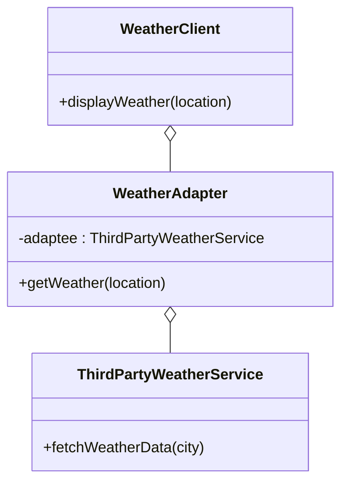

## 9.3.1 Adapter Pattern in Web Development

In the ever-evolving world of web development, integrating various third-party services and APIs is a common task. However, these external services often come with their own interfaces and data formats, which may not align with the ones used in your application. This is where the Adapter Pattern becomes invaluable. By employing this pattern, developers can ensure that incompatible interfaces work together seamlessly, enhancing the flexibility and maintainability of their applications.

### Understanding the Adapter Pattern

The Adapter Pattern is a structural design pattern that allows objects with incompatible interfaces to collaborate. It acts as a bridge between two incompatible interfaces, converting the interface of a class into another interface that a client expects. This pattern is particularly useful in scenarios where you want to integrate existing components with new systems without altering their source code.

#### Key Concepts of the Adapter Pattern

- **Adaptee:** The existing interface that needs adapting.
- **Adapter:** The intermediary that converts the adaptee's interface into one that the client can use.
- **Client:** The entity that interacts with the adapter to use the adaptee's functionalities.

### The Adapter Pattern in Web Development

In web development, the Adapter Pattern is often used to integrate third-party APIs, libraries, or modules that do not match the current application's interfaces. This pattern allows developers to adapt these external services to their applications without modifying the existing codebase, thus promoting code reusability and decoupling.

#### Common Scenarios

1. **Integrating APIs:** When a third-party API returns data in a format different from what your application expects.
2. **Module Compatibility:** When integrating modules or libraries that have incompatible interfaces with your application's existing code.
3. **Data Transformation:** When adapting data from various sources like RESTful APIs, SOAP services, or WebSockets to fit your application's data models.

### Example Scenario: Integrating a Third-Party Weather API

Let's consider a practical example of integrating a third-party weather API into a web application. The API returns weather data in a format that doesn't match the application's expected format.

#### Problem Statement

Your application expects weather data in the format:
- `temperature`: A numeric value representing the temperature in Celsius.
- `condition`: A string describing the weather condition.

However, the third-party weather service returns data in the following format:
- `temp`: A numeric value for temperature.
- `conditions`: A string for weather conditions.

#### Implementing the Adapter Pattern

To solve this problem, we can implement the Adapter Pattern using ES6 classes and modules in JavaScript.

```javascript
// Target interface expected by the client
class WeatherClient {
  constructor(adapter) {
    this.adapter = adapter;
  }

  displayWeather(location) {
    const weatherData = this.adapter.getWeather(location);
    console.log(`The weather in ${location} is ${weatherData.temperature}°C and ${weatherData.condition}.`);
  }
}

// Adaptee: Third-party weather service with a different interface
class ThirdPartyWeatherService {
  fetchWeatherData(city) {
    // Simulate an API call returning data in a different format
    return {
      temp: 25,
      conditions: 'Sunny',
    };
  }
}

// Adapter class
class WeatherAdapter {
  constructor(adaptee) {
    this.adaptee = adaptee;
  }

  getWeather(location) {
    const data = this.adaptee.fetchWeatherData(location);
    // Convert data to the format expected by the client
    return {
      temperature: data.temp,
      condition: data.conditions,
    };
  }
}

// Usage
const thirdPartyService = new ThirdPartyWeatherService();
const adapter = new WeatherAdapter(thirdPartyService);
const client = new WeatherClient(adapter);

client.displayWeather('New York');
// Output: The weather in New York is 25°C and Sunny.
```

#### Explanation

- **Adaptee (`ThirdPartyWeatherService`):** This class represents the third-party service with a method `fetchWeatherData` that returns weather data in its own format.
- **Adapter (`WeatherAdapter`):** This class wraps the adaptee and transforms the data into the format expected by the client.
- **Client (`WeatherClient`):** This class uses the adapter to get weather data without needing to know about the third-party service's interface.

### Best Practices for Using the Adapter Pattern

1. **Full Interface Implementation:** Ensure the adapter fully implements the target interface expected by the client. This guarantees that the client can interact with the adapter as if it were interacting with the actual service.
2. **Minimal Logic in Adapter:** Keep the adapter logic minimal and focused on data transformation. The adapter should only be responsible for converting data formats and should not contain complex business logic.
3. **Maintainability:** Use the Adapter Pattern to improve maintainability by decoupling client code from external libraries or APIs. This makes it easier to replace or update third-party services without affecting the client code.

### Real-World Applications

The Adapter Pattern is widely used in web development for various applications:

- **Adapting RESTful APIs:** Transforming data from RESTful APIs to match your application's data models.
- **SOAP Service Integration:** Converting SOAP responses into a format that can be easily consumed by your application.
- **WebSocket Data Handling:** Adapting real-time data from WebSockets to integrate seamlessly with your application's architecture.

### Visual Representation

To better understand the relationships between the components in the Adapter Pattern, let's look at a class diagram:



### Key Points to Emphasize

- **Integration Without Modification:** The Adapter Pattern allows for the integration of third-party services without modifying existing code, which is crucial for maintaining a stable codebase.
- **Code Reusability:** By decoupling the client code from external libraries or APIs, the Adapter Pattern promotes code reusability and flexibility.
- **Ease of Implementation in JavaScript:** JavaScript's dynamic typing and flexible class structures make implementing the Adapter Pattern straightforward, allowing for quick adaptation to changing requirements.

### Conclusion

The Adapter Pattern is an essential tool in a web developer's toolkit, especially when dealing with the integration of third-party services and APIs. By understanding and implementing this pattern, developers can create more flexible, maintainable, and robust applications. As you continue to develop your skills, consider how the Adapter Pattern can be applied to solve integration challenges in your projects.

## Quiz Time!



### What is the primary purpose of the Adapter Pattern?

- [x] To allow incompatible interfaces to work together by converting one interface into another that clients expect.
- [ ] To create a single interface to represent a group of related interfaces.
- [ ] To define a family of algorithms, encapsulate each one, and make them interchangeable.
- [ ] To provide a way to access the elements of an aggregate object sequentially without exposing its underlying representation.

> **Explanation:** The Adapter Pattern is used to allow incompatible interfaces to work together by converting the interface of one class into another that a client expects.

### In the provided JavaScript example, what role does the `WeatherAdapter` class play?

- [x] It acts as an intermediary that converts the data format from the third-party service to the format expected by the client.
- [ ] It directly fetches weather data from the third-party service and displays it.
- [ ] It serves as the client that uses the weather data.
- [ ] It modifies the third-party service to match the client's expected format.

> **Explanation:** The `WeatherAdapter` class acts as an intermediary that converts the data format from the third-party service to the format expected by the `WeatherClient`.

### Why is it important for the adapter to fully implement the target interface expected by the client?

- [x] To ensure that the client can interact with the adapter as if it were interacting with the actual service.
- [ ] To make the adapter more complex and feature-rich.
- [ ] To allow the adapter to modify the client's behavior.
- [ ] To ensure that the adapter can function independently of the client.

> **Explanation:** By fully implementing the target interface, the adapter ensures that the client can interact with it seamlessly, as if it were interacting with the actual service.

### What is a common scenario in web development where the Adapter Pattern is useful?

- [x] Integrating third-party APIs that return data in a different format than what the application expects.
- [ ] Creating a new interface for existing classes without modifying them.
- [ ] Defining a family of algorithms and making them interchangeable.
- [ ] Encapsulating a group of related interfaces.

> **Explanation:** The Adapter Pattern is particularly useful when integrating third-party APIs that return data in a format different from what the application expects.

### Which of the following is NOT a benefit of using the Adapter Pattern?

- [ ] It allows for integration of third-party services without modifying existing code.
- [ ] It promotes code reusability and decoupling.
- [x] It simplifies the business logic within the application.
- [ ] It provides flexibility to adapt to changing requirements.

> **Explanation:** While the Adapter Pattern provides many benefits, simplifying business logic is not one of them. The pattern focuses on interface compatibility and integration.

### How does the Adapter Pattern promote maintainability in web applications?

- [x] By decoupling client code from external libraries or APIs, making it easier to replace or update services without affecting the client code.
- [ ] By reducing the number of classes and interfaces in the application.
- [ ] By eliminating the need for data transformation.
- [ ] By providing a single interface for a group of related interfaces.

> **Explanation:** The Adapter Pattern promotes maintainability by decoupling client code from external libraries or APIs, making it easier to replace or update services without affecting the client code.

### In the context of the Adapter Pattern, what is the role of the `Adaptee`?

- [x] It is the existing interface that needs adapting.
- [ ] It is the intermediary that converts the interface.
- [ ] It is the client that uses the adapter.
- [ ] It is the new interface created for the client.

> **Explanation:** The `Adaptee` is the existing interface that needs adapting to be compatible with the client's expected interface.

### What should the adapter logic focus on?

- [x] Data transformation and format conversion.
- [ ] Implementing complex business logic.
- [ ] Modifying the client's behavior.
- [ ] Creating new interfaces for existing classes.

> **Explanation:** The adapter logic should focus on data transformation and format conversion to ensure compatibility between interfaces.

### Which JavaScript feature makes implementing the Adapter Pattern straightforward?

- [x] Dynamic typing and flexible class structures.
- [ ] Strong typing and rigid class structures.
- [ ] Built-in support for data transformation.
- [ ] Automatic interface generation.

> **Explanation:** JavaScript's dynamic typing and flexible class structures make implementing the Adapter Pattern straightforward, allowing for quick adaptation to changing requirements.

### True or False: The Adapter Pattern can only be used with third-party services.

- [ ] True
- [x] False

> **Explanation:** False. While the Adapter Pattern is commonly used with third-party services, it can be applied to any scenario where incompatible interfaces need to work together.


