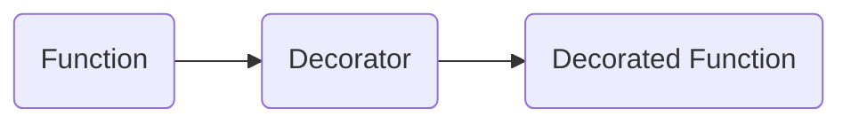

## 9.3.2 Decorator Pattern with Higher-Order Functions

In the world of software design, the Decorator pattern is a structural pattern that allows behavior to be added to individual objects dynamically, without affecting the behavior of other objects from the same class. In this section, we will delve into how this pattern can be implemented in JavaScript using higher-order functions, a powerful feature of the language that enhances code flexibility and reusability.

### Understanding the Decorator Pattern

The Decorator pattern is a structural design pattern that is used to extend the functionalities of objects without altering their structure. It provides a flexible alternative to subclassing for extending functionality. By wrapping an object, the decorator can add new behaviors or modify existing ones. This is particularly useful when you want to add responsibilities to objects dynamically and transparently, without affecting other objects.

#### Key Characteristics of the Decorator Pattern

- **Transparency:** The decorator pattern allows for transparent extension of object functionality.
- **Flexibility:** New functionalities can be added without altering existing code.
- **Single Responsibility Principle:** By dividing functionalities among different classes, each class is responsible for a specific behavior.

### Higher-Order Functions in JavaScript

JavaScript, being a functional programming-friendly language, treats functions as first-class citizens. This means functions can be passed around as arguments, returned from other functions, and assigned to variables. A higher-order function is a function that either takes one or more functions as arguments or returns a function as its result.

#### Characteristics of Higher-Order Functions

- **Abstraction:** They allow you to abstract over actions, not just values.
- **Reusability:** Enable the creation of reusable function components.
- **Composability:** Facilitate function composition, allowing small functions to be combined to build more complex ones.

### Implementing Function Decorators

Let's explore how we can use higher-order functions to implement the Decorator pattern in JavaScript. We will start by creating a simple function decorator that logs the execution of a function.

#### Example Scenario: Logging and Timing Execution

Imagine we have a function that performs a simple arithmetic operation, and we want to log its execution details without modifying the function itself. We can achieve this by creating a decorator function.

```javascript
// Decorator function
function logExecution(func) {
  return function (...args) {
    console.log(`Executing ${func.name} with arguments: ${args}`);
    const result = func(...args);
    console.log(`Result: ${result}`);
    return result;
  };
}

// Target function
function multiply(a, b) {
  return a * b;
}

// Decorated function
const loggedMultiply = logExecution(multiply);

// Usage
loggedMultiply(5, 3);
// Output:
// Executing multiply with arguments: 5,3
// Result: 15
```

#### Explanation

- **Decorator Function (`logExecution`):** This function takes another function as an argument and returns a new function. The returned function logs the execution details before and after calling the original function.
- **Decorated Function (`loggedMultiply`):** This is the result of applying the `logExecution` decorator to the `multiply` function. It behaves like `multiply` but with additional logging functionality.

### Implementing Class Decorators (Using ES7 Decorator Proposal)

JavaScript's class decorators are part of a proposal that allows decorators to be applied to classes and class members. While not yet part of the ECMAScript standard, decorators can be used with transpilers like Babel.

#### Example: Making a Method Read-Only

Let's see how we can use a decorator to make a method read-only.

```javascript
// Using a transpiler that supports decorators
function readonly(target, key, descriptor) {
  descriptor.writable = false;
  return descriptor;
}

class Person {
  constructor(name) {
    this.name = name;
  }

  @readonly
  getName() {
    return this.name;
  }
}

const person = new Person('Alice');
console.log(person.getName()); // Output: Alice
person.getName = function() {
  return 'Bob';
}; // Throws error in strict mode
```

#### Explanation

- **Decorator Function (`readonly`):** This function modifies the property descriptor of the `getName` method, setting its `writable` attribute to `false`, thus making the method immutable.
- **Usage:** When attempting to overwrite the `getName` method, an error is thrown in strict mode, demonstrating the effect of the decorator.

### Best Practices for Using Decorators

When using decorators, especially in a language like JavaScript, it is important to adhere to best practices to ensure clean, maintainable, and efficient code.

#### Best Practices

1. **Purity:** Keep decorators pure and side-effect-free. A pure function is easier to test and reason about.
2. **Preserve Context:** Ensure the original function's context (`this`) is preserved when necessary. Use `Function.prototype.apply` or `Function.prototype.call` to invoke the original function with the correct context.
3. **Parameter Handling:** Make sure that decorators handle arguments correctly, especially when dealing with variadic functions.
4. **Chainability:** Design decorators to be chainable, allowing multiple decorators to be applied in sequence.

### Real-World Applications of Decorators

Decorators are widely used in various real-world applications to enhance functionality dynamically and modularly.

#### Enhancing API Calls

Decorators can be used to add authentication, logging, or caching to API calls. For example, a caching decorator can store the results of API calls to avoid redundant network requests.

#### Modifying React Components

In React, Higher-Order Components (HOCs) are a form of decorator pattern used to modify or enhance components. HOCs can add additional props, manage state, or wrap components with additional UI logic.

### Visual Representation

To better understand how decorators work, let's visualize the wrapping process using a diagram.



This diagram illustrates how the `multiply` function is wrapped by the `logExecution` decorator, resulting in the `loggedMultiply` function with enhanced functionality.

### Key Points to Emphasize

- **First-Class Functions:** JavaScript's functions are first-class citizens, making higher-order function decorators powerful tools for extending functionality.
- **Modularity and Reusability:** The Decorator pattern enhances code modularity and reusability, allowing for flexible and dynamic behavior extension.
- **Context and Arguments:** Be cautious with function contexts and ensure that decorators handle arguments and `this` appropriately.

### Conclusion

The Decorator pattern, when implemented using higher-order functions in JavaScript, provides a powerful mechanism for dynamically extending the functionality of objects and functions. By leveraging the flexibility of higher-order functions, developers can create modular, reusable, and maintainable code. Whether you are enhancing API calls, modifying React components, or simply adding logging to functions, decorators offer a versatile solution that adheres to key software design principles.

## Quiz Time!



### What is the primary benefit of using the Decorator pattern?

- [x] To add behavior to individual objects dynamically without affecting others.
- [ ] To create a hierarchy of classes.
- [ ] To simplify code by merging multiple classes.
- [ ] To enforce strict type checking.

> **Explanation:** The Decorator pattern allows behavior to be added to individual objects dynamically without affecting the behavior of other objects from the same class.

### What is a higher-order function in JavaScript?

- [x] A function that takes another function as an argument or returns a function.
- [ ] A function that only performs arithmetic operations.
- [ ] A function that is executed before any other functions.
- [ ] A function that is part of a class.

> **Explanation:** Higher-order functions are functions that take other functions as arguments or return functions, enabling powerful abstractions.

### In the provided code example, what does the `logExecution` function do?

- [x] Logs the execution details of a function.
- [ ] Multiplies two numbers.
- [ ] Checks if the input is valid.
- [ ] Returns a random number.

> **Explanation:** The `logExecution` function is a decorator that logs the execution details before and after calling the original function.

### How can decorators be used with classes in JavaScript?

- [x] By using a transpiler that supports decorators, like Babel.
- [ ] By using native JavaScript without any additional tools.
- [ ] By modifying the JavaScript engine.
- [ ] By using CSS.

> **Explanation:** As of now, JavaScript does not natively support decorators, but they can be used with transpilers like Babel.

### What does the `readonly` decorator do in the class example?

- [x] Makes the `getName` method immutable.
- [ ] Changes the return type of the method.
- [ ] Deletes the method.
- [ ] Logs the method name.

> **Explanation:** The `readonly` decorator modifies the property descriptor of the method, making it immutable.

### Why is it important to preserve the original function's context (`this`) in decorators?

- [x] To ensure the function operates correctly within its intended context.
- [ ] To increase the execution speed of the function.
- [ ] To allow the function to return multiple values.
- [ ] To enable the function to modify global variables.

> **Explanation:** Preserving the original function's context (`this`) is crucial for ensuring the function operates correctly within its intended context.

### What is a real-world application of decorators in React?

- [x] Modifying components using Higher-Order Components (HOCs).
- [ ] Creating new HTML elements.
- [ ] Compiling JavaScript code.
- [ ] Styling components with CSS.

> **Explanation:** In React, Higher-Order Components (HOCs) are a form of decorator pattern used to modify or enhance components.

### What is a key characteristic of higher-order functions?

- [x] They allow abstraction over actions, not just values.
- [ ] They can only be used with arrays.
- [ ] They must return a number.
- [ ] They cannot be nested.

> **Explanation:** Higher-order functions allow you to abstract over actions, enabling powerful and reusable function components.

### What is the output of `loggedMultiply(5, 3);` in the provided code example?

- [x] Executing multiply with arguments: 5,3
- [ ] Result: 15
- [x] Result: 15
- [ ] Executing multiply with arguments: 3,5

> **Explanation:** The `loggedMultiply` function logs the execution details and then returns the result of the multiplication, which is 15.

### True or False: The Decorator pattern is only useful for modifying functions.

- [ ] True
- [x] False

> **Explanation:** The Decorator pattern can be used to modify both functions and objects, providing a flexible way to extend functionality.


